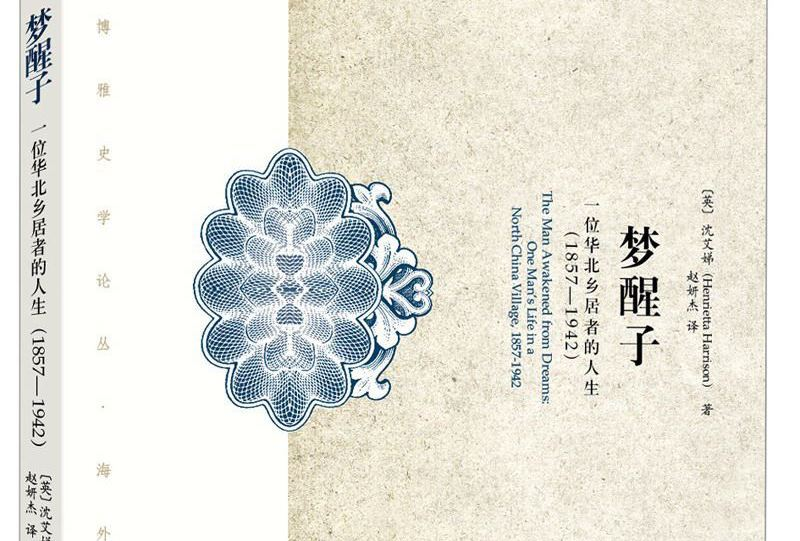
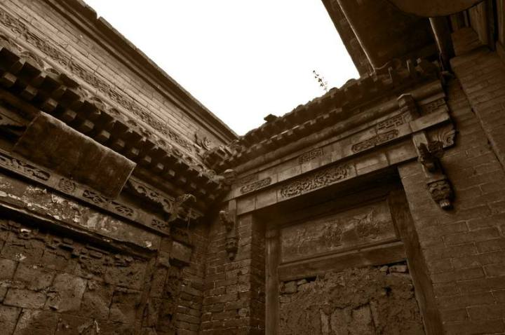

**道政坼离：刘大鹏、刘玠父子两代人的女性观分野  **

**作者**：[Otto Han](https://www.zhihu.com/people/otto-ludwig-hani-46)

**编辑**：讳言

**《梦醒子:一位华北乡居者的人生》**是牛津大学历史系教授沈艾娣（Henrietta
Harrison）女士的力作，全书通过对山西一普通士缙刘大鹏日记进行诠释与解读，开掘出近代权势转移之际道政分离、道出于二的大转轨期，中下层知识人所面临的困境与抉择。沈艾娣女士以汉学家特有的细腻视角敏锐地把握了此期知识人的心路历程，勾勒出了近代化路径中为人们所忽视的苦楚与创痛。其中，二刘父子的妇女观之流变值得细细玩味，今暂抛砖置评，以期关注区域社会史的同仁有所理解与同情。沈艾娣女士已于2011年担任中国社会史研究中心客座教授，相信在不久的将来，区域社会史还会迸发出更多探索与发现的火花。

<!--more-->

**内容简介**

本书以19世纪、20世纪之交的一位山西绅士刘大鹏的日记为核心资料，描绘出其人作为儒者、孝子、商人、议政者、农民的不同身份状态下的人生景况，讨论了中国在从传统社会转型为现代社会的动荡中下层知识分子所面临的生活的困难、身份认同的焦虑，以及由此而来精神的折磨与坚守。从一个人的遭遇折射出清末民初中国社会、中国知识群体的转型之痛。

**作者简介**

沈艾娣，牛津大学博士。曾任教于哈佛大学，现为牛津大学教授。主要研究方向为华北乡村、地方宗教与社会、清末以降的社会文化等。著有*The Making of the Republican Citizen: Ceremonies and Symbols in China*, *China: Inventing the Nation*，及*The Missionary’s Curse and Other Tales from a Chinese Catholic Village*等。

---

“道之大原出于天，天不变，道亦不变。”在传统士人的想象图景中，**德性秩序与伦常模式具有天然而紧密的联系是不言而喻的，男女大防更是其认知链条中的一大基石。**对切实感受过乡土社会的山西士人刘大鹏而言，出生于咸同之际并于同光年间求学进场的人生履历，既意味着他本人有着对传统礼教的沉浸式体验，更暗含了道政坼离的转轨期他所将迎来的个人困境。科场程式与泰西学问、内圣外王与西学西政、纲常名教与公民准则，诸多错综复杂的矛盾，在山西赤桥村这个远离变革前言的小世界交织出刘大鹏错综复杂的心路进由。其余纠葛之处，前人乔志强先生、赵素梅女士、行龙先生等多有行文，兹不赘述。**本文试图从刘大鹏、刘玠父子对其女眷态度的微妙变化切入，理解清季民初道政坼离对妇女切实而缓慢的若干影响。**

其实并不如沈艾娣女士所设想的那般，经历二十世纪中国革命的几次连续与递进\[i\]后的激荡，刘大鹏的故事已很难说是为中文读者所熟悉的生活背景\[ii\]的一部分。事实上，刘大鹏的故事为中文读者重新发掘是廿世纪90年代才出现的风气，其中乔志强先生的档案整理与罗志田先生的微观解读一定程度上重塑了山西区域社会史的学术生态。为了便于读者阅读，下文将简要介绍寓居于精神异国的遗民刘大鹏的基本生平。或许有细心的读者已经发现了“寓居”一词。是的，如果进入刘大鹏的精神世界，山西赤桥村正逐渐变得陌生，因困厄科场而返乡谋生的刘大鹏事实上目睹了自己是如何失去的精神故乡。

多年以后，当遗民刘大鹏面对来自日本人现代化的统购管理条例的压榨时，他便会想起父亲带他去太原逛庙会的那个傍晚。那时，初秋的太原是一座古韵盎然的都会，仕女如云，凤箫声动，人心如明月一般皎洁\[i\]。清冷的汾水绕过女墙，粼粼波光倒映出如血的残阳。

（赤桥村民居  作者：老游）

如同山西普通富户的其他孩子，刘大鹏出生伊始便寄托着家族的厚望，这一点因其父的武举人身份更加凸显。即使是在崇尚商利的山右，读书人家庭依旧享有着相当的声誉。
在斩获二十一岁取得生员功名后的成就后，命途的坎坷接踵而来。囿于山西信息闭塞，科场提携西学的风气事实上加大了刘中举的难度。在他四十岁那年，发妻逝世，这对于其时不长于稼穑经营之道的刘更是雪上加霜。离开书院外出授馆的塾师生涯也从经世济民未果的维度加剧了他的痛苦。1894年，经历了前五次省试的挫折，刘逐渐改变了对自我的期许与对西学的态度，年近不惑方中举似乎固化了刘的知识结构，面对京城科场重视小楷和经世西学的风气，刘痛苦地发现山西学习的经历似乎无助于科场。此后，癸卯学制、废除科举接踵而来，进士无望的刘在短暂的地方咨议局生涯后转向了煤炭、造纸和商业调解。然而，在外蒙排华、俄国革命后，山西失去了商业要道的地位，除开太原的官办企业和城市建设，山西似乎逐渐变得一无所有，也包括赤桥村的商业生态。进入廿世纪30年代，刘家的主要收入已经转移到了地产—约折合6亩田地—和少数租子。即使长期怀着对民国共和政体的敌意，到了30年代末，刘大鹏不得不在面对日本与民国中择一合作，颇具讽刺意味的是，不是北洋、各路军阀抑或国民政府，而是沦陷区的遭遇把一个保守的前清遗民改造成了民国的忠诚公民，尽管这离其人生终点1942年已不足5年光景。

这便是一个踽踽独行而不合于世者不受欢迎的一生。在理解其生平遭遇后，我们试着重新审视沈艾娣女士这段叙述背后的意味：

> 刘家遭受的不幸则主要是家中的妇女和孩子过世……妇女常因难产而死，但是和男性比，她们也有可能营养不良：除了最贫寒的人家之外，一般人家都是公公婆婆最先吃饭，随后是上工的男人，最后才是媳妇们。除此之外，这里的习俗是妇女分娩之后只吃小米粥，囿的时候可以吃上几周。缠足意味着妇女运动很少，常居于灰暗和烟雾缭绕的房间里。很多妇女遭受着贫血、软骨病和肺病的侵袭。太原县的人口统计显示能够寿终正寝的女性比男性少很多。\[ii\]

应当说，从张正明先生的《山西历代人口统计》\[iii\]看，这里的描述大体属实，而且这也正是当时女性生存境况。但是前文也有提到，刘大鹏已经因为求取功名接触过西学，并不是全然的顽固派。那么，刘大鹏的女性观是否有所改观？令人遗憾的是，尽管对西洋技艺的认知有所变化，但是在对妇女的态度上，刘与更为保守的人士似乎变化有限。例如，在他为其友人张桢所作的《张孝子桢传》中，他是这样记述的：

> 乃子不责妻之不善事亲，反怨父母之不慈其妻。

如果是建立在双方自愿的现代婚姻，媳妇孝顺公婆与公婆慈怜媳妇应该是双向的，如果公婆不慈，那么很难苛求妻子孝顺公婆。这里刘是站在礼法规制的角度去作价值判断，并未将媳妇视作家庭中平等的一员。然而，西力东渐的态势已经潜移默化地改变了人们的观念，即使是较为敌视新派人士的刘也慢慢发生了变化。当刘的女儿刘红喜于1901年早夭时，他将其女儿比作美玉—通常这是给予儿子而非女儿的评价。**到了1939年的中元节祭祖活动，刘已经接受了妇女祭祖的可行性，并多次暗示女儿和孙女可参加活动，这些在过去的山西乡村都是很难想象的事实。**当然，刘一切思考的出发点和落脚点未超出纲常名教，太原新式学堂的女学生举止和街上流行的新式女装就因为罔顾伦俗、变易服饰一直不为刘所理解和接受。

刘的保守姿态事实上是一种心理防御机制。在科举制废除后，道统与政统分离，传统士人所熟知的经典世界已经成为了不合时宜的“屁股上的纹章”而为人们嘲笑，即使是身为文化保守主义者的学衡派诸人也必须坚持“阐明新知”方不至于招致世人诟病。刘本人并不以富裕著称，在失去了功名所加持的威望后，只有对传统道德的维护才能维持在桑梓的权威。刘大鹏对这一变化是极度抗拒的，在清季科场取向的变化过程中，僻处内地的刘大鹏并不认为是自身知识结构过于陈旧，而是“观其风气，失于浮华”。如果将男女大防置于刘所坚持的世界秩序的一环，就能意识到一个问题。**对于刘大鹏这种古典士绅而非近代知识分子的人士，女性问题并不是单纯的女性问题，而是同宇宙秩序联结在一起的国之根本。**在这一意义上，刘大鹏可以说是顽固派里相对开明的，开明士绅中相对保守的。这种过渡性为日后他与其子刘玠的分野埋下了草蛇灰线。

同样被寄予厚望的刘玠走上了父亲并未走完的科举道路，但是，凛冽的西风已经深入到了内地的乡村。不同于蹉跎多次的刘大鹏，刘玠早已中举，甚至父子同去开封参加会试。所以，年轻的刘玠比刘大鹏更能理解世风转轨、学风流变背后的现实逻辑。尽管刘玠也终止于举人，并未成为进士并进入国家权力中心接触最前沿的变化，但很难说天津谋职的两年旅途没有对刘玠产生影响。刘玠的二女儿喜鸾成为家中第一个天足女性，刘玠更是在科举不第后在代县女子师范学校谋得一职，在女子学校教书，这对于传统士人而言是绝对不可接受。没有更多的材料支撑进一步的推断，但是刘玠坚持远离赤桥而到远处的代县工作不得不说是一种对父亲过于强烈的宗法观控制欲的逃离与抗拒。对于刘玠而言，妇女问题是泰西自由平等观念的一环，而非纲常名教的五大基石之一。**刘大鹏或许并未发现，尽管他与其子刘玠的空间距离不过数百公里，但是却是已然处在两个完全不同的意义世界之中了**\[iv\]。

**注释：**

\[i\]刘大鹏：《退想斋日记（手稿）》，光绪十八年九月十七日

\[ii\]沈艾娣：《梦醒子：一位华北乡居者的人生（1857-1942）》，页54

\[iii\]张正明：《山西历代人口统计》，页233

\[iv\]张灏：《梁启超与中国思想的过渡，1890-1907》，页3