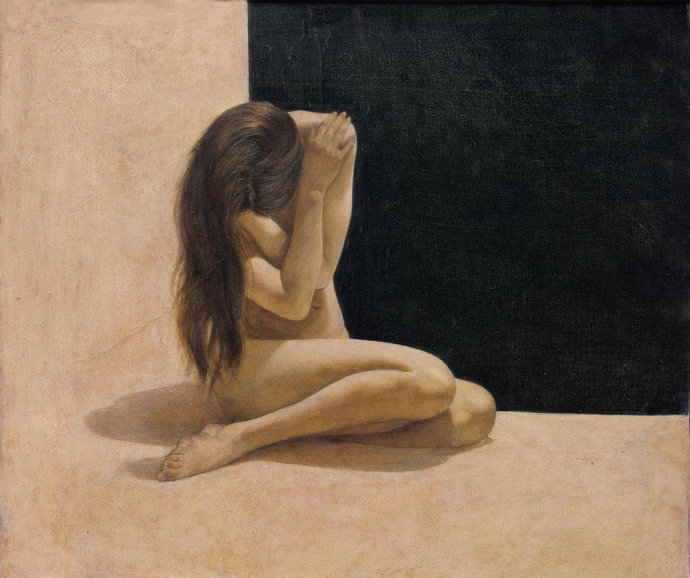
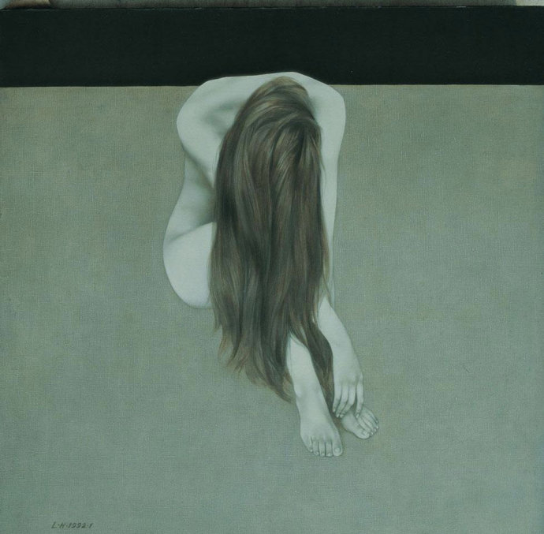

**作者**： 王毅飞

**编辑**：[heaven疏狂](https://www.zhihu.com/people/heavenshu-kuang)

这是一篇关于女性身体与符号意味的讨论：我们的身体在父权的象征系统里无处逃脱。

毫无疑问，涂抹口红的嘴唇无法进食，因为口红已经使得嘴唇被抽象化，符号化，嘴唇脱离了女性生理意义上的身体，它现在已经进入了一个高度象征性的场合，它是男人们梦寐以求的，女神的嘴唇，它是绝对的柔嫩与饱满，它充满诱惑，或者说它就是诱惑本身。 

<!--more-->

  
对这样一个永远被渴求又永远不可能得到的嘴唇，进食便成了一种双重意义上的伤害——食物首先会在物理上影响口红的状态，但更重要的是，选择进食，则意味着女性的嘴唇不再抽象，不再是女神那完美的，饱满的，象征化的嘴。它只是一个身体器官，或者说它已经被踢出男人印象中完美的符号世界，落于真实而沉重的生活——符号嘴唇下降为一个生物学意义的身体器官，这意味着它变成一粒粒牙齿，变成唾液，咀嚼，牙垢，吞咽，细菌，食物残渣。

类比过来，涂抹口红的嘴唇也不能用来接吻，尽管抽象化嘴唇的很大一部分审美情趣正是来自于，对达成接吻这一事件的诱惑力，但接吻也首先会从物理层面破坏口红的完整，而同时，接吻预示着嘴唇不再是抽象化完美的嘴唇了。**其实女神式嘴唇并不能承担诱惑的结果，它只放置诱惑本身，这种诱惑也被符号女性对接吻的拒斥所强化。**不需要真的接近它，相信我，你是不会想品尝口红和唾液混合物的。
  
那个永远无法达成的接吻，正是完美嘴唇之所以完美的缘由，也是抽象化完美的嘴唇具有“接吻诱惑”的缘由——涂了口红的嘴唇，因为它成为完美符号而变得不可触碰，又同时因它的高高在上，因它脱离凡尘地存在于绝对的符号世界，而有了极强的对接吻的诱惑力。
  

*刘虹 唇语-5*

乳房是被遮掩的，同时也只有在这种完全不可见的状态之下，乳房才有条件成为象征的乳房，抽象化为一个神秘的，有关性的符号。

因这完全被遮挡在衣物和胸罩之下不可见的神秘，乳房成为被男人们的普遍幻想构造的完美的乳房符号，但也正是由此导致了它难以在公共场合露面，或者在另一方面可以这样说，正是因为乳房拒斥了一切形式的公开露面，才使得乳房的在场和介入成为可能——使得乳房符号成为在场景观的，首先是因其被遮挡，但同时也因其被裸露——在一些场合中，乳房裸露出除了乳尖以外的一些部分，这些部分具有光滑，柔嫩，肉感等特性，在另一些保守的场合中，乳房裸露出上臂和肩膀，这些部分同样具有光滑，柔嫩，肉感等特性，**它们使得乳房以性隐喻的姿态介入环境——作为性的符号，其裸露部分暗示着乳房的完全敞开，可同时的，乳房又因其符号化，成为对女性生理器官性质的拒斥，成为永不可见的暗藏。**乳房不单是因封闭而成为乳房，也不单是因敞开而成为乳房——只有在封闭与敞开的双重中介之下，乳房才能以它自身的形态，出现在我们的日常生活里。

*刘虹 冥想-6*

女性生殖器是性象征，同时也是女性的象征，它被父法排斥在公共空间之外，并被父法主宰的普遍审美定义是“丑”的，这种不在场的丑陋或许在一定程度上影响到男性对女性其他方面的评价，比如要求嘴唇饱满，闭合，要求作为乳尖隐喻的胸部圆润，光滑，这有可能隐晦地体现了对女性生殖器形态的拒斥，当然这不是重点，毕竟公共话语对女性生殖器（也包括男性生殖器）和性行为本身的排斥是无需论证的，单从现象上看，我认为，父系社会将女性的嘴唇，乳房或者其他部分抽象化，将女性符号化的意图，并不是希望女性真的成为符号，真的去模仿男同性恋中的那些被追求者的人格模式，因为它还同时抱有对接吻，乳房复杂的审美趣味，以及对女性生殖器和男女性行为的诋毁和蔑视，这反而是在阻止女性彻底沦为男性追求的符号——父法以美丑的划分严厉制止了女性身体在一个个符号世界里进行自由交换与流通的可能性。

**父系社会借助符号和权力，抽象化，完美化女性的躯体，但对性行为进行严酷的排斥和打压，因为父法只希望女性可以成为符号的载体，而非符号的本体，**这样女性身上的符号就能够形成一个相对稳定的系统，一个用来评价和衡量男性与女性的，相对稳定的向度标准，它使得男性和女性都大量地被固化，被模式化，在父法社会里更深地植根。

*刘虹 冥想-15*

这样的社会中，男性的，以及女性的个体，都将面临必然的失落。
  
具有处女情结的处男，因女友不是处女而大动干戈，因为在这些人看来，嘴唇已经被亲吻，乳房已经向公共空间的评价标准彻底敞开，**女性身体的符号被肢解，被拆散，女性的身体便不再具有抽象化的权力征服的意图，不再是一个可以被他们拿到公共空间张扬炫耀的女性符号身体。**而是一个难以面对的，生理意义上的真实的女性身体，这反而不能被称为“女人”。同时对社会建构的男性整体而言，审美上追求符号化女性的完美身体依然意味着失落——接吻是直面真实的嘴唇，揭开胸罩则会看到生理层面上真实的乳房，印象式的符号，完美的女性身体的象征永不可得，即使追求实在的感受，有关性的所有，哪怕只是幻想，自它在脑内诞生的那一刻开始，也会被普遍性话语贴上恶心的标签，并随着个体不断与社会接触，邻里的家长里短，社会建构的普遍道德，将这种恶心一点点内化，以勾勒男性的部分人格结构。

也有一些女性试图摆脱客体化的命运，但她们总会不自觉地，在心理上将自己的嘴唇，乳房或其它符号置于社会普遍性评价标准的罗网，也偶尔有女性希求彻底沦为客体，却因生殖器和性行为的丑陋而在父系社会话语中永恒地失败着。  

*电影《嘉年华》海报*

在现代，失落是爱情不可避免的主旋律。

但是呢，男人嘛，毕竟不会被酒吧的脱衣舞娘挑逗起性冲动，也不会对假面舞会上的舞伴抱有完美的幻想，在性欲和暗示彻底增殖的场合中，在扩散的和彻底泛滥爱情制码的场合中，平时精疲力竭的人们似乎终于达成了温柔的宽恕与和解。
  
游戏式的性交，被模拟的爱情，可以让一个人更像一个人吗？

*Tamara De Lempicka*