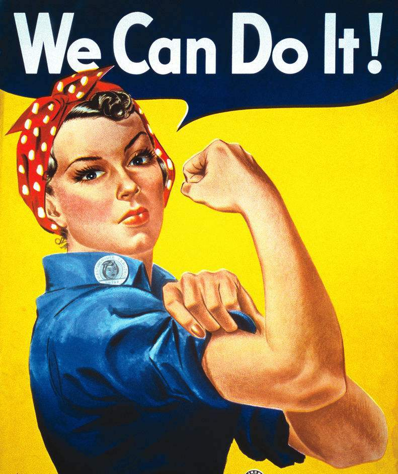
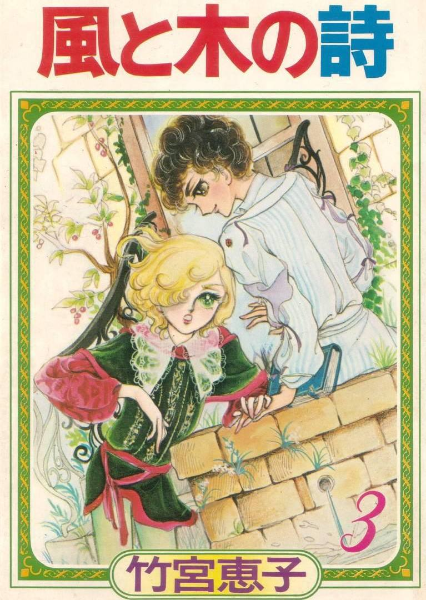
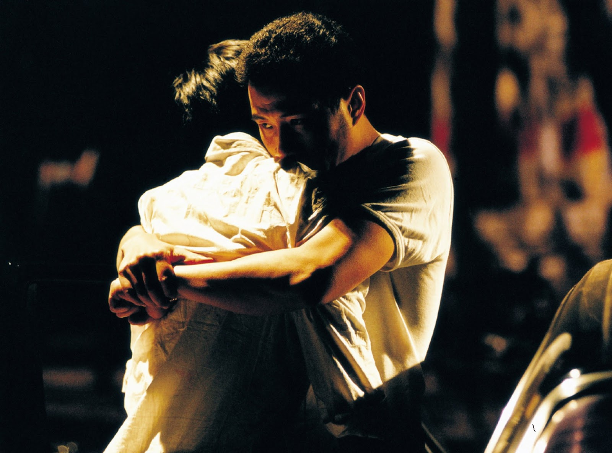

**作者**：[陳觴](https://www.zhihu.com/people/chen-shang-83-53)

**编辑**：讳言  

<strong>"在腐文化推动了性少数群体平权深入人心的同时， 是不是也失去了什么自己原有的特质呢？"</strong>

声势渐涨的腐文化的可以看做女性对于以男权为中心的文化话语权的抗击。然而作为反抗者的腐女群体，因为长期浸淫于男性文化霸权下的社会氛围，她们既对家长压迫形象的男性深恶痛绝，却又不得不将男性符号化，他们对男性和霸权的认识是片面的。换言之，虽然腐文化是腐女对于男性性别霸权的反动，却又具有对男性符号的依赖性。**这种依赖性充分地体现在腐文化本身，女性觉醒之时空有反抗意识而没有精神寄托物，同时找不到可以完全借鉴学习的模板，那就只能向与自己不同的男性客体寻找突破桎梏的可能性。**

<!--more-->

诚然，我们不能就此来否定腐女和腐文化，或许追寻腐文化的发展轨迹能够找到一些原因。腐文化壮大的地方不是苏联或者美国，却是日本。日本的社会文化本来就是一个十分耐人寻味的，值得好好琢磨的案例。虽然苏联早早地解放女性权利，却制造出越来越强大的官僚统治阶级，女性并没有真正地取得话语权；反倒是与之分庭抗礼的欧美资本主义国家的平权运动，为女性地位独立争取到了一定的空间。平权运动打破了对于白人和男性的霸权地位，自由主义思潮转向了社会主义，平权运动和共运不谋而合，性别多元成为了西方社会的共识。

女权海报中充满力量感的女性
  

日本的地缘优势很大，但是，这种优势却是在其夹缝生存的窘境中体现出来的。日本是美国控制西太平洋以及对抗苏联的桥头堡，然而，上世纪七十年代的资本主义经济危机深刻地影响了全世界，美国的民权运动风起云涌，欧亚大陆西端的法国发生了五月风暴，东端的日本是无法“独善其身”的，正是在左翼思潮的影响下，各种新兴文化兴起，salash文化和酷儿运动传到了日本。然而，外因只起到了推动作用，塑造腐文化的最重要原因还是在于日本保守的社会风气。明治维新以降，日本社会极为推崇文明开化，不过，这并没有摧毁掉家长制，时至今日，日本的家庭文化依旧以父权（夫权）为内核，男主内女主外之类的观念“深入人心”。对女性的压抑可见一斑，腐文化这类精神抵抗的出现是自然而然的。

要完全探求腐文化产生的社会原因，那就不应该只局限于社会必然性这种宏观叙事角度。腐文化是在女青年中流行的亚文化，青年对于现有制度，尤其是教育体制的不满便是其动因，而日本风气出了名的保守，性教育的不到位和人们对于性少数的排斥乃至歧视，也助长了青少年的好奇心，耽美文化便成了女青年窥测同性恋的窗口。这种微妙的偷尝禁果的滋味，愈发刺激着年轻人的冒险心理，人们讳莫如深的同性恋成了年轻人中间的一种新潮文化符号。那些宅在家里，不善社交的女性（后来演变为“干物女”）有着与男性交往的渴望，耽美漫画或者小说正好满足了她们的这一种需求。

腐文化不是从天上掉下来的，它来源于七十年代的耽美文化。至于腐女，这本来是对于这些爱好男同性恋文化的女性群体的歧视性称呼，然而，如同同性恋这个词被“酷儿们”接受一样，腐女们毫不畏惧这类偏见和嘲笑并以此自名，腐女坦然接受外界舆论压力，并以他人之名自居，这颇有在从中心化处去中心化的味道。文化的形成需要创造者与接受者，这里面的创造者的创作同样是自发行为，如今腐文化圈公认的耽美漫画起始是70年代的竹宫惠子的《风与木之诗》。后来，耽美文化变为自发创作的耽美作品以及对原有作品二次创作的同人作品。

日本耽美始祖级漫画《风与木之诗》
    

腐女及其追捧的腐文化本来是少数，而且是对男性本位的中心观念的反动。男同性恋虽是生理上的男性符号，但是“见不得光”，也就是说，接受耽美文化是一种冲破禁忌的刺激行为，然而，久而久之，她们对于耽美产生了依赖，这时团体的凝聚力是不再依靠瞬间刺激，而是向心力，那么这个“心”什么呢?**腐女借助男性这一客体作为观察对象，用一个中心来替换另一个中心，原本处于舆论强势地位的是异性恋和男性主导的恋爱观，男同性恋则打破了这一限制，甚至可以说，两个男性的相爱就是二元并立，用刚才中心替换的说法，就是腐女把自身当做男性客体，原本属于客体的中心地位便给予了女性。**

然而，并不是将中心取而代之便万事大吉。腐女看似借此占领了中心地位，却是以符号化的男性客体来获取的。耽美之所以叫耽美，就在于耽美作品的风格内敛，偏向于阴柔。这无疑是传统语境下的女性气质在男同性恋身上的再创造，她们是用自己的审美来代换掉原有的男性审美，如今的男性形象也不再追求阳刚，也是女性夺回审美权力的一种体现。当然，这时候的耽美文化和如今的腐文化还有区别，首先在于其传播性不广，这只是腐女小圈子里的爱好，其次则是腐女们组成的团体自成一派，各自有各自的门槛和内容，这也保证了其“纯洁性”。但是，当耽美文化开始扩张，腐文化在其基础上大范围散播，这时的腐文化正式进入了公共话语领域，受消费主义裹挟。**人们热衷于追求符号价值，盲从资本塑造的消费潮流，腐文化一旦成为消费品，那就很难再恢复原状了，大量腐文化为噱头的文化商品应运而生，腐文化形成了另类的消费景观。**耽美最初包含的纯爱色彩受到粗放直接的肉文影响，同人作品成了文化资本依赖的扩张工具，如《哈利波特》中著名的民间cp马尔福和哈利波特，作者J·K·罗琳“不否认”邓布利多是gay，《神探夏洛克》中夏洛克和华生以“卖基”来搏取眼球，最新的一个例子当属微博的沈氏cp，他们最终被拆穿是为了卖化妆品而伪装情侣。

各种萌雷自见的“拉郎配”
      

消费主义的裹挟者正是那些处于顶端的消费者，也就是我们常说的精英阶层。中国腐文化则是典型的精英文化，耽美文化起初是由女性海归和国内互联网初期的网站平台带起的，这时同人圈子是一个小型社群，但是，当耽美文化和同人文化融合的时候，腐女的社群便呈现了对耽美作品的自觉阅读和自觉创作，甚至会形成对于腐女社群的归属感，人们开始对外界文化产生厌倦和警惕，这是腐女社群的封闭性。与此同时，同人文化找到了其精准的市场定位，文化资本再次用符号来垄断腐女群体的话语权。在yaoi文化中，男性的攻受正好体现了传统伦理中男女的强弱地位差异，连原来男—男的二元关系也消失殆尽，这就是耽美文化生态被外来资本入侵的异化现象，至此，新的中心主义产生了，腐女圈子变成了一种排他的如同图腾崇拜的宗教。

这种排他性也有不同的表现。当阅读者进入文本，文本中的男性角色便是女性阅读者的化身，然而，当女性代入了男性客体，会自动地模仿男性（起码是书上男性）的行为，某些腐女对BL的作品的依赖，她们认为BL就是社会常态，于是，她们开始对社会不适应，对异性恋感到不解，她们凡是看到男生就想组cp，甚至出现了对女性的厌恶，这就是上文所说的依赖于男性符号的表现——腐女们很有可能会对男性威权有暧昧情感。这种反向歧视在去中心化运动中并不少见，被许多人训斥的“田园女权”便是一种假托女权主义的变异体，称其为女利主义更合适。同时包括国内一些沽名钓誉的爱狗人士和不择手段的“环保人士”。

《蓝宇》 剧照
    

**腐文化作为一种亚文化，的确不能对它要求过高。然而，正如我上面所说，当这一种文化进入公共话语领域，它极容易丧失本真，被社会上拥有强势话语权的人或社群牵着鼻子走——腐文化被消费社会招安了。若是要真的通过文化来对男权进行强有力的反抗，必须要从自身开始重建。**腐文化脱离男同实际，把同性恋当做了被社会常态，殊不知性少数群体的平权之路多么漫长和艰辛，任何与强权的斗争都不是过家家。腐文化要保持去中心化的势头，首先是解决性别认同问题，腐文化本应激起人们对男同性恋，甚至扩展到整个性少数群体的关注和理解，其次便是回归到实践之中，在腐女群体之中，有着非常多的跨性别者，其中的男同性恋和跨性别男同性恋也为数不少，如果能够借此来进行性别平权运动，腐文化便有了新的涵义，著名的禁片《蓝宇》便来自同志小说《北京故事》，以及其他借男同性恋来言及社会黑暗的作品。除此之外，还有一条独特的道路，那就是女性的自我转向，现在许多与平权相关的文化作品都喜欢用或明显或隐蔽的女同性恋设定来批判男权，这是新的去中心化方法——女性必须以其自身来构建情景，从而抢占话语的中心，腐文化的扬弃需要女性真正地在场。当然这还远远不够，去中心化并不一定要树新靶子来打旧靶子。（反对基础主义的人认为基础互相替换，不存在所谓的基础，无主体反而要容纳更多的主体而非“独裁”，大家各有各的场域，此时的）去中心化，其实就是任由不同的中心生根发芽，让所有的主体共存，其终点就是文化多元主义。