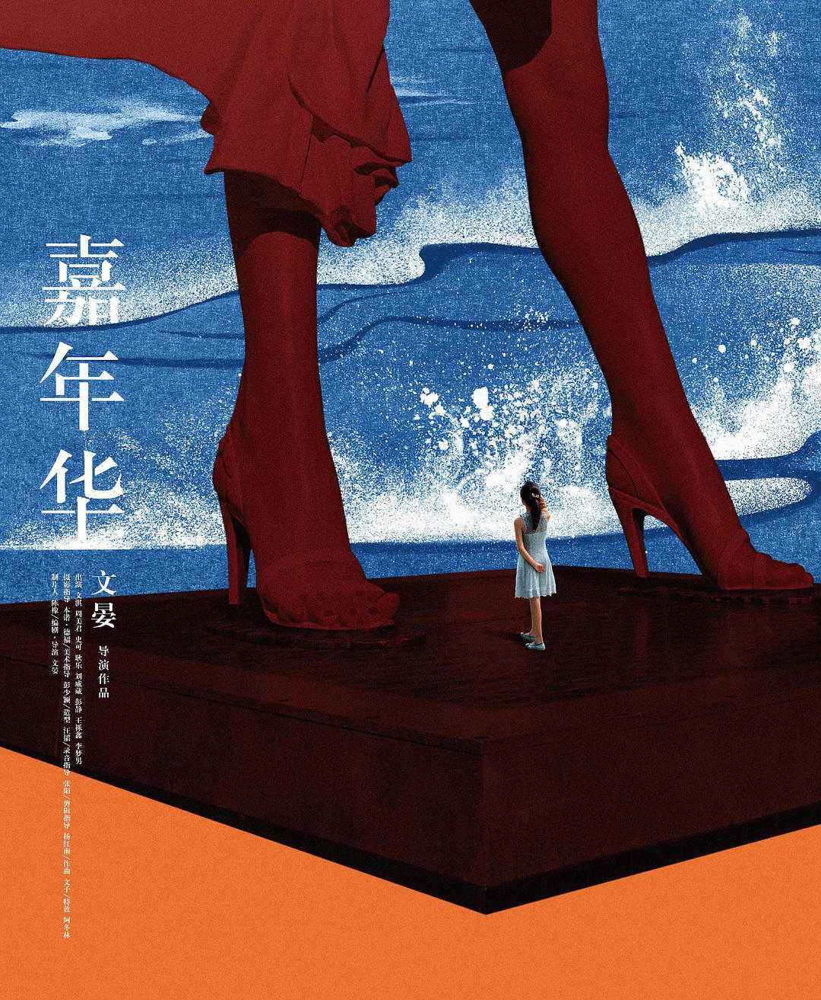
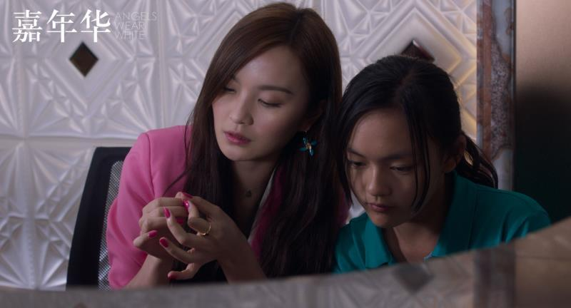
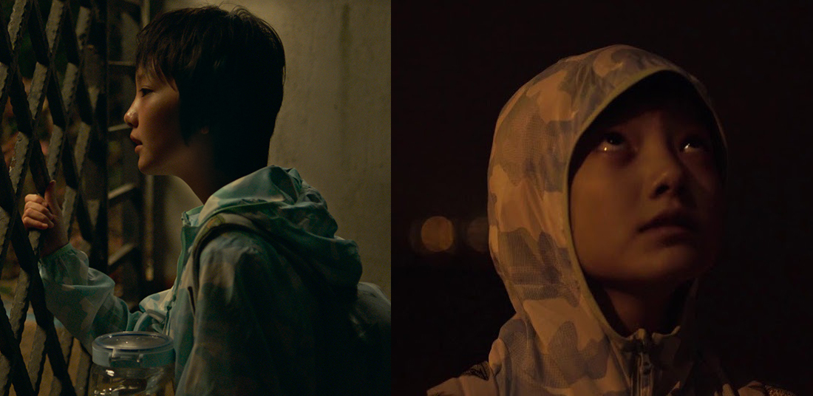
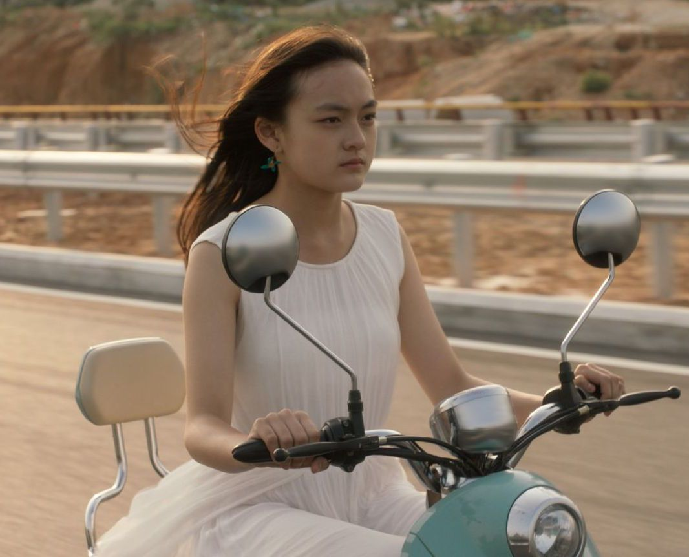

**作者**：[陈觞](https://www.zhihu.com/people/heavenshu-kuang/activities)

**编辑**：[heaven疏狂](https://www.zhihu.com/people/heavenshu-kuang/activities)

> 消费社会的浪潮裹挟了每一个人，女性都是明码实价的商品，从贴满了广告的梦露雕像，到被出售初夜的小文和新新，她们却不知道处女膜为何物，被地痞利用的莉莉，受迫于生活和城市有产者的小米。这不仅仅是一部电影，也不只是和女权有关，它是无耻的食利阶层的喜剧，也是穷困潦倒底层人民的悲剧。  
>
> 这场嘉年华注定属于少数人。 

<!--more-->

文晏导演恐怕没想过，《嘉年华》这部本属于事后反思的电影，却在这个多事之秋莫名地“应景”了起来。看似是《嘉年华》撞上了舆论的枪口，实则不然，我们现在就暴露在千千万万座枪炮之下，只是有的炮弹会直接击穿身体，而另外一些披着诱人外壳的侵蚀着众人的灵魂，后者大概是属于人道灭绝。  

这也是文明的演进方式，以前只看见男人偷拍裙底风光，现在则可以“众生平等”去一览禁区，但是，当我们站在玛丽莲梦露的雕像之下的时候，我们是用谁的眼睛去看？当小米去看的时候，她或许只看到了一个美丽的女人——而她只是一个漂泊无定的小女孩而已。梦露变成了消费社会的一个巨大符号，无论男女都将自己的各种希望投射于之，又或者说，一只无形的手在拉扯着他们前进——这是以她们的牺牲为代价。从摄像头到移动硬盘，到处都是迎合着男人的眼睛，而女人在亦步亦趋地跟随着，男性凝视着女性，而女性却在迎合着他们的目光。当小米拿着金色发套的时候，她感到新奇，就像她仰视梦露雕像的一样，就像她看到莉莉精致的妆容一样，这就是所谓的爱美之心，这是一条把无数人都引向不归路的诱饵。

从来都不缺垂钓者，只缺上钩的鱼。旅馆经理就是一个钓鱼人，他非法雇佣黑户，而且为了生意掩盖罪证，在他头脑里全是金钱，没地方容下正义了。而池子里的鱼没有意识到自己的命运这才是最可怕的。莉莉为了小混混悉心打扮，最后却被人出卖，她只是地痞获利的工具之一而已。  

最可怕的是两名被性侵的女孩，她们被大老板骗去酒店开房，却浑然不知自己被性侵，甚至到检查的时候还不知道处女膜为何物，这当然可以归咎为性教育的缺位，但是，更重要的是，家长真的负起了监管责任了吗？电影里还有一些暗示，新新的父亲的上级正是性侵者，他受其限制，到了后来连走法律程序的勇气都被熄灭了。小米是唯一一个鼓起勇气说出事实的人，但是她本身就是黑户，她固然是有良知的，却碍于生计而张不开嘴，直到最后被人痛殴后，才决定逃离这个是非之地。

  

在这场声势浩大的嘉年华里面，人们只围绕着一样东西旋转，**那就是利益**，说白了就是钱。  

新新父亲为了巴结上级而让女儿认其做干爹，却没想曾想自己的女儿带着同学送进了大资本家的狼口；地痞小健为了利益不择手段，甚至以爱情来吸引莉莉来成为自己往上爬的垫脚石；旅馆经理以不“惹是生非”为务而谎称录像被洗，警察也不闻不问敷衍了事，更勿论后来权权相偎，给罪恶的大资本家脱罪。在消费社会的狂潮中，我们头顶上还有至高无上的神，那就是金钱，它渗透进生活的方方面面，但是，我们把的堂皇冠冕撕破之后，却发现，它背后就是权力。我们血管里就流淌着权力的血液，而那些食利阶层用金钱来获得权力，也用权力来攫取金钱，为此不惜一切代价。大资产阶级用各种消费品来吸引金钱，符号价值使他们赚得盆满钵满，消费者却被虚荣迷糊了眼睛，电视里面婀娜多姿的女性激发他们的欲望，而女性也迎合了其需求——如莉莉般那些所谓能把男人迷倒的女性，多是男性凝视衍生出来的消费品。而人与人之间只有赤裸裸的金钱关系，小米这样寄人篱下，朝不保夕的底层人民只能靠微薄的工资度日，她没有任何额外的权力，她被资本束缚在旅馆之内。

嘉年华里面得利最大的是食利阶层。他们以玩弄女性为乐，他们是居高临下的主权者，他们可以用金钱来收买受害者，又或者说，他们用强大的权力逼迫受害者就范，检察机关可以轻而易举的做出伪证，而受害者父母（新新父母）又迫于孩子未来前途和自己的工作而妥协私了，公义似乎已经隐没了，代替者是一只每个毛孔都流着血和肮脏东西的怪物。它让每个人都成了其附庸，剥削阶级以维护自己霸权为重，而无产阶级只是被娱乐消费的商品——他和她也在消费其自身。梦露雕像上面贴满了广告，两个孩子的公道用学费来支付了结，小米的身份证也要打上不菲的价格，以致于她用录像带来勒索刘会长。资本在我们每个人的额头上都刻上了价格，嘉年华中，到处都是明码实价的肉体和灵魂。  

《嘉年华》注定是属于少数人的嘉年华，滚滚而来的市场经济并不能拯救一切，权贵们开始扬汤止沸，他们对人们的自由标标好了售价，流氓无产者见风使舵，下层女性仍然是原子化的商品，消费社会的景观已经架构完毕。梦露的雕像已经被世人抛弃，小米穿着白色裙子，骑上摩托，我不知道她要逃去何方。她大约的确是自由了。

