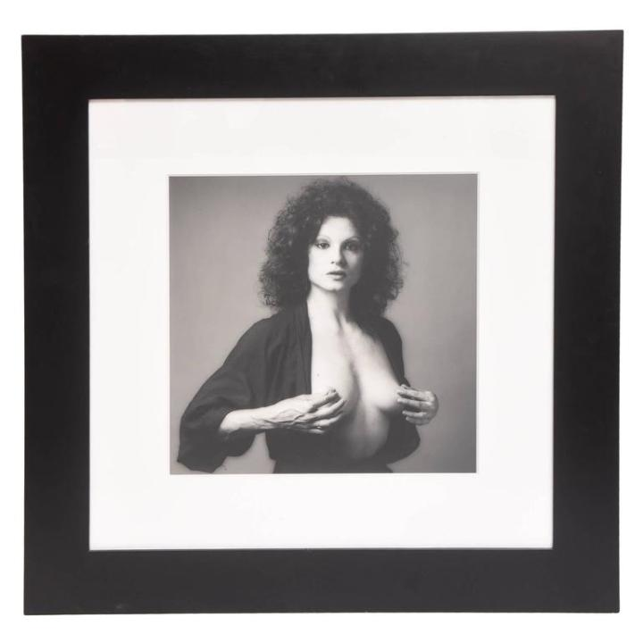

**作者**：Adramahilik

**编辑**：讳言

西方哲学传统中存在着一个不可设想的悖论：思考着的身体。语言和物质性被当作认识论上截然相反，不能融合的两个范畴，而圣奥古斯都和卢梭将女性放在物质和自然的一边，男性放在语言和文化的一边。于是女性主义哲学激进的认识论重要性不应该是继续在这样的二元结构中操作，要求女性摆脱物质性的“刻板印象”，和男性一起加入到文化和语言中，而是在于对这种语言和物质性之间的简单对立关系的颠覆。当女性主义面对思考着的身体这个悖论时，它所要求的不是被归于女性的血肉之躯和被归于男性的理性思维之间的融合或是和解，以便从理论上消解性别，创造出某种先性别（pregendered）的抽象人。这样做，考虑到将男性作为一种人类无性别的实例，而将女性作为对人性别化的偏离的文化传统，实际上是在要求女性成为男性的权利。女性主义不在于尝试回答在已经是男权的哲学传统中关于女性的问题；也不在于赋予这种传统对女性的排斥以价值，从而变得“非哲学化”。女性主义应该要求有属于自己的蛋糕。

<!--more-->

> 编者按：女性主义哲学发端于20世纪70年代，是西方妇女运动实践和女性主义理论探讨的产物。经过30多年的发展，女性主义哲学以其独特的研究视角、执著的批判精神，在哲学研究方面已取得引人注目的成果，推进了当代哲学、人文社会科学的发展，并对女性主义理论与实践产生了重大影响。
> 
> 女性主义已成为当今时代的一种颇具影响力的哲学价值观和方法论，它以“性别”为分析范畴来重读、解构和重建哲学，批判和检讨许多导致人类自身及自然危机的固有价值观体系，为协调和解决各种冲突，创造更为开放、更为平等、更为自由的哲学思维空间，培育新的时代精神作出独特的贡献。

在对这样性别化的二元结构的颠覆中，重要的一点是意识到不存在一种简单的规则，能详尽的描述或者支配性别差异。女性和男性，既不是纯粹语言上的意识形态建构，也不是自主、自足的物质性身体。而性欲和性别也是分离的分析范畴，两者间不存在简单的结构关联。当然这不是说，不存在基于性别的性欲规约，而是说，性欲不止是在性别建构中添加的一个变量。女同性恋主义对于女性主义的重要意义在于，它打开了似乎统一的女性身份的内部差异（欲望的空间）。女同性恋主义和女性的遭遇是一个处于爱洛斯的符号下的问题，而不是逻各斯。

稍微离题一下，性欲和性别的分离也让我们意识到，性别的颠覆可以不说明任何关于性欲或性实践的事实；性别可以在规范性性欲完全不被扰乱的情况下被模糊化。这对于同性恋，无论是作为文学上还是实践上的范畴，所提出的问题是，在多大程度上，处于支配地位的仍是父权制的性欲规范，传统的性别等级秩序是否仍在更换了性别能指的情况下运行。

身体并不是真实的或者本质的，它不包含我们寻找的所有问题的答案。然而，女性主义不能简单地抛弃它，正如女性主义不能简单地寓居于它。身体的区别仍然是一种事实，一种威胁着而不是合法化我们对性别差异理解的事实。而西苏（Cixous）所说的“书写身体”(writing the body)正是一种关乎身体的女性主义策略，它关系到对身体的重新构型，并以此创造不同的性别标记的分配方式。具体来说，父权制传统的性别差异的二分结构建构了稳定、“健康”的理想身体，而这种身体的理想型又作为虚构的终点反过来投入到性别生产的无休无止的过程中。“书写身体”的旨趣就在于去稳定化、去自然化理想身体的幻象，从而扰乱对性别差异的二分式理解。

*埃莱娜·西苏，法国当代最有影响力的小说家、戏剧家和文学理论家之一。她将写作分为阴性书写和阳性书写。她认为女性要打破男性创造的二元对立的菲勒斯逻各斯体系，就要进行“阴性书写”。*

伊利格瑞（Irigaray）对女性身体描述的重新部署提供了“书写身体”的一个例子。与波伏娃相反，伊利格瑞不把女性看做他者，而认为主体与他者这两种概念都是用来支持菲勒斯中心主义的意指经济的主要支柱。对于伊利格瑞，在普遍男权主义的语言中，女性代表了一种不能被思考的性别，是语言的不在场。于是，从菲勒斯-逻各斯中心主义的话语限制了我们对性别差异和快感的理解的基本论点出发，伊利格瑞试图寻找能说出女性不可言说的快感——存在却不能被菲勒斯中心的语言所说明的快感——的语言学方法。

> “两片唇亲吻两片唇：我们又获得了自由。我们的“世界”。而从内到外，从外到内的通道，我们之间的通道，不被限制，没有尽头。不会打结或绕圈，没人能阻止我们之间的交换。”——《When Our Lips Speak Together》 

但是这个身体，这些嘴唇，并不将身体固定为关于女性本质的话语的合法化基点，而是将身体化作一个不断发生差分的场所(site)。快感和性别差异的多样性既不局限于个体的身体，个体身体之间的边界也不被清晰的划分。女性主义内部存在着伊利格瑞的文本是否属于本质主义的争论，在我看来，伊利格瑞的作品不应该被理解为另一例粗糙的本质主义或是对生理特质政治错误的兴趣，而是一种策略，通过重新部署形态学意义上的语言来去自然化身体。与为一个假设的女性身体而欢呼恰恰相反，伊利格瑞对生理学话语的修辞使用重构了解剖事实，通过身体写作而不是对某个身体的写作，这就是西苏所谓的“书写身体”。

然而存在着另一种对身体重新构型的方式，远没有书写身体的正面意义。父权制对女性身体的宰制，表现之一便是“厌食症”：一个女人的身体永远不处在正确的形态，而且据说需要一直通过节食和手术来改变。十几岁的少女们经常节食，厌食症和贪食症的例子几乎和感冒一样常见。隆胸、抽脂、整容完全算不上给一小部分女性准备的奇怪手术。女性和她的身体处于不可能的状态中，而这种与自己身体的战斗是成为一个女性决定性的特征。那么在这种情况下，厌食症如何与书写身体区分？

首先，这里要解决的问题不是对一个本质上稳定的身体的破坏。厌食症所尝试的恰恰在于消除女性身体的不稳定性，来避免父权制对稳定健康身体的话语和女性实际经验之间的矛盾。厌食症寻求宰制身体的权威，所付出的代价就是身体本身；把身体化约到一个固定的价值词项中：零。这就是为什么厌食症不会满足于“瘦”，过分的瘦是为了将身体的不稳定性永远建构为错误和对理想的偏离，并以此来掩盖不可逃避的悖论。书写身体所反对的，恰恰是构造了厌食症的双重束缚的理想身体。

*法国著名厌食症女星去世，年仅28岁*

然而我们要问，书写身体所说的对身体的重构能走多远，它在多大程度上仅仅是乌托邦式的构想，虚幻地逃避着日常生活中女性的实际经验。书写身体对二分式定义的性别差异的超越尝试毫无疑问是乌托邦式的，因为它唤起的是与现存的异性恋矩阵所不同的系统。那么问题是，乌托邦和实际之间的关系是什么？我们熟悉一种从柏拉图到马克思的社会学传统，在其中，乌托邦是一个用来敲击现实的棍子：理想给我们以批判现实的基础，而批判的实际经验反过来改造理想。然而这种辩证法不是在书写身体中发生的情况：与改造或调整不同，书写身体将乌托邦做为探索的场所，而探索的目标在于对所有女性的概念的去稳定化，无论是理想的还是经验的。于是，这不是关于理想模型的乌托邦主义（理想城市，理想社会，理想女性），而是“无地点”的乌托邦主义，它试图消解现存的思考模型。女性主义从中也许能获得重要的启示：必须在女性的范畴中保持开放一个容许激进不确定性的空间。