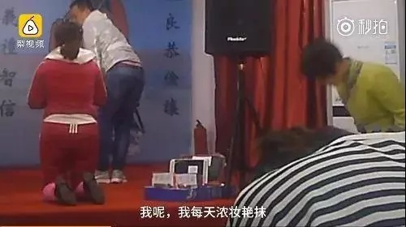
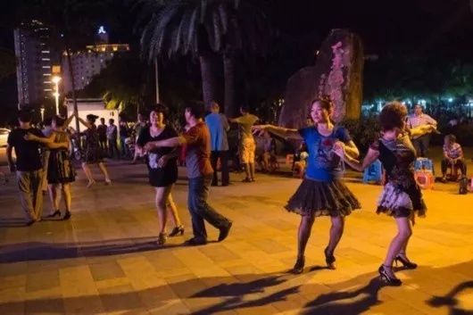
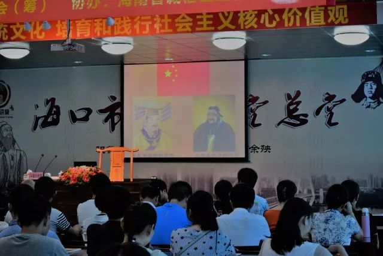

**编者按**

最近女德班现象在中国各地愈演愈烈，11月30日7:33分，梨视频的《女德班：女子点外卖是不守妇道》视频一出，各大媒体开始广泛转载，一时间，“女德班”又再一次的回归到了大众的视野当中，也让这个位于辽宁抚顺的传统文化教育学校也成了的十足“网红”。

今天我们邀请到了参与中国第一次女德班踢馆活动的讳言和飞剑客来谈一谈女德班与社区的关系。

<!--more-->

*抚顺市女德班视频截图*

11月30日早上开始，辽宁抚顺市传统文化教育学校以“男为天，女为地”、“女子就该在最底层”、“女子点外卖是不守妇道”等女德教诲的视频在微博上被网友疯狂转发，除了“外卖”躺枪，视频中宣讲的内容不禁让人回想起半年前“女德教主”丁璇在九江学院“三精成毒”、“女孩最好的嫁妆就是贞操”和“女性穿着暴露会克家庭、克父母、克子女”的种种呼吁，丁璇事件让早已中国社会结构性撕裂处滋生的“女德班”以“历史倒车”、“封建糟粕”的面目突然闯入城市白领与学生的视野，激起主流媒体、众多女权公号对其声讨和挖掘。在笔者与类似女德课近距离接触情况看（是的！笔者曾经和小姐姐们一起踢过女德馆），与其说是传统糟粕的死灰复燃，更准确说是挂着封建羊头的中老年保健产品的资本主义产业链，像抚顺事件里这些无证办学机构，从11年起，如今在郑州、三亚、温州等地设有分校，在广袤的中华大地上有着超乎想象的市场，受众从哪里来？答案是，基层社区。以海口市道德大讲堂为例，地处一个退休职工住宅区内，以市文明办为主办单位，在一个人口密度较高的小区中公开进行宣传活动，举办女德班“家和人乐
女德为要”活动时甚至在小区内有着巨大的十米横幅，在场做义工的也多是小区的中年女性。诸如全国各地其他的女德班也都有进入社区“传教”的历史，很大程度上丁璇事发也是因为她没有保守地龟缩在社区这样一个封闭空间内，而是试图去染指较为开放的大学校园空间。

*海口市道德大讲堂*

我们可以理解为，看似是文化骗子牟足劲想开倒车，实际上更有可能是搭了社会历史进程的顺风车——伪传统的兴起离不开自九十年代以来社区结构性转型。**早期的社区是行政力量派生的两种社会系统，即工作单位和地区组织，各自拥有相对独立的生态圈**，其相对优越的文化环境被大院子弟的哥姐们儿享用了；

而在市场化转型、城市化的高歌猛进下，原有的“单位人”、“大院人”被强推到“社会人”，“市场”作为“筛子”将不同阶层的人群从原来均质社区中“过滤”出来，相同阶层背景的人口在一定的空间地域内自发聚集，或是赚了第一桶金，钻进高档小区隔绝外界以确保象征界的地位，或逐渐形成以共同利益和特定的亚文化为联系纽带的城市基层居民生活共同体。

在宏观结构性变迁的背景下，社区经历过结构、观念和行动变迁的创造性过程，个人被整合成群体(Follett,1919)。社区中的行动者，如个人、组织、团体或机构等在社会场域中互动，产生了不同的社区过程—社区冲突、社区空间利用、社区意识形成与发展等(桑德斯，1982)。**毫无疑问，当下的社区结构变迁无疑带给当今人被从单位中剥离出来散落成单子化的“社会人”心理上的落差感，雅各布所描述的现代功能性城市的规划不断摧毁了原有的共同体，又亟需一种新的代替性的想象共同体，以维持社区的人际交往。**

与女德班形成有趣对照的是广场舞现象。对于中高龄社区居民来说，广场舞的流行便是作为一种临时性协作的共同体，其所营造的场域环境唤起了他们的集体主义时代传统的回溯与身份认同，而被抢占篮球场的年轻人、想在广场上安安静静喝杯咖啡玩玩手机的中产阶级们自然难以体味到广场舞大妈们从酣畅淋漓的舞蹈音乐体验中被满足的“共同存在”渴求。于是大妈们免不了被污名化的命运，变成固定的笑料，最好再扣上了wg余孽的帽子。

*广场舞*

然而，与“广场舞”一样作为现代性统制下的奇景再现的“女德班”们，则是高度迎合九十年代以来号召“妇女回归家庭”保守思潮以及主流社会对已婚女性的期待，**相比于广场舞所承载的历史符号，女德班以其柔和而仪式化的方式更容易成为了社区人所幻想的共同体（这种方式和邪教有着极大的相似性，她们内部互称家人，而据我所知很多邪教内部也是互称兄弟姐妹）。**沿着对社区的节点治理思路（节点治理形成了某社区文化内部反锁的空间）和对传统文化的想象，“道德讲堂”成为文明办扶持的一道招牌，女德趁机混杂其中，不得不说有点诡异了。

“女德”作为一种外来事物入侵社区，选择聚集了大量中老年退休职工社区是有其用意的。据我有限了解，有些退休职工在经历了让他们手足无措的商业/下岗大潮之后往往失去了原有的社会地位，抑或家庭生活过得悲惨，这使他们成为了对现状无缘置喙的存在。他们对入侵的思想毫无招架之力，而被阶级/性别的压迫的最深的痛感又无法抹去，直接对抗社会和男权结构又有着太大的风险，而“忍耐”、“女性的贞操要求”、盲目的孝、披着政府号召外衣的女德班就相对容易被他们接受了。**“女德”制造女性以对自我戕害和规训来达到崇高假象与诉苦的途径，实则是看似无法反抗的男权让深陷其中的她们达成了一个畸形的“女性”身份的妥协，她们重复获得了关于“忍耐”经验之后，在缺乏判断力之下会轻易被“女德”感召。简而言之，女德给予被压迫的女性一套完美的修辞和精神鸦片。**

*女德班听讲的孩子们*

同时，现代社区的一定程度的排他性特征以及这种空间文化的内卷化倾向，使得一旦女德班在社区里扎根，其影响还难以祓除，这就为女德班的“售后”问题提供了先天的保证。女德班使其信徒认为自己是具备德性之人（姨语？），自然而然地收纳她们周围有着相似境遇的女性，并排除掉“女德班”所指认的道德败坏的女性，例如底层难以企及的女强人，诋毁手段就是猜测她们获得权威的方式和认为她们即使再强，也不是一个真正的女人。女德班通过不断生产道德敌意，将被排斥之人他者化，聪明之处在于女德不是硬性的排斥而是劝服不女德的女性迷途知返，道德总堂此时就变成一个灵魂的灯塔，召唤着所有人走向这里重获新生。

言而总之“女德”从来不是一小撮牛鬼蛇神倒行逆施，不是一起起孤立事件，它们长期悄无声息地繁殖在现代性的潮湿阴暗之处，以及，上个世纪末的社区的结构变迁，保守主义思潮，东亚金融危机，国企的下岗潮流等等，无数人的工作生涯戛然而止，这些都为近几年甚嚣尘上的女德班提供了社会土壤。**作为微观场域的社区，容纳了政府、企业和居民等的博弈，在各级政府倡导的文明建设下，各种女德产业链里电商和劳务公司打着宣传传统文化的旗帜（被发明的传统）和公益活动（满满的挣钱套路），温情脉脉地走向基层社区。**

写这篇文章时，我也必须坦诚以上这套学术老干部文风的说辞与被性别压迫的中年妇女的实际情况是存在距离的，甚至也存在臆想的结论，即使我们曾经和她们一起走进讲堂，入座，置身于和谐盛世的朗诵声中，之后和他们一样被卷入女德课所营造的各种煽情氛围里。**但当我意识到了我们的行动是抱有一种预设，要唤醒男权“铁屋”里昏睡的人们，这种预设充满学院式的自负、懒惰和对远方人的想象，我们带着可悲的隔膜进入这样的场，同时我们也能理解“他们”对我们的敌意。**那么，我们该用怎样一种文化（工农文化？妇女半边天？），在类似女德班之前抢占更多社区真空状态……分析归分析，不如让我们一起来跳广场舞吧。

*国旗同黄帝一色，孔子与雷锋同辉*