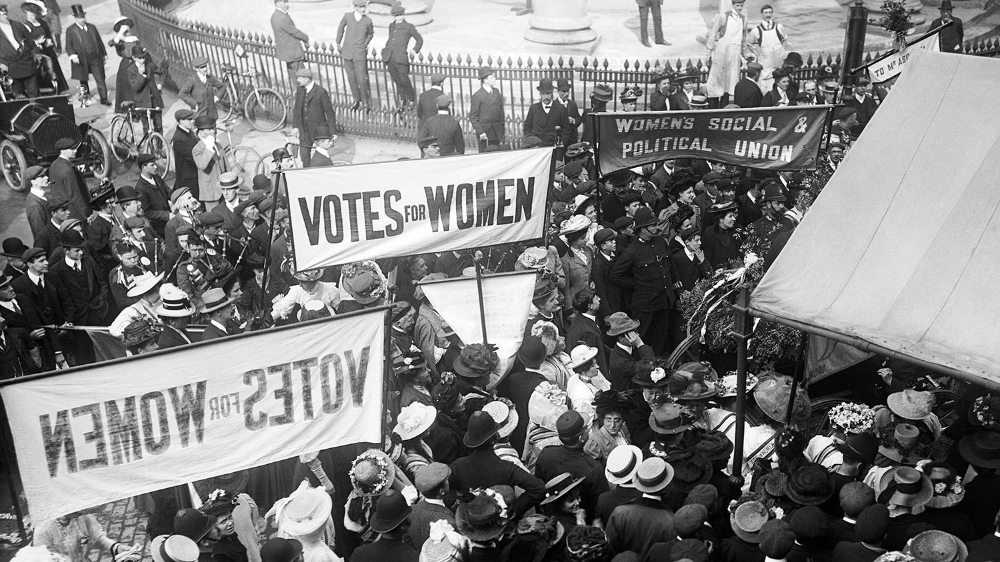
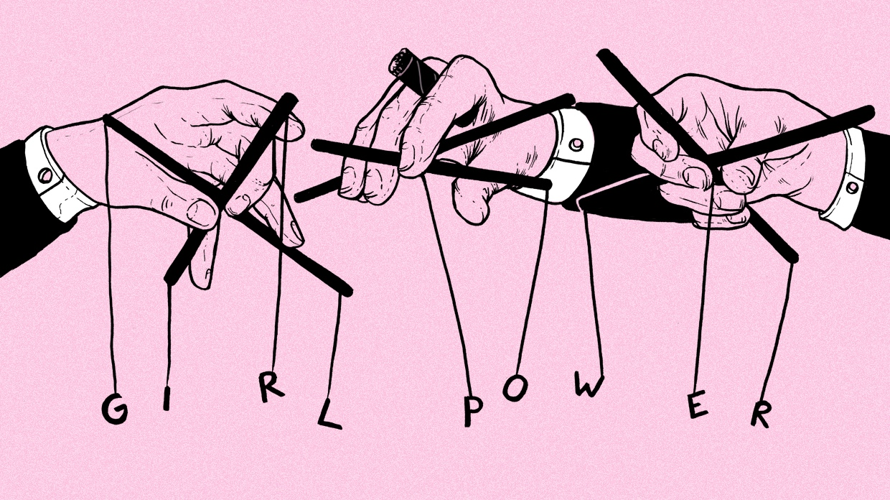
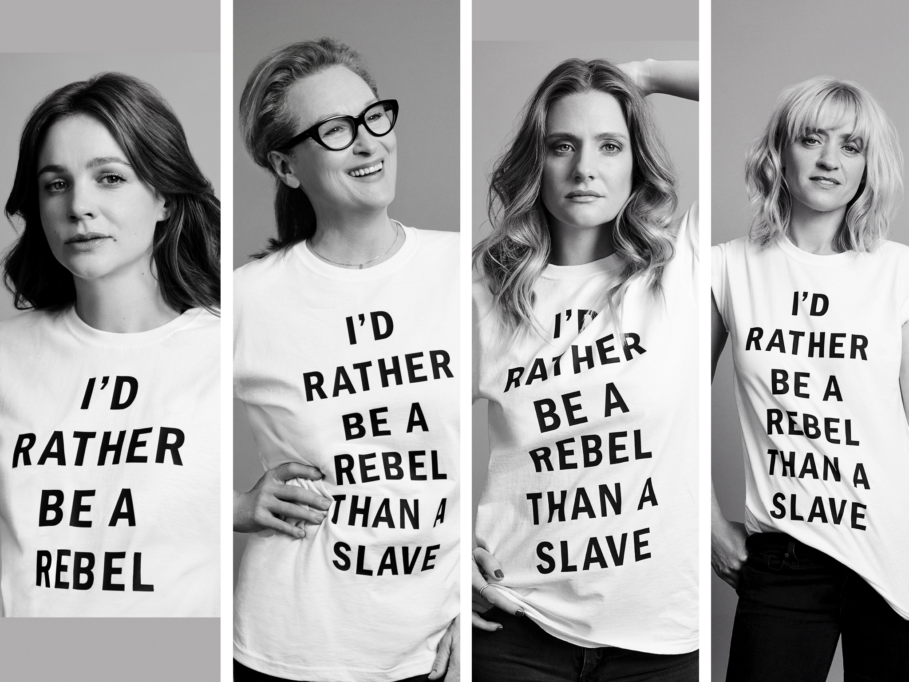

人们总是对新生事物充满兴趣，当且仅当这个事务满足现代性中对奇异性的审美，仿佛是现代性叙事的一种绵延，在既有的生活逻辑下生产了新内容，填充了某种猎奇的美感。但对另一种新生事物却充满恐惧，因为她打破的是对现有秩序的那种常态，颠覆了现有的生活逻辑。

<!--more-->

Claude Lefort将权力的建构性展开当做某种文本的阐释权，当然这个诠释权是政治权力行成的新主体，而非单纯的某个阶级。这种进路的权力观解释一定程度避开了讨论我们如何让度自然权力或者形成政治社群这种传统思维。将现有的政治常态当做一种既定现象。那么，我们自己在这种常态规则中的自律，对现秩序的服从，将秩序之外的权利观探讨当作不实际的讨论，慢慢就从权力结构控制变成了一种共同体生活，成了一种权力语境，似乎某些政治价值是不言自明的。这种例子数不胜数，无论是晚期资本主义社会还是男权制。

在此种权力语境下，人对现有秩序有极端不切实际的“公正信念”。这时代男权结构中男权者的出现首先是一种麻木，当我们在知乎普及女权的时候，某些群体的疑问是“这也能扯上女权吗”。这种被阉割式的呓语是对现有秩序的不自觉维护和一种无知的恐惧。

即使对于此类问题有一定认识的部分人，他也会诉诸“宏大叙事”，“这是特定历史阶段的产物”，仿佛说完只一句，性别问题就在这些人的鬼畜逻辑被消解了。通过寓言般的宏大叙事，用杜林主义一般的“终极图景”来去带真实面对的性别政治问题，却从未正式和严肃对待过任何一个微观问题。这也是某些人的“幼稚病”。

从某种长期的叙事阶段来看，一个难以想象却又真实地展现在人们面前的事实是，长久以来，我们所熟知的一切事件、经历与神话，都很难能完全称其为属于人们的历史。那些潜藏在文本边缘的不为人知的视线，那些为文本所拒斥的声音，以及更遥远处无力表达自身言说的一切失语者，他们绝不是尘世中无足轻重的一抔黄土，而是曾经真实存在过的生命。基于对菲勒斯崇拜的质疑，我们希望将这些饱经沧桑的魂灵请回舞台。在这样一种从离场到在场、从边缘到中心、从建构到解构的多重视域的诠释中，来自不同阶层、地区、信仰、性别和性取向的人们得以在重新认识他人的过程中认清自己。贫乏、空洞的消费主义叙事已经渗透到了当下话语结构的每一角落，弥赛亚时间的来临不过是对地平线尽头的惊鸿一窥，但是我们坚信，缓慢而坚定地推动巨石上山的挑战者，永远不缺那永不迟到的第一千零一名。

在这个话语高度去中心化的自媒体时代，传统的社会精英似乎正在失去对话语与秩序的掌控权，权力精英开始退居幕后，精英文化逐渐被大众文化所取代。

我们似乎进入了一个前所未有的美好时代，技术进步让我们摆脱了物质匮乏的恐惧，互联网引发的信息膨胀使人目不暇接，沉迷于各种超真实景观。人人尽可能地发出自己的声音，争相站在舞台最中央，享受他人的关注与崇拜，而非沦为观看他人表演的“沉默的大多数”。

在这场充满变革的时代潮流中，每个人似乎都可以自由地选择各种生活方式。

你可以利用消费主义构塑出属于自己的精致生活，岁月静好；你也可以全身心地投入资本主义商业大潮中，运用种种高明的商业手段成为世人歆羡的时代弄潮儿；

你可以选择蜗居于尚且安稳的象牙塔里教书育人，专心于学术，为追求真理而奋斗；你也可以哀叹世风日下，批判庸俗的大众太过喧哗和骚动，指责人们不再谈论诗歌、理想、家国和天下。

你可以利用时代赋予自己的话语权为自由、平等和进步等理念而呐喊，抨击社会的种种不公，为自己所信奉的理想信念而奔走；你还可以深入社会基层，用实际行动为改善弱势群体的生存条件尽一份力。

同样的，在这个看似去中心化的移动互联网时代，KOL吸附于热点输出着消费社会话语，资本无孔不入地重塑着我们的日常。中心从来不曾消失，只是更隐蔽也更强大。伴随着女性受教育率和工作率提升，消费社会也迎来了新的热点：贩卖女权生活方式。

通过一系列“红脸忠臣白脸奸臣”式的朴素价值判断构成的偏见集合，女性获得了非常舒适的女权人设门槛，而这实际上是波伏娃“当她发觉自己被海市蜃楼愚弄时，已经为时太晚，她的力量在失败的冒险中已被耗尽”那段论述的重演。虽然过去了七十年，太阳底下还是没有太多新鲜事，资本主义一如既往地是男权制的盟友。

*图源：https://www.huckmag.com/perspectives/opinion-perspectives/capitalism-is-co-opting-and-ruining-the-feminist-movement/*

那么女权主义究竟是什么？

这并不是一个可以简短回答的答案。正如“平等”的追求者有着共产主义、社会民主主义、左翼自由主义等不同理念一样，女权主义内部也有着纷杂的理论派别，而答案的对错也终归要在实践中寻找。

如果一定要给一个比较私人的女权概念，那我们想借鲁迅先生的一句话来表明，“无穷的远方，无数的人们，都和我们有关。”

女权就是一件与无穷远方无数人们与每个个体息息相关的事情。在比较大的层次上，女权是人类复归的必经之路；在个体而言，女权是个人认知从必然王国走向自由王国的起点之一。

于是在种种转瞬即逝的时代图景中，我们并不想充当冷眼的旁观者，我们希望能够尽一些微薄力量发出一种声音，去解构种种不合理的幻象，驱散当前景观世界的虚假幻象，帮助父权束缚下的男性和女性实现自我意识的觉醒，去反抗，去创造。

而在今天，越来越多年轻的中国女性加入了为性别平等发声与行动的行列之中，我们也将在进步的浪潮中作出自己的努力。面对男性中心社会中针对女性的种种不公，每个人都不应置身事外。

*《妇女参政论者》主演拍摄宣传照*

社会性别被文化塑造，严苛的性别体制嵌入生活的方方面面，性，生育，工作，家庭。私人的也是政治的。我们关注性与性别，关注父权制的形成与运作，关注历史中的女性，关注性少数群体，关注来自不同身份背景的女性的生命体验，关注父权制下的暴力与侵害，关注女性在求学工作生活中可能遭遇的各种困境。

从每一个细小的方面出发进行反思，分享女权主义思想，让她继续保持激进的心跳。

反思的进程，是保留一种黑格尔式的否定强度。为何我们自称为“Herstoria”？单纯提供一种性别视野？远不仅仅如此。在古典时期 Historia 或者 Historien 是一种调查研究，将 Logos 运用在真实关系研究的一种方式（所以希罗多德的《历史》其实可以翻译成《调查研究》），属于广义的 Logosgraph（如希罗或者克特西比乌斯这些信奉原子论的工程师甚至也可以归类于此）。而后现代女权在于对父权秩序话语遗留的 Logos 和菲勒斯中心主义的消解，同样也是对新叙事的一种重塑和否定的力量，目的是为了一种脱离于市民阶级道德的平权意识的诞生。

列宁在《对旧事物的破坏吓坏了的人们和为新事物奋斗的人们》提过新生事物的发展。

“被旧事物的破灭吓坏了的人们只有那些不愿意联系起来看历史事件或者不善于联系起来评价这些历史事件的人，才看不到这一点。他们不愿意看到，军队、农村和工厂里的各种不民主的制度，在几个星期内就几乎被彻底摧毁了。不经过这种破坏，便没有也不可能有其他通向社会主义的道路。他们不愿意看到，那种在拖延战争、用秘密条约掩饰掠夺和侵略的对外政策方面的帝国主义谎言，在几个星期内就被争取真正民主和平的真正革命民主的政策代替了。这一政策已经取得了重大的实际成果，即实现了停战和百倍地加强了我们革命的宣传力量。他们不愿意看到，工人监督和银行国有化已经开始实行，而这正是走向社会主义的最初步骤。

有些人看不清历史的前景，他们被资本主义的陈规所束缚，他们被旧事物的急剧破灭、被沙皇制度和资产阶级的历史建筑崩溃倒塌的折裂声、巨响和‘混乱’（表面上的混乱）弄得目瞪口呆，他们被发展到极端尖锐程度的，即变成了内战的阶级斗争吓坏了，而这是唯一合理的、唯一正义的、唯一神圣的战争，这不是神父所说的神圣战争，而是凡人所说的神圣战争，即被压迫者要推翻压迫者，使劳动者从一切压迫下解放出来的神圣战争。实质上，所有这些受到束缚的、被弄得目瞪口呆的、被吓坏了的资产者、小资产者和‘资产阶级手下的职员’，常常不自觉地以那种‘道听途说’的、陈旧的、荒谬的、温情的、知识分子庸俗的关于‘实施社会主义’的观念为指导，抓住社会主义学说的一鳞半爪，重复着被那些不学无术和一知半解的人所歪曲的社会主义学说，并且把这种‘实施’社会主义的思想，甚至计划，硬加到我们马克思主义者的头上。”

“在资本主义和社会主义之间有一段很长的‘阵痛’时期；暴力永远是替旧社会接生的助产婆。”

同样，在共运的低潮期和女权运动觉醒的当口，我们面对的式晚期资本主义和男权制的共生体，对新生事物的奋斗秉承同样的逻辑和处境。

那么，在男权秩序晚期和平权意识觉醒的过渡时期，在这个宣称 Herstoria 的亚历山大城，我们试图做的也是一个助产婆的角色。从打破文本开始到性别政治的行动，声音则是历史变革的先导。

