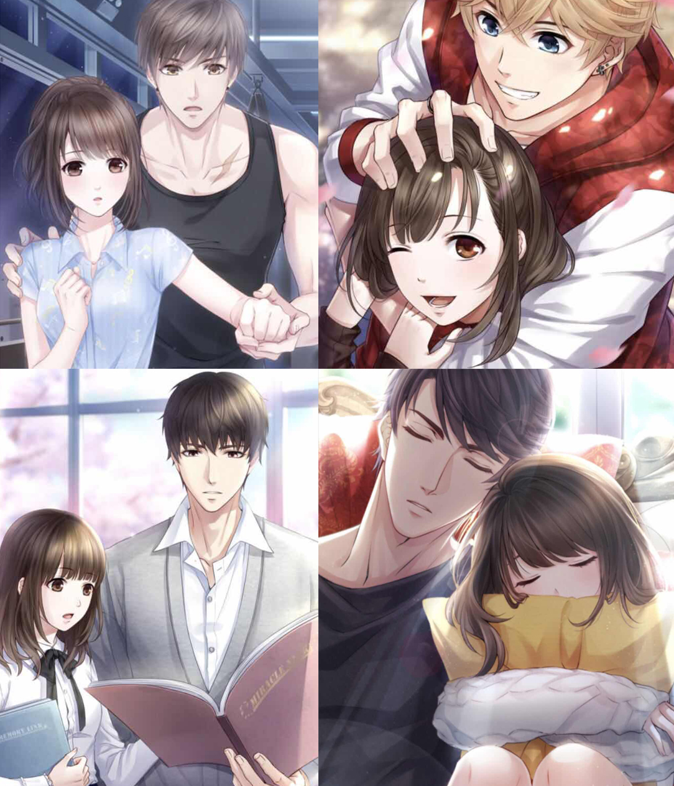
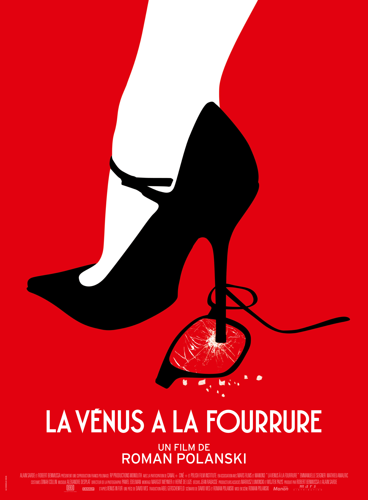
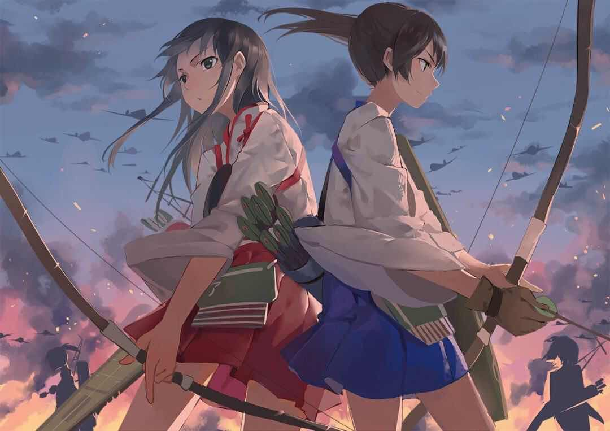
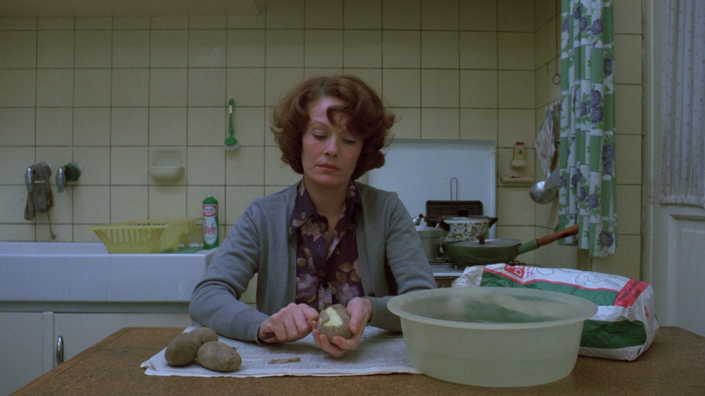
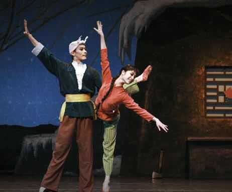
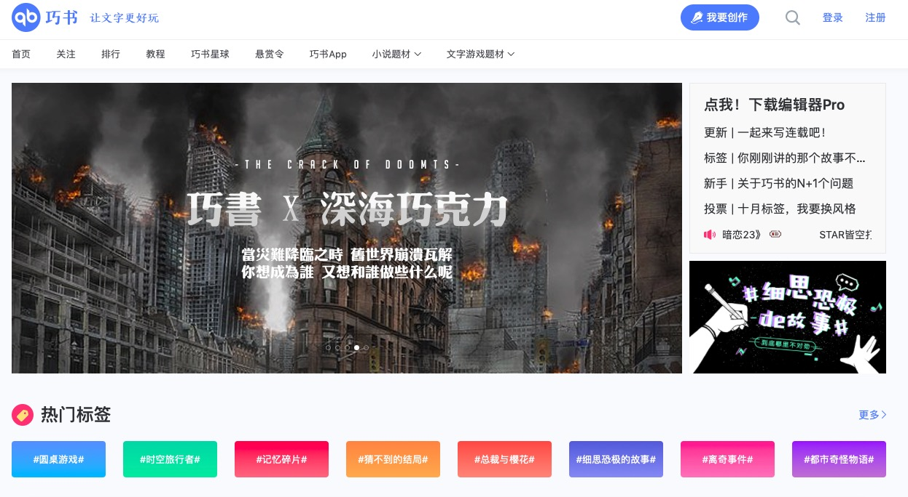

**作者**：[钟子默](https://www.zhihu.com/people/zhongzimo/activities)

**编辑**：[heaven疏狂](https://www.zhihu.com/people/heavenshu-kuang) 

后工业时代以来，不少学者对社会有一个基本洞见：社会逐渐朝着“**文化化”**的方向发展，似乎身边的一切事物都可以成为一种“文化”。随手买的一包烟、一本杂志或一瓶香水，甚至是身体所处的公园、超市或酒店，文化早已烙印在了生活的方方面面。与此同时，**文化观念上的自由与解放**被看得越来越重要。不论是近期某动画新番下架还是追溯到去年发生的外来剧大清洗，网民舆论很好地佐证这一点。如今，伴随着女性主义意识的解放，抢夺文化阵地成为了女权主义者的诉求。作为文化宣传的重要形式，女权主义文学在很多时候被寄予了厚望。

<!--more-->

笔者在写作过程中也出现过“女权文学何以可能”这样的疑问。本文提炼于笔者基于左翼立场对这一话题的自我反思与辩论。实际上，女权主义文学作为一种观念传播的出路，它至少将面临着**两座大山**。

后工业社会消费文化引起了学者对资本主义社会的忧虑。如果将列斐伏尔的空间观点引入到文学创作之中，那么文学创作本身也是一个生产过程，对于创作者而言，主体在文本中的叙述的内容与其所处的生产关系有着密切的联系。书籍是人本身的延伸，文学空间则作为一种社会抽象空间。统治阶级不仅规定现实生产空间的规则，并且透过文化霸权渗透进抽象的文学空间划定伦理和禁忌，完成意识形态的再生产。个人表达即“表征的空间”便在很大程度上会受制于文化工业的“空间的表达”。**在父权制社会关系下，女权文学必然要面临着男性霸权的审判**，即便不会被严打取缔，也可能会踩到读者的地雷。起点网前常务副总编真方土就提到：读者禁忌这块，男性读者的容忍度是很低的，基本要求是男主角不能愚蠢，必须强大；第一女主必须是处女，不能与其他男性发生关系，绝对不能有NTR。多年编辑的经验告诉他，男性读者作为网文消费群体的主体，有着固着的性别审美。而与此同时，这种审美又经常诉诸模因（原谅梗、黄毛）得以广泛传播。相对而言，女权主义文学由于其尺度之大，内容之突破，很可能触及这些本质论者敏感的神经，导致他们无法接受甚至传播恶名，女权主义文学与文化便陷入与主流文学与文化“针锋相对”的部落化困境。此时要求写出一部“女权”作品，结果可能仅仅是得到一个异化的剩余物，或指向一个空洞的能指。前者对应的是戴锦华教授所提到的，**将异性恋霸权的主奴关系强行移置在耽美文学之下，并没有摆脱父权制定位的象征秩序**；后者则突出表现在这个问题下许多马克思主义者的“乡愁”：**文学渐渐失去了它作为一门艺术对现实所发挥的“扬弃”作用**。

> 1. [NTR］是日文“寝取る”（Ne To Ru）的被动形“寝取られ”（Ne To Ra Re）的罗马拼音缩写，中译即“被他人强占配偶或对象”。
>
> 2. [黄毛］因里番中给男主（女主）戴绿帽子的多为黄头发，后来就叫给男主（女主）绿毛子的人为黄毛。

耽美文学中的主奴关系当然是基于内容反身性而言的。同时我们也可以注意到，随着消费市场边域的不断拓展，女性群体潜在的消费力量也被挖掘出来，逐渐成为一股具有强大消费能力的受众市场。女读者与耽美文学的关系不是纯粹的看与被看的关系，读者在阅读过程中有着“在场”与“缺失”的辩证，这表现在读者一方面作为读者阅读作品，另一方面又作为作品中全知的镜头窥视角色。耽美文学中，**男性仅仅作为他者被言说，女性作为偷窥癖的欲望主体**得以显现。比如在深圳京基100大厦为《恋与制作人》虚拟男性李泽言庆生的女性，从某种角度来说也体现着女性对男色觊觎的解放。

乙女游戏《恋与制作人》

女性消费男色似乎也意味着女性掌握了欲望的自主，当女性向游戏和文学市场开辟之后，女性在消费领域里逐渐褫夺了许多话语权。但是消费市场并不能由我们的一厢情愿去脑控。资本主义逐利使然，在维系旧的生产关系前提下，形成一套应对新的市场背景的规训机制，促进工作消费快速完成资本环程，女性的欲望和诉求便受到了干涉和引导。小说成为异化的延伸构建起一系列虚妄的自由意象。“爽文”的受欢迎程度远大于严肃文本。于是出现了以下吊诡的现象：许多女性承认了欣赏男色的事实**却并未承担主体意识的解放**，而是**遵循消费主义构建的“自由”塑造自我认同，形成一套迎合现有父权结构的价值观**。不少女尊小说沿着“女为主，男为从”的母题，却在故事当中处处表现男性对女性的过分让度和宠爱，更有甚者女性的娇纵和蛮横得到无底线地接纳。有些普通的言情小说也未能避免，主人公的成长始终围绕着男人，矛盾冲突总是进入“女人为难女人”的叙事怪圈。一些读者（尤其是一部分直男）对女性角色“形象”的容忍度极高，却对女性角色“行为”的容忍度极低。除了“白雪公主和灰姑娘”“邪恶的巫婆和继母”似乎找不到别的什么模板去比较女性角色的行为了。同时故事主人公与女读者的想象关系强行打断了现实秩序的介入，弱化和消解读者的结构性思维。从某种角度来说，这为接下来提到的“脑臂分离”埋下祸根。

SM题材电影《穿裘皮的维纳斯》

所以，笔者关注的地方在于后者。如何在父系社会下写出真正女权小说这个问题本身折射一个荒谬的悖论，尤其是在互联网时代，不论是知乎还是贴吧在讨论这种问题时，很容易出现各式各样人群的角色扮演。在历史唯物主义美学里，文化作为实践产物联系着社会的生产力，观念上层建筑与经济基础即对应的生产关系是统一的。随着后工业社会的崛起，文化与实践的关系出现剥离。法兰克福学派最早就指出了文化工业对艺术实践性的摧残，直到现在，一些左派还是寄希望于超越性主体试图让真正的艺术复归，这样的执着难免引导我们将目光放在动荡的红色年代，追寻一种无奈的怀旧主义。可如今用后现代的目光对文化产品做出阐释是不可避免的，我们不得不审视一个可能的悲剧结果。鲍德里亚在《符号政治经济学批判》中尝试用结构主义符号学对马克思的价值论进行变换：交换价值/使用价值=能指/所指。中间的斜杠意味着“绝对的断裂”。以文学为例，这里并不意味着卖方只拥有价值（交换价值）而买方只拥有使用价值的不可调和。而是使用价值已经成为滑动的所指继而被消解。作为享受阅读的读者所能拥有的也仅仅是文学内容中的漂浮能指，指涉着没有实际意义也永远没有实际意义的消费快感，现实与想象产生断裂，社会因而也“符号化”了，亚文化本有的反抗要素归于虚无。这样“直男癌爱读女权小说”也因此成为一种可能。这是句颇有反讽意味的话。我们能在日常生活中感受到，社会对女性形象的容忍度远远高于男性形象，置于文学创作当中也是一样的道理。当原则性的底线不逾越（如上文提到的副总编的话），一位独立自主、呼风唤雨，甚至是抖S的女王也可以被异化为发泄性欲的绝佳对象（更何况，现在还存在一些NTR爱好者。这些底线也渐渐模糊化了），**女权符号被收编于凝视的对象当中**。抖M或草食系并不意味着他就不是沙文猪，更不意味着这些草食系“愿意”或者“能够”在现实中践行这种亲密关系。而现在不少人批判雄性衰落，主张重振雄风。抛开这种性别二元对立倾向的毛病不谈，那至少需要将矛头对准消费主义，而不是追念保守的性别差异观。

大多数表达着女性优势或劣势的符号都能成为欲望对象，所以才会有如今看似奇葩的“反文化”在不断搞文化“革命”，就是要尝试以“审丑”的方式对抗主流的“审美”。如果按照鲍德里亚的思考方式，那实际上本文的关键问题也消解掉了。这显然不是笔者所要主张的。我们应该看到鲍德里亚预言的超真实社会并未完全出现，欧美后现代社会在我国还不多见，文化唯物论仍然有着生命力。那么至少不能放弃西西弗的精神，让批判的武器尽可能地发挥重要作用。我们可以尝试大胆地解放文学的内容和形式。然后考虑到宣传层面的问题，做出适当的妥协。

以笔者的拙见，在这个框架之下要写出至少让我们感受到“现实力量”的女权小说。可能需要我们一厢情愿地提这几个条件：

## 1

第一，在能够有效推广作品的前提下，尽可能的严肃创作。构建起原作者的元叙事，**阶级的话题**永远不会落伍。

应该说亚文化、反文化中的一些后结构主义路径对晚期资本主义的对抗有一定的启发意义，但容易误入歧途。“礼崩乐坏”的同时也会波及自身。如果要以平权为纲，我们可能需从严肃的创作中心出发。不能去消解问题反而要直面现实的宏大叙事，掀开笼罩在读者头上的诸多臆想。从题材的角度来说，女德班，农村存在的杀婴虐婴、拐卖女大学生的现象，城市外来务工人口的亲密关系中可能发生的状况，嫁入豪门成为家庭主妇的生活，都值得挖掘。当**性政治与阶级关系**错综复杂的交织在一起的时候，每一个引爆小说冲突的点，都可以引起读者的思考。

## 2

第二，重视现实和批判性。最好是作者，尤其是女性作者，以亲身经历或部分亲身经历为蓝本进行创作。并且在这一前提下，突出揭露、描写、转化女性之间的关系。构建“**女性共同体**”的印象。甚至在必要的时候完全取消男性角色的进入。

百合作品

文学是生产的过程，优秀的文学作品根植并扬弃于现实的生产关系，这是文学指向超越性的体现，也是文学所肩负的使命。在父系社会下，女性群体的自我反思和平权实践显得尤为宝贵，我们无法指望已经占有性别优势的平权男性成为运动的主体，正如新民主主义运动不可能以民族资产阶级为主体一样。从历史发端来看，女权运动源于**妇女对自身屈从地位的反叛，源于对男性霸权主义气质的攻讦**。女性一直是作为运动的发起和最终目的而被强调，甚至直到现在性别多元、性别自由的时代同样作为一种**身份政治**而延续。文本中男性与男性符号的“消失”也是重要的一环。女性之间建构起独特的关系场域，将男性客体排除在外，把焦点重新放在女性与女性之间。取消男性变量值，就还原了一个纯粹的“人”与“人”或“女人”与“女人”的矛盾及统一。这对现实中女性共同体的意识形成也有促进作用。

## 3

第三，有句不雅的讽刺：“美少女也要拉屎”。这意味着我们展现的是真实，而不是经由镜头选择过的“美”，因此必要时请大胆地“**审丑**”。

这里的“审丑”观点与第一条观点形成了一个看似矛盾的对照。如果我们问需要拿什么内容颠覆父权制审美，利用反文化中的那些看似丑陋和邪恶的元素是一个策略。波德莱尔在对待“**严肃的丑恶**”这点上展现了他振奋人心的诗学观。在对古典美学的扬弃上，波德莱尔毫无疑问是其中的佼佼者，而在对现代生活的看法上，他也毫不犹豫地与启蒙时代以来的各路文学风格背道而驰，对资本主义现代性投以冷静的审视。他将眼光对准赌徒、流浪汉、妓女、女同性恋等**边缘群体**，在这些群体中看到了一种独特的现代美学。但是他同时却在物质生活上拒斥现代性，表现出固着的贵族气质。在批判美国佬暴发户特性的时候，这种对美的“守贞”显露无疑。在女权文学的具体操作过程中，这些丑的形象也可以被严肃地挖掘。描写一名兢兢业业的妓女发现自己孕吐的时候；描写被毁容女性的激动或害羞的时候；描写乖乖女终于在好友被欺凌时拿起武器反抗的时候等等。这种对真相的去蔽，是对女性“**幼体性熟（pedomorphosis）**”叙事的有力回击。

女性主义电影《让娜－迪尔曼》

关于“真实”还有一个引发争议的讨论。当女权主义以文学的姿态介入意识形态领域的时候，文本所展现的内容不可避免会受到意识形态编码而呈现出艺术加工后的“艺术真实”，而这种真实与现实生活是有区别的，甚至可能有害。以50年代诞生的歌剧《白毛女》为例，政治挂帅在文本中体现得淋漓尽致，塑造了黄世仁地主的丑恶与白毛女的善良勤勉的鲜明对立。而不少学者通过实证论据指出，旧社会残留的地主并没有那么穷凶极恶，反之，“人命关天”，地主需要与父老乡亲和谐共处打成一片，才有可能应付乡绅和官员的“政审”或者共度灾荒。《白毛女》的政治叙事更像是第一共和国命运的缩影，展现的是经济基础与文化诉求的断裂，政治口号的工具理性对文学终极价值的排挤。因此最后的破产也是意料之中。类似于《白毛女》的这类政治文本最后也没能达到严肃文艺的经典型与永恒性。理念大于内容的“政治正确”在失去了现实支撑的情况下，最终只能沦为“自我感动”。女权文学若是以这种“向欲望屈服”的姿态出现，那么和上文提及的“爽文”也就没有两样了。如果女权主义小说需要产生经久不衰的影响力，以严肃文学的标准来看，其内容或许需要超脱意识形态而叩击人类灵魂的深层要素。如果是这样，我们不妨说终极的女权主义文学是有关人类社会进步的蓝图，是关乎“**存在**”与“**自由**”的祝词，目的是为了全人类的肉体、心灵与身份的平等与解放。而现在所探讨的女权主义文学正是其中关键的一步。

红色芭蕾舞剧《白毛女》剧照

## 4

第四，适当突破传统小说的固定形式。比如可融入一些**后设（meta）**元素。

后设元素通俗来讲即意味着，作者不再扮演故事的上帝，而是**介入到虚构文本的叙事过程中**；同时小说的主人公并不安于自己扮演的角色和故事框架的设定，而与作者和读者发生互动。从策略上来讲，这是对小说主人公的赋权，使他能在自己的主观视线、叙述的客观视线以及读者的阅读视线之间来回跳跃。虽然根本上这仍然是作者设下的诡计，却也建立起了作者与读者的沟通桥梁。读者难以通过沉迷故事构建想象，因为作品角色总是出戏打脸，倒逼读者反省文本和自身。最终实现关注点从内容到形式的转变。《真实魔鬼游戏2015》就是这样的例子，主人公不断与光怪陆离的现实抗争，最后终于发现自己正是被创造者安排进闹剧的角色。为了逃脱被摆布的命运，她觉醒的自由意志以肉体的自我了断的方式为全剧画下句号。此时作为观众的我们才发现，无法推敲的荒诞故事内容根本是创作者的有意为之，他们所要表明的正是关于自由和寻找真我的主题。

《真实的魔鬼游戏2015》剧照

对于女权小说来说，适当的meta手法就是要达到这样的效果：对内容主题进行升华，让读者从不合理的内容中读出父系社会的荒谬，从而关注创作意图，同时**将对内容解读的功能性视角，转为对整体批判的结构性视角**。也许我们就能看到故事里并没有设置所谓的“父权代理人”，真正的幕后黑手就是故事本身。当然需要注意的是，这种解构文本的创作方式不宜滥用，这不仅对于读者的认知习惯而言，对于文学的严肃性而言也是如此。毕竟后设终归是一种创作手法，但凡属于文学审美领域，产生审美疲劳几乎不可避免；过分突破叙事框架会导致注意力向形式与架构倾泻，文本内容失去深度和意义，造成内容匮乏和系统臃肿。

## 5

第五，在传统文学领地下与父权文化硬碰硬可能比较吃亏，或许我们可以尝试在橙光游戏等在国内新兴的**文字AVG**领域里践行“农村包围城市”的道路。

狭义上来说，文字AVG指的是日本的美少女恋爱养成游戏。广义上的文字AVG只要符合文字互动——即玩家（读者）阅读故事，在分歧点做出不同选择有不同结果既可。目前除了橙光游戏以外，还有如简书、巧书、蝶梦等平台发布这类作品或游戏，其相应的影响力也在逐渐上升。

巧书网站首页

文字AVG在国内还是比较新颖的概念，其本身也可以被理解为后现代风格的文学。当传统文学阵地在内容和形式上形成了“路径依赖”之后，文字AVG为网络小说桎梏的突破创造了新的可能，并吸引更多有能力的创作者。处于试验田阶段的文字AVG，相对来说对内容的监管和阻碍会更少，内容的体量会更大。不仅是女权的内容，其他先锋的、进步的内容也可以找到生存的土壤。更重要的是，文字AVG的创作者和受众大部分是有互联网思维并受亚文化影响较多的青年人。在这几代人中争取话语权，对女权事业的将来也十分重要。

总而言之，笔者讨论了父系社会下女权小说面临的两个困境，一个是**父权秩序对女权文本创作的干涉**，一个是**后现代主义文化发展路径可能导致的女权文本的解构**。对女权小说的进路的讨论可以分为三个方面，内容上的严肃，构建元叙事，把焦点放在女性关系场域；形式上的适当解构与融入后设元素；传播策略上，借助新兴的创作载体开展文化的“游击战”。不论作品最终是否沦为消费符号，不论最终的影响力究竟能抵达何种层次，这样的努力都是无可厚非的。我们应该取得共识的是，文学阵地不能没有女权主义者奋斗的身姿，不能没有我们为平权事业挥洒的血汗。不如给我们的行动寄予美好的愿景吧。