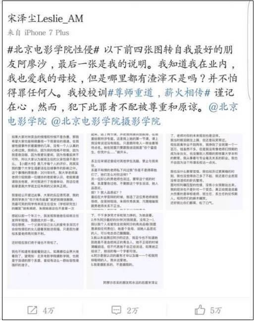
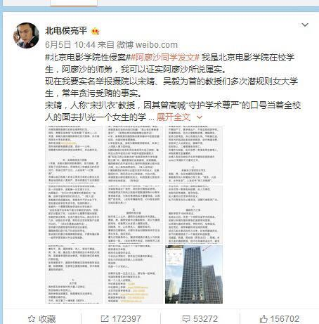
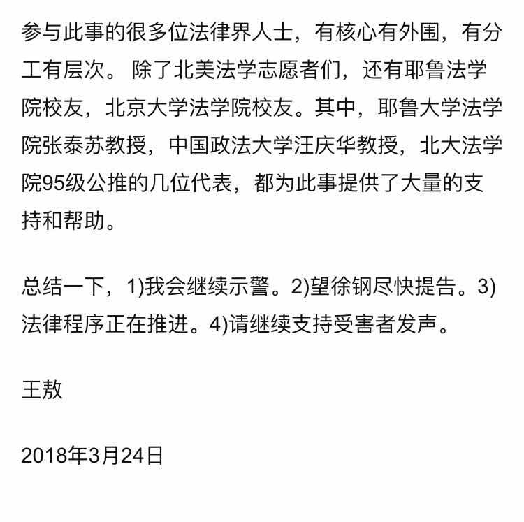
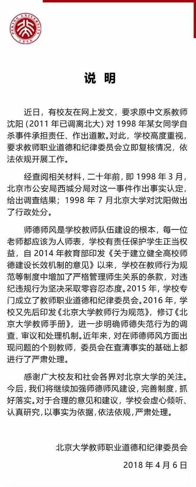
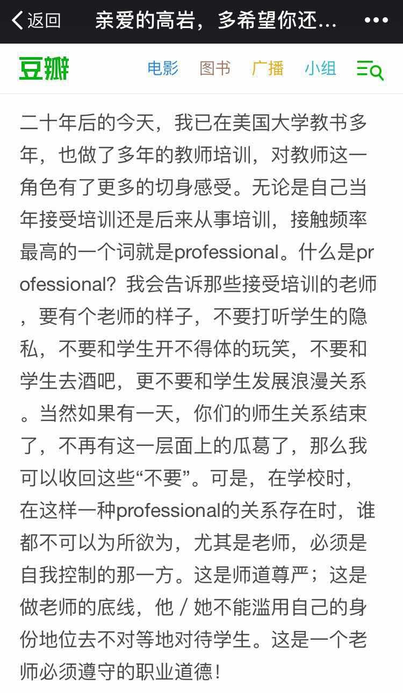

**汇总**：[Off-Line](https://www.zhihu.com/people/li-luo-jia-42)

**撰写及编辑**：[杨则非](https://www.zhihu.com/people/gu-chen-qiu) & 讳言

做这样的采集汇总，开始只是想保存一下最近这些事件的记录，到了后面看得越来越多，发现问题比我们想得还要严重。根据广州性别教育中心发布的《中国大学在校和毕业生性骚扰调查报告》，受访的6592份问卷里，**有7成受过不同程度和不同形式的骚扰，然而将近一半的人会选择忍耐，报案比例更是不到百分之四。**在询问为何不向学校投诉报告的3835名回答者里，有六成认为告诉学校也没用。也就是说，我们能在新闻看到的这些不过是冰山一角，背后，还有沉默的大多数。

**如果不做些什么，它们就真的，消失了。**

 

这是一份不完全的统计，因为我们无法将所有事件毫无遗漏得组织起来，我们只摘选了其中脉络清晰影响力较大的部分，后续我们还会陆续用石墨文档在公众号后台更新其他事件，后台回复**“资料”**我们将提供收集的大量相关资料（如林奕含的采访视频等），欢迎大家关注我们的工作。

<!--more-->

#### 事件轴线

**2017.4.28**

台湾作家林奕含自杀

↓

**2017.5.11**

北电阿廖沙事件在微博上曝光

↓

**2017.7.7**

电科大张翼德被“女权之声”指出性骚扰行为

↓

**2017.12.18**

南昌大学国学研究院副院长周斌被指性侵女生

↓

**2018.1.1**

罗茜茜博士举报北航教授陈小武

↓

**2018.1.11**

知乎提问引发对外经贸大学副教授薛原性骚扰事件曝光

↓

**2018.3.10**

王敖教授指出UIUC徐钢副教授长期性侵女学生的行为

↓

**2018.3.27**

公众号“白沙漠”公布

同济大学徐蜀辰博士性骚扰事件

↓

**2018.4.5** 

北大校友李悠悠、王宇根指证原北大老师沈阳曾性侵高岩

↓

**2018.4.8**

王敖指出上海华师大二附中张大同猥亵男生

####  **事件具体情况整理** 

01

**林奕含**

2017.4.28

台湾作家林奕含自杀，自杀生前出版《房思琪的初恋乐园》这本“女孩子爱上诱奸犯的故事”

↓ 

2017.8.21

台南地检署侦结该案，宣布由于证据不足对陈星不予起诉。

 

----

02

**北电阿廖沙**

 

2017.5.11

微博实名认证为“畅毅文化艺人事业部总经理”的@宋泽尘Leslie_AM发表微博，称好友“阿廖沙”在北京电影学院就读期间，遭遇班主任之父性侵。

 

北京电影学院连发两条微博针对此事加以辟谣。

第一条微博称，阿廖沙自中学起就患有抑郁症，大学时曾因因抑郁症自杀洗胃，并称经调查不存在所说的性侵情况。

随后删除微博，说明“学校正组织相关部门认真调查”，调查结果将在第一时间进行公布，并感谢社会各界对学校的支持和关心。

 

> 一开始引起轩然大波的微博
>

2017.5.12

百名北影毕业生联合署名《联名为朱炯老师正名：请不要让无辜者变成受害者》，呼吁抵制网络暴力，因为对事实不了解，无从判断真相，但希望舆论不要过度对朱炯老师施压。

2017.5.18

微博签约自媒体@一个有点理想的记者（以下简称“理记”）采访了事件中的班主任朱炯，在《北京电影学院深陷“性侵门”，对话朱炯副教授及各方当事人》她回应了阿廖沙的指控，否认对阿廖沙进行学术打压，说明阿廖沙患有抑郁症，经过和父亲沟通，父亲否认阿廖沙的指控，愿意阿廖沙走法律程序维护自己的权益，如果阿廖沙诽谤她她也将依靠法律保护自身权益。

 

阿廖沙同级同学魏艾迪在微博和知乎实名爆料，称阿廖沙被性侵确有其事，并直指北电摄影学院内部斗争。同时指出@11级北电毕业生和@北电侯亮平的爆料不实。

2017.6.5～6.10

微博账号@北电侯亮平， 自称“阿廖沙的师弟”、“北京电影学院摄院在校学生”的同学，6月5日到6月10日，在微博“举报”了“北电性侵门”事件中的相关人士，并以图片的形式披露了部分学院老师违规的证据，且在微博中透露自己已向北京市纪委实名举报。

 

> 北电侯亮平发文
>

2017.6.9

北京电影学院官方微博表态，将对此事予以彻查。

 

2017.6.11

北电侯亮平账号被封禁

 

2017.7

阿廖沙收到法律传票

 

此事没有后续。

----

03

**电科大张翼德性骚扰事件**

2017.7.7

“女权之声”在微博发布信息呼吁大家关注电子科大的校园性骚扰事件。据多名答主在知乎爆料，电子科技大学通信学院张翼德老师曾在课堂上传播具有性别歧视和性骚扰意味的言论，并多次利用考试成绩、保研名额威逼利诱女生。

↓

 2017.7.27

学校给予张翼德开除决定。

 

----

04

**南昌大学国学研究院副院长周斌**

**性侵女生事件**

 

2017.12.18

南昌大学女毕业生小柔（化名）委托第三方向校方举报遭该校国学研究院副院长周斌持续性侵七个月，并将一些细节和证据发布在微博上，引发舆论关注。

 

小柔曾向院长程水金举报周斌性侵行为，程试图阻止小柔曝光 

2017.12.20

南昌大学新闻中心官方微博@南昌大学通报称，20日下午，学校召开专题会议，决定免去程水金国学研究院院长职务、免去周斌国学研究院副院长职务，暂停周斌的一切教学科研工作。

 

----

05

**罗茜茜博士举报北航教授陈小武**

 

2018.1.1

罗茜茜发文章实名举报陈小武性骚扰，在文章中详述举报和北航处理的经过。

同日，北航对陈小武停职，展开调查

 

2018.1.11

北航官微发布调查结果，认定陈小武学术性侵犯行为属实并给予了处理。撤销陈小武研究生院常务副院长职务，取消其研究生导师资格，撤销其教师职务，取消其教师资格。

2018.4.3

网友“滴滴红宝石”在微博上爆料称1.11被查明有性骚扰行为并被取消教师资格的北航计算机系教授陈小武，3.29荣登2018年国家重点研发计划答辩名单。（该奖为性骚扰事发前申请）

 

06

**对外经贸大学副教授薛原性骚扰事件**

 

2018.1.11

匿名用户在知乎提问，曝光对外经贸大学统计学院副教授薛原性骚扰。一名本校学生在知乎回答称被薛原骚扰。

 

2018.1.12

对外经贸大学回应，收到网友匿名邮件举报，成立工作组跟进此事，已和对方展开沟通。 不日公布结果

 

到4.8为止，此事暂无进一步进展。

 

----

07

**UIUC徐钢事件**

 

2018.3.10

卫斯理安大学东亚研究学院副教授王敖在豆瓣发帖，实名指出伊利诺伊大学香槟分校的徐钢副教授长期性侵女学生的行为。并在知乎和微信多个平台发声。（豆瓣原文因为举报已经删除）

 

之后，徐钢在2013年殴打策展人黄笃女助理的事件被曝光，在知乎得到事主证实。知乎陆续有受害者回答证实徐刚行为不端。

 

徐钢否认王敖指控，并发出律师声明要求王敖停止诽谤。

 

> 王敖对于徐钢事件的回应
>

徐钢伊利诺大学香槟分校终身教职被免除。

“深圳艺术双年展”中止合作并解除徐钢的策展人身份。 

此事暂无后续。

----

08

**同济大学徐蜀辰博士性骚扰事件**

 

时间线参考公众号“**白沙漠”**。受害人没有直接公开。

 

2018.3.27

当事人就已经与院方提交举报，有所交涉。

 

2018.3.28

当事人正式向院方提交举报，聊天记录被曝出。

 

2018.3.30

知乎出现相关问题贴。

 

2018.3.31

公众号“不画图的建筑师”发布相关推文（已被删除）

 

2018.4.3

建筑与城市规划学院部分学生与教授于上午自发组织了’白手套“声援性骚扰受害者活动。

院方持积极态度。

部分院系教授转发了这个活动表示支持。

事件移交杨浦区公安局进行备案预备调查。

朋友圈出现转发豆瓣文章普及此事

 

2018.4.4

知乎徐蜀辰性骚扰相关帖子完全被删除。

当事人发朋友圈声明不曾意图二次炒作，不希望此事扩大。

院方表示积极支持态度，打算采取进一步措施。

 

> 当事人朋友圈
>

2018.4.5

公众号白沙漠发表《致每一个关心徐蜀辰涉嫌性骚扰同济女研究生事件的我们》

 

事件待续…

----

09

**北大高岩事件**

 

2018.4.5

清明节，北大校友李悠悠、王宇根指证原北大教授沈阳曾性侵高岩。北大校友徐芃、王敖等撰文哀悼。

 

2018.4.5 晚

红星新闻采访北大中文系时任系主任费振刚。费振刚表示，高岩去世后，北大校方专门针对此事召开了内部会议，在会议上对沈阳作出“记大过处分”。费振刚称，沈阳也承认与该女生有过“男女关系”。学校档案都有记录在案。

 

2018.4.6

沈阳否认指控，说处分决定上根本没有师德问题。”他同时还强调：“处分决定也只是行政警告，根本不是记大过。”

 

> 沈阳的回忆录
>

同日北京大学微博发出声明，98年已经对此事作出行政处分决定。对于行政处分的具体内容，北京大学党委宣传部负责人在回复媒体采访时表示，需要周一工作日查询档案后才能告知。

 

南京大学文学院前院长丁帆教授告诉中国之声记者，直到今年4月事件发酵，调阅档案后，校方才知道沈阳教授曾因为此事受过处分。

 

2018.4.7上午

沈阳现在就职的南京大学发布声明。其中表示，北京大学的处分已经证实沈阳的师德师风存在过问题，任何处分都不能代表事实的消亡……经讨论，建议沈阳辞去南京大学文学院的教职。

 

南京大学文学院前任院长丁帆也在其朋友圈发表了个人说明，自责引人失察。丁帆教授还告诉中国之声记者，在沈阳教授调至南大7年间，两人只见过两面。虽然在2012年卸任文学院院长，但在丁帆任职期间没有外调档案就同意引进人才，对此事应承担全部责任，同意并服从南京大学、南京大学文学院的一切处分决定。

 

上海师范大学同日也公开发出声明，明确终止此前与南京大学文学院教授沈阳所签校外兼职教师聘任协议。

 

同日晚，北大14级本科生邓宇昊援引《北大校务公开办法》，将于2018.4.9（周一）上午9:00前往校办，提交《信息公开申请表》和学生证复印件申请北大公开相关事件档案，呼吁同声协力。被约谈。次日凌晨放回。

 

> 北大的说明
>

2018.4.8

北京大学校召开了北京大学教师职业道德和纪律委员会专项会议，讨论《北京大学反性骚扰有关规定（建议稿）》。

公开当年“沈阳性侵事件”调查结果。

 

此事待续.

----

10

**上海华师大二附中张大同猥亵男生**

 

4.8上午，王敖代李晋发表给华师大二附中公开信，呼吁公开2012年的调查结果，是否有对张大同追责，学校采取了哪些措施防范性侵。

 

（暂完）

----

汇总的结尾，我们希望讨论一些问题。

**为什么受害者不愿意相信公义？除了高校内部处理相关事件的机制极其不透明之外，或许也与社会舆论未曾站在受害者一方有关。**

 

长期以来我们习惯于歌颂光明，以至于不敢正视黑暗，无法接受人类在负面生活环境中所能遭遇的一切及其结果，不惜通过“可怜之人必有可恨之处”的逻辑来维持天理昭昭的愿景。**具体到性骚扰、性侵性质的事件上，就是“荡妇羞辱”这一类受害者原罪论和将其“病理化”的舆论倾向。**

 

虽然经过这些年舆论对“谴责受害者”越来越难以容忍的态度的矫正，已经极少出现赤裸裸的受害者有罪论，但取而代之的又是一种“没有真正的苏格兰人”式的受害者身份剥夺。这不一定是冷漠或者恶毒，而是对同类的境遇抱有一种不切实际的公正世界假设导致的同理心缺失。

 

**所以最基本的一点是，对受害者要有同理心。**“勇者愤怒，抽刃向更强者；怯者愤怒，却抽刃向更弱者。”在任何一起性骚扰、性侵事件中，更值得谴责的永远是作恶之人以及给予他们作恶勇气的深层次存在。一个人如果在正义感向冷峻的现实低头后，转头把怒火倾向了受害者，那他毫无疑问是一个无能的“怯者”。

 

谴责受害者的舆论环境无疑是对受害者不友好的，当受害者鼓足勇气站出来告诉人们曾经发生过什么，ta不仅要直面对自己的学业有生杀予夺之权的母校，还要面对世人的不理解乃至质疑。受害者要么忍气吞声要么孤军奋战，这理应让我们感到羞愧。

 

而在高校内部的反性侵、反性骚扰机制的确立方面，**我们需要给弱势方规范而全面的保障，以及对强势方的权力的约束。**我们生活在一个现代化国家，不应该继续保卫师生之间家长制的残余。公就是公，私就是私，不能让权力套着师生感情的面具滥施淫威。

 

要有反性骚扰、反性侵在事前、事后各环节的相应措施。事前环节，应当普及关于性骚扰、性侵的相关法律，让潜在受害者意识到哪些行为是不应当被容忍的，应当如何规避，而如果遇到这些行为又应当如何处理。事后环节，应当在教育体系内设置里性骚扰、性侵举报的快速、透明、规范的响应机制，对事件的调查、对受害者的心理疏导等措施都应当及时到位。

 

**应该建立现代教育体系的师生伦理。**现阶段对师生关系的认知仍然有着许多前现代家长制基础上师生观念的残余，“一日为师终身为父”的训条下教师天然拥有对学生学业生活以外私人空间的干涉权，造成师生双方心理边界的模糊。应当认识到，“师者所以传道受业解惑也”，教师作为一种传授知识的职业不应当获得课堂以外的身份特权，这需要相应的职业伦理予以约束。

 

20年前自杀的高岩的朋友，如今已是大学老师的严蕾在纪念高岩的文章中写道：“我会告诉那些接受培训的老师，要有个老师的样子，不要打听学生的隐私，不要和学生开不得体的玩笑，不要和学生去酒吧，更不要和学生发展浪漫关系。当然如果有一天，你们的师生关系结束了，不再有这一层面上的瓜葛了，那么我可以收回这些“不要”。**可是，在学校时，在这样一种professional的关系存在时，谁都不可以为所欲为，尤其是老师，必须是自我控制的那一方。这是师道尊严；这是做老师的底线，他／她不能滥用自己的身份地位去不对等地对待学生。这是一个老师必须遵守的职业道德！**”

 

> 严蕾发在豆瓣上的纪念文章
>

诚然，在这一桩桩高校性骚扰事件的暴露之后，有无数兢兢业业恪守职责的教授老师们蒙受了这种“污名”，**如果因为这些孤立事件就将整个代表知识的教师群体集体贴上标签是极其不公平的，我们需要警惕类似于“中国高校就是乱”的极端言论。**即使是现在，我们也必须承认还存在顶着校方施压大胆说出“有本事就把我们的院长、副院长都免了，正好可以好好做科研！”的学者，也存在着尖锐讽刺这些叫兽“他们对自由与美和浪漫的宣谕包裹着一颗庄之蝶的心，念诵诗和远方的含泪双眸隐藏着开膛手杰克的凶残”的正直老师。不要对知识界失去希望，但也不要太过美化作为知识代言人的TA们，**老师亦凡人，导师制的一对一权力控制容易纵容他们放纵自己的欲望，这种无限制的权力机制才是值得我们探讨的真问题。**

 

至此，2018年4月9号，还有大量后续未被揭露和调查，还有大量尘封的冤屈未浮出历史地表，也许后面仍有不断的“反转”和新的信息被公布出来，我们的汇总工作也不会停止。当新的事件被曝光，希望朋友们能信任我们给我们投稿，让我们一起记录这一切——这个时代或残酷或刻奇但真实的事件，那些没有后续的桩桩件件并非被遗忘，它们只是潜伏在集体的某个记忆的角落，等待被召唤出来与新的一切发出嘹亮的和声。**当它们从无数人的记忆中被询唤，那会是一种真正能鞭策世界去改善的力量！**

 

最后，非常感谢Herstoria编辑们的集体工作，特别是off-line的细致梳理，和其他编辑们的集思广益~