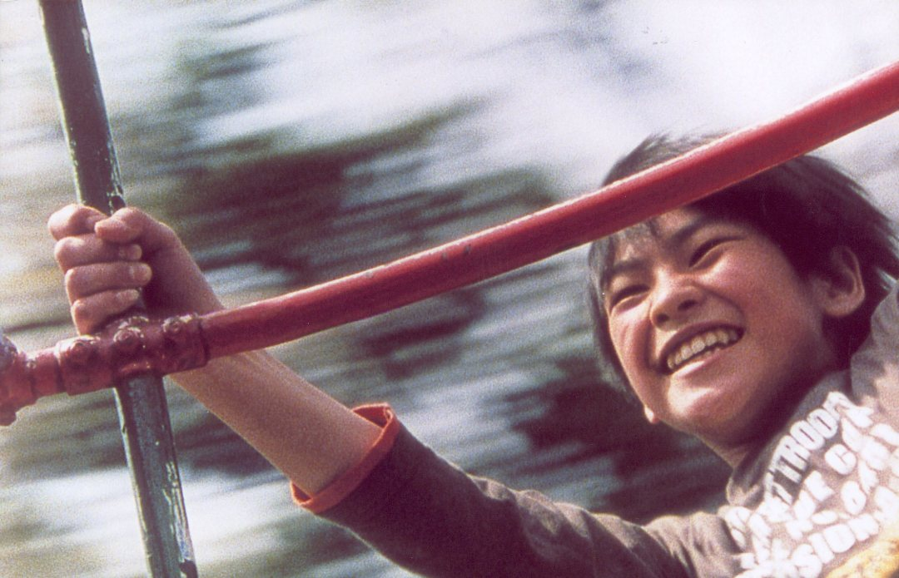
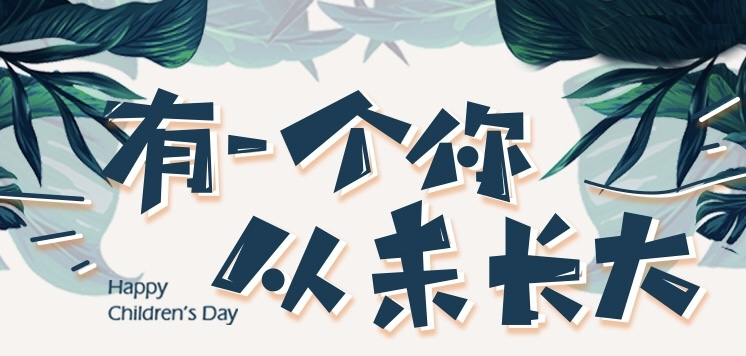
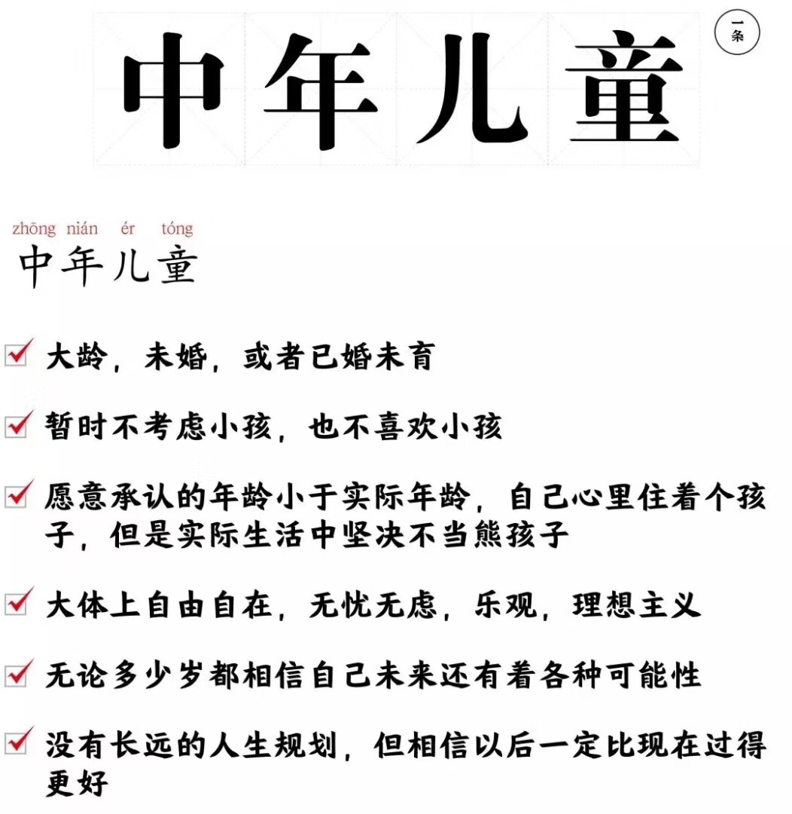
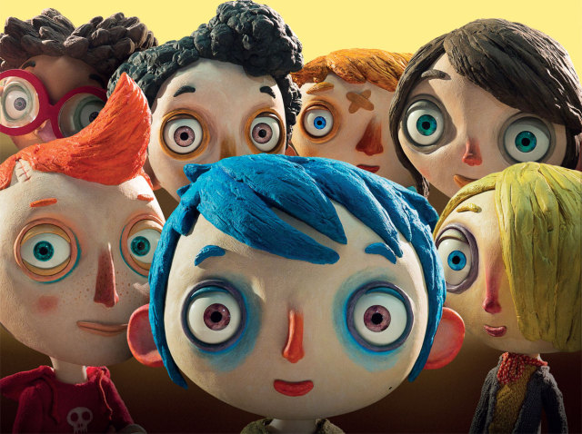
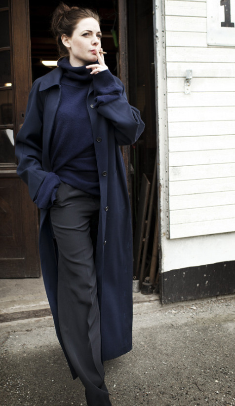

**作者**：[acel rovsion](https://www.zhihu.com/people/acel-rovsion)

**编辑**：[Luzz](https://www.zhihu.com/people/ru-shi-shuo-59), [heaven疏狂](https://www.zhihu.com/people/heavenshu-kuang)

> 儿童是现代人被剥夺的过去，从自主的匮乏走向了被剥夺的匮乏，但是当异化的人浪漫化童年之后，其实忽视了他们的匮乏主体只在出生那时刻。当社会身份的父母回应你的第一声啼哭之后，其实你已经介入社会关系了。

<!--more-->

**编者按**

今天是国际儿童节（International Children's Day），是全体儿童的节日。儿童节的设立初衷是为了悼念在战争中死难的儿童，反对虐杀和毒害儿童，以及号召保障世界各国儿童的生存权、保健权、受教育权和抚养权，改善儿童的生活。

近年来，儿童节逐渐不再局限于孩子们的节日，网络上盛行着一股“成年人过儿童节”风气，不少在年龄上已经不属于儿童的成人热衷于扮演儿童的游戏，卖萌取乐，向别人索求儿童节礼物，怀念童年时光，感叹童年的消逝……虽说这是以娱乐为基调的戏仿和操演，却折射出了某些时代症候，作为现代人的我们热衷于扮演儿童的游戏的同时，儿童—成人的关系也在发生异化。

某App今日宣传图（部分）

本期儿童节特辑，Herstoria特别邀请北欧大姐姐acel rovsion来谈论这个话题。

儿童是现代人被剥夺的过去，从自主的匮乏走向了被剥夺的匮乏，但是当异化的人浪漫化童年之后，其实忽视了他们的匮乏主体只在出生那时刻。当社会身份的父母回应你的第一声啼哭之后，其实你已经介入社会关系了。从这个角度来说，早期的儿童—成人之间存在某种共享视角，这个视角基于家庭这个有限的社会关系中，父母替你浪漫化和隔绝了外部，这样你获得了在完全自我阉割进入社会关系之前最自由的时光。

我们往往把这个特殊的时间段叫做“童年”，与其说我们是在回忆具体的记忆，还不如说我们悬置了一个丰碑，然后在完全被社会关系剥夺了主体的此刻，求得某种呼唤。

扮演儿童的需求和童年这个概念被生产了出来，真正的儿童在儿童节之际正疲于应付学校组织的活动和学校看似单纯的社会关系。而成人在一个人从“自然人”的自我意识映射到社会人的局限的时候，发现自我的叙事永远逃不开一种指涉，这个指涉可以确定自己，也可以外化自己。于是你开始厌倦，外面那个吵得要死的社会，以及吵得要死的自己，并怀疑那曾经如此清晰的自己与世界，**成人戏仿儿童去寻求某种来自起源的自主性**。

（戏仿寻求的是一种批判，就如同同性恋平权的策展中，会把异性恋主体的社会细节进行角色反转，来找到这些不言自明的社会逻辑中的荒谬之处。）

定义：中年儿童

语言和相互定位制成了一套不言自明却具有强迫性的象征秩序，这个秩序渗透到了曾经泾渭分明的儿童世界和成人世界。

尼尔·波兹曼在《童年的消逝》把儿童世界和成人世界的模糊视作媒介生产所致，并且认为媒介虚构了一种成人主体视角看待的童年。我更愿意将其解读成，象征秩序和社会权力渗入整个社会有机体的各处：

**成人在高压社会和信息爆炸的时代被社会关系所桎梏，作为个人希望悬置一个童年的他者并希望ta能召唤一个曾经具备自主性的自己，来暂时抗拒社会身份对于你主体性的覆盖。因为成人视角的儿童，ta是不需要被评价，也没有被介入社会关系的。**

就像蜘蛛侠被毒液这种共生体附身以后，即会享受共生体给予他的另一种生命意志，但当他的意志有一丁点找回自己，就会用声波或者火焰让共生体脱离，扮演儿童就是一种对自己的声波，用痛苦的自我否定来肯定权力意志。

其次，家庭结构由于作为保护者的父母被过高的养育成本或者经济焦虑很难再维护一个完全封闭的家庭空间，甚至无时间关注自己的孩子，更无力维护原始的家庭生活模式。**儿童在缺乏和父母的相互承认关系，家庭关系变成慢慢趋近于经济秩序，**父母在中度匮乏中以经济理性人的方式来思考家庭关系，对于底层家庭来说，儿童变成了投资品（换而言之，可以有处分人生的权力，比如舍弃或者选择），对于中层家庭而言，儿童则成了消费品（生育是价值满足的伴随物）。

在个体-世界的体验中出现了中空，这些东西过早地社会关系所填补，而学校作为社会再生产的场所在阶级社会慢慢承担了**文化资本再生产和社会资本再生产的作用**，高昂的培养成本和教育资源开始把成人世界的阶级区隔带入到学校之中，而学校也承接了儿童被过早填充的社会关系意识。学校中的身份确定，以及消费能力的攀比所引发的主动区隔意识，开始慢慢渗入这个场所。

布洛赫曾经用儿童比喻过一种初始关系。儿童其实是一个**匮乏主体**，一个匮乏主体的任何行动都是没有外在性动机的。所谓的外在性动机，包括由于拜物产生的商品性价值驱动的动机，也包括社会关系中迫于资本社会伦理所做出选择的动机。这种匮乏主体对于外界的贪婪的理解和接受，甚至包括接受物都不是来自于一个确切的社会动机，就是单纯的”好奇“而已，而这个好奇就是人本身主体性的流露而已，这个主体性流露的行为没有确切的外部目的性，就如同嬉戏一般，这也是原始的人本身主体性（autonomy）。

而从自己的啼哭无法被真正回应，儿童-父母关系被缩小到极限，我们都需要从外部获得回应来确证自身。儿童走向了他们的小社会，成人苦涩地扮演着他们想象的儿童生活。与其说儿童这个主体退场了，还不如说“我们”消逝了，成了社会进程一个没有注解的数字。

**彩蛋时间**

上次投票结果中， acel rovsion成为本号读者最想了解的编辑，
所以这期在文首附上简单的个人介绍\~

**Acel Rovsion**

气鼓鼓的河鲀，北欧大姐姐。日常外貌，智商，社会关系焦虑，主体焦虑，什么都焦虑。社交恐惧症，人生意义缺失症，后垮掉派，脑臀分离症，阿斯伯格症。总之就是到处都是毛病。

右图是个人心中最想成为的形象→

