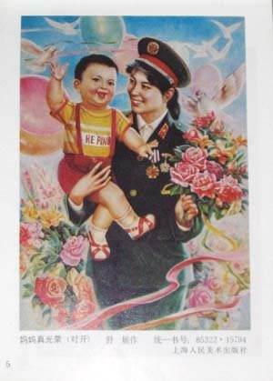
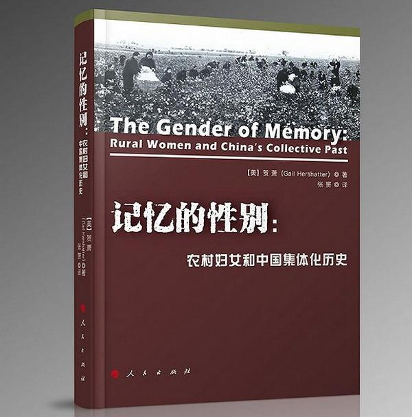

**作者**：時客

**编辑**：讳言

2012年美国亚洲研究学会年会上，贺萧教授作为年度主席做了题为“Disquiet in
the House of Gender”（性别宅邸的隐忧）的讲演，是文发表于当年的《亚洲研究学刊》\[1\]。

<!--more-->

## 贺萧教授

*贺萧（Gail Hershatter），现于加利福尼亚大学圣克鲁斯分校历史系执教，曾任美国亚洲研究学会主席，是中国近现代史专家、美国中国妇女与性别史研究开创者之一。代表作：《记忆的性别：农村妇女和中国集体化历史》。*

文章讲述了发生于1949年后中国大陆的三个“故事”，强调在地化研究的重要性，对性别研究提出新的展望。

第一个“故事”的主角是陕西妇女张朝凤。1960年，她和丈夫在生育问题上发生分歧。她随后选择去往县城，通过司法途径办理离婚。这个故事看似普通，实则呈现出多个有异于宏大叙事的面向：其一，作为一个童养媳，她与本该作为“压迫者”的婆婆关系相当亲密；其二，她没有在1950年《婚姻法》颁布后就离婚，直到十年后才选择用法律捍卫自身权益；其三，本该支持“妇女解放”的乡村基层干部，担心“离婚会给党的形象抹黑”，没有支持张朝凤离婚。贺萧教授指出，当国家政策下行到复杂的基层环境中时，会同当地习俗、实践和感情倾向发出意想不到的反映。而且，基层环境自身也在不断地发生改变，改变也不总是遂称国家权力的希望\[2\]。  

第二个“故事”关乎家庭、劳动和赡养。毛时代的集体化虽旨在提高粮食产量，但客观上改变了原有的家族老幼抚养机制。老人通过调整家庭内工分和粮食，鼓励子女承担更多的抚养第三代的责任。改革开放后，农村人口涌向城市。此时第一代已渐老去，集体化时代的低保亦不复存在，其子女们需要承担抚养上下两代人的责任。毛时代多子化的影响下，每个子女的承担责任被削弱，遑论婆媳与翁婿关系了——孝顺婆婆逐渐淡出对女性美德的要求。在贺萧教授看来，要理解这种现象，必须回溯“政策、家庭劳动、继承权、寿命”\[3\]与女性性别定位之间的联系。

第三个“故事”是一个群像的考察。其主角是在“计划生育”时代奔走乡间的中年女性。她们是50年代社会主义农村的积极分子。当时鼓励生育的政策（如“光荣妈妈”等）大幅透支了她们的能量。所以在80年代，她们积极支持和推广“计划生育”的主要动机“不是忠实地执行国家的发展战略”，更不是为了充当“国家在当地的完美代理人”，而是指向对于鼓励生育政策的“一种隐性的批评”\[4\]。她们不满这种政策的姗姗来迟，一如当时年轻男女不满这种政策的初来乍到。后者在各类作品中屡见不鲜，前者却提供了另一个更广阔的思考维度。

*“光荣妈妈”与“计划生育”*

作者根据上述三个故事发问：毛时代的革命究竟是什么？谁发动了它？谁从中获益？毛时代的人如何理解它？它在物质和社会实际层面留下了怎样的遗产？它如何淹留或重组于当代的记忆与理解中？最重要的是，性别在研究这些问题中该承担怎样的角色？在贺萧教授看来，性别这一研究范式的价值不是在于其从微观到宏观的同一性，而在于其多标量和不可单纯量化的特质。她认为，研究需要综合考量“个人、家庭、社区、地区、国家和更广阔的范围”\[5\]。这些不同范围的交界处充满了凹凸不平的政治领域，这也正是历史研究需要去探索的地方。

至2012年，美国学术界关于性别的研究已可谓汗牛充栋。学者们逐渐形成统一范式、理论和分析框架。诸多个案、群像和问题都可以被放到“性别”的范畴内然后庖丁解牛。这固然是学术研究日趋成熟的结果，但又恰恰阻碍了新的研究问世。当学者满足于待在这名为“性别”的学术宅邸中，舒服地鸟瞰历史长河时，往往会忽略了诸多细节、纹理背后的历史本相。贺萧教授希望研究者们不再“依赖于家庭和国家之间的同构性”，不再“假设跨区域之间的稳定联系”\[6\]，走出这座学术府邸，动态地用“性别”观察历史图景。

贺萧教授本文的批评和展望，是基于对美国学术界的审视。与之相比，大陆学界是否也存在类似问题呢？兹本世纪以来，大陆学界妇女史研究兴起。以中国近现代史领域为例，2009年全年共99篇相关论文，是2002年的5.5倍\[7\]。学者们关注女性身体、教育、职业，以及婚丧。同一时期，随着西方逐渐引入，学界开始两种转型。一是研究边界的拓宽，其核心是“社会性别”的提出和运用。它打破了以往妇女史研究以女性代言人身份，揭露传统伦理戕害，这种“压迫-解放”的固定模式，强调重视在传统社会中，两性自己的声音。这一概念不再仅指代女性，而是以更高度抽象的视野统摄整个历史图景。二是研究视野下沉，其源头是后现代理论和新文化史的推动。学者们引入人类学的民族志方法，对具体历史场景作深描式分析。宏大叙事往往会遗漏基层与地方社会这种深层衔接点。研究者就是要通过观察这些微观结构与小进程，解构传统中国史叙事所建造的历史同一性和整体性。

这两种行进中的转型固然令人欣喜，但与西方学术界从上世纪70年代开始的轨迹相比，大陆学界仍道阻且长。比如，在古代史领域，学者研究的重心停留在传统命题（如妇女地位、生活、特殊妇女群体等）\[8\]。这种现象与史料建设不足有关，既有研究成果反复利用已发掘的传统史料，大量新史料缺乏充分整理和利用，它包括且不限于简帛、卜辞、器物、墓志、碑铭、方志、族谱、契约文书、州县档案，以及神话传说、民歌诗赋、小说绘画等。史料的局限导致学术研究只堆砌了典籍中与妇女有关的历史信息——即贺萧教授批评的“增加妇女和搅动”\[9\]的研究方式——从而至少呈现出以下三种缺憾：

**一是对于性别视角中的男性群体缺乏关注。**性别视角天然地包括男性，讨论社会性别也自当围绕两性与两性关系来展开。以近代近代中国“妇女解放”历程为例，最早发声呼吁女权的多为男性。在这一变迁中，男性对于女性问题的表述该如何分析？男性与“妇女解放”关系如何？要解决这些问题，自然需要深入历史的细部，做更加复杂和综合的考察。

**二是基本概念及其适用范畴界定尚乏共识。**研究视野下沉的一个影响是硕、博士论文多沉浸在讲述具体个案的层面。这些研究当然填补了史实层面的空白，但鲜能回应概念、分析、理论层面上的问题。“碎片化”现象导致题目越做越细，宏观思考相对缺乏\[10\]。晚清民国以来，“男女平等”、“妇女解放”、“女权”、“女界”、“女学”、“新女性”、“贤妻良母”等广为时人使用和争论的词汇在不同的文本中具体代表了什么？它对当时的男性、女性意味着什么？而今我们又该如何使用这些概念？这些问题的背后，恰是社会性别史的关怀所在。

**三是作为分析工具的“性别”正逐渐僵化为单一固定范式。**在美国学界，“性别”是对人类历史的一种基本分析框架。当代学者多将之与其他框架并置，从多角度还原历史的复杂面貌。以欧立德的研究为例，他置满族寡妇于“族群、政治与性别复杂重叠之处的中心”\[11\]，还原清朝政府对她们的控制。他据此提出，“性别塑造了族群，反之亦然”，而帝国藉此确保族群界限并实现生育控制。与之相比，国内学界鲜少将性别视角与阶级、民族等视角做有机结合，催生出不少仅以“性别”视角来切割历史的“成果”。

回看贺萧教授的批评。美国学界对基本概念的讨论和对两性及两性关系的分析业已不知凡几，这座名为“性别”的宅邸已巍巍大成。正是在这种背景下，才有“隐忧”之思。与之相比，如果说前两个问题是国内转型尚未完全所致，第三个问题则正在贺萧教授批评的范畴内。国内学界距离宅邸竣工尚有时日，反倒先有了闭门不出的毛病。究其原因，是我们尚未，建立在地化的“实证—理论”研究习惯。现有研究，尤其硕、博士论文，很少能打通从史料考辨到理论分析的路径，多是讲完“故事”就挪用理论来嵌套。乍看之下，论文数量成倍在增长，实则没能为社会性别史研究添砖加瓦。这也就造成了史料不固、概念不清、对象不明等问题存在的同时，理论分析先走向僵化的局面。**如贺萧教授所说，无论性别、族群，还是阶级、职业，都该被作为一种攀岩滑轮\[12\]而装入背包。学者当负起行囊直攀岩壁，触摸历史细部的凹凸和纹理。**

## 注释

\[1\] Hershatter, Gail. "Disquiet in the House of Gender." The
Journal of Asian Studies 71, no. 4 (2012): 873-94.

\[2\] Hershatter, Gail. "Disquiet in the House of Gender.", pp. 881.

\[3\] Hershatter, Gail. "Disquiet in the House of Gender.", pp. 886.

\[4\] Hershatter, Gail. "Disquiet in the House of Gender.", pp. 887.

\[5\] Hershatter, Gail. "Disquiet in the House of Gender.", pp. 891.

\[6\] Hershatter, Gail. "Disquiet in the House of Gender.", pp. 892.

\[7\]
余华林：《新世纪以来中国本土近代妇女史研究检视》，《山西师大学报（社会科学版）》，2015年第2期，第111页。

\[8\]
王申：《近10年来唐宋妇女史研究的回顾与反思》，《妇女研究论丛》，2012年第2期，第113页。

\[9\] Hershatter, Gail. "Disquiet in the House of Gender.", pp. 878.

\[10\]
高世瑜：《从妇女史到妇女/性别史——新世纪妇女史学科的新发展》，《妇女研究论丛》，2015年第3期，第121页。

\[11\] Elliott, Mark C. "Manchu Widows and Ethnicity in Qing China."
Comparative Studies in Society and History 41, no. 1 (1999): 33-71.

\[12\] Hershatter, Gail. "Disquiet in the House of Gender.", pp.
891.