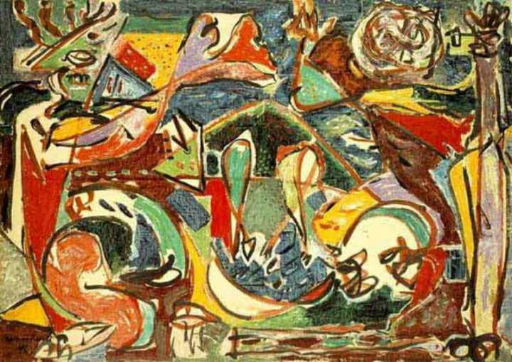
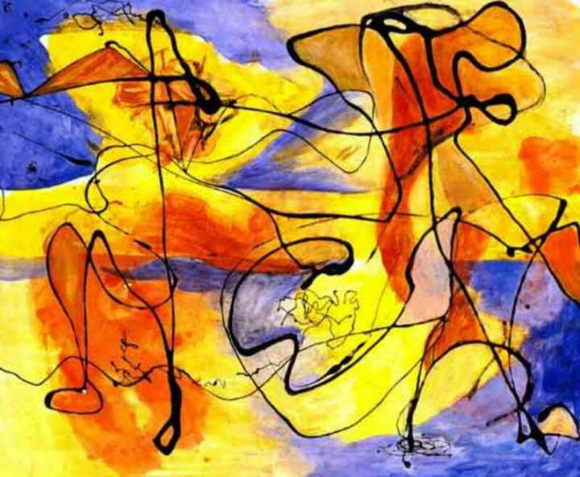

**作者**：王毅飞

**编辑**：[Luzz](https://www.zhihu.com/people/ru-shi-shuo-59)

导言：我希望进行一些新的思想实验，让话语在实体界与象征界、广场与卫生间、权力中心与亵渎边缘等二元层面跳跃、牵引，利用这一追逃过程中的哲学思辨，展现一种先锋式的艺术与美。

<!--more-->

这名男性，当他尚且处于私人领域内部，对其被公共空间凝视而组建的身体来说，该私人领域构成了闭合的系统，其阴茎则进入一种存在与消弥的混合叠加形式，只有当男人推开门进入公共空间，才能在社会视角的观测中摆脱生死交加的状态，让我们知道，他活在**象征界**，抑或者已经被自己的身体杀死。

由活人构建的象征界公共空间里，男性生殖器坍缩为不在场，性和阴茎被禁止提及，男人失去了**实在界**的性器官和男性身体——男人变成符号，就像公共场合附带的卫生间男性符号那样——一个被标识在显眼位置的蓝色或黑色的塑料板剪影。这是刻板的，平面化的符号，一个在象征界取代男性的没有阴茎的标志。

当人来到广场，我们环顾四周，所有公共空间里男性的生殖器都已经被抹除了，很好，看这些行色匆匆的白领，标准的装束，标准的谈吐，每一个人都手持一部标准的智能手机，这样的情景下你觉得一切都很正常，你不该如此突发奇想——他覆盖西装裤子的裆部真的存在一对布满褶皱的睾丸吗？

广场是开放的，流动性的，它的身上则依附着一些闭合性的相对稳定的空间，在这些狭小的功能性场合里，人们故作轻松地随意聊天，或者故作深沉地高谈阔论。一些饭桌上，你看见那位足以称为焦点的男人（权力中心），现在，想象他下体有在场的丑陋阴茎和浓密的黑毛，你会感到不适（为什么），必须停止想象了。你那个**被社会建构的超我**告诉你，在别人阴茎坍缩为无的场合，凝视他实在的生殖器，这是不对的。而且每个人都会觉得这种念头真的很恶心。

从什么时候开始，人们觉得生殖器以及和它相关的言语是恶心的呢？

饭桌上高谈阔论的深沉中年男性有阴茎吗？芳草地奢侈品购物中心里和周围人随意闲谈的休闲白领有阴茎吗？超我告诉你，以上这些想法不该出现，这是亵渎。

你理当羞愧。

这个视野里象征界的图样或许是一条完整的，平滑的曲线，它的弯曲或许也很符合流行文化的审美趣味，闭合的曲线，是那些被衣物遮盖的——不存在的躯体才可能是完美的符号的躯体，不存在的阴茎才可能是完美的男性的表征。一个完美的闭合 ，意味着它是绝对的光滑的平面，无孔的皮肤没有任何显眼的凸起，你这不存在的菲勒斯，不存在的男性的躯体，一切来自实在界的性特征和性心理已经消弥——阴茎成为一条完美的曲线，如同被抹掉孔洞的女性的外阴。

这曲线并非无限地长，如果公共场合（无论是符号无限流通的广场文化区，亦或者的相对稳定相对闭合的泛广场文化区）被性介入，完美曲线就会发生可怕的断裂，其结果则是完美男性符号被自己的身体杀死。

曲线必须延长，为了避免断裂，性理当被架空。

## 一、权力的角色

自男孩出生开始，社会便围绕他的身份主体构造了一系列话语，以便培训其快感模式与人格结构，为他在青年时期彻底融入象征界打好基础。有时候男孩从大人背地里的掩嘴偷笑和窃窃私语中习得了性的禁忌，这种被**大他者**神秘化的性，将在男孩进入象征界之初因其“难以达成”而被架空为权力的表征——一个不可能的符号，甚至脱离了性的**能指**——性成为象征界里的明星和模特的美色，成为象征界里没有阴茎男孩永恒的失落。

男孩如何向自己象征界里的同伴炫耀性符号（也就是他的女友）？或许情商比较高的朋友应该主动向他询问，比如询问他追求女生的进度就是一个好的引子，一个方便简单的仪式，可以为男孩的符号炫耀搭建话语中的合法性。他们相谈甚欢，一切看上去都正常得刻板——两个没有阴茎的男人喋喋不休地默契谈论着其他话题，用以方便自身触碰性的禁忌。结果自然是“皆大欢喜”的——在保持话语合法性，即没有阴茎的前提下，对性的指涉就是如此让人愉悦。

## 二、仪式，戏拟与刻奇

此外在上一个故事中，男孩还收获了权力的炫耀式快感，这部分主要来自“朋友角色”高情商地倾情表演，而朋友也会因自身的戏拟技术产生自恋，正如在现代社会的葬礼仪式上，一切都紧张而有序的进行，人们由于过渡担心他人凝视下的自己会破坏葬礼本身的氛围，反而忘记思考死亡本身的严肃性和失去亲属的创伤，一些人或许甚至会在葬礼的悲怆戏拟中，在公共空间的凝视之下生成刻奇的愉悦——得出那个平淡的结论是：**高度社会建构的场合里，人们通过扮演角色的技术性快感，可以将自身与性，死亡等实在范畴隔开。**

或者说，这快感本就由隔离的状态加以生成，以性与死亡的参照坐标被召唤而来的飘渺的欢欣——在纯洁，神圣又严肃的高中教学氛围之下，一名女生因无法控制地幻想男老师私下的做爱，射精和性器官形状而无比苦恼，但很快，她将在这名老师面前保持更高强度的刻奇，尽管男老师的符号身体已经濒临枯竭和死亡，但在他**生理意义**上的身体（一具全裸的，拥有丑陋阴茎的尸体）旁，女同学却愈发纯洁，愈发刻板，愈发严肃认真地扮演着好学生的形象，男老师象征性的葬礼仪式上，女同学获得了更多角色扮演的技术性快感，因为戏拟本身就是鄙视链的每一环，任何戏拟皆以其外的每一样事物为行动的参照。

## 三、放逐的阴茎

当被问及任何一种可能被性所介入的问题时，我看见西装革履的男人们使用科学，哲学，心理学或者心灵鸡汤的话语，高声地，恰当地，长篇大论地谈论着性，就仿佛一旦触及到那些有关性与生殖的话语，现代社会便开始喋喋不休地讲述着自己究竟有多么合法，开放和正常。为了维持自身无阴茎的身体，男性符号竭尽所能地滔滔不绝，在现代社会建构的各种体系里疯了似的坦白着自身，希求撇清自己和性之间的所有关系。

现代社会将性异化（权力化），架空（仪式化），还放出一系列围绕着性的话语，严丝合缝地对实在的男性生殖器围追堵截，当然这是效果显著——即使阴茎坍缩为在场，也有葬礼仪式将阴茎的实体存在与公共空间的话语隔开，毫无疑问，**在现代，男生殖器已经遭到抹除，只留下无数科学的，哲学的合法性话语**，如福柯所说“喋喋不休地讲述着自己对性有多么沉默”。

而在这严丝合缝的闭合曲线中，卫生间则成为了公共空间里无法避免的唯一的伤痕，成为了男性实体在象征界中唯一的投影，面对真实的阴茎，现代社会终于哑口无言。留在二者之间的只有卫生间的指称——一段无法符号化的，冗长的尴尬。

所以回到开头，我们把我们自己的现代**性别符号**放置在卫生间的门口，就仿佛只要你一从卫生间的量子生死叠加状态里出来，这个蓝色或黑色的塑料板剪影就能替代这个人活下去了似的。

不错，我也曾亲眼看见古米的西比尔吊在一个笼子里。

孩子们在问她：西比尔，你要什么？

她回答说：我要死。 \[1\]

\[1\] 编者注：原文最后一段出自佩特罗尼乌斯的《萨蒂利孔》，艾略特在《荒原》题记里引用过，西比尔是西方传说中可预言未来的女巫。在希腊神话里，阿波罗爱上了西比尔，施予她预言的能力；而且无论过了多少年，只要她的手中有尘土，她就能活多少年。然而她却忘了向阿波罗索要永恒的青春，因而日渐衰老憔悴，最后几近成为空壳，却依然求死不得。