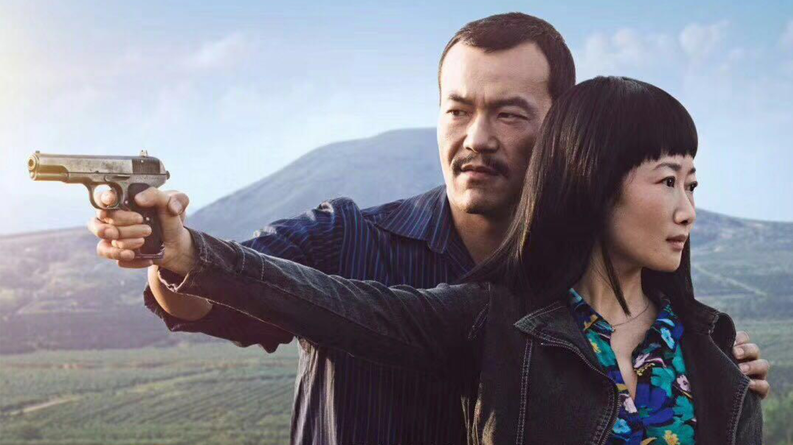
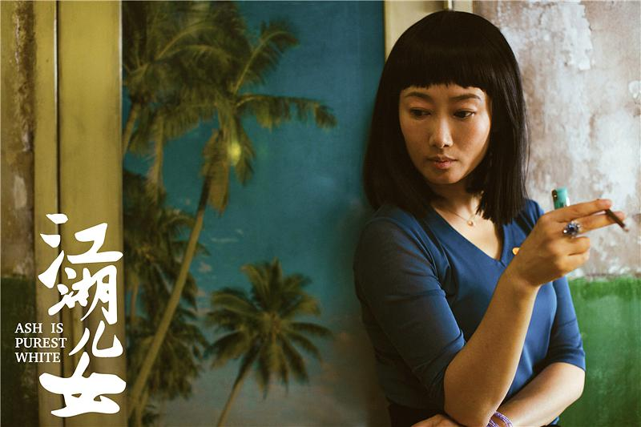
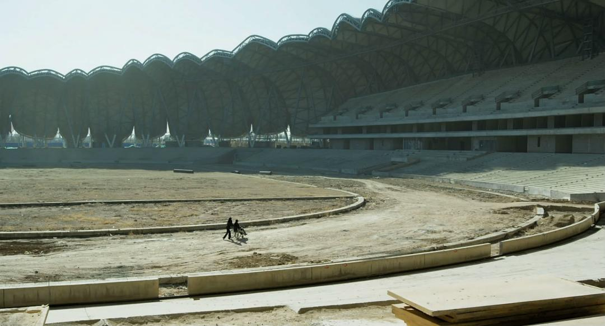

**作者**：[陳觴](https://www.zhihu.com/people/chen-shang-83-53)

**编辑**：讳言

<!--more-->

艺术是现实的反应，就像逆流而上的鱼儿，它似乎是反向的，但是，站在它的前面或者上面，你会看到，它是不断前进的。《江湖儿女》所呈现的，大概就是一种奇特的艺术，这不是一部电影，从而也不是一部女权主义电影——应该说，《江》是一个完整的样板房，它里面包括了很多元素，而女权主义的元素确实是可被挖掘的，这体现了女性受难及其反抗之源。到底是谁握住了谁的笔，来进行女性的书写？

与其看握笔者，我们不妨先从纸上开始。这是一个小县城的故事，这里面弥漫着牛粪和煤灰的味道，乡村和城市，田野和矿井，白道和黑道，这是一个介乎农业和工业之间的中国，这才显得尤为真实而又时代感。故事的培养皿本身就是一对矛盾，而有了矛盾才有江湖。巧巧一开始就在这样的环境中出现，她是农业文明中最为讨人喜欢的一个角色，但是她又受到了工业文明的影响，她可以说是一个融合体。她一直在斌斌背后做一个打下手的角色，这也符合传统道德对女性的辅助性定位，但是她无疑是有自我意识的，但是，说到底，女人在江湖中是在微不足道的，她让父亲停止和倒卖国产的官员争执，也一心经营自己和斌斌的生活，她并没有江湖中人的气质和意识，然而，形势比人强，她最终还是走进了江湖之中。

#### 安静的躁动

----

一开始，巧巧的生活是十分平滑的，就像一个波澜不惊的湖面，但是，她逐渐地被推向了河流，流入了海洋。时移世易，工人或下岗或搬走，地下社会的根脉已经越来越丰富而庞杂，她却依然想着操劳起一个普通人的家庭，这明显是一种“天职观念”的影响，女性的身体就是家庭，女性对家庭的渴望和承担俨然成为了本能反应。不过，在日益躁动甚至是崩溃的社会里头，她却显得非常幼稚，她不想开枪，而且让斌斌把枪丢了，甚至她想让斌斌和她跟着矿上搬到新疆，可是大同终究斌斌的地头，她想让男人放弃事业去过小日子无疑是痴心妄想。

彼时的大同已经日益商业化——这是中国的一个标本，大量工人下岗而走到了黑白之间，而这里需要一股国家之外的力量去盈贯充衡，斌斌毫无疑问就是这样的一个角色，已经洗白的黑道大佬让他帮忙摆平谣言，他自己也是一个小集团的领袖。历史的书写者是他，因为每一个动荡的时代都需要英雄，斌斌已经成为了斌哥，而其他的小毛孩需要打破这个秩序来给自己铺设上位之路，他就像关二爷，这个偶像存在一天，他们就得继续受其颐指气使。

而巧巧依然对这种东西茫然不知，因为父系社会的游戏，她是无法下场的，即便她最终被卷入混沌其中。整个故事的时间毫无疑问是线性发展的，但是这不代表社会是如此，更不代表巧巧能够一路前进。**正是巧巧经历了那么多的事情，可以说，这时候她已经跳出了一般女性所担任的职责和角色，她必须要承担起一些她未尝试过的东西，这就是江湖中的道义。**

#### **步入江湖**

----

巧巧从工厂跳入了江湖，她便跳入了另一个循环，江湖的规律就是，大吃小，黑吃黑，下犯上。巧巧一直循规蹈矩，只想做一个大哥背后的女人，最后却被迫开枪自救，陷入牢狱。她出狱之后仍然想找斌斌，但是一切都变化了，斌斌移情别恋，钱包被偷，无法回家，她被生活狠狠地敲诈了。整个社会进入了新的循环，她无法再继续做农业社会里头安分守己的持家小女人了，她在这种被迫和无奈之下开始蹭饭，欺骗，她终于为了生活不择手段，这便是江湖人的特性——地下的社会是没有规则的，人们无异于野兽。

**正是野兽般的凶猛、好斗和勇敢之类的男性气质，最后被道德日益衰败的商业社会给灌输到了失落的女性身上。**这样的一种系统，与其说是一种进步，不如说是一个原地转圈的方式——只是这个绕的圈子比起旧有的社会体制更大了一些。因为小农经济的生产力缺乏，以及生产节令的限制，农业社会中的时间是以农业生产为循环；而工业彻底破碎了田园牧歌，它解放了生产力，却不一定给人们带来美好的生活。巧巧便是处在这两个时代的夹缝，她被时代浪潮推涌着，小鸟依人的女性已经不适合了，她们为了生存被迫进化，这时的女性已经不再是旧有的女性。

然而，我们也不能说女性身份得到了创新。因为她们仍然不是书写者，巧巧一路上“依靠”的人还是父权制的代表，如包养小三的新贵，忙于生意的斌斌和大学生；也有因社会压迫而沦为流氓的人，如想“耍”的摩托车司机，偷钱包的中年妇女，以及在火车上诱骗女人的小卖部老板——他们正在围剿巧巧这个猎物，而巧巧一直斗智斗勇，她从被动的接受者成为主动者，不然她会被整个父权社会吞没。

在她回到大同之后，她扮演的实际上是斌斌的角色，这时候便是她在父权制和黑社会中的一部分，她成为了麻将馆老板，不惜用水壶砸人，她要用原来的男性权力来维生并自立。她还要把雄风已没的斌斌请回来，他依然是一副大哥范和臭脾气，巧巧既是想回顾过去，“走过来时的路”，一方面也是一种对过去身份的超越。这是一个新的循环，她走到了工业文明的时间里头，也走到了江湖之中。她已经是江湖中人了。

#### **循环和道义**

----

正如上文所属，巧巧从天真无知的年轻女孩，到了后来拼死拼活，成为自我独立的江湖女性。她肩上背着道义，道义不同于正义，正如社会不同于江湖。江湖是社会的一个中间环节，它的另一头连接着一股莫名而强力的冲动，这是表层社会所不能容纳的。她给家里送钱，给斌斌打点琐碎小事，考虑前途(丢枪，跟着矿上到新疆去)，这些尚且是一般人的小事，可是当她拿枪救斌斌的时候，这就是道义，这是江湖义气。

但是，如果再深挖下去，江湖是一个灰色地带，地下社会是农业文明跳跃到工业文明的枢纽，是矛盾的衍生物，宗族，家庭，也可以看到等级分化和权力争夺。社会的剧烈变化导致了底层群众的严重撕裂，失业、失地、家庭破碎，地下社会便是一个维持权力秩序，又有不同力量在互相牵扯，这里面也有其更新换代。就像朝代兴衰，政权更迭，社团会壮大，分裂，小弟会成为大哥，老大哥又被新的小弟取代，这就是江湖里的循环。而农业的循环，如宗族的成立，分家，衰败，农田的分散，集中，垄断，按着节令走的农业生产枯燥无味。再加上工业的循环，如资本的扩张垄断，公司创业破产，工人们为了生计奔波，永不休止的经济危机。江湖的循环是一个小循环，它既有农村中的规矩，也有公司里的条例，它是破产农民和流氓无产者的结合，在这里，道义取代了道德，江湖弱肉强食的，道义不过是弱者的抱团和强者的联手。**农业和工业就像小齿轮和大齿轮，推动着江湖运动，然而江湖终究是个小机器罢了。**

巧巧在这个机器之中也要讲道义，她有照顾麻将馆和下属的道义，有替斌斌出头的道义，道义并不是正义，归根结底，道义不过是一种利益交换罢了，但是我们却能看出其中的正义成分。这是小人物的糊口的办法，是上升江湖地位的做法，也是一种力量的体现，权力本身就是依靠外在力量体现出来的。巧巧虽然是个并不强壮的女性，却在江湖中有了她的力量，有了她的权力，她能够维持一定场所的秩序，能够替斌斌出头，这便是正义若隐若现之处。不过，最让人懊恼的是，难道正义要靠巧巧这种江湖人物来体现吗？以金钱和作为人情纽带的规矩离正义还有多远？

#### **姜文的女神和贾樟柯的女人**

----

各大著名导演都有给自己妻子“开小灶”的习惯，姜文和贾樟柯亦然，但是，他们不一样。

姜文下的女性角色都是女神，他也坦承如此。这是由姜文的风格决定的，他热爱宏观叙事，这也注定了他的女性角色必须是正义凛然，英姿飒爽的，他追求的是大义，但是这种大义的历史背景往往使女性变成辅助角色——英雄是要大于英雌的，这是历史的行程，也不难解释，为什么其电影中出现的众多男性凝视镜头。

贾樟柯镜头下的女性角色都是平凡人，这更容易让大部分公众感同身受，这也是为什么我说他的电影是样板房，他的电影是中国社会的浓缩版。在贾樟柯的电影里头，更能看到平凡人的生活，也因此更有质感，更容易看到生活的虚伪和强迫。这里他更需要的是小人物的道义。这是十分现实而直观的，道义所体现的底层民众的生活和社会关系，恰好证明了平凡生活的不断循环，巧巧和斌斌的矛盾就是贾樟柯的循环，自《任我行》到《江湖儿女》，周而复始。

#### **纸和笔的颠倒**

----

**我们已经把整张纸摊开了，但是，她依然是随意泼洒的墨水，女性是整个书写环节的客体，她需要用镜像来发现自己，她是菲勒斯的缺口，她必须要书写自己，又不像自己。**实际上我们不必去臆想出一个不存在的主体，我们每个人都是书写的主体——意志的体现恰好是我们自身的体现，在时空是轮回的，也是断裂的，正是在断裂之中激发出人的潜能，这种新的力量就是新的身份，是女性缺失部分的补充。

人类历史就像笔在纸上不断循环画圈，圈子却越来越大。从母系社会走向父系社会，这时候开始了政治，我们遇到的第一个循环是农业社会，女性在其中扮演贤妻良母的角色，家庭就是女性的身份依存，第二个循环就是工业社会，女性走出家庭，但这仅仅意味着其生产能力的释放，而不是其权利的解放，女性的身体此时是残缺的，她既是家庭的呵护者，也是社会公共领域的一员。**即便如此，她依然无法做主，作为言说的存在，她必须继续依靠菲勒斯，这便是循环，女性身份便是永世轮回的，她在对象性劳动中成为了客体，她未有一刻能掌握自己的命运。**

男性角色的湮灭恰恰要依赖女性身份的主动，性别（gender）变成了一个牢固的囚笼，不可能依赖这个囚笼来获得自由——而是要拆掉它，并且用它来制造新的工具，这种工具是彰显权力的——这是主体性的依靠，只有把笔握在手中，才能有自己的故事。显然，这一切要打破循环的时间，首先要突破身份的束缚，她从缺乏力量，一步一步在劳动中积攒力量，最后把他杀掉——把男性的身份取消，因为他拥有至高无上的权力，而权力就是一切。就像一切杀掉暴君的戏剧一样，巧巧即使请回斌斌，最终他还是离开了，因为这里已经没有一寸土地能容纳得下他的骄纵跋扈了。而这些小人物的故事，尤其是在金字塔下任劳任怨的女人，最后都会有自己的故事。**在这漫长的过程中，这文本是属于革命者的，她们必须要把矛投向菲勒斯，用其鲜血来书写新的篇章。**