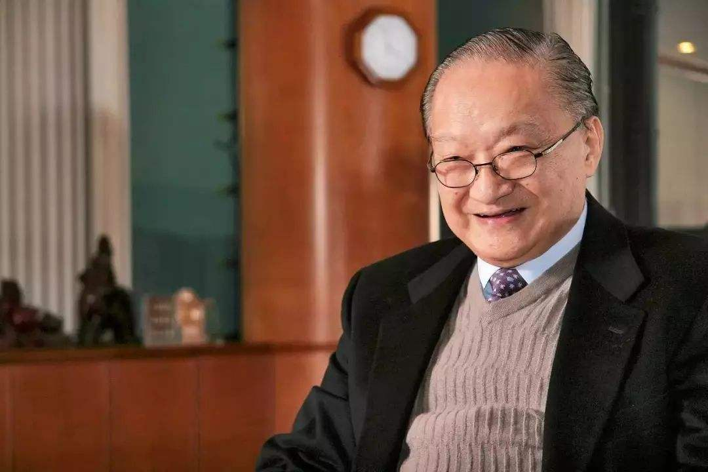
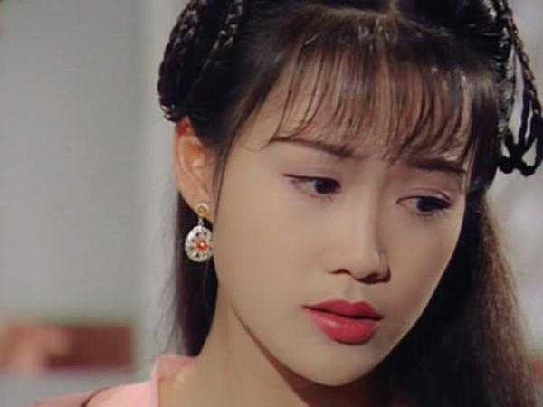
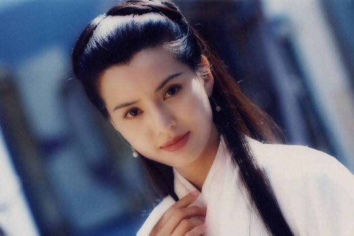
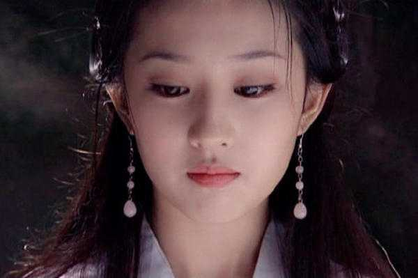
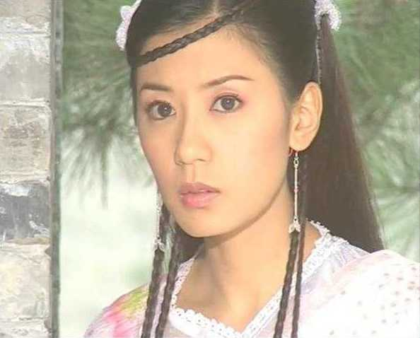

> 2018年10月30日下午，金庸（原名查良镛）于香港病逝，享年94岁。作为红遍两岸三地的武侠小说家，金庸的影响力在当代几近无出其右。 金庸作品在上世纪90年代正式进入大陆市场，伴随一代又一代人成长，00后等新生代也许未必看过金庸的小说，但各种版本的金庸武侠剧，想必是很多人难以忘怀的童年回忆。<!--more-->
>
> 金庸的影响力很大，也一直有不少争议，比如其笔下的女性形象。很多人认为金庸骨子里对女人很不客气，甚至是歧视女人的。有人则认为金庸非常欣赏和尊重女性。 那么，女权主义真的反对金庸以及他笔下的小说吗？
>
> 本期我们分享acel rovsion发表于2014年的一篇相关旧文。
>

一般而言，虽然女性主义/女权主义在英文语境下差别不大（英文均为feminism），但是在中文语境下，**女权主义**一般用作社会公共事务中，而**女性主义**常用作社会哲学，艺术美学之中。

在艺术理论领域，女性主义是从**建构论**折射到**女性本位视角**的一套理论体系，它是一套具体到艺术美学上的**认识论**，**所谓“女权主义者是否反对金庸”之说，其实在艺术理论的女性主义探讨中没有太多的意义。**

本文从女性主义视角展开批判。本文分为两部分，前半部分为通论，后半部分具体到金庸的作品上去。

整个世界文学史从20世纪以来一直受着女性主义的诘问，而这里面最常见的一个诘问就是“文艺作品”的“**女性缺失**”。

严格而言，这套诘问可以追溯到后现代初期时候的Lucy Irigaray（注：法国女性主义哲学家），其著名论断——**质疑自觉的理性主体，认为理性是男性的西方的单性文化**。

故**女性形象在一切显性的父权符号秩序中都是被单体建构的虚体**。而显性的符号集合中最著名的就是艺术类的女性形象，故而大多艺术作品中的女性形象是缺乏感受机制、流于表观的符号基团，而这个符号基团是男性视角下的单一建构，此为“女性缺失”。

而Laura Mulvey在《You Don’t Know What You’re Do You, Mr.Jones》（发表于1973年的Spare Rib）算是对女性形象提出了一个具体的批判。在上世纪六十年代兴起的女性主义艺术理论研究中，不少理论家都指出，**尽管女性角色充斥作品，但女性本身在作品中几乎是消失不见，她们更多时候只是作为与男性有关的一个附属性别而存在于艺术作品中。**

而这个**附属性**体现在主要几个方面：

#### 1

男性规则/规劝对于艺术作品中的女性形象的扭曲**。女性角色在艺术作品中不仅仅是男权规则主导的人格，而唯一个性的东西，往往来自于男权规则的缝隙，最终也必须要归元到男性本位视角上。比如说，常见中国武侠小说中，女性形象的聪明往往体现在对于男性照顾式考量，她可以有超越男性的智慧，但是最终他必须顺服于小说中的男性角色，而女性人格在小说世界观中的伦理评判往往和她对于男性角色是否忠心有关。也就是说，女性角色的个性往往必须与男性视角的女性规劝不相冲突。简而言之，在这种设定下，**女性的作用就是男主角的：升级工具+保姆+免费心理医生。**

而在金庸书中，男性情感往往层次丰富，女性情感往往就很单薄，强调女性为男性的无私奉献和无限容忍，这种封建社会的”女德“往往就占了女性情感塑造的大部分。

这就是“女性缺失”。

#### 2

**性伦理的规劝和压抑**。性伦理的规劝，体现在设定一种**女性伦理观**和**男性视角的男女关系**之上。

首先，在大部分作品中，**女性对于性，也就是自己身体的自由支配，往往就容易受到男性视角的伦理观的谴责**。在大部分作品中，只要女性对于**性**的态度比较开放，那么此人物的品性和命运往往被作者定义得非常之低，这种伦理观的强度甚至远高于日常生活。

其次，**男性视角下的男女关系非常的单一**，就是男性主导一段情感然后女性依附，而这个过程又非常地模式化，呆板化，女性往往不是作为一个“独立人”去追寻爱情，而是化作了一个符号化的机器，在男性的示好姿态之下，变得感动和归顺，最后形成这么一段关系。而这种单一关系的刻意感，直接导致的是女性角色缺乏基本的人格塑造，几乎是男性角色和主要情节推动的附属品。这个在金庸作品中的例子就太多了，比如《天龙八部》中的天山童姥和李秋水这段**推动情节**的恩怨，最终到头来不过是为了个**无崖子**这个多情的渣男争风吃醋罢了。

而大量反面女性角色的塑造，更是体现了这个特点，一般而言，体现一个女性角色的“**反面性**”就是从“性态度”和“性伦理”上切入，通过描述其对性追求的荒谬，最后愚昧地落下了一个悲惨的结局，然后以批判这个反面女性角色的性伦理，来给其他所有人立一个“大牌坊”。

这也是“女性缺失”。

#### 3

**男性叙事主导**。这个其实不用多说，中国文学从演义小说开始，所谓男性的“家国天下”或“独善自身”的情怀就是整个历史语境下演义的主导，而这其中的女性角色要么是满足某种男性视角的需求（美貌/可供观赏的“聪明”等等），要么单纯作为叙事的串联或推动，或者为了满足演义宣扬的某种伦理观的“牺牲品”。

这个在宏大叙事的《三国演义》中尤为体现，“悬梁劝子”的徐母，投井救子的糜夫人，这两个形象都不是独立人格的女性，而**作者花篇幅去描写这些女性仅仅是为了体现“忠君”的赞歌而已**。而为了展示这种叙事，作者往往还做了挺矛盾的处理，封建时代对于“**女性干政**”是深恶痛绝的，而本作品之中也承接了这套观点，比如其对于蔡氏干政的态度，但是他却又对某些女性干政的行为做出了大篇幅的着墨，比如伏皇后的衣带诏事件。说白了，这种看似矛盾的女性政治观，也就是通过建立一个“工具化”的女性形象，来宣扬某种政治伦理观罢了。

具体到金庸作品中，对于女性的”命运“设定，也是体现了这种**男性叙事主导**特点，男性的自我实现目的很多，有实现报国、兼济天下以及独爱自由等等，但**女性的命运往往不得不和男性捆绑在一起，从显”跟随“**。其中，王语嫣的例子比较典型，王语嫣武学功底深厚，在几乎属于男人戏的武功对决中也颇有笔墨，本应该是一个突破，但是她的命运却不是跟她表哥慕容复相关，就是和段誉捆绑，毫无自己的诉求可言，瞬间落入俗套。

这也是“**女性缺失**”。

而这个意义上金庸几乎三者都犯。

**金庸对于女性的态度实质上是一个姿态不错的大名士对于青楼女子居高临下的怜悯和赞扬罢了**，说破天也仅仅是一种似乎放低姿态的友好，但是女性在其作品中一直被当做“第二性”的状态。就像波伏娃说的一样：“**在男人眼中，女性本质是男人的诗。**”，金庸也仅仅是延续这么一种姿态而已。

这也是古典小说中”才子佳人“路数的本质美学逻辑，实际上哪怕是不少人认为对于女性和女性生态塑造更为丰满的《红楼梦》也是如此，**“女人是水做的骨肉，男人是泥做的骨肉”这套论断，与其说是抬高了女性地位或者说将男女视为平等，不如说，只不过把男性视角对于女性的建构，以“同理心”进行串联，做了一个极富人文水平的辩护罢了。**“水”的形容实际上逃不开父权符号秩序对于女性形象的规劝，无非是抬高了这种“规劝”的合理性，来貌似显得对女性的推崇；“泥&水”之喻实际上强调了**父权社会的性别预设**，可贵之处仅仅是内蕴了些同情心在里面。**从女性主义视角上看，曹雪芹所谓的“突破”在于其复杂的人物共生态和情节线索中，尽力淡化了男性叙事主导，而选择了更为相对主义的态度。**

事实上，金庸也同理，**他在文中对于女性的赞扬不少，并且用了极佳的人文辞藻和描写来深刻阐释其女性角色的情感需求，对于女性的外形也是用尽心思。**

随便举几例：

**外形**：小龙女--“只见一只白玉般的纤手掀开帷幕，走进一个少女来。那少女披着一袭轻纱般的白衣，犹似身在烟中雾里，看来约莫十六七岁年纪，除了一头黑发之外，全身雪白，面容秀美绝俗，只是肌肤间少了一层血色，显得苍白异常。 只觉这少女清丽秀雅，莫可逼视，神色间却是冰冷。”

**心理活动**：“赵敏红晕双颊，容貌娇艳无伦，神色之中只有三分薄怒，倒有七分腼腆，一个呼叱群豪的大首领，霎时之间变成了忸怩作态的小姑娘。但这神气也只是瞬息间的事，她微一凝神，脸上便如罩了一层寒霜，”

其实金庸确实是揣摩过的，但是这些都有一个很大的问题，那就是——**没有“人味儿”**。

金庸对于女性的赞美，其源头完完全全来自于**封建文化对于女性规劝的伦理观，以及男性视角对于女性人格的建构**（比如女性对于情感羞涩“），以及男性对于”清绝动人“，”可爱善解人意“等审美需求的体现。

**虽然他试着去揣摩女性的情感，但是他的女性形象并没有被赋予人格，而是符号化地堆砌出来**。金庸对于女性角色个性的塑造，也正如我上面批判的那三条一样，**女性可以杰出但是不能忤逆男性规则，女性可以独立但是也得依附男性，而女性可以有自己独立的叙事但最后得绕到男性那里去**。

这实际上就是相当沙文主义的思维。

故而，金庸对于女性的赞美或热爱，和古代大名士逛青楼的心理一模一样，与其说他是真的在欣赏女性，不如说他用**男性视角**的需求从一个女性角色身上猎奇出一个一个”他认同“的点，最后堆砌成艺术作品里面的女性角色。

与之相对的是，同为香港武侠小说家的古龙和金庸则正好是某种”69“关系，**古龙是典型的”厌女症“患者，他对女性充满红果果的歧视，并且对于女性群体充满恶意的偏见，审美格调也非常低下，他塑造的女性几乎集聚了他个人的负面印象，却又赋予这些女性追求自我实现、自我需求和个人自由的机制。**为什么说后半句呢？古龙作品中无论男主还是本人对于女性的贬义和厌弃情绪流露得不加遮掩，让人愤慨，他笔下的女性角色几乎都承受了大量的反面特性和道德Judge。

但是她们却往往懂得自己要什么，并且会主动地，不惜任何代价地去追求，在情感需求上也懂得自己的尺度，和男性的关系上着墨不多，但不会局限于“顺从”，而**古龙强加的”负面特性“往往是对男性规则的一种利用和反抗**，智商&武功完美压制男主角的女性角色也是大有人在，甚至体现了对于天性和自由的极度追求。这也是古龙在女性观上让人觉得很囧的一点。

这就非常好玩，好玩的地方在于：

**金庸在作品中有礼有节，善待女性，但是压根没把女性当人。**

**古龙倒是把女性当人了，但是什么脏水都往女性身上泼**。

而这两个人对女性的态度，淡化一点，实际上就是**中国两拨传统男性**（即高位者和中低产）**对于女性的态度的体现**。

说了这么多，这一切的逻辑来源，实质上就是我在本文开头的那一点——”女性缺失“，或者说，”男性中心话语导致的艺术形象的倾向“。