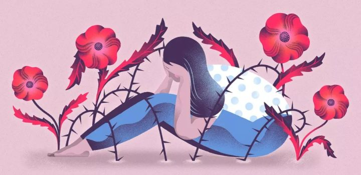
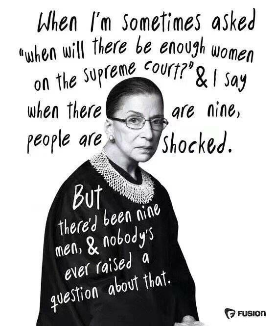
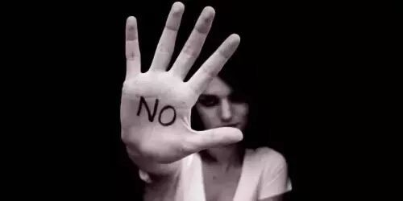

**作者**：miss prejudice

**编辑**：[陆贽](https://www.zhihu.com/people/ru-shi-shuo-59)

 <!--more-->

> **编者按**：关于本文所提到的抑郁症，有人说这就是一种病，让大家去看医生；也有人反对把抑郁症完全病理化（个人化，生理化）的理解方式；还有人批判现在的抑郁症治疗方式有问题……对于抑郁症的性质和成因，目前还有许多学术争议，本号在此不站立场。

昨天我又知道一位女生朋友抑郁到有自杀念头，这一年来已经有好几位了。和她们一路走来，知道她们的优秀与才华，也陪伴他们的失意与不顺。她们有着如下类似的特征：**接受良好的教育，从小到大一路都是佼佼者，被人羡慕，可是最近遭遇很难解开的个人困境。**

这些困境让她们无路可逃，有成长于乡村的朋友，毕业延毕，可是为了避免回到乡村老家，被邻居和村民嘲笑，不得不选择到一个公益机构边实习边写论文；也有自尊的朋友平生最讨厌的就是因为贫穷申请助学金，可是老父亲突然遭遇了癌症，她除了筹款为父亲治疗别无它法。

这些当时是她们遭遇的个体困境，但是这些困境其实多是**结构性困境**。与她们个体遭遇的生活困境一起，还有普遍的学术困境，**在学术界里伪善之人比比皆是，满口仁义道德，做的却是鸡鸣狗盗的事情**。偏偏这些人把握着重要的学术权力，拥有更多的资源，有着更多的文章发表套路，但是这些多数时候完全不会给努力认真的人，留下任何位置，所谓的劣币驱逐良币。

我很能理解她们的想法，我也时不时会有强烈的危机感。在我读博以前是没有的，之前的我就是为了目标竭尽全力往前冲刺，干什么都像个小野兽似的精力充沛。可是博士的我，常常就是懈怠，觉得一切已经失去意义，明白自己即使再努力，也不能往前推进，怎么努力也不可能撞破壁垒，只能转向了自我攻击，极度的低自尊。 这几位都跟我说人生不值得，她们把这一切归功于自己的自作自受，问自己为什么不能随波逐流。

我又不得不说，她们的个人日常困境，比起很多同龄女性已经好很多了。这些日常困境，虽然无比糟糕，但是她们接受的高等教育，使得她们即使不能解决所有问题，至少缓解困难还是比较容易做到的。

与底层女性相比，她们算是突破壁垒的人们 了。但是不幸的是，高等教育让她们理解了什么是苦难。**在不断追问自身的过程中，她们的刺痛感和悔恨感越来越多，大概这就是人生的悲剧所在。可能如果自己钝感一些，没有理解这些苦难和困境，不要这么敏感，可能心安理得会好过不少。**正如豆友韭菜饺所说：“”人比较容易禁锢在自己认知的世界里。确实经常有人说，比起别人你真的幸运太多了。但是每个人的遭遇不同，即使在别人眼里不值一提的困难，对遭遇的人来说都是一场狂风暴雨。”

我自己也从去年10月，一直到前两天，才终于成功让我的直接加害者跟我道歉，在此基础上实现和解。这是我人生里最漫长难熬的日子，一向开朗乐观的我陷入了情绪抑郁和焦虑状态。无法控制的长时间哭泣，喘息困难，不停呕吐，当然还有反复的失眠与噩梦，一堆病理的身体表现，我可能幸运的是我有个陪伴我周围的医生朋友，很早就在我反复检查后，就确定我是植物神经紊乱。当然还有来自豆友的鼓励，让我自己去看医生，给我提供了很多积极可靠的方法。

在我意识到我遭遇了伤害以后，我就一直各种努力寻求来自加害者的道歉。可是反反复复受伤害的只有我，我每一次都鼓起巨大的勇气要求对方向我道歉，可是我根本无力控制我的情绪，也不能有条理有逻辑的分条陈述我所遭遇的伤害。对，也就是此时，我才意识**很多加害者因为习焉不察的社会风气，根本不知道自己做的恶行是伤害**。于是，每次就成了我伤害噩梦的重演，直到前两天我才做到了虽然情绪激动，但是完全不影响自己的逻辑和理性，最终对方终于愿意跟我无条件道歉。

其实我想说米兔真的给我了巨大的勇气，虽然每次看到千奇百怪，又重复类似的性骚扰和性侵犯事件的时候，我感觉自己在遭遇了一次伤害的再体验。可是有如此多的勇敢女性们，将日常生活里所遭遇的苦难，如此大规模地暴露在公众的视线里。**曾经有过伤害的女性，觉得自己不再是那个倒霉的个体，而是集体地抱怨控诉糟糕的社会风气，这当然是了不起的事情。**也正是米兔的鼓舞下，我又一次努力去找直接加害者让对方跟我道歉，于是长达11个月以后，我可以放下仇怨，放过自己。

不过我也始终明白抑郁症的恐惧与恐慌，当然不只是因为和母亲一谈起抑郁症，母亲就马上脸色一变，警告我小心被人白眼，小心影响我以后找工作。我也有朋友，明明我各种反复陪她聊天，甚至还找来医学人类学著作，证明神经衰弱和抑郁症是同一种病，她只是再度复发了而已。可是她明明已经屡次出现自杀念头，依然顽固地拒绝去医院看病。因为她非常担心自己无力承担昂贵的抑郁症治疗费用和心理咨询的费用。

昨天豆瓣上吐露关于朋友的经历以后，认识的马师兄鉴于越来越普遍的博士群体的抑郁，鼓励我建立一个学术抑郁陪伴群。我欣然就听从了建议，建群的过程中非常顺利，可是随后全是一系列的烦恼。

先是一个本科的妹子加入，我问她你是本科确定要加入吗，当然没说不想让她加入的理由，是我的问题。可是我始料未及的是这个妹子一再批评我是学历歧视。早上一位哲学系的男生，竭力推荐自己的哲学治愈抑郁的方法，大意说抑郁是因为不够理性，如果不是拥有认识自我人生的理性，就不得不求助于医生。我提到需要有身体的病理表现，他说是不是非要病入膏肓才行。这种对理性傲慢的态度，让我也非常匪夷所思。当然还有更多我无法理解的事情，群里有的同学明明长时间不开心，有着很明显的抑郁症表征，却拒绝去医院看病，坚信自己只是心情抑郁，讳疾忌医让我非常难过。

当然这些跟我妈妈在某种途径知道以后，用非常严厉和难听的语言批评相比，已经不算是什么。其实我很好奇什么样的好事者，将此事转给我妈妈，难道不知道这很容易引起家庭矛盾么。**在国内，父母和子女之间普遍有很多永远也无法沟通理解的话题，大家平日里都是小心翼翼，尽量逃开这些话题，然后相关无事。**于是直接又一次引发了我的情绪崩溃，在躺平一整个下午，吃了大量的谷维素以后，才情绪缓和过来。