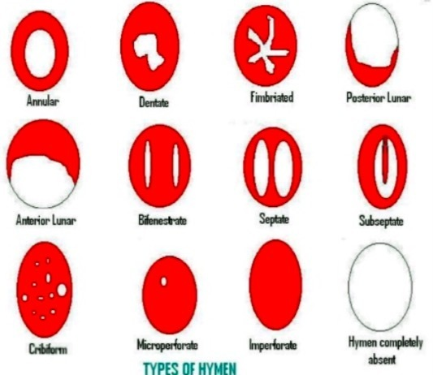

**作者**：[陆贽](https://www.zhihu.com/people/ru-shi-shuo-59)

**编辑**：[陆贽](https://www.zhihu.com/people/ru-shi-shuo-59)

<!--more-->

当你和朋友走在某个中国城市大街上，偶尔会在路边某处碰到处女膜修复手术的广告，你可能会一笑而过，不拿这些牛皮癣广告当一回事，也很难理解许多男性对处女情结的偏执。毕竟如今中国人已普遍不再像过去那样，把第一次留到新婚之夜。

潘绥铭在90年代时曾说过，中国正在进行一场性革命，婚前守贞观念已经明显松动（潘绥铭，1994），尤其是在相对发达的城市地区，对婚前性行为的接受度已经很高（Yeung&Hu，2013）。**2013年，中国大陆地区90后的的初夜年龄已经提前到了18.2岁**，甚至早于新加坡、香港和台湾，农村地区更早，“保守”的70、80后初次性行为的年龄分别为22.4岁、21.3岁。

奇怪的是，与近三十年日渐开放的性行为相比，中国人的贞操观却似乎没有太多进步。今天，依然有不计其数的人被“处女情结”困扰，甚至因此发展出了庞大的处女膜修复市场，很多人即使认为处女情结相对传统、保守甚至有些不合时宜，他们依旧可能会以种种理由为“处女情结”辩护：

比如**出于风险偏好的取舍**：“我知道处女情结不好，但我爸说中国的大多数男人，不管他是否传统，都有处女情结，新婚之夜时，当他发现你不是处女，他还是会有心结。为了避免风险，女孩子还是保守一点好。”

比如基于**自主选择**的辩护：“虽然处女情结有束缚女性的嫌疑，但现在的男生多少都有点处女情结的，对于不在乎的女生，我觉得没什么，尊重对方自主性，但对于自己喜欢的女孩子，我多少还是会在意她是否是处女。”

很多人对处女膜的印象往往来自于电视剧里的“见红”（处女膜破裂出血），古人正是以此来检验女子的“贞洁”。很多人也因此形成了某种根深蒂固的“观念”：**初夜就是会见红，不见红就不是处女**。

> 处女膜的各种形状

然而处女膜本身只是**阴道外口周围所覆盖的一层较薄的粘膜皱襞，其中内含结缔组织、血管以及神经末梢**。处女膜多在中央有一孔，呈圆形或新月形，少数呈筛状或伞状，这些孔是大姨妈的必经之地。孔的大小不一，小至不能通过一指，甚至闭锁需手术切开，大至可容两指甚至宛如不存在处女膜一般。处女膜可能会因为性交撕裂或者剧烈运动而破裂，没啪啪啪过的女性也有可能产生处女膜破裂，即使处女膜未破裂的女性“初夜”也未必会“见红”。

如今，“处女之身”依然被很多人认为是女性的一种资产，相比于已经“失身”的“非处女”，“处女”被认为是更好的婚恋对象，哪怕处女可能由于缺乏性经验而导致初次性生活体验未必有多好。对于很多人来说，**相比于性愉悦，更重要的是女性的“贞洁**”。女性的“贞洁”本身可以成为男权婚恋市场可供交易的筹码，用来换取男方的婚姻保障（经济和情感等），女性一旦交出自己的“贞洁”，男方就该对此负责，提供等价的交换物。

在关于“贞洁”的话语建构中，女性的性价值并不在于生理和心理上的快乐和满足，而在于男方所提供的婚姻保障。**这种“贞洁”话语具有明显的性别偏向性，它并不适用于男性**，“处男”在这个评价体系的价值根本无法与“处女”相提并论。男权结构下，男性普遍被看作性主体，而女性则被看作性客体，男性“守贞”反而被质疑为缺乏主动、没有魅力。

> 国产热门电视剧《欢乐颂2》剧情，IT男应勤因为邱莹莹不是处女而分手

这种“贞洁”话语在如今日益开放的社会里依然很盛行，并有可能内化成为女性的道德规训，让女性产生处女情结。女性在性方面比男性保守和被动，因为现有环境并不鼓励女性开放。**很多女性虽然在观念上接受婚前性行为，但她们自己并不会去实践，她们会“自主选择”守贞，降低风险，避免让自己“贬值”。**这种保守的博弈性策略多少可以用来解释为何中国人的婚前性行为接受度很高，婚前性行为的发生率却相对偏低。

**贞操观念本身与性别不平等有很大关系，贞操观是男权对女性规训的产物，它体现的是男权结构对女性的压迫。**通过贞操控制等手段，男权结构可以实现对女性的性和身体的控制，正是因为如此，相比于男性，人们普遍更看重女性的“贞洁”。

在潘绥铭所说的中国性革命中，与女性相关的“贞操观”并没有多大改变，女性依然需要面临着比男性更多的性审查，并没有太多的性自主权。即使是追求性自由和性解放的女性，也会由于受到以“贞操”为代表的传统性伦理道德的影响而尽量选择低调，不会过分声张。比如约炮的女生很少会像男性一样自豪地宣称自己“百人斩”，否则她很容易遭遇**荡妇羞辱**，被骂为下贱的“公交车”。

人类文明的发展往往伴随着对人的性和身体的严格控制。自然界的动物为了繁殖而性交，发情期很短。人类有点不太一样，可以长期保持发情，人类的性交并不必然是为了生殖，也有可能是为了追求性愉悦。人类高频率的性行为很容易导致人口膨胀，而低下的生产力和有限的资源无法承载太多的人口（直到工业革命之后，人类才逐渐摆脱物质匮乏，人口也随之迎来了大幅增长）

然而在长期的历史中，人类的生殖资源却又长期匮乏紧张，不是所有男性都拥有与女性发生性行为的机会。父权部落时代，发动战争抢夺人口，将敌对部落的女人抢回来充当生殖资源很常见。罗马的历史上，罗马人和萨宾人的冲突和融合就是起源于抢女人，从罗慕路斯筑城到环地中海帝国，罗马人不断发动战争，将敌人的男人变卖为奴，将女人变为自己的妻妾或女奴，领土和人口不断扩大。如今各国不少男性认为本民族女性结交外国男友是导致本民族性资源外流的背叛，也是这种父权残遗的体现。

于是，为了人类的繁衍和社会文明的发展，性控制和身体控制似乎因此变得必要起来，人类历史上的大多数文明都普遍对性行为进行了控制。从部落内的近亲乱伦，群婚，杂婚，再到部落间的“杂交”，再到原始的夫妻制的产生，一夫多妻，一夫一妻，同婚合法化，非婚同居，一夜情……人类文明发展的过程本身也是性控制的演变过程。

性节制和生育节制是性资源分配的重要手段。人类社会通过生育节制、限制性自由的方式建立起性规范秩序，继而建构起相应的社会权力体系。可以说，社会结构的权力运作高度依赖于对性和身体的控制。

人类通过性艺术和性科学的方式对性进行“价值解读”进而将性与道德伦理建立联系，从而使人产生性道德自律倾向，对贞洁的褒扬和倡导，以及对“荡妇”的贬斥和惩罚，都是建构性伦理道德并使人遵守的重要手段。而性艺术和性科学同时还主导着性话语的生产。

贞操观是父权对女性实行性控制的重要手段，父权的规训使得女性把贞操观念内化，达到控制女性的目的。女性受到的性节制和身体控制明显更甚于男性，因此女性的贞操问题才会受到人们的极端重视。而“非处”往往是女性不遵守父权性伦理道德的表现，因而很容易受到舆论指责和伤害 。

在公共场域里，掌握着话语权优势的男性会利用性伦理道德对“出格”的女性进行话语压制和污名化，指责她们不遵守父权性别角色法则。他们会紧抱着性价值不放，利用自身话语优势将“出格”的女性污名化成低价值角色。如果女性不守贞操，不遵循传统性伦理道德，那么她就会被污名化为“下贱”的“荡妇”，被施加公共伦理审判。

如今，女性结交外国男友很容易被指责为“easygirl”，尤其是结交在后殖民主义审美秩序里占据低生位的黑人。

新自由主义盛行的当下，女性已经不再被视为不合理的性别角色规范的牺牲品，而是被建构为具有自主选择的性主体，“婚前守贞”和“处女情结”往往被建构成自主选择的结果——“女性是自愿进行守贞的”；“处女情结”也可以用男性的自主选择来进行辩护——“**男性有处女情结只是他的个人偏好，与他人无关**”，这种诉诸个人自由的说法在当代很常见。

然而，反对“处女情结”并不等同干涉私人婚恋选择，我们可以因为“处女情结”话语本身所蕴含的性别不平等和压迫而进行反对，同时不干预男性出于“处女情结”的个人偏好而选择与处女谈恋爱和结婚的行为，尊重个体的意愿。

而**拿自主选择来为处女情结辩护，有将“处女情结”背后蕴含的男权结构性问题个人化的嫌疑**，性别不平等和压迫的不合理之处因此被掩盖了，当人们打着自主的旗号为处女情结辩护时，却忘记了这种自主性神话的背后是男权结构对女性自身主体性，独立话语以及自主人格的忽视和侵害。

女性的性自主权被男权性伦理体系高度压制，即使女性”自愿”选择“婚前守贞”，实质上很有可能是因为“处女之身”在男权评价体系里具有更高的价值，而我们不言自明地被社会灌输了这种评价体系，并内化了相应的价值观念，因此我们才会认为“处女之身”具有高价值，形成自己的偏好，并影响到自己的行动。

作为社会关系总和的个体（社会人），个人偏好的养成很难不受到外界社会结构的影响，自主、自愿和消极自由的“马奇诺防线”背后可能是由于异化而失去了自我实现能力的社会机器零件。在查尔斯泰勒看来，自由不仅仅意味没有外在限制，还与内在阻碍密切相关，即使去除了社会压迫和制度强制等外在障碍的束缚之后，无知无觉、虚假意识以及压抑等内在障碍同样会妨碍我们实现自由。

从激进女权主义角度来看，“自愿守贞”等之类的“自愿”或“自主”未必意味着自由，现有社会的“贞操”话语在性别上完全不中立，这种性别倾向性是由男权意识形态导致的，比如社会舆论对男女性出轨的态度迥然不同正是这种性别不中立的体现。而这些性别不中立的话语却被很多人不加以质疑地接受，并认为是合理的。而在激进女权主义看来，以上都是男权社会压制女性主体性，导致她们的自主意识产生折损的体现。

当然，我们对“处女情结”进行解构并不是想要限制男性和女性的自主选择权，妨碍男性娶处女，阻止女性婚前守贞，“强迫他人自由”（卢梭），正好相反，正常的女权主义者都会捍卫和尊重个体自主的正当权利（但是反对在公共领域宣扬“处女情结”）。

我们只是想在新自由主义盛行、普遍推崇个人自主和消极自由的当下，希望人们能去反思一下自主性神话的合理性及其背后的结构性问题。