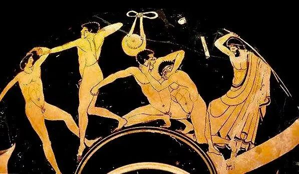
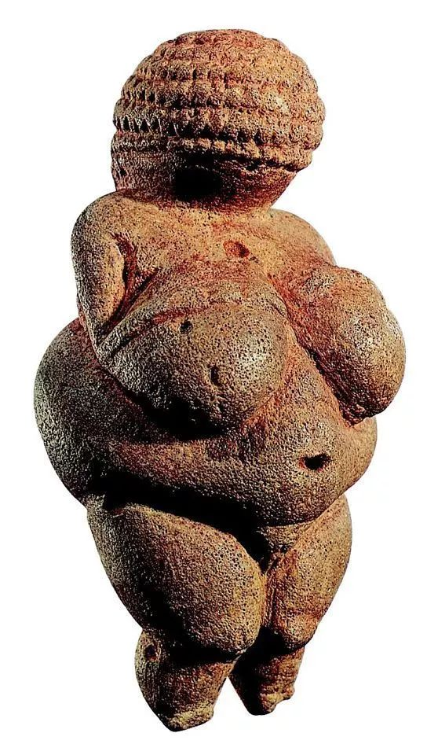
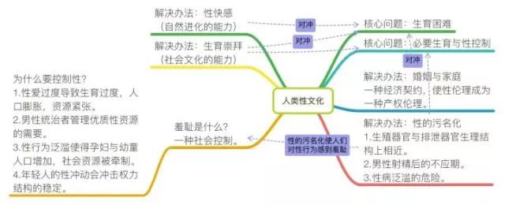

在讨论这个问题之前，人们往往会忽视非常关键的一点，“人类认为暴露生殖器是一件羞耻的事情”的历史，比大部分人想象中要短得多。

<!--more-->

文明社会禁止暴露生殖器，在解释上很大程度是为了禁止性联想。而在历史上，赤裸身体并非总是和色情联想在一起，反而被许多严肃的性教育学家视为克制性冲动的重要举措。在许多文化中，裸体并不下流，裸体非常高贵。

古希腊的运动员不穿任何衣服，他们认为裸体是为了展现人体之美，是一种荣耀。法国作家蒙田认为，饱览人体的丽质秀色是医治放纵色情的良药，穿着打扮的目的是刺激性欲，完全裸露反而不那么色情。

启蒙运动时代，欧洲的上流社会中流行着一种空气浴的潮流，他们相信让身体赤裸地接触空气、水和阳光有助于健康，只有熟悉了身体的形象，才能消弭低级的色欲，陶冶情操。苏格兰的一位高级法官蒙博多每天早上起床会把窗户打开，在屋子里裸体漫步，他还教自己的几个美丽的女儿在阳台上效仿。美国建国先贤富兰克林有光着身子在书房里走来走去的习惯。

这种空气浴的潮流一度传播到民间，许多商人在欧洲各地开设了天体浴场，人们可以在这种浴场里浑身裸露漫步，毫无尴尬。一些性教育学家建议让男女一起裸体锻炼，这样可以培养自我节制的能力。通过这种措施，人们看到异性时便不再有任何性欲的产生，能缓解年轻人自然的好奇心理，并阻止病态的情绪产生。

在东方，日本人认为接吻与展示裸体比起来，前者反而更加猥亵，一个女人可以赤身裸露，但仍然不失为一位举止高雅的贵妇人。在日本的某些地区至今还保留着男女共浴的习俗。

之所以今天一部分人认为暴露生殖器是一件羞耻的事情，这其实只是特定的性节制文化影响下的一个结果。在讨论这种社会禁忌的起源之前，我们有必要首先来解读羞耻是什么？

## 1.羞耻

我们可以很轻松地达成一个共识：羞耻是一种极为高级的情绪。羞耻高级之处在于：其只能发生在具有自我意识的动物身上，同时必须要依据在某种社会规范之上。许多时候，只有高等智慧的社会动物才具有羞耻感。

一些实验证明，部分动物在照镜子时，并不能意识到自我的存在，不存在自我意识便不可能存在羞耻情绪。同时羞耻还必须发生在一个社会当中，一些未经世俗的小朋友在受教育之前，也不存在羞耻情绪。

羞耻还是一种极为特殊的情绪。羞耻特殊之处在于：当一个个体在违反群体规范之后，还没有受到权力结构实质上的惩罚，个体就自行对自己进行惩罚了。

羞耻的这两类特点给权力管理社会带来了极大的便利。权力结构仅仅需要界定一些禁忌，并时刻保持这些禁忌的强调，受众就会在羞耻的痛苦体验中，不断规范行为，自我顺从社会控制。同时羞耻作为一种高级情绪时刻有沦入低级情绪之中的倾向，我们很容易看到羞耻常常伴随着愤怒，紧张，恐惧这类情绪一起混杂出现。

从儿童发展心理学的角度看，人们觉得暴露生殖器很羞耻，这种体验其实起源于他们的家庭教育。在儿童的哲学观念里，“我从哪里来”这个问题尤为重要。大多数儿童在简单的经验观察中会发现，每一件事物都存在一个源头，商品是从商场里拿走的，食物是由一堆食材再经过爸爸妈妈的手变出来的，小鸡是从蛋里孵出来的。而一旦小朋友们开始追问自己是从哪里来的时候，他们便得到了无数种解释的学说，这些学说往往由家长随口胡诌，错误严重，极容易被否定，这与他们基本的经验相反，因为他们认识到事物似乎只可能有一种来源，那么就只有一种解释才是对的。

于是小朋友们开始自己创立种种说法来解释生命的到来，这些解释都是根据经验的猜想。他们会在各类媒体上、甚至亲眼看到动物的性行为，于是他们很自然地将这种猜想逐渐向性器官靠近，并开始洋洋得意，骄傲并兴奋地向父母讲述。孩子这种出乎信任的讲述却第一次得到父母一种提防心理的回应，很多家长会幡然变脸，破口大骂，使得孩子不知所措，在这种言语规训下，儿童们才开始形成一个观念：性器官是不可言说的，是坏东西。

在了解了羞耻的产生之后，我们又面临新的问题：为什么社会要严格禁止人类的性联想，哪怕这种联想是完全无害的呢？

## 2.性节制

在人类的性文化中，呈现出一种惊人的一致性——大多数文明都普遍选择了对性行为进行节制，而这种节制附带也否认了性联想的正当性。这种一致性不可能再由简单的历史起源臆断作解释，而必须要深入到人类的一些生理共性中去挖掘。

从人类客观的生理属性来看，因为我们巨大的头颅发育所带来的负担，导致了女性的妊娠期极长，且生育危险极高。同时我们几乎是以一个半成熟的胚胎状态就与母体断绝了联系，人类在一至五岁阶段没有基本的行动能力、觅食能力，在自然条件下独立生存的可能为负，这些客观条件促使人类必须走向结社。

在这个过程中，每一个有组织的人类社群都会不约而同地达成一个共识：对性行为进行节制。从起源的角度看，性节制本身是权力的产物，因为这涉及了资源分配与秩序。

**第一，出于对高生育危险的补偿，人类进化出了一些和动物与众不同的属性，人类的发情期是终年的，同时人类的性爱能产生极高的快感。**这两个属性使得人类可以通过性行为量上的增加补偿生育困难带来繁衍问题。但是在一个原始部落当中，任何高频率的性行为带来的高生育，都会导致人口增加膨胀，使得资源紧张，出于资源控制的需要，人类选择了对性进行节制。

**第二，在父权制占主导的时代，与女性发生性行为的机会本身就是一种宝贵资源，因而掌权者有必要对这种资源进行管理，从而形成一种秩序。**在进入文明社会之后，许多人类制度仍然保留了这样的原始残余，比如初夜权，在某些国家的特定历史时期，一地的领主享有和当地所有中下阶层女性第一次性交的权利。

**第三，因为人类婴幼儿的脆弱性与妊娠、生育困难。**对于女性来说，孕妇在妊娠后期如果从事劳动，会造成病痛，并压迫子宫进入盆腔，造成早产。一旦性行为泛滥导致的生育率提高，会使得一个部落的资源被极大牵制在保护孕妇、儿童上，继而在原始残酷的战争中受到威胁。妇女、儿童成为了纯粹的消费者，这给生产者带来了负担。

**第四，性节制在社会中通常被视为一种美德。**因为年轻人在青春期会迸发出强烈的性冲动，这种性冲动带来的暴力会对原有的权力中心构成威胁。所以权力中心会强调克制冲突与忍耐欲望是一种美德，以此保证权力的正常运行与社会秩序的稳定。

从以上四点的分析来看，性节制的措施与其说被发明出来，不如说是一种逆向淘汰，任何没有对性进行控制的文明都被一个巨大的筛选网所过滤掉了，因为其性行为的泛滥造成了以上种种结果，导致资源分配失调，部落生产效率低下，最终被其他部落在原始战争中消灭。

然而，一旦性节制走向极端，这所带来的严重人口断代与繁殖滞后又会影响一个部落的正常延续，因此人类采取了一种全新的手段来保证人口延续——生育崇拜。

## 3.生育崇拜

首先我们需要明确一个基本事实：人类的生育是一件很困难的事情。因此，为了物种的基本繁衍，一定要有一种利好可以对冲高成本的生育。

在自然状态，人类进化出了性爱的快感，在文明社会则表现为生育崇拜。在人类早期文明中，生育与性的关系是水乳交融的，生育崇拜基本上就等同于性崇拜，一些出土的文物可以佐证，人类通过强调女性的性征来表达对生育与性的歌颂。

然而在性节制被普遍实施之后，性与生育在价值意义上似乎分离了。在世界大部分前工业文明当中，生育被神圣化。在古罗马，孕妇的房屋都要装饰象征光荣和荣誉的花环，有孕妇的地方是神圣不可亵渎的，甚至可以成为罪犯的庇护所。在文艺复兴的绘画中，怀有身孕的妇女是一种理想化的美人，而性则成为了一种耻辱，淫秽。精神病学者席德斯曾经记录了一个在天主教教堂里受教育的女子，以作证性的污名化说教是如何让这个女子走向神经极度敏感的。

> 她在教堂读经的时候，她就对女性形象留下一个极坏的印象。她认为女子就是一个便桶，满桶都是蛆虫屎尿。这个观点是一个以圣洁著称的修女教给她的。在她月经之后，她就深深铭刻了自己是脏东西这个看法。利15:19
女人行经，必污秽七天，凡摸她的，必不洁净到晚上。在她看来，女子就是垃圾，就是污粪，是淫邪的化身。她甚至在有性冲动的时候，考虑过用火把灼烧自己的下体。

在这套规范之中，性与生育彻底断裂，许多人甚至会因为在性爱中体验到快感而感到耻辱。然而这种极端贬损性的文化，并没有严重影响人类的生育，原因在于我们发明了保障生育的婚姻与家庭制度。

婚姻与家庭制度诞生之后，迅速形成了一套伦理道德。夫妻、父母、子女之间的关系被默认为一种权利与义务的互相捆绑，子女对父母尽孝是天然义务，继而母亲生育的苦难也能被家庭亲情、天伦之乐，养育孩子的喜悦，子女赡养得到的回报所对冲，生育的价值得到了保障。

在这套制度出现之后，我们会发现，社会性伦理本质上变成了产权伦理。比如，任何没有被婚姻所授权的性爱都会成为严重的违法行为，原因在于倘若一个人的妻子和别人发生了关系，也许未来继承他财产的儿子根本不是他的血肉。

从产权伦理的角度看，一部分人类法律对于乱伦、婚外恋的低容忍，其原始动机往往是这种性爱可能造成的生育会打乱正常的财产继承秩序。妻子也许对丈夫买春并没有那么介意，然而丈夫如果发生婚外恋，试图与另一个女性进行可能以结婚为目的的恋爱时，妻子会暴跳如雷，大多数人也会选择严重谴责小三。

我们会看到，在人类性文化中始终隐藏着一对基本作用力的平衡——性节制与必要生育。即如何在实施性控制之余仍然保证一定的生育，如何在强调生育之余有意识地对性进行节制。这其中最为普遍采取的措施便是对性进行污名化。

## 4.性的污名化

现实中，很少有文明会对生育进行直接的限制，而往往是通过对性的节制完成对生育的节制。在生育在与性分离之后，为什么遭受到污名化的是性而非生育，这是一个很有趣的话题。

同样，对性的污名化的解释并不能简单地归结于性文化的影响，这就变成了一种回溯式论证：性污名化来自性文化，性文化来自性污名化。所以，我们还是必须要深入到人类的一些生理共性中去挖掘。

我的一个猜想是男性性爱之后的不应期，即当代所称的贤者时间，可能是解读这种性文化的关键。因为在父权制下，道德话语权是由男性主导的。男性在射精之后，是他人体多巴胺分泌达到的最高点。随后，催乳素登场，开始抑制多巴胺的分泌，让男生的脑袋达到一个前所未有的清晰状态。这个过程会让他得到罪感，并很容易让他联想到性是一件不好的事情，进而把这种生理现象解释为性行为是肮脏的。

同时，人体的生理构造也可能是一个重要的原因，人类生殖系统和排泄系统在生理上同根同源，这很容易让人们把性行为和排泄联想在一起。在自然环境下，性病泛滥造成的负面影响也是一种可能。

人类对性进行污名化经历了一系列过程，从最早断言所有性行为都是脏的；逐步走向文明时期，认为未经婚姻授权的性表达是脏的；再走向今天，大部分人并不认为性是脏的，人们也开始接受婚前性行为，甚至于陌生人之间的无偿性行为。

在经过全文分析之后，我们可以得到这样的结论：**其实人类大部分制度、文化、意识形态都是有其生理根据可循的，而非某些神话所称的那样是超自然力量设计的产物。诚然，我们也不能完全否定这些神话叙事的伟大价值，而是应该用冷静的目光去分析、对传统进行祛魅。**

读到这里，你还会为暴露生殖器而感到羞耻吗？

**性羞耻是社会对身体进行控制的一个典型。在当代，其实我们的社会正在用一种让人完全意想不到的方式控制着你的身体。**