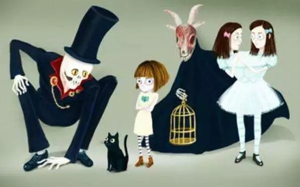
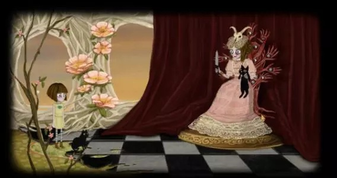
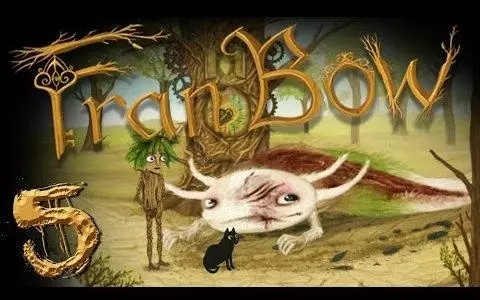
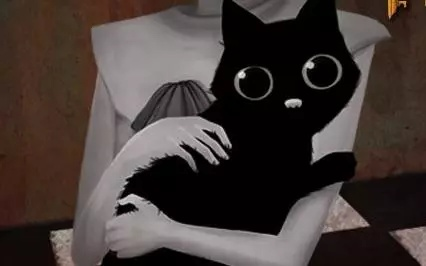

大家晚上好，欢迎收听后现代主义哲学广播电台夜间节目《新纪元访谈》，近日一名初三女生在试图逃离全世界最大疯人院时被其疯爹打成尾骨骨折（相关链接：[十四岁少女早恋开房被父母打进医院](http://mp.weixin.qq.com/s?__biz=MjM5ODIwNDIwMA==&mid=2652691553&idx=1&sn=4f1cc4640f9e1ea384a7c9034e5286fa&scene=21#wechat_redirect)），尽管院方表示，类似事件在疯人院时有发生，只是病人之间的常态活动，但秉持着人道主义的原则，我台还是派出记者对此事进行实地考察。

<!--more-->

我台记者小飞来到疯人院，可以看到这里山河壮丽，风光秀美，而且绿化工作不错，除了大量的精神病患者以外，到处都是草，草，草。

小飞继续往前走，遇到了一名工作人员。

您好，请问您是在这家精神病院工作的吗？

护士说，是的，我是一名护士。

我们在这个角度我们可以看到，尽管医院已经很大了，但由于关押着全世界最多数量的精神病患者，其用地依然严重不足，海量精神病患者被关押在一个个巨大的笼子里，并没有分开的隔间，显得十分拥挤。

看见护士出现，许多患者流着口水，一拥而上朝笼子边缘赶来，场面一度十分混乱。护士则隔着笼子开始对患者进行动物般的投食。她朝患者投喂一种红色的小药丸。

他们为什么每一个都流着口水呢？我问到。

护士解释说：我院秉持着绝不放过一个的基本原则，多年来一直致力于将每一位在我院降生的新生儿全部培养成神经病，这当然是一项浩大的工程，而流口水的仪式便是这工程的一部分。

简单来讲，自每一位新生儿诞生开始，我院便围绕他/她构造出一系列的话语，以将这些话语所体现的单纯而道德的评价标准，即“超我”植入到新生儿的人格结构中，而超我则会指导他们的活动，将日常生活的行动仪式化，并在社会的凝视之下生成刻奇的快感，比如在同类的葬礼上，超我彻底主宰了神经病们的人格，他们战战兢兢完成葬礼的仪式，生怕自己亵渎死者，或者被其他神经病的凝视所鄙视，当然你可以理解的，即使在葬礼仪式上真的十分悲伤，超我也会让他们在被看中生成刻奇的快感，以便让这群煞笔赶紧忘掉自己真实的身体和死亡，尽快融入神经病们哄抢红色药丸的社会结构里。

当然有些人脑子里被植入超我也会发生排异反应，这类神经病喜欢高声谈笑，肆无忌惮地谈论自己的金钱，人脉或王者荣耀技术，有时他们也猥琐地在角落里淫笑着谈论些有关性的小秘密。根据调查显示，这类人和第一类人之间具有广阔的交集，更多只是神经病个体在不同情境表现出不同的状态，毕竟神经病的人格就是这么简单，跟草履虫似的给个环境给个刺激就能作出特定反应。当人处在超我之外的神经病社会权力领域，其行动以假想中的超我为参照，而暂时被超我主宰大脑的神经病的行动则以假想中超我之外的个体为参照，我院便使用这一点深化双方心中的侵凌性，直到二者的快感模式完全由侵凌性主宰为止。

看我还是不太明白，护士又说：侵凌性是精神病之所以成为精神病的实质。

她一指远方，那儿站立的一位神经病十分与众不同，他冷静而睥睨地看着自己丑态百出哄抢红色药丸的同类，但并不去一同哄抢，看上去对这种行为十分不屑，歪斜的眼角极尽冷漠，一股煞笔的气息扑面而来。

护士冷淡地说：实际上，同质化中也总是会诞生异质，但结果总是无伤大雅——这个煞笔一直以为自己是个艺术家，对这个以红色药丸占有数量作唯一评价标准的社会十分不屑，他终日沉溺绘画和欣赏精神病院铁笼，灌肠器和前额叶切除手术室等自然景观之美，看上去似乎和其他精神病哄抢红药丸的社会结构格格不入，但其实二者并无本质区别，只是神经病的发作形式不同罢了——他们都是以对“对象”的侵略完成快感获取的，只不过被红色药丸主宰的精神病是以真实的红色药丸数量侵凌假想中那些贫瘠的对象，而他则是在观看精神病院景观，画画等行动中鄙视不懂得欣赏前额叶切除手术室之美，不懂得欣赏色彩铺展的普通神经病，同样是以侵凌假想中的“对象”为其全部心理活动基准。

红色药丸已经发完，护士拿出一个遥控器，点了一下按钮，顿时笼子中不知道从哪里冒出来无数的蓝色药丸。

你看，他屁颠屁颠去吃药了。护士又指了一下那个艺术家，果然他正跪在地上吃药，那贪婪的神情让人不由得感到一阵阵恶心。

护士看我感觉不适，便开导我说：其实我院还是很人道的，知道红色药丸数量不够，所以我院配备了大量的蓝色致幻剂，可以让那些无法抢到红色药丸的大部分失败者长时间生活在幻想中，在他们在自己一个人的幻想世界里尽情占有红色药丸，像是刚才那种只吃蓝色药丸的艺术家就属于这些人里口味独特的，大部分人都是在现实中找不到红色药丸的可怜虫而已，当然这些人的幻想世界也充斥着神经病社会结构的特点，即使在蓝色药丸的世界里，这群煞笔也一天到晚想的都是如何找点东西侵凌一下，让自己的神经病得以发作。比如在幻想中让一个完全被欲望建构出来的东西去弄死个什么神啊怪啊，斗罗大鹿斗破苍熊，强奸个二次元妹妹干我妹小埋什么的，总之这完美的体现了我院的人道主义精神和对这些废物的可怜之情。

那位被打伤的初三女生也是神经病吗？我好奇地问。

这时，一直不动声色的护士突然脸色一沉。

她想了想，说：不，她不是，但我们会让她是的。

她接着说：如果一个人没有在被侵凌性霸占整个灵魂之前，受到红色药丸中心化评价标准以外一些事物的吸引，比如爱情，那她或许这一生都不会进入鄙视链之内了。

所以必须惩罚，她的父母都是很正常的神经病啊，她的哥哥也是，她以后也会是的……必须杜绝任何让少女成为正常人的可能性。

这点解释起来又是一件复杂的事情，神经病的世界是以男性为主宰的，而女性的整个人格，外貌和技术，都只能作为男神经病在神经病社会之内的评价标准，所以女性不能触碰红色药丸，或者至少不能让女孩完全被红色药丸主宰，她们需要幻想，因为女性本身就是男神经病的红色药丸之一。

但少女的幻想，在她彻底成为神经病之前的少女时代又是完全不可控的。

所以我们发明了一个概念，叫早恋。必须使用一切手段杜绝早恋！人们只有在成为神经病之后，在被超我，侵凌性和红色药丸主宰之后，才有资格在精神病社会组织和鄙视链系统内部谈恋爱。绝对不能给尚未被侵凌性主宰的小女生以爱情建立新评价标准，逃离红色药丸依赖性和精神病社会依赖性的可能，不能给他们任何成为正常人的机会。一个也不行！护士无不残忍地说。

如果人人都正常了，我们的精神病院怎么办？正常人要么成为神经病，活不下去就去死！一个都不能留！

梦醒了，惊出一身冷汗，这才发现原来我也正在神经病院里，当患者。

又听见很多人笑我，他们说，王毅飞，你又当自己是后现代主义哲学广播电台了，你丫不就一神经病吗？还是只能吃蓝色药丸的那种。也有人笑我，王毅飞，你又要瞎说什么全世界精神病患者联合起来了。

诶，我还能怎么办呢？我只能在一阵阵嘲笑声里，尽量多跑到小孩子面前，问他们：

无神经病院主义有四种形态，你知道么？

我刚用指甲蘸了酒，想在柜上写字，见他毫不热心，便又叹一口气，显出极惋惜的样子。