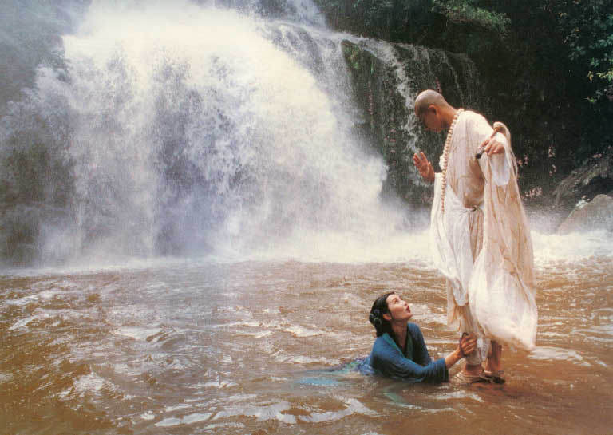
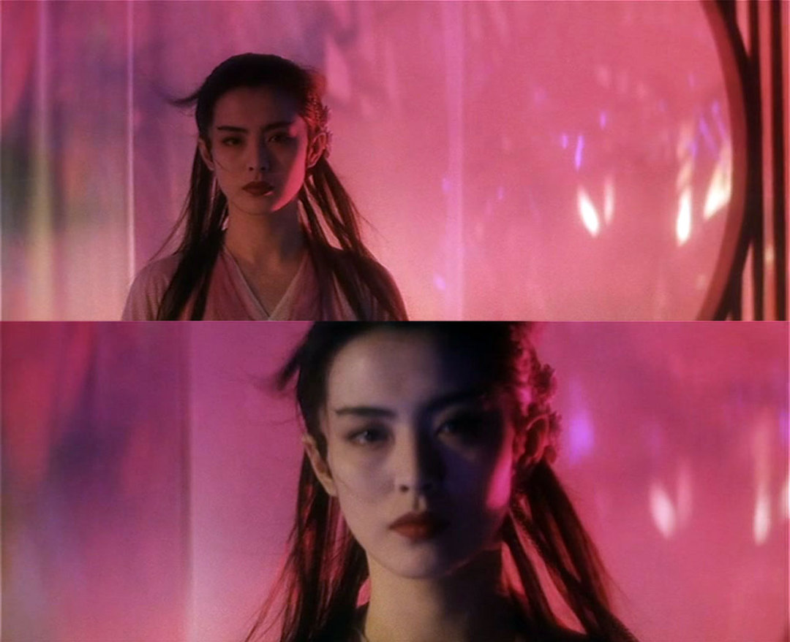
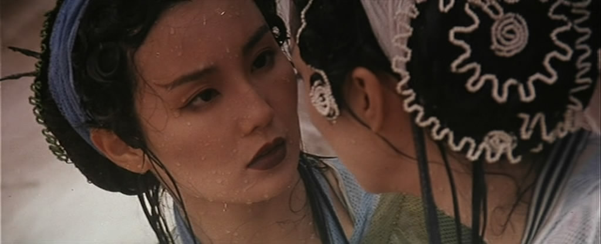
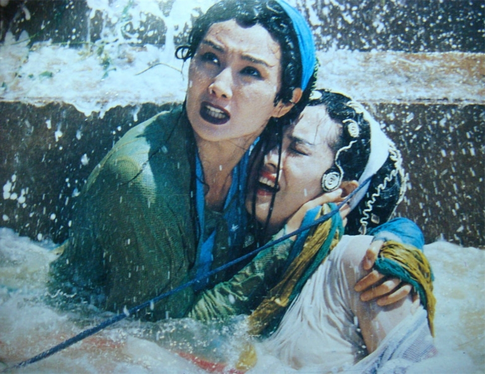
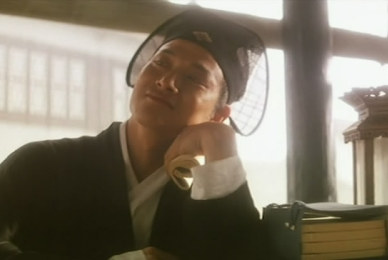
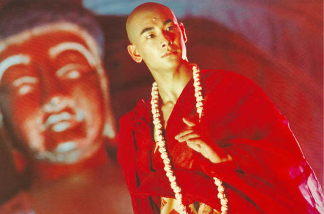
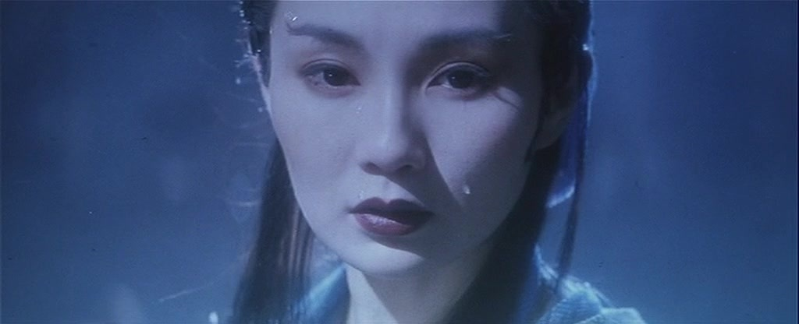

**作者**：[Off-Line](https://www.zhihu.com/people/li-luo-jia-42)

**编辑**：[heaven疏狂](https://www.zhihu.com/people/heavenshu-kuang)

*内容简介*

《青蛇》是上世纪九十年代由李碧华的原著小说改编的电影。故事发生在南宋，一个人妖难分的时期。法海和尚以替天行道为己任，四处降服妖精，也扰乱了在西湖底修练的青白二蛇。二蛇佯装成人，以姐妹相称，徜徉人间。白蛇恋慕上了凡人书生许仙，嫁与他成为妻子。而青蛇同样看上许仙，百般挑逗。日子久了，许仙受不住青蛇撩拨，生了二心。端午节时，在用雄黄酒试探出二蛇真实身份后，许仙当场吓晕在地。于是青白二蛇赴昆仑山寻灵芝仙草救许仙。白蛇夺草先逃，青蛇拦截法海。法海要求青蛇助他修行，功成尚可放她一条生路。青蛇在他身旁抚摸呢喃，缠绵连连，结果害法海情欲勃发，不攻自破。

<!--more-->

许仙醒来后，法海违背诺言，以二蛇性命相威胁，抓走他逼其剃度。青白蛇双双赶来，大战法海。白蛇怀有许仙的孩子，大战之下动了胎气，制不住水，一时之间水漫金山。白蛇亦在水中产下一婴孩。原本已被人妖孽缘与内心色念困扰的法海见白蛇产子，心神恍惚。而青蛇趁法海迷失心智之际闯入金山寺寻找许仙，却发现许仙早已被封了五阴，抛弃了昔日情谊。那一边，白蛇已被无法控制的大水所淹没，被雷锋塔镇入湖心。青蛇带许仙出来，却不见姐姐身影，便将手中剑刺进许仙胸膛，扔入水中。法海转身离去，青蛇孑然一身，回返西湖。

本文将从女性主义角度解构电影《青蛇》中的爱欲，情欲和婚姻。

*青蛇与法海*

## 01

说这部电影是女性主义电影还是没问题的。

青蛇-白蛇之间的感情戏是电影重要的线索，创作者在这部电影里面模糊**人-妖的界限**，也在试图说明女性的处境。

在传统故事当中，女性角色一般都被定义为“妖”，对于男人来说代表**诱惑、道德的败坏**，这是原本故事赋予女性的角色定位。从一开始，白素贞和小青成为“人”的过程，就是舍弃自由，进行自我阉割的过程。当小青问白素贞“你说人间有情，妖就无情”的时候，也是在质疑这么一个标准：为什么要服从男人呢？为什么要成为人呢？同样是女性，你有没有把我当人？

在电影里，**白素贞-小青的对立**就是两种象征，姐姐试图成为人，小青则保有很多少女特有的元素：野性，自由，天真。从性的开始，小青慢慢觉察到男人的不可靠和冷漠，再到后来和姐姐决裂，以绝情为代价完成自我觉醒。电影中女性对自我的探索不断在对爱进行解构：为什么对男人的情才是成为人的标准，为什么怀了孩子才能被法海承认是“人”？法海眼里人妖的区分很可笑，妖只有能够生出人，才有被称为人的资格？白素贞的结局是尊重原著的改编，白素贞为了子嗣牺牲了自己的自由，成为了家庭的牺牲品。

*白蛇*

两个好姐妹之间感情的分裂是以怀孕为标志的。白娘子怀了孕要和小青决裂，生下孩子的时候，白娘子又催促小青去救相公，小青的眼神转冷，她依然不理解姐姐为什么这么渴望成为人。什么是爱呢？真的如白娘子所说，是对男人的从一而终吗？哪怕这种爱要学会说很多很多的谎？哪怕这些男人出尔反尔，口是心非？还是如后来的白娘子所表现的，有了孩子，就要有相公？那么五百年的姐妹之情对白娘子来说又算什么呢？

电影里面水漫金山有一个很有意思的情节，小青赶过来的时候，白娘子跪在法海面前求法海放回自己的相公，小青飞过来帮助姐姐，说不要跪。那些人妖的分别，为什么呢？白素贞为什么为了相公，可以放弃那么多呢？

*小青对视白蛇*

姐姐，你千年修行就为了一个许仙，值不值得呀？

你说人间有情，但情为何物？

## 02

在电影中，情欲本身是没有问题的。

贯穿电影有两个非常重要的符号，**佛珠和水。**一般意义而言，这两个符号之间的含义是对立的。佛珠是禁制，水是诱惑。但是电影当中，法海和小青她们结缘就是因为佛珠，而递交给许仙的时候，成为了禁制的象征。白娘子在雨天里诱惑许仙，最后又在洪水里葬身，始于情欲毁于情欲。故事里面所描述的情欲，就像电影里的雨和洪水，它只是变化。人因情而生缘但也可能为之而死，白娘子最后的结局有着这样的隐喻。
  
故事原本依据的传说就是白娘子被镇在塔下，电影的艺术处理是将水漫金山和白娘子葬身于塔下杂糅了起来，用洪水淹没白娘子暗示情欲对她本人的葬送。白娘子的人化是封建语境下女性的代表，白娘子付出了很多，从开头许仙的医所到后来的孩子，这种无止境的奉献必然是以自我的消泯为代价。电影里面白素贞和小青的告别，也是对自己“妖”的身份的告别，最后在洪水当中产子牺牲，是对这种选择的升华。她做到了自己开头所说的话，从一而终。无论许仙是否背叛白娘子，白素贞都算完成了愿，求仁得仁。

*白蛇产子*

问题在许仙吗，问题在法海吗？许仙的多情和法海的无情只是男性在那样的环境里的一体两面。

许仙诸多试图逃离白娘子的行为，都是在试图和情欲进行斗争。**在封建礼教的环境中，儿女情长和建业立身依然存在着根本的伦理冲突。**妖对人的诱惑，本身是不道德的，家庭的产生依然无法将情欲合理化。读书，信佛，只是不同的果。许仙表现了男性在这样的话语体系里常规的一面：多情，好色，懦弱，顺从。而法海则是真理体系的一部分，威严庄重。两个人在电影里的成长是交叉的因果，许仙阉割了情欲，法海信仰的权威被小青拨动。许仙和白娘子的故事只是正常封建礼教下的爱情悲剧，贫贱夫妻百事哀，他们无力改变自己存身的环境，也不敢自如地表达自己的情欲。电影当中淡化了爱情与外部环境的冲突。但是从旁人对许仙的窃窃私语来看，许仙的处境是不如意的。

*许仙与法海*

法海的身上，混合了**男性的稚嫩和礼教的专制。**电影的展开对法海而言，是在不断检验自己对于人妖之别的信仰。电影有意糅合了性的懵懂和法的威严，把两种极端的事集中在法海这样的人物身上，强化了情与理之间的冲突。小青和法海那场戏也是法海对自己的标准进行检验。直到电影的结尾，法海仍然无法理解什么是情爱。法海对于人妖殊分的理解，只停留在能否繁衍的层面，没有子嗣的女性，依然是妖。虽然他抱着新生儿，但不代表他本人焕然一新。只不过堕入凡尘，成了无情的许仙，懦弱的法海。
  
人妖分别的枷锁，成为了每个人的心魔。

*青蛇*