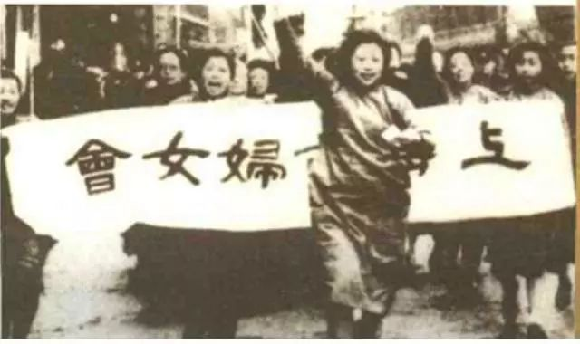

**注**：本文作者是一位中学生。我们希望听到一些更年轻的声音。

## 1

著名作家托马斯·哈代有一本书，名为《德伯家的苔丝》，讲述的是苔丝在她好攀高枝的老爸的一系列手段影响下，遇见生命中的两个爱人的故事。

<!--more-->

由于姓氏相近，苔丝应父亲要求到杜伯维尔家攀亲戚。而这样一位单纯美丽的农村姑娘，在杜伯维尔的猎苑中被诱奸，事后苔丝独自生下孩子，孩子却夭折而死。后来，苔丝和安琪儿相识，相恋并结婚，在新婚之夜，苔丝向丈夫坦白了自己的过去。安琪儿无法接受事实，选择抛弃了苔丝。苔丝为了生计成为杜伯维尔的情妇，但当安琪儿归来时，她杀掉了杜伯维尔。

*《德伯家的苔丝》剧照*

看完这个故事，很多人会自然而然地对杜伯维尔这个强奸犯产生厌恶，认为他的死罪有应得，然而真正摧毁了苔丝的并不是这个混蛋，而是Angle。

安琪儿在西方传说中是在云端演奏竖琴的仙灵，而名为Angle的他在苔丝心中确实也是天使。他博览群书，思想独立，瞧不起社会等级和财富差异，对传统习俗极为冷淡。他克服中产阶级身份限制，与工人们打成一片。无论从哪个角度讲，安琪儿都是社会里的佼佼者。

然而当他得知妻子的过去后，这一切都改变了。他伤心，失望，苦恼，一筹莫展，遭到了严重的精神折磨。天使在这场道德灾变中堕入了地狱。他原本以为自己既然放弃了娶一个有地位，有财富，有教养的妻子的全部打算，那么理应得到娇艳的面颊和朴素的纯洁。

温情脉脉的土壤被拨开之后，骨子里尽是利己主义，男性中心的金属矿脉，中产阶级的体面，门风，地位以及利害关系，纯洁无私的爱在这矿脉面前消失了。作为社会的优秀样板品，安琪儿在主观上追求独立思考，却在遭到意外时选择退回保守教条，成为习俗和传统的绝对奴隶。无意间，安琪儿成为了男权卫道者，他的男权行径绝对性地毁灭了苔丝。苔丝的毁灭是纯洁的毁灭，是男权压迫下的悲剧。

很多人，正是在不知不觉中成为男权结构的压迫者和帮凶。而这些压迫来源于性别，来源于男权对性别的绝对区分。

不仅仅是中国，纵观人类历史，名垂青史多为男性。无论是在政治、经济、法律、宗教、教育、军事领域还是古代最重要的宗族祭祀权，所有权威的位置都被男性所占据，这就是男权制的体现。人类社会最大的不平等是两性之间的不平等，男权制作为一只看不见的手，使男性在社会中处于支配地位，女性居于服从的劣势地位。

或许你认为男权虽然存在，但却离自己很远。不不不，现实生活中，男权无所不在，无所不在以至于我们很难察觉到它的存在，但从行动到言语的细枝末节，却处处体现出男权。

比如身为一个女孩子，总有人半开玩笑地对我说，“女孩子读书不用那么辛苦啊，将来漂漂亮亮嫁个高富帅这辈子就轻松啦！”，这并不是偶然现象，我相信长辈们不会希望我一辈子呆在家里待嫁等死。然而这些玩笑，不仅仅是玩笑，其背后是我们习以为常的性别不平等。

从解剖学的角度说，存在着差异的身体的性别含义，身体被理解为不可抗拒的生存法则的被动接受者。但事实上，男性和女性之间的差异造成的不仅仅是男女性别角色分工各司其职的局面，还有一种带有极端性的观念定式。

譬如，理工科研究和军事通常被认为是男人的工作，即使有女性在这些领域极具天赋，可以取得不低于男人的成就，她们在出场时总会被加上一个令人哭笑不得的前缀，她不是“科学家”，而是“女科学家”，仿佛这些职位本身就是为男性设立的，而不是为全人类设立的。

我国颇具争议性的作家，譬如莫言，苏童，格非，他们在作品中把女性表现为弱的、服从的和动物性的自然形象。

这也形成了一种独特的现象——女性依靠提高外在美的方式来获得爱情以及嫁入资产阶级来获得物质的享受。

这造就了男权错误思潮的又一次抬头。甚至很多人甚至都不知道自己何时就成为了压迫者。他们做的都是别人做过的事，他们从未觉得这些事情是错误的。

在中国家喻户晓的古典神话中，存在着一位女神——女娲创造了人，在与共工祝融的争斗中，女娲补天，又一次拯救了人类。女娲象征着女人，换言之，女娲象征着生命的创造，在很多出土的文物中，不难发现女性的泥塑通常被赋予了丰腴的性器官。这不是恶意，而是在赞扬褒奖生命。没有女性就没有人类生命的延续。即使是在父系社会初始时，哪怕是女性被要求下跪和服从，被要求遵守女德，然而从统治者到黎民百姓，都被要求孝敬母亲。

但是这并不是女性地位崇高的标志，在女性沦为奴隶，被强买强嫁时，母亲却被追捧到极端的地位。

在国外，女性虽然享有特殊条件下家族的继承权，但一旦结婚后这些财产都会归为夫婿所有。男性可以光明正大获取妻子的嫁妆后外出沾花惹草，不仅不会遭到谴责还会获得风流头衔；而女子则被要求以性命守护自己的贞操，因此不乏烈女受到侵犯后自尽的举动。不仅如此，还有君王因为妻子无法生出男性继承人而选择了离婚。性的不平等同时也是人权的不平等的标志。

男女的天平继续倾斜。

女性在男权结构下长期被物化成剩余的工具，全身上下唯一有用的器官就是子宫。

什么是性别的区分？生殖器是男女最明显的区分。解剖学的理论完全不足以支持性别区分所产生的问题。不仅是无法解决，还产生了更多关于性别不平等而产生的压迫与屈服。

现代社会的种种问题和旧社会遗留的劣根，滋生了环境造就的天生男权者和男权的服从者。

## 2

我们来看一场全球化针对女性的屠杀。拿人口大国印度举例。6岁及6岁以下孩子的男女性别比例从上次人口调查结果的1000:927降到了最近的1000:914，而世界平均水平是1000:950，印度一些地方的性别比例更是令人吃惊，达到了可怕的1000:883，为什么不能在正规医院验胎儿性别，或许正是因为这个。但这挡不住众人的厌女心理，各地林立的小诊所里，每年有无数生命被简陋的工具扼杀。

*《印度的女儿》海报*  

我曾经看过马良的《人间卧底》，马良的上头有三个姐姐，全家都盼着这最后一胎是个男孩，等到马良出生时，他的奶奶一嗓子跪在了地上，感激家里的香火有人传承，自己不再会因为没有孙子被耻笑。她这一跪，却是千百年来妇女对于男权社会的绝对尊崇的体现。落在地上的不仅仅是膝盖，还有女性对自己性别的不自信和根深蒂固的服从。并非是孙女不好，只是大家说女孩不好。这些观念代代相传，影响了一代又一代人。生男孩好的观念埋在了众人的心头。

中国自古有“不孝有三，无后为大”的观念，在仍被传统文化洗脑的地区，女性仍要遵循女德。这些“传统”之下还有多少毒瘤仍在生长？当一个小孩子看到这些东西，会如何？是否在小姑娘心中埋下了自卑的种子，认为自己生来不如男孩；是否会让小男孩产生天生的绝对优越感，对女性产生支配习惯？

在不少描写广大贫苦农民的文艺作品和偏远山区的采访实录中，常常可以看到贫困而多子的家庭的女孩子想要读书的案例，但倘若家里只能交起一些孩子的学费，那么女孩子将会是被抛弃的。哪怕是在义务教育普及的今天，仍有许多人得不到教育，而在深山中，受过教育的女孩子远不如有一门手艺的女孩子值钱。但没有受过教育，在一定程度上就可以说未来的可能性下降了很多，她们的职业可能和眼界都会受到影响。哪怕是在教育最发达的地方，也很难讲男女在教育上完全获得了平等的待遇。

Ben Barres教授，斯坦福大学神经生物系主席，一个拥有绝对天分的科研者，也在其变性前遭到了顶尖学府的男性歧视。这种在乎性别导致影响到对科研成果的关注度的现象，对社会进步与科学发展都是极为不利的。

 

*Ben Barres教授是一名跨性别男性*

想要收获平等的尊重，要先有对等的实力。平权之路漫漫，当轻视女性成为一种默认合理的思维回路时，我们很难再进一步谈及更多平等。

我在女权思潮墙上看到过一个男生的投稿，他提及很多男权主义者对于自己向女性施加的暴力行为习以为常且毫无愧疚，甚至对调解的单位同样施以辱骂和拳脚。

其实我很佩服这个男生，能把自己的一切想法吐露。但与之相比，更可悲的是压根没有觉得自己的所作所为是一种性别压迫，受到男权伤害，却心甘情愿沦为服从男权社会的奴隶。鲁迅说，哀其不幸，怒其不争。在宣传种种言论的同时，在以理论基础为出发点的运动中，我们又是否应该关注到不同的教育阶级和不同社会阶级的人群呢？譬如对于不加解释的运用专业的理论，固然严禁可靠，但对于初次接触的人来讲变犹如天方夜谭，无法理解。女权活动并不是单靠一群人就可以完成的，任何事情的成功之下都应该有大量的支持者。但现在社会对于女权运动仍然存有偏见，漠然地插着双手，观看他们一些人的舞蹈。

但是和这样的困境对应的是，我认为女权的出路就在前方。

## 3

女权并不是一场空穴来风的运动，女权主义者不是女巫，不仅仅局限于性少数群体，每一个女性生来就应该是女权主义者，甚至我认为，每一个接受过义务教育的男性心中都应该有关于人权平等的秤，是一位支持人人平等的平权主义者。

当然女权主义对世界的改变不是一朝一夕就能完成的，女性在历史中不断被物化，已经物化得很彻底，甚至成为一个符号。

女权运动并不是偶然的。就像当历史上，当国家无路时商鞅变法，让人民相信君主，为秦的大一统奠基。当中央集权过于严重，人民沦为牛马，孟子提出了“民贵君轻”的口号。当中华民族陷入亡国灭种的危机时，洋务运动，太平天国，义和团，戊戌变法，辛亥革命，五四运动……从历史的大走向我们可以看出，凡是不平等的，错误的东西，最会都将会被推翻。性别不平等亦是如此。或许是一块难啃的硬骨头，但滴水都能穿石，获得平权的胜利只是时间问题，平权是历史的必然，虽然这个时间谁也说不准，或许是十年，或许是几十年，或许是下一代人。

*中国的女权历史* 

当然，每个人的思想不同，我所提及的遐想，是乌托邦式的。但谁说乌托邦的美好就不能存于世呢？乌托邦的存在象征着信念。

信念就是必胜的开头。

女权的第一步不应该是理论，而应该是观察，是思考，是女性的自我觉醒。正如我说的，一次亲身经历比多少理论研究都来得彻底。这不仅仅是女性的思想变革，同时也是人类的思想变革。女权不仅仅是女人的事，也是男人的事，是人类的事。

专业的平权主义者以理论出发，具有极专业的理论素养。但我认为，对于普通人来说，哪怕她没有接受过教育，也可以以粗俗的语言咒骂和暴力行为来反抗压迫，昭示自己的异质性并非没有合理的缘由和路径，因为反抗压迫追求自由是人类的天性。

我所向往的新时代是基本平权的时代，女性一样可以获得平等的教育机会，优秀的大学会依照能力公平录取，而非以性别论英雄，有更多的家庭生育的子女跟随母亲的姓氏，生养子孙并不只是男性家族的传宗接代，“杰出女性”的头衔不应该特殊化，一些专业不应该被保留女性不能胜任的看法。军事，政治以及理工等领域事务，照样可以是女人的事。

男性对女性的关怀不应该仅是出于爱情和友情，还应当是平等的尊重，我们并不是弱者。我们需要的不是基于性别不平等的优待，而是平等的尊重；女性也不应当沉浸于性别不平等带来的“特殊待遇”，而是努力实现自我独立，用自己的能力赢取他人的尊重。

我们应该对平权事业充满信心，一起努力，营造一个理想的平权社会。