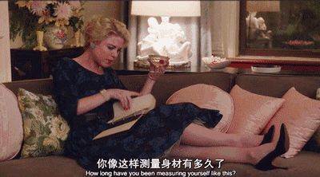
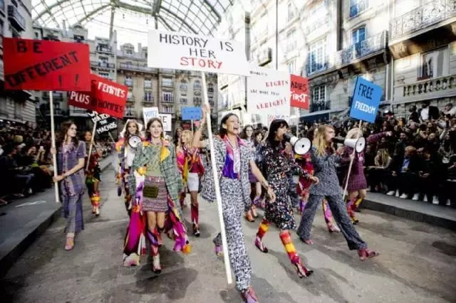

**作者**：[acel rovsion](https://www.zhihu.com/people/acel-rovsion)

**编辑**：讳言

去年的妇女节文章——[**姑娘，你想当女神还是当妇女？**](http://mp.weixin.qq.com/s?__biz=MzIzNTU3MDI5Mw==&mid=2247484909&idx=1&sn=8526d847827b9639c3ef5d398b96ad3b&scene=21#wechat_redirect)批判了某些资本出于制造消费需求人为制造了（妇女/女神）的身份分化，对男权语境中的权力关系进行了某种遮蔽，甚至在恶意分化女性群体，我们今年着重聊一下消费主义本身。

<!--more-->

消费主义在平权问题上带有某种奇特的两面性。你不能说它对反抗男权社会有好处，但也绝对无法说一点积极作用都没起到。**从学院语境来说可以直接看到消费主义的负面性，但这篇文章我们放在更日常的语境来谈。**

一方面而言，或者说积极方面，消费主义的体现很多，消费媒介通过文化中间品（价值观和生活方式贩卖）和文化消费品（消费品及其亚文化）制造性别文化分野。用格雷厄姆默多克的说法，商品化介入了媒介与资本权力构成的商品化逻辑中。并且商品化不一定是具体的交换物，交换价值可以从某些公共观念或者价值观开始，也可以重构一种有区隔的生活期望或者生活方式。

*被消费主义塑造的精致女性*

**而这个特性在初期对于性别博弈是有一定良性作用的，因为消费主义的播撒是纯粹媒介化的。新媒介对于传统作为信息包办人的传统权威进行消解。这导致公共领域被顶开，弱势方得到了一些主体性赋权和发声渠道。**

这使得传统被男权社会压抑的女性欲求，开始寻求合法化进程。传统被男权的男性凝视（Male Gaze）当作被展示者的语境开始被倒置，无论是小鲜肉还是卖老公人设的女星，实质上在媒介身体的塑造上都遵循着新消费力主体的凝视。

同时消费主义制造了一种个体性的自我关注。男权社会传统客体化女性，并神秘化（诉诸自然性）话语权威，甚至内化行动者的行为图式。然而，消费主义解构了这种社会逻辑规制，把男权社会的身份框定给消解了（女孩-性客体-妻子-母亲）。这其中存在很大的积极意义是使得女性开始关注个体生活，无论是贩卖精致生活还是价值观向往的，个体生活的优先性这件消费主义产物本身就反抗了部分男性干涉。这样，**女性开始注重对于财产和社会资源的积累；开始通过消极否定，拒斥传统带有剥削性的婚姻角色；开始砍断社会角色和权力体系的强迫。**

*美剧《了不起的麦瑟尔夫人》中的家庭主妇麦瑟尔夫人是个时刻在丈夫面前保持完整妆容和完美搭配，甚至每天量度自己的体围确保好身材不走样的完美主妇。遭遇丈夫出轨之后，她开始走出家庭领域，遇到了无数阻碍。*

此外还在公共领域合法化自身欲求，特别是性欲求。传统男权社会的性管制议程中，对于女性的公共性伦理审判是男权社会一个重要的维稳方式。而消费主义通过制造擦边球和多样化诠释的方式，开始使得性欲求的诠释权与男权木偶线脱离。无论是感官公共化，使得在至少社交网络上谈论女性自己的欲求和解读权力成为很正常的事情;还是给乙女游戏的李泽言们花钱也是一种公共承认的方式;或者是对传统男性形象的倒置和单向建构。甚至可以形成一种武器，通过消费主义建构的主体性可以在微博等社交网络形成一类带有排他性的强势话语，掩埋掉不属于这个语境内的生物。

所以说，消费主义带来模糊的积极性，就和查尔斯泰勒解读的“承认的政治”一样。个体的自代表性和族群的代表性被消费主义构成的晚期资本主义文化所扩大，这至少完成了女性对个体的关注。其次对消费媒介不愿取悦的传统群体（特别是掌握资源的中年老男人和没资源却带有保守立场的男男女女）进行了“新穷人”（鲍曼的概念，远离消费生活且失去消费社会部分话语权的群体）歧视，而传统群体对于男权秩序又有极端的路径依赖，这貌似达成了一种反抗，或者说如同希伦在历史制度主义论述里提到的关键时刻中对于微观权力关系的制度性变革。

*风靡万千少女的霸道总裁和小鲜肉人设*

但是，这种积极是有局限性的，所以从积极的局限开始聊到某种“局限的积极”。

这种局限性其实很简单，消费媒介制造焦虑和需求是一门满足晚期资本主义再生产的“生意”。正如同早期资本主义消灭了领主和旧贵族的人身依附权力关系，并把财产权从领主间不成文法制衡诉诸到资产阶级法权上一样，晚期资本主义也乐于解构男权家庭这个对生产关系已经不怎么适应的社会基本元，也乐于消灭捆绑在其上的男权宗族意识。通过松散化原有基本元并重构到个体性上，完成进一步挖掘生产力和消费循环的过程。**所以说对于生产过剩的解决方式是模糊使用价值和交换价值的二分，甚至通过建构使用价值去包装交换价值，使得消费成为一种维持体系运转的闭环。消费媒介不会真正有良心去做一种对弱势者的赋权，因为他是做生意的。**

其次，消费媒介对于男权性别文化的重构并不是要消弭男权社会遗留的性别身份固化，有些时候它甚至在人为制造性别身份焦虑和性别文化分野。商品拜物教既乐于取消行动者的传统枷锁，也乐于固化行动者的行动模式。

比如阿里巴巴女王节的宣传语就是自我矛盾的。今年甚至还搞出了**“释放女子力”**的广告，于是女王节主推的“让生活变得有趣”和“女子力”带有明显性别文化销售区隔，与其说它在讨论性别女性友好或者激励性别变革，更多是用强化性别文化来进一步筛选消费力受众而已。（本身以为阿里只是找不到好词来翻译带有女权实践意味的women
power或者girl power，从而找了个日本流行文化中由性别文化衍生的概念来概述，但其实视频中内容里面最多平板支撑那段勉强算激励女性和破除刻板印象，其他诸如受伤也要穿高跟鞋之类的桥段而言，我只能说确实高估了消费媒介对女性力量的想象力）

*阿里巴巴女王节广告*

或者比如除了公益性或者学院性的平权大号在正经做性别平权以外，大部分营销号的价值观营销都是精准投喂给“性别文化同质化”的圈子，并且刻意去制造甚至极端化这种性别文化分野。甚至干脆营销这种进一步固化的性别文化分野间的矛盾，于是不知道是编的还是歪曲的明显能制造痛点的情感故事就成了最好赚的一门生意，然后各路社交网络打得满天飞，钱就轻松赚到了。

于是我们发现了这样一个局限性问题：**消费主义在初期对平权有积极作用，但在后期可能异化反而阻碍性别博弈的继续良性发展，资本乐于刻意去制造政治景观、性别分野和性别冲突来博得盈利，并且乐于制造割裂的元叙事，甚至制造了新时代性别刻板印象的底本。**

就如同去年的文章提到的一样，“妇女”是近现代广泛使用的一种公共政治身份，这类似于上世纪女权运动被翻译成妇女运动一样。对于妇女的污名化是男权秩序分化女性共同生命经验的方式，而消费媒介乐于迎合这种区隔而貌似给女性“正名”，实际上也是一种分化投喂的手段。女性对于政治参与和对男权真实政治的攻击，以及几十年女权运动实践带来的共同体力量，以及我们面临的男权社会真实的矛盾，其实都被消费媒介分化和粉饰掉了。

伊格尔顿往往把这个称作**“资本主义的形式”**或者**“缺位的上帝”**。这其实说明商品拜物教是一个进行式的产物。

> **1. 这里面包括输出“商业生活”的史诗--一种个人梦想和物质丰沛构成的精神享受闭环**;于是诱发政治变革（包括性别政治）
>
> **2. 其次，掩盖此岸的阶级矛盾和众多权力关系的错位。**并表征化商品符号制造一种想象性的形式化自由。
>
> **3. 犯罪协定。**这个概念就是把交换价值以及相关伴随的象征权力全部归结为一种“道德”---商品拜物教的道德。

**异化的进程中，用新的异化去反抗老的异化，但忽视了异化本身背后退场的主体（资本或者消费媒介），这就是局限性。**

比如，最早的时尚界对于女性有推动作用的，包括：现在奢侈品行业对于女性友好的制度；早期裤装运动对于女性身体自主的呼吁；还有Fit的健身文化一拳打在了传统男性凝视的身体模式上。

*Chanel2015春夏大秀，这一幕的背后是Coco Chanel小姐的笑容。作为女权主义者的杰出代表，Coco Chanel将所有的态度融入了她的衣服中。作为第一批女性设计师，她打破常规推出裤装，大胆的将男士衣物的布料用于女装的设计。*

但在几十年后它也走上了异化。比如反抗body
shaming和形象自爱运动反抗的就是过度Fit和时尚制造的身体模式形成新的强迫性文化底本。这在健身刚兴起几年，乐于消费“健身等同于自律道德”的国内显得很不可思议---“Fit作为身体模式样本好歹也在弘扬自律和健康生活吧，一群外国女人反个大头鬼啊，你练也行啊”，这可能确实是中外平权和左翼实践暂时无法交流中的一个“区隔”。

**其次，消费媒介更乐于投喂自己的受众，而没兴趣去代表消费力较低的人去发声音。**其代表性都是由布尔乔亚组成。无法发声的中下层制造业或服务业女性工作者，得不到司法公共品的农村女性，以及在上升期受到男权集群压力的中上层奋斗期女性（既不是布尔乔亚式公共消费的有闲阶级，也不是上层社会式定制性消费的有闲阶级，而是真正会打击到男权社会资源分配的奋斗者），为平权事业献出大部分时间的妇女（政治身份），甚至都不在消费媒介代表的兴趣篮子里。

*Fit现在是门生意*

南希弗雷泽对于第二波女权的不满也是以上类似原因，第二波女权之后可能在部分革命进步后忘却了阶级叙事本身---仿佛我们已经从逻辑上撼动了男权体系，之后只需要修修补补就好了。但是新自由主义、男权和晚期资本主义三者的共生体逻辑只是通过掩盖矛盾走向了一种放置性的不确定，它并没有走向自己的否定。她因而呼吁重拾激进女权提到的性别政治和阶级叙事，即对于趋于退场的男权和资本主体形成对抗性的否定力量。

如鲍德里亚的拟象论所言，发展到晚期的资本主义形成了一个“超现实社会”，拟象的内爆使得我们通过想象性关系去理解社会，脑臀分离更多是享受于文化制造者输出的场景结构，甚至反过来主导了真实社会的组织。

但是这本质上和南希弗雷泽的批判一样，缺乏对于真实性别政治的纯粹反思以及对于资本主义逻辑本身抱有希望，把解放当作景观式解放，把自愿等同于自由和个体性的神话，把自由等同于观看物质丰沛的惊颤体验（本雅明的概念），而忽视男权的阶级性以及男权和资本主义的共生关系，进而陷入新一波的困境。

这算是我们这些支持平权的人需要面临的另一重挑战。毕竟还是那句话，**能够颠覆男权的不是精神狂热和唯心主义妄想，而是对于所有制的变革和生产关系的发展;不是玫瑰，而是枪炮与组织。**

**3.8妇女节快乐！**