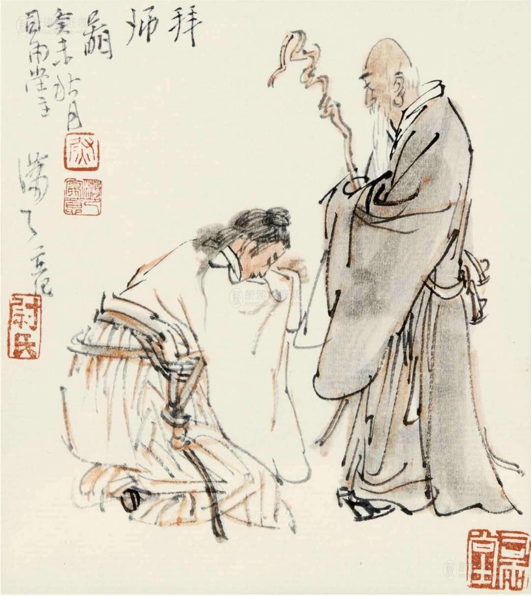
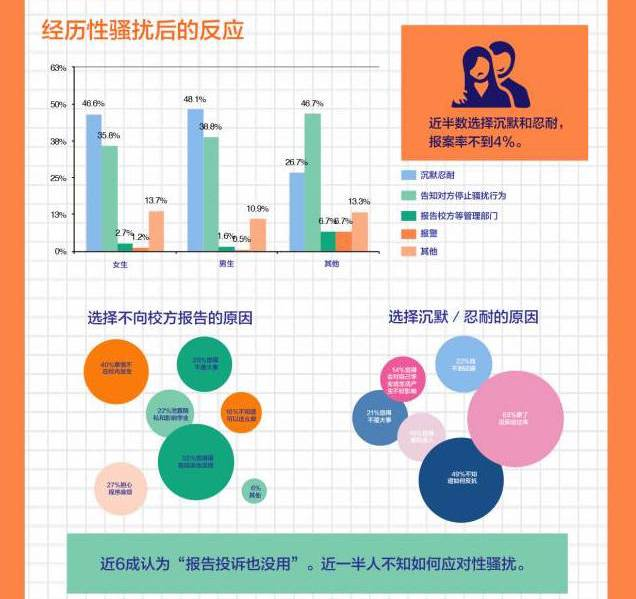
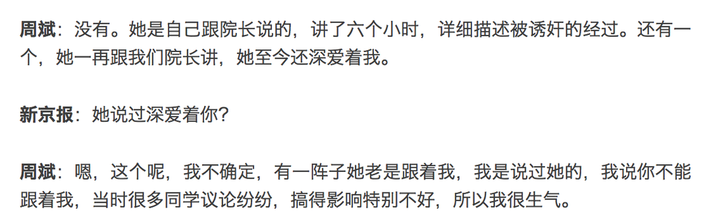

**作者**：[杨则非](https://www.zhihu.com/people/gu-chen-qiu)

**编辑**：[heaven疏狂](https://www.zhihu.com/people/heavenshu-kuang)

*编者按*

沉寂20年北大高岩事件近日在高校与网络上引发讨论。时任北大副教授沈阳被校友指控性侵高岩，导致她自杀身亡。 无疑，沈阳与高岩的师生关系是影响事件发展的关键一环。

对于“师生恋”这个争议性关系，我们怎样看待它？ 本期Herstoria编辑杨则非将对师生恋中暗含的权力关系以及它对教育公平的影响进行剖析。

<!--more-->

近日互联网上掀起了一场讨论“师生恋”的浪潮，但在中国的教育体系内，“师生恋”长期是一个模糊不清的暧昧概念，有人视之为悖伦，有人视之为浪漫。其中许多“师生恋”支持者的讨论思维仍然停留在前现代的上个世纪，把师生恋视为当事师生双方的消极自由予以辩护。但是现代化精密运作的教育体系与过去的私塾或者家庭教师有着天壤之别**，**师生双方的消极自由在体制化的教育体系内早已被干涉，这时候再追求“恋爱自由”已经显得刻舟求剑了。
     
在前现代，实际上很难说对师生恋有过明确的禁止，因为那时候极少出现异性师生，而同性恋又被视为不正当的。一个前现代人如果宣称自己反对师生恋，那极可能只是基于“一日为师终生为父”这种基于封建家长制建立的师生伦理。那么在现代，除了教师与未成年学生产生恋情这种明显失当的关系，当我们质疑成年人与成年人交往的师生恋时，我们在质疑什么？又在捍卫什么？

## 1  

心理咨询行业在行业伦理里有一个很有意思的论述，就是说如果咨询师与来访者或者其家人在三年后发展出性关系或者亲密关系（三年内禁止），要求“**仔细考察该关系的性质，确保此关系不存在任何剥削、控制和利用的可能性**”。\[1\]

可以看到，即使是专业的心理咨询工作人员，也无法保证自己在咨访关系结束后如果与来访者发展亲密关系能完全排除因为咨访关系不平等性带来的剥削、控制和利用的可能性，又何况是对人类心理的认知尚且不如咨询师的教师们呢？

更重要的是师生关系的不平等，远比咨访关系的不平等更加严重且具有系统性。这种不平等比较明显地存在于两方面：

**1.教育制度赋予教师的权力与权威，**

**2.前现代家长制式师生伦理的残余。**
     
在现代教育体系中，教师对学生拥有着小到作业评改、成绩评价，大到学位证书、保研推荐的权力，这种权力是现代教育体系赖以运作的根本，但也随时可以成为无良之师对学生作恶的底气。另一方面，我们的现代教育体系是从西方现代化国家直接移植过来的，师生关系中存在着许多封建残余，**“一日为师终生为父”的观念**仍然被普遍认可，没有形成教师只是一种“传道授业解惑”职业的观念，这给了教师把自己的职业权力投射到学生日常生活的天然合法性，于是师生关系不仅在课堂内不平等，在课堂外也无法平等。

*尉曉榕 拜师图*

除了显性的不平等之外，经验、知识的差距也带来了话语上的不平等。师生之间往往并非如“师生平等”的口号一样是两个主体的对话。教师除了被体制赋予的现实权力之外，也拥有着其学术成就、人生经验带来的话语权力。这种话语权力优势使得教师在师生心理互动中处于主导地位，教师可以策略性地塑造自己在学生心理中的形象并影响学生对双方关系的心理期望。比如一项学术性骚扰的研究就在一些案例中发现，**教师会通过“先抑后扬”再借机“关爱”学生，达成心理操控的目的**。\[2\]

所以单纯从师生关系权力、心理、知识各方面不平等的角度看，我们都需要更审慎地检视师生恋中潜藏的“剥削、控制和利用的可能性”，而不是忙之不迭地赞美“恋爱自由”。

## 2 

除了师生关系的不平等性，讨论师生恋我们还需要关心什么？
     
首先我们需要考虑，**师生恋的双方是否有足够的能力处理好自己的亲密关系？如果处理不好会有什么后果**？

一个比较极端的例子是贵阳六中师生恋事件，这一事件中老师与两位学生都有了恋爱关系，这段三角恋最后以其中一名学生杀害了另一位学生告终\[3\]。这一事件在师生恋中不一定具有普遍性，毕竟那名行凶的学生也只是刚刚成年，心理和行为能力都不足够成熟，但它仍然能给我们带来一个警示：师生恋并不总是美好，而一旦师生恋失败了，师生关系的特殊性**可能导致比普通恋情的失败更严重的后果**。

固然，在社会或者一般的校园恋情中，一场失败的恋爱关系也可能给我们带来深痛的创伤，但分手之后终归能够慢慢治愈。而师生恋由于师生关系的近乎**不可撤销性**（转学或者换工作的成本过高），会面临一个非常尴尬的境地，闹矛盾了或者分手，师生关系却仍然在延续，那么恋爱关系的波动是否会影响师生关系？长期扭曲的师生关系是否会给双方尤其是处于权力弱势的学生带来更严重的创伤？实际上早在1997年美国一项关于高校双重关系的研究就表明，**曾经经历性双重关系的女生在回顾时普遍对这段经历持负面看法，教师也常常为一场失败的性双重关系感到尴尬**\[4\]。

其次，讨论师生恋除了要考虑关乎师生双方的问题，我们还必须注意的是，师生恋对**第三方**有什么影响？

中国古代的政治实践在非常早期就提出了回避原则，后来细化为籍贯、亲属等方面的回避制度。其中在科举问题上回避原则也得到了贯彻，即考生、考官等需要互相回避。可以看出，在前现代人们就意识到私人情感对考试公平的影响，那么在现代，我们又岂能忽视师生恋影响教育公平的可能？

毕竟师生关系不是简单的双边关系，一个老师需要同时教育多个学生，精力必然有限，即使不给予自己的学生恋人什么特权，**注意力过多地集中于一个学生身上，这本身就是显失公平的**。这种不公平如果被作为第三方的学生觉察，那么无论对于这些学生的学习积极性以及心理成长，还是对于整个校园的学习风气，无疑都会造成损伤。

## 3

长期以来反对干涉师生恋的声音，主要集中在“师生恋”属于私人领域的观点上。即师生恋是出于师生双方理性判断而产生的，如果其没有被证实存在不正当性，那就不应该被公权强势介入。那么“恋爱自由”适合拿来给师生恋辩护吗？

但现实是人类社会显然并非由理性人组成，就像现实中不存在绝对刚体一样，所以我们讨论现实问题时不能以理想状况为前提条件。具体到师生恋问题上，就是需要充分考虑师生关系的不平等性、师生恋可能带来的对恋爱双方以及第三方的不利影响。我们不能假设每一个学生都有足够的勇气拒绝来自老师的约会邀请，而不被欢迎且隐含强迫性质的约会邀请无疑是一种事实上的性骚扰。因此，美国恩波利亚州立大学在其关于师生恋的政策中明确指出“尽管一个学生可以合情合理地拒绝教授所提出的任何一种私人关系，但当教授提出约会时，学生可能会感觉到几乎没有其他选项可供选择……结果是，在这种关系中，**知情同意在多大程度上达成是很难确认的**。”

实际上，性骚扰与师生恋之间的边界时常是模糊不清的，比如2002年美国加州大学伯克利分校就曾经出现过教师声称是师生恋而学生称是性骚扰的罗生门，性骚扰者往往会策略性地运用自己的**权力操控受害者“同意”自己的行为**\[2\]。而中国由于除了在司法实践中采取插入说的强奸罪，始终没有完善性骚扰与性侵的相关法律定义、举证责任，大众也缺乏这方面的认知，师生恋与性骚扰被模糊的情况可能更加严重。

虽然不能得知师生恋中强迫性质的那一部分即性骚扰具体有多大的比例，但是如果认为自己受到性骚扰，事实上采取积极面对态度的人并不多。在一项关于校园性骚扰的调查中有7成受访者受过不同程度和不同形式的性骚扰，**其中将近一半的人会选择忍耐，报案比例更是不到百分之四**\[5\]。从这一数据我们可以侧面观察到，师生恋中即使隐含了权力弱势方所能认知的不平等，他们也很难选择发出反对的声音。

*高校性骚扰调查报告：经历性骚扰后的反应*

在目前，许多师生不平等产生的压迫问题，都是当事人摆脱师生间的权力关系之后爆出的。所以“正义的师生恋”其实是个悖论，因为外界无法认知其中是否隐含权力不平等的因素，只能依赖于当事人的自我主张，而学生不一定有被胁迫“恋爱”之后站出来主张这场恋爱是不正当的勇气。

一个可供参考的例子去年年末被举报的南昌大学国学院副院长周斌性侵女学生事件，除了需要注意到其中关于性侵“多次”“长期”的描述，更值得注意的是数名受害人都提及性侵发生的同时伴随着加害者的“表白”，事发后加害者甚至以“她还深爱着我”试图为自己辩护\[6\]。不难想象，事件中的受害者如果没有足够的证据证明性侵的指控，那么教师一方完全有理由辩解自己这是一场师生恋。这足以警示我们，受害者的勇气无法有效对抗加害者被体制赋予的作恶权力，**只有同样制度化的权力才能对其形成制约**。性侵与性骚扰问题如此，能够掩盖性侵与性骚扰的师生恋问题同样应该如此。

*周斌为自己辩护：“她还深爱着我”*

相似地，如果一场师生恋涉及利益输送而导致其他学生利益受损，处于弱势地位的学生们也只会敢怒不敢言。长此以往必然挫伤他们的学习积极性，甚至影响其人生观、价值观的发展。

所以可以说，如果我们继续以恋爱自由的名义赞美所谓美好的师生恋，只会掩盖更多不正当的师生恋，只有建立反对师生恋的伦理，我们才能在学生向老师说“不”时与Ta同在。哈贝马斯关于主体间交往平等性的论述值得在师生恋问题上参考，“**有了主体间性，个体之间才能自由交往**，个体才能通过与自我进行交流找到自己的认同，也就是说，才可以在没有强制的情况下实现社会化”\[7\]。

## 4

关于**高校师生恋的政策**，其实在国外已经有了很多可借鉴的版本。比如哈佛大学在本科阶段是全面禁止师生恋，在研究生阶段则是相对禁止，即禁止与相关导师恋爱，如果某研究生有权对某本科生打分、评估或者指导那么他们的恋爱也是被禁止的。南犹他大学的政策则是要求师生恋发生后，教师一方有责任向上级主管公开恋情，也就是对师生恋采取要求报告备案的政策，这一类型的政策在超过百分之40的美国高校中实施。而诸如布鲁姆菲尔德学院等部分高校更是直接采取了对师生恋全面禁止的态度，即禁止学生与教职工之间一切恋爱关系，不论是否自愿或者有直接师生关系。

虽然上述高校对师生恋的干涉力度不尽相同，但显然他们都并不认为师生恋是个无需探讨的默认存在，这种态度应当对我们有所启示。当然，并非美国高校的政策就一定适合中国国情，但正因为如此中国才更需要审慎地看待师生恋，并在讨论中形成本土化的师生恋政策。更重要的是，虽然教育部已经出台“**高校师德红七条**”\[8\]这种以道德为法规约束教师的红头文件，但短短一百多字根本难以定义高校中关于双重关系的专业伦理，教师在双重关系中的权力滥用处于一种只要不严重到违法就难以被制约的情况，对师生恋的讨论或许就是关于教师、教育、师生关系的专业伦理在中国发展的开端。

毕竟，师生之间任何性质的双重关系都存在和师生恋同样的隐忧：不平等性会给双重关系带来剥削、控制和利用的嫌疑；双重关系又会反过来影响当事双方以及教师与第三方的师生关系，削弱了教师在自己本职工作上的专业胜任力。这两点与心理咨询行业伦理中反对双重关系的理由其实是近似的，即“**有可能会损害心理学家的客观性、能力或效率，从而影响其工作的效果或者直接对来访者造成剥削或伤害**”\[9\]。而值得深思的是，心理咨询其实并不是对我们人生影响最大的行业，却发展出了致力于避免来访者受到损害的强制性职业伦理，真正对个体身心发展影响最大的高等教育行业却显得落后了。

所以质疑师生恋的逻辑不仅仅是质疑师生恋本身，它质疑的是师生之间包括恋爱关系在内的**所有双重关系的正当性**。中国历来倡导教师与学生在师生关系外保持融洽的私人关系，所谓“情犹父子”“亦师亦友”。但实际上校园外师生的私人来往极易因其不平等性导致教师对学生的控制乃至凌辱，又或者是涉嫌人情往来引发关于教育公平的质疑。比如近期陶崇园事件中爆出的师生聊天记录可以看到，其导师王攀经常要求其带饭、洗衣等，这种关系无疑极度损害学生人格。

合理的考虑是，师生尤其是存在直接指导关系的师生，因当尽量避免发展在课堂外的私人关系，特别是涉及利益、性或者其它亲密性质的双重关系。师生在课堂外出于教学指导等正当目的需要接触，应当尽量把会面地点安排在具有公共性质的场合，否则应当尽量保证第三方在场。并且可以考虑设立高校自治性质的**伦理督导委员会**，要求教师对自身的双重关系予以报备，对师生双重关系实行专业督导。

归根结底，师生关系几年便过去了，如果真的爱对方，那就等师生关系结束后再约会吧；如果志同道合希望成为朋友，那就毕业之后再约饭吧。要求审慎看待师生恋乃至其它师生双重关系，并非要质疑两个人终身的交际自由，而是为了**保护更多人在师生身份外私人生活的自由、保护教师在自己工作上的专业胜任力、保护学生的学习生活不被异化**——是为了倡导一种更专业的师生关系。

## Reference

\[1\]中国心理学会.临床与咨询心理学工作伦理守则［EB/OL］<https://baike.baidu.com/item/%E4%B8%AD%E5%9B%BD%E5%BF%83%E7%90%86%E5%AD%A6%E4%BC%9A%E4%B8%B4%E5%BA%8A%E4%B8%8E%E5%92%A8%E8%AF%A2%E5%BF%83%E7%90%86%E5%AD%A6%E5%B7%A5%E4%BD%9C%E4%BC%A6%E7%90%86%E5%AE%88%E5%88%99/2137884?fr=aladdin>.

\[2\]李军.
学术性骚扰的共犯性结构:学术权力、组织氛围与性别歧视——基于国内案例的分析\[J\].
妇女研究论丛, 2014, (6): 44-55.

\[3\]中国新闻网.45岁女教师与2名男生三角恋 男生捅死情敌\[EB/OL\].
<http://news.sohu.com/20080227/n255387818.shtml>.

\[4\]Patricia A.Rupert，Deborah L.Holmes.Dualrelationships in higher
education: Professional and insti-tutional guidelines ［J］.Journal of
Higher Education.1997，（6）：660-678.

\[5\]广州性别教育中心，北京义派律师事务所.中国大学在校和毕业生遭遇性骚扰情况调查报告
\[EB/OL\]. <http://mp.weixin.qq.com/s/R97NMawENv8Dpjr19C2pEg>.

\[6\]新京报.南昌大学一副院长被指长期性侵女学生，我们找到了两位当事人
\[EB/OL\]. <http://mp.weixin.qq.com/s/6jQtFcrc-YqyT7rWePQu4A>.

\[7\]哈贝马斯.交往行为理论第一卷行为合理性与社会合理性\[M\].曹卫东译.上海:上海人民出版社，2004.121.375.

\[8\]中华人民共和国教育部. 教育部关于建立健全高校师德
建设长效机制的意见\[EB/OL\].
<http://old.moe.gov.cn//publicfiles/business/htmlfiles/moe/s7002/201410/xxgk\_175746.html>.

\[9\]百度百科.双重关系. \[EB/OL\].
<https://baike.baidu.com/item/%E5%8F%8C%E9%87%8D%E5%85%B3%E7%B3%BB>.