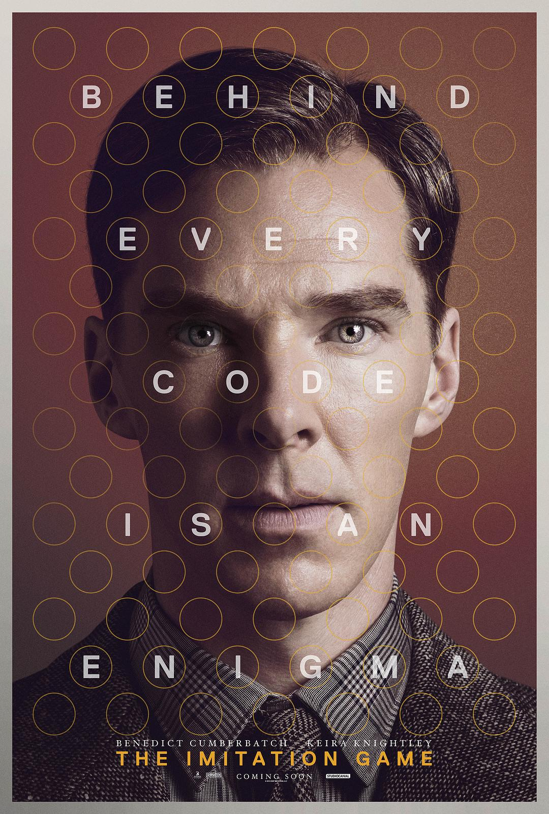
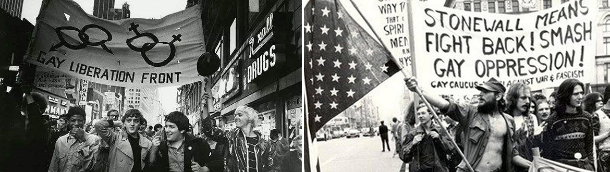
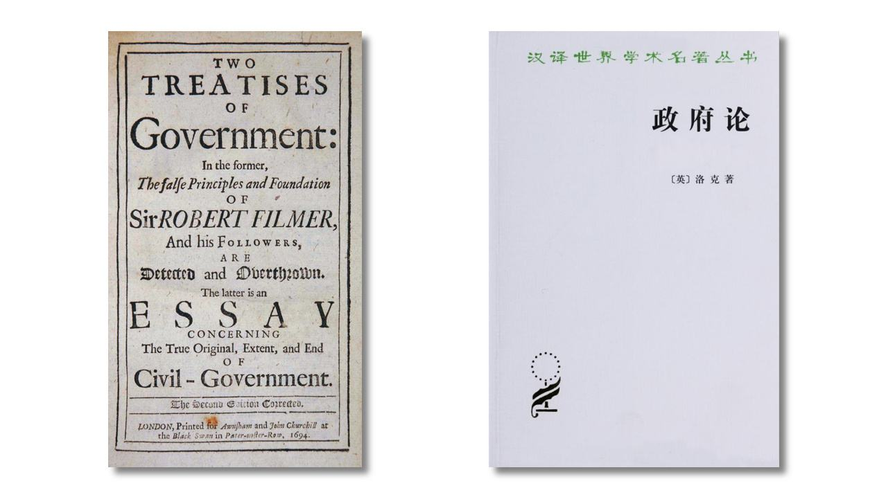

1954年6月7日，人工智能之父艾伦•图灵在自己的家中服用氰化物自杀，而在此之前的1952年，他由于“明显的猥亵和性颠倒行为”而被定罪，被迫持续注射荷尔蒙长达一年，最终不堪折磨而自杀。在当时的英国，同性恋依然被认为是违法的。

<!--more-->

不止英国，在历史上的很长时间里，同性恋在很多国家和地区被认为是一种罪行或疾病，被普遍打压。同性恋被认为是不正常的，不符合主流标准的性行为会被当作违反公共道德的罪行，性少数者可能仅仅由于向别人表露自己的性倾向就会被投入监狱，更不用说在日常生活中遭遇的几乎无处不在的偏见、刻板印象与歧视。

> 《模仿游戏》剧照 影片改编自安德鲁·霍奇斯编著的传记《艾伦·图灵传》，讲述了“计算机科学之父”艾伦·图灵的传奇人生。

为了改善性少数群体的生存状况，实现性少数群体的解放，同性恋平权人士长期致力于消除针对于性少数群体的偏见、刻板印象和歧视而积极行动，反抗来自于经济、政治和文化等不同形式的压迫，而同性恋婚姻合法化就是其中一大诉求。

如今在法律层面，目前全世界已经有24个国家和地区在全国范围内实现同性恋婚姻合法化，墨西哥等国在部分范围内实现了同恋婚合法化，诸如德国、捷克、瑞士、奥地利和匈牙利等国家和地区给予同性恋人“民事结合”或结为“生活伴侣”的权利。

> 1969年的纽约“石墙酒吧暴动”

就亚洲地区而言，东京近期宣布立法禁止针对LGBT的歧视和仇恨，并于2019年正式实施，而在此之前，东京某些区和福冈市已经启用“伴侣宣誓制度”来容纳实现同志婚姻合法化，日本文科省则宣布将引入LGBT等相关科普内容引入初中德育教科书；泰国和台湾已经立法实现同性恋婚姻合法化，并于明年开始实施。

虽然目前同性恋平权在全球范围内已经取得不少进展，但是目前反对同性恋的声音依然相当庞大，公共话语空间长期存在着与LGBT相关的偏见和歧视言论。

其中，在反对同性恋婚姻合法化的过程中，有些保守主义者认为同性恋婚姻合法化会导致婚姻制度的合法性滑坡，以至于会造成今后任何形态的”不合理“（对于保守主义者而言）关系都会避开共识性道德而获得合法性，比如乱伦恋或多偶制。

部分保守主义者声称，如果我们支持同性恋，那么我们是否应该反对单偶制？如果喜欢一个人就应当有天赋权利结婚，根据逻辑一致性的原则，相爱的三个人也应当拥有结婚的权利，那么我们应当支持多偶制婚姻？如果同性恋婚姻合法化的逻辑是“人畜无害即自由”且“多数人的不同偏好不应当成为褫夺个人基本权利的正当理由”，那么“禁止乱伦恋”在同性恋支持者的逻辑体系里是否合理？

在保守主义者的推定中，“异性婚姻”在法理中的“合法性”有一定道德基础，而他们是在判断是否放开婚姻的范围，而放开之后这个范围或者塑造的新婚姻的定义之后是否会导致逻辑滑坡，以至于原有的道德基础就不存在了。

**但是以上观点显然逻辑存在问题，事实上异性恋婚姻和异性恋固定关系并没有任何合法性(legalitat)可言，只具备正当性（legitimiatt）。**

> 正当性：即政府是否依法治理，与法律是否保持一致；
>
> 合法性：针对主权机器统治的框架而言，即政府和法律权威被普遍认可的程度。

关于异性恋婚姻的建构历史，异性恋婚姻出现在父权社会早期是作为一个男女生育合作的经济契约所存在的，在罗马早期建构家族制度，包括我朝从《周礼》时期开始建立宗族制度，才使得这层生育合作带来的功利契约具备了所谓的“正当性”(legitimiatt)，而这个正当性当且仅当父权社会的家族结构存在而存在，在之后由于基督教父权意识和公理会道德，给异性婚恋建构了所谓“神圣性”，其法理来源是上帝作为判断主体所带来的对于人类这个“他者”的原型叙事，以形成某种“道德”。

所以说，事实上异性婚姻意识根本就是一个处于实用主义建立的生育权责关系，最后被诉诸成规范文本并延续至今而已。我们在签订契约前，就已经存在了既定的习惯制度，于是从习惯出发，我们在后来的成文法体系才规范形成了异性恋婚姻制度。而现今的婚姻赋权制度，完全是可以剥离生育权责的。

但是，异性恋婚姻的合法性早就没有了。

**第一，在平权意识过后，父权社会的家族制度或者宗族意识是处于被公众抛弃的状态，所以异性婚姻的合法性依然只是父权社会时期成文法的延续。**

**第二，从保守主义者喜欢使用的“自然状态”到社会契约的法理论证来看，婚姻权在权利让度的过程中根本没有交给公共权威作为派生权力而存在**，因为从洛克开始，就严格界定了“私人领域”和“公共领域”的界限，而婚姻权责在保守主义的法理中根本没有进入到社会契约里面去，而是作为普通法所遵循的传统而存在；而共和主义和新保守主义的女权主义者对于这套法理的批判首先就是“社会契约不包括性别契约”。

> 洛克 《政府论》，自由主义谱系著名思想家

**因此，保守主义者指责“合法性滑坡”是根本不成立的**，我们在选择某种关系是否具备“正当性”，在现代社会是一个规范语言范式中所有人对于社会关系的叙事规范之加总（即哈贝马斯的认同理论），也就是说，我们共识承认同性婚姻是一个共识法理下的”赋权“过程，而婚姻的法理定义本来就是不稳固的，**所以同性恋婚姻合法化更多的是赋予更多人自由权责的正面过程，而并没有破坏消极契约。赋权过程并不侵犯消极自由。**

> 哈贝马斯认为，现代社会的集体认同已经发生了重要的范式转换，随着传统社会向后传统社会的转型，个体和集体再也无法从传统和权威中寻找认同的基础，他们必须自己为自己建立同一性，通过民主的参与程序由社会成员集体地决定：“个人不再从传统的、非反思的集体认同中获得构建个人认同的源泉；相反，他们共同参与文化与集体意志的形成过程，在此过程中，集体认同需要他们共同的塑造”。由于未加批判而得来的传统文化与规范对已启蒙的个体不再具有说服力，因此只有那种经过主体间交往并体现个体自主性的集体认同形式才会在现代社会取得合法性。[注:Jürgen Habermas, Communication and the Evolution of Society，P116。]

我们在承认任何一类婚恋体系（包括保守主义者所焦虑的不伦恋等等）是否被接受是一个阶段性共识的过程，我们考量出自现有的道德直觉（家族长幼差序的伦理是否需要遵守）和功利的利害关系（不伦恋是否会导致实质性危害），权力关系的戕害（不伦恋中是否涉及权力关系不正当以及不对等，承认这个权力是否会导致权责体系崩坏）是否存在等等，交互过程中进行认同，而并非从整个人类道德的公序良俗中异性恋所构成的道德基础从头推断（而且也未必存在）。

只要我们承认某些诸如”乱伦恋“的关系不可接受是因为在我们的共识里认为这其中存在着“权力关系的戕害”，道德共识中的不可接受以及父权家族制度的伦理还有存续的必要等等，就不可能出现逻辑滑坡，**因为我们认同的过程不是一个整体性的过程，而是一个过程化的妥协。**

当我们认为父权家族中的权力关系还有效的时候，并且这种乱伦关系的后果对于社群有功利上的戕害，那么我们自然会拒绝这种关系，而当我们这种“道德共识”解体之后，乱伦恋有可能就被人接受了。比如在美国最高院的同性恋婚姻合法化判决中，波斯纳大法官认为，目前我们之所以不允许多偶制婚姻，核心原因是既定的社会结构使得多偶制的社会成本极高，我们共识里仍然无法接受。

**因此，“异性婚姻”的合法性是不存在的，我们现有习惯法的制度是在后来的成文法被规范，并且被某种共同体意识赋予了“价值尺度“，我们承认异性恋婚姻正当的过程是一个后发形成共识的过程**。它不是一个法理推定的逻辑关系，并不存在逻辑前提。异性恋婚姻本身不存在社会契约意义上的”合法性“，保守主义者原有推定的逻辑前提就不存在。承认同性恋并不会导致婚姻合法性滑坡，因为“承认”的过程不是个法理性过程，即不存在合法性，只有正当性。