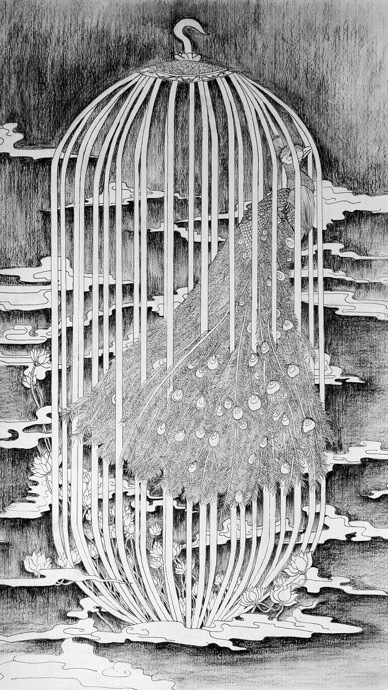
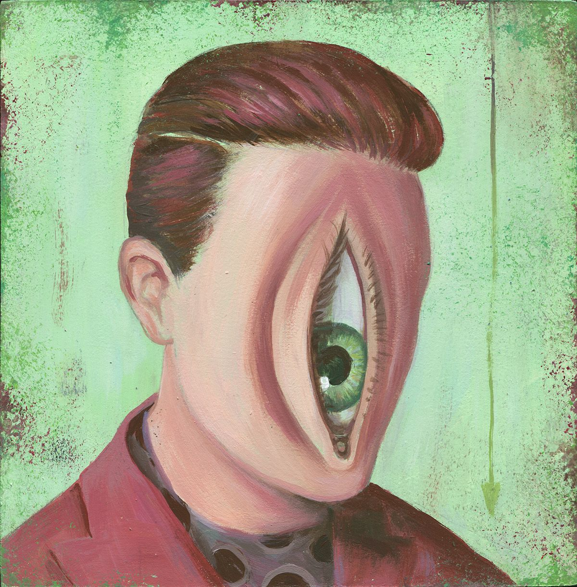
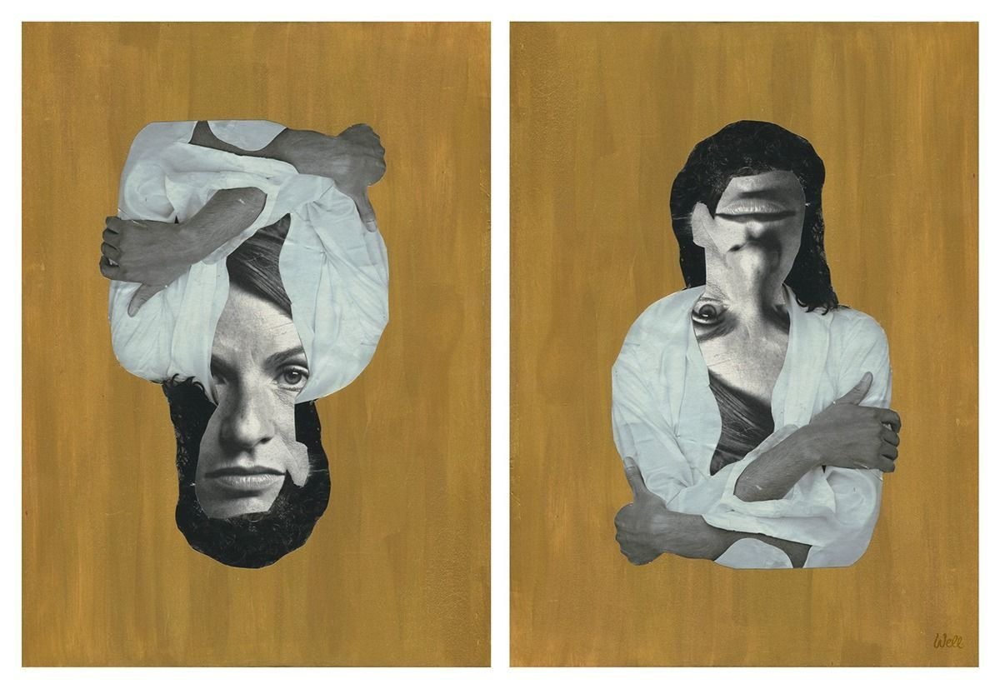
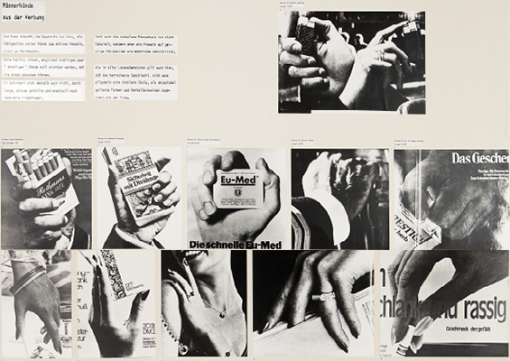
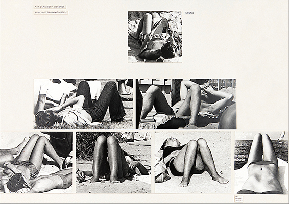
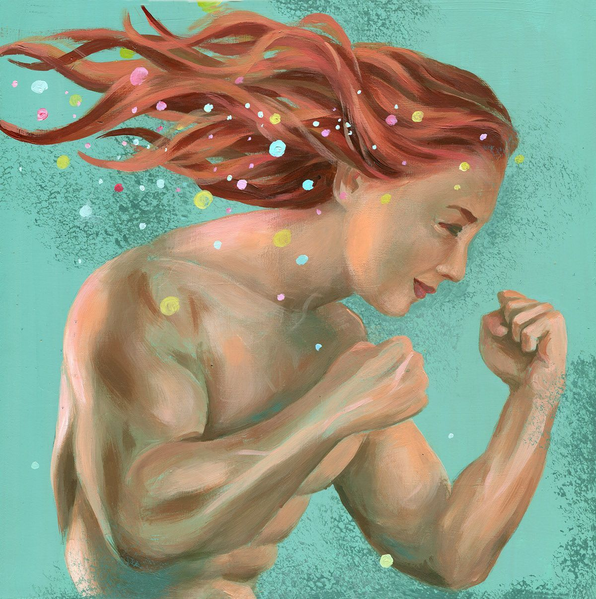

女性主义的一项基本主张就是，女性是受到压迫的。「压迫」是个很强的词。它惹人反感，又引人入胜。它很危险，且在危险地流行着，可又濒于灭绝。它经常被误用，有时候还是故意被误用。

<!--more-->

女性受到压迫的提法经常被回敬以男性也受压迫的说法。我们听说，压迫对于压迫者而言也同样具有压迫性，就像那些被他们压迫的人一样。一些男性把经他们大肆宣扬的欠缺哭泣能力当作他们受到压迫的证据。太困难了，我们听说，要当个大男子汉。当男性的压力与挫败被用于证明压迫者也受自身压迫行为的压迫时，「压迫」这个词就被夸大到毫无意义了；就好像它包罗了任何和所有人类受限制或受苦难的体验一样，而无论其原因、程度或后果如何。一旦这种用法施加到了我们身上，那要是我们再否认任何人或群体受到压迫，我们就好像是在认为他们永远不受苦难、毫无情感一样。我们被指责麻木不仁，甚至是偏执。对于女性而言，这种的指责尤其骇人，因为敏感可是难得分配给我们的美德。如果裁定我们麻木不仁，我们可能就会担心自己毫无可取的长处，也许自己连真正的女性都不是。因此，我们在发声前就被噤声了：用以描述我们处境的词语被抽干了意义，我们自己的内疚机制也被触发了。

但这是胡说八道。人类可以在不受压迫的同时仍然生活悲惨，在否认某个人或群体受到压迫的同时不否认他们有情感或他们受到痛苦，可以是完全自洽的。

我们需要清楚地思考压迫，并且要缓解它有很多可以做的。我不想保证能证明女性是受到压迫的（或者男性不受），但我想讲清楚，当我们在说这些事情的时候，我们到底在说些什么。我们需要这个词汇、这个概念，而且我们需要它是清晰且确定的。

#### **一.压迫是一张系统性关联着的力量和障碍网络**

「压迫」一词的词根是「压」这一部分。**人群挤压着走，大兵压境，压平裤子，压印，压按钮。**压是用来塑形物品、或将其压平、或缩减其体积的，有时缩减的方式是挤出其中间的气体或液体。被压的则是被困在力量与障碍中间的东西，这些力量与障碍彼此相连，共同限制、约束或防止那个东西运动或流动。塑形。固定。缩减。

被压迫者的日常体验提供了另一条线索。在被压迫者体验着的世界中，最具特色且最无处不在的特征就是**双重困境**(double bind) ——在这种情况下，能选择的东西被缩减到了最少，而且所有的选择都会招致惩罚、责难或剥夺。例如，对被压迫的人经常有一项要求，就是我们要笑，要高兴。我们要是服从，便示意了我们的温顺和我们对自身处境的默许。那样，我们就不需要得到关注了。我们默许了自己的不可见，默许了自己的缺乏存在感。我们参与了对自己的抹除。而另一方面，只要脸上挂着的不是最灿烂的笑容，我们就会被视作刻薄、怨妇、撒泼或危险的。这至少意味着，与我们共事可能比较「困难」或不愉快，而这足以毁掉一个人的生计了；最坏的情况下，被视作刻薄、怨妇、撒泼或危险的会招致强奸、逮捕、殴打和谋杀，这是众所周知的。而一个人除了冒险挑战自己喜欢的形式与毁灭速率外，别无选择。

另一个例子：在美国，女性，尤其是年轻女性，还普遍面临这样的困境——有性生活和没有性生活都是不对的。如果一位女性与异性有性生活，她就容易因为不检点、没教养或是淫荡而遭到责难与惩罚。「惩罚」来自批评，嘲讽与令人尴尬的评论，被男性当作公交车，和受更加保守的女性朋友鄙夷。她可能不得不对父母撒谎并隐瞒自己的行为。她必须兼顾意外怀孕的风险与危险的避孕手段。而另一方面，如果她拒绝异性恋性生活，她就经常会被某些男性骚扰，这些男性尽力想要说服她、强迫她，让她「放松」「随便一点」；她受到「性冷淡」「古板」「厌男」「婊子」「撩了又不负责」等标签的威胁。原本不赞成她性生活的父母可能又要担心她没有性生活了，因为这表明她不受欢迎或不会受欢迎，或者在性方面上不正常。她搞不好是蕾丝边 [1]。如果一位女性被强奸了，那么假如她又有异性恋性生活，她可能就会被推定喜欢被强奸（因为她的性生活被认为可以证明她喜欢性），而假如她没有异性恋性生活，她可能还是会被推定喜欢被强奸（因为想必她「压抑着性欲」）。无论有没有异性恋性生活，都很可能被当作你想要被强奸的证据，因此你当然没有**真的**被强奸。你赢不了的。你被困住了，困在了系统性关联着的压力 (systematically related pressures) 之间。

> [1] 此处选择将「Lesbianism」音译为「蕾丝边」，而不采用通行的「女同性恋」。在本书的最后一节中，弗赖伊指出「Lesbianism/Lesbian」之概念在弗拉制度 (phallocratic) 的社会下是不可定义的或不可解释的。弗赖伊认为，费拉制度所能理解的「女同性恋」与蕾丝边们所理解的「Lesbianism/Lesbian」不是同一概念；易言之，在费拉制度下「Lesbians are not real. There are no lesbians. (蕾丝边不是真的。蕾丝边并不存在。)」。参见本书第155至161页。后同。——译注

女性也像这样被困住了，被困在了力量与障碍组成的网络之中，无论是否在外面工作、是否领低保，是否生孩子，是否结过婚，是否还在婚，是异性恋、同性恋、两者兼有或两者皆非，这张网络都可能使人遭受惩罚、损失或蔑视。经济上的需求；监禁在种族和/或性别的职位贫民窟；性骚扰；性别歧视；由对**女性**、**妻子**与**母亲**相互矛盾的期待与评价所带来的压力（在整个社会中，在种族与民族的亚文化中，在自己的脑海中）；对丈夫、父母或国家（全部或部分）的依赖；自己的政治观点信仰；对种族或民族或其他「少数」群体的感情；来自自尊心与对他人的责任的要求。以上的每一个因素都相互冲突，惩罚着或阻止着摆在桌面上的所有选择。而扎脚的，永远都是这些数不清的小石子。这样穿衣服，就会被说骚；那样穿衣服，看起来又「不注重仪表」或「不像女孩子」。如果说话「语气强烈」，就可能被当作「婊子」或「荡妇」；如果没有，就可能被当作「女士」——这个词被用来巧妙地回击强有力的发言，或其所应该指代的现实。

被压迫者的体验是，她的⽣活受各种⼒量与阻碍所限制所挤压，而这些⼒量与阻碍⼜不是巧合的或偶尔的，因此是⽆法躲避的，它们互相系统性地关联着，以⾄将⼀个⼈关在其中，限制或惩罚其朝向任何⽅向的动作。这是被关在笼⼦⾥的体验：所有道路，每个⽅向，都封锁住了或埋上了陷阱。

笼子。想想鸟笼吧。如果仔细观察笼子上的某一根栏杆，你是看不见其它栏杆的。你只见树木的视觉焦点决定了你眼前所能看见的东西，你可以上下打量那根栏杆，却还是搞不懂为什么小鸟不能绕过那根栏杆飞去想去的地方。除此以外，即使有一天你只见树木地检查了每一根栏杆，你仍然搞不懂为什么小鸟不能绕过那些栏杆飞去想去的地方。不管你再怎么严密检查，你也**找不到**栏杆有任何的物理属性，能解释为什么一只小鸟会被区区一根栏杆限制住或伤害到，除非是发生了最天方夜谭的意外。只有你往后退一步，不要再微观地一根一根地打量栏杆，而要宏观地观察整个鸟笼，你才看得出来为什么那只小鸟哪里都去不了，实际上你立马就能看出来。并不需要有什么精巧的精神功力。非常**明显**，那只小鸟被一张系统性关联着的障碍网络所包围，其中没有单独某个障碍会阻碍它的飞行，但是经由它们之间的关联，最终铸成了铜墙铁壁。

现在可以理解压迫这么难以发觉的其中一项原因了：一个人可以非常小心并带着善意地研究压迫性结构的各要素，但却不一定将该结构当作一个整体来看待，因此就看不出或无法理解自己眼前的是个笼子，笼子里关着人，其动作与行动受到限制，其生活受到影响与缩减。

将视野局限在微观层面导致了对诸如男性开门礼仪的常见误解。这种礼仪在各阶级与种族中都非常普遍，令许多人感到困惑，其中一些人觉得它很冒犯，另一些人则不这样觉得。瞧瞧两个人走向一扇门的情景吧。男性稍稍向前一迈，把门打开。男性扶着门，直到女性走过。然后男性才进门。门在两人身后关上。「现在呢」，有人天真地问道，「那些疯癫的田园女权倒说说这怎么压迫她们了？那位先生可是帮那位女士平顺而从容的前进道路**扫除**了障碍呢。」但是，这样的礼仪都是某种模式的一部分，事实上好几种模式的一部分。要看到全貌，就必须提高看问题视角的层次。

开门假装是在帮忙，但帮的是假忙。这一点可以通过观察它有没有任何实际意义来认识到。年迈体弱的男性和浑身大包小包的男性都要为没有身体障碍的女性开门。男性会笨拙地勉强自己挤着去第一个把门打开。这项行为不是为了方便或优雅。除此以外，种种这些帮不需要乃至讨人厌的「忙」依存于一种模式中，即男性不帮实际有用的、女性亦会欢迎的忙。**女性**所体验到的世界是，殷勤的白马王子装模做样要帮忙、要给小恩小惠，可惜这些忙与恩惠都派不上多大用场；但在当有日常需要或受到威胁、侵害或惊吓，真正需要实质性的帮助时，身边又没有足智多谋、口齿伶俐的王子了。洗（他的）衣服不帮忙；凌晨4点写报告不帮忙；调和亲戚孩子吵架不帮忙。除了女性在天黑之后应该呆在家里，或者由男性护花回家，或者真的遇上了就「躺下来享受」等建议以外，什么都没有。

献殷勤的姿态没有实际意义。其意义是象征性的。真正需要开门和类似服务的，是那些由于种种原因而丧失行为能力的人——身体不适，浑身大包小包的，等等。因此，其所传达的信息其实是女性不具行为能力。而将这些行为从女性的实际需要与不需要的现实中分离出来，则是传达这种信息的载体：女性的真实需求和利益是不重要的或不相关的。最后，这些姿态所模仿的是仆人对主人的行为，因而更是对女性的取笑——她们在大多数方面都是男性的仆人和照顾者。男性献殷勤式的虚伪帮忙所传递出的信息是女性的依附性，女性的不可见或无足轻重，还有对女性的蔑视。

如果把注意力集中在个体事件的全部特殊性上，包括那位男性自身意图与动机的特殊性，以及那位女性自己对该事件的理解的特殊性，那就看不到这些礼仪的意义。有时候，人们似乎故意只看树木，让视野里充满微观事物，以免看到树林。不管怎样，无论是否故意为之，人们都有可能且经常真的看不到对女性的压迫，这是因为他们没有宏观看待问题，因此看不到问题的各个要素在更大格局里实际是系统性关联着的。

由于鸟笼的囚禁是一种宏观现象，女性在各种不同人生中所经历的压迫也是一种宏观现象。从微观角度也看不出来。但是当你采取宏观视角时，你就能看见它——一张系统性关联着的力量和障碍网络，合力导致了女性的固定、缩减与塑形，我们的生活。

#### **二.我们是作为特定社会群体的成员而受到压迫的**

笼子的形象有助于表达压迫之系统性本质的一个方面。另一个方面则是对笼子住户的选择性，这一方面的分析也有助于解释女性所受压迫的不可见性。

一个人是作为一位女性（或者作为一位奇卡诺人 [2]、或者作为一位黑人或亚洲人或蕾丝边）而被关起来的。

> [2] 指墨西哥裔美国人。——译注

*「为什么我不能去公园，你都让吉米去了！」*

*「因为对女孩子来讲不安全。」*

*「我想当书记，而不是裁缝；我不想学缝衣服。」*

*「这一行没有黑鬼的事；学个可以谋生的手艺吧。」*[3]

> [3] 这个例子改编自 Louise Meriwether 所著 Daddy Was A Number Runner 一书（Prentice-Hall，Englewood Cliffs，新泽西州，1970年）的第144页。——原注

当你质疑为什么自己被拒绝，为什么有这个障碍挡你的路的时候，答案都与个人天赋或能力，残疾或障碍无关；相反，它与你在某范畴中的身份有关，而这种范畴被认为是「自然的」或「生理的」。「笼子」的「住户」不是个体，而是群体，即某个范畴的所有人。如果某个个体受到压迫，那便是因为身为某个群体或范畴的成员而受到系统性的缩减、塑形与固定。因此，要把一个人识别为被压迫者，必须要把该个体视作属于某类群体的。

有很多东西可以帮助或阻碍我们识别到某人在这里所说的群体或范畴中的身份。特别是，似乎有理由认为，如果此群体的限制和定义包括物理上的关押或隔离，则关押和隔离将有助于将该群体识别为一个群体。这反过来有利于聚焦于宏观视角，使人能够识别到压迫，也有利于该群体成员的共鸣与团结。但是，并不是所有压迫性结构都对某群体作为一个群体施以物理关押和隔离，而受压迫者在地理上和人口学上的分散并不利于将其识别为一个群体。通过鼓励聚焦宏观视角来揭露向该群体所有成员施加压力之结构的整体性，对改善这些人的状况没有或很少有帮助。[4]

> [4] 强迫同化实际上是压迫群体用以缩减和/或消灭另一群体的一种政策。例如，美国政府对印第安人使用过这种策略。——原注

有太多人，男女和每个种族与阶级都有，根本不相信女性是由被压迫者所组成的一个范畴，我认为这一部分是因为他们被女性在组织起男性的阶级与种族系统中的扩散与同化所迷惑住了。我们的扩散使女性难以相互了解，因此难以识别我们共同的笼子的形状。女性在各经济阶级与种族的扩散与同化还在实践和经济上将我们分裂开来，因此给看不到沾上了利益色彩；对一些人来讲，是对其福利的嫉妒，对另一些人来讲，是对其他人有利地位的愤恨。

为了解决这个问题，有必要注意到的是，事实上所有种族和阶级的女性都是受困于同一个差强人意的贫民窟的。存在一个女性的位置，一个部门，所有阶级与种族女性都生活其中，它不是由地理边界而是由功能界定的。这一功能便是服务于男性和男人自己定义的利益，其中包括生养子女。服务和工作条件的细节因种族和阶级而异，因为不同种族和阶级的男性有着不同的利益，并用不同的修辞、方言与语言表达他们的需要和要求。但也有些共通之处。

无论是在上等，中等还是下等阶级的家庭或工作场合，女性的服务工作总是包括个人服务（女佣，管家，厨师和私人秘书的工作），[5]性服务（包括满足他的生殖器性需求和抚养他的子女，还包括「对他好」「为他貌美如花」等）和情感服务（鼓励，支持，赞美，关注）。女性服务工作在各地都以责任和无能为力的致命结合为特征：我们受到要求，并且我们也要求自己，对男性和儿童在几乎所有方面的良好结果负责，尽管我们几乎毫无实现该目标所需要的权力。对这种奴役状况的主观感受，其细节因人而异。它们受到经济阶级、种族、民族传统以及对应男性之性格的影响。所以强迫我们容忍这种奴役的具体力量也因不同女性所生活与工作的特殊环境而有所不同，

> [5] 阶级更高的女性可能不会做所有这些工作，但通常仍然需要负责雇佣和监督那些做事的人。这些工作，在这种情况下，仍然是女性的责任。——原注

所有这些并不是说女性不具有、不主张或有时候不能设法满足我们自己的利益，也不是否认在某些情况和在某些方面上，女性自己的利益确实会与男性的重合。但是，在每个种族/阶级内部、乃至跨种族/阶级的层面上，男性都不会像女性服务男性一样为女性服务。「女性的领域」也许可以理解为「服务业」，当然后一表达要比在一般经济学讨论中的意思宽泛和深入得多。

**三.但压迫却不仅仅是伤害或障碍**

在某种程度上，我们都遭受苦难、挫败与限制，都遭遇讨人厌的障碍，并且都在各种方面受到损害与伤害，这似乎是人类的境况。由于我们是社会动物，构造我们几乎所有行为和活动的都不仅仅是个人倾向和地球及其大气条件。[6] 没有人能摆脱社会结构，摆脱了也（大概）不会幸福。结构是由界限、限制与障碍组成的；在结构化的整体中，有些运动与变化是可能的，而另一些则并非如此。如果想找借口削弱「压迫」这个词，便可以用社会结构的真实存在作借口，说每个人都是受压迫的。但是，如果想要搞清楚压迫是什么与不是什么，就需要区分各种苦难、伤害与限制，并弄明白哪些是压迫的要素和哪些不是。

> [6] 这里的「构造/structure」与后文的「结构/structure」是同一个字。——译注

从我在这里已经说过的话可以看出，如果要确定某特定的苦难、伤害或限制是否是某人所受压迫的一部分，就必须**在具体场景里考察它**，以判断它是否是某压迫性结构的要素：必须考虑它是否是力量与障碍所组成之封闭结构的一部分，且该结构趋于固定和缩减某一群体或范畴的人。必须考察该屏障或力量如何与他人相适应，以及它对谁有利或不利。只要看看实例就很明显，不是所有挫败或限制一个人的东西都是压迫性的，并不是每一起伤害或损害都是压迫导致的或导致了压迫。

假如有一位富有的白人花花公子靠在南非投资钻石矿产为生，他在阿斯本[7]滑雪时不小心摔断了腿，并在暴雪中忍痛等了好几个小时才得救，我们可能会认为他在那段时间里遭受了苦难。但那段苦难时有尽头的；会有能用钱买到的最好外科医生治好他的腿，他也很快会在奢华的套房里一边啜饮芝华士[8]一边康复。这幅场景中没有任何东西暗示了存在障碍与力量的结构。他是好几个压迫群体的成员，并不会因为受伤和痛苦而突然就受到压迫了。即使这起事故是有人的恶意疏忽造成的，且有人可以因此受到责备并且在道德上存在过失，那个人也仍然不是压迫的施为者。

> [7] 美国科罗拉多州的一处滑雪胜地。——译注
>
> [8] 一种产于苏格兰的威士忌。——译注

想想看必须在道路哪边开车的限制吧。毫无疑问，该限制有时候几乎令人无法容忍，尤其是当一个人所在的车道堵死了，而对面车道却畅通无阻时。甚至有时候，遵守该规定还会招致有害的结果。但是该限制在大多数时候对我们中的大多数人来说显然是有利的。该限制是为了我们的利益而施加的，而它也确实使我们受益；其运作有利于我们**持续**运动，而不是将我们固定。交通法规所施加的限制是我们大多数人都会乐于施加于自身的限制，因为我们知道其他人也会遵守它们。它们是塑造我们行为的结构的一部分，不是缩减与固定，而是保护我们持续根据自身意志而运动与行为的能力。

另一个例子：美国城市中的种族贫民区的边界在一定程度上阻止白人进入，同时也阻止贫民窟的居民出去。某一白人公民可能会觉得受阻或感到被剥夺了自由，因为他/她不能去那里闲逛，感受「外国」文化的「异域」风情，或在贫民窟的旧物交换商店淘到便宜货。事实上，种族隔离与贫民窟的存在确实剥夺了白人的见识，并通过培养莫名其妙的优越感而伤害了她/他的品格。但这并不能使白人在这种情况下成为被压迫群体的成员，即因为她/她的种族而受到压迫的人。我们必须考虑障碍。它限制了双方的活动和接触机会（尽管程度不同）。但它是白人为了白人利益的意图、计划和行动的产物，其目的是取得和保持白人作为宰制和特权群体的成员所一般享有的特权。虽然此障碍的存在给白人带来某些不好的结果，但该障碍并不与其它障碍与力量处于系统性的关系中，不构成对白人具有压迫性的结构；恰恰相反。它是压迫贫民窟居民之结构的一部分，因此（遵从白人的意图）保护和促进着主流白人文化所理解的白人利益。该障碍对白人而言不是压迫的，尽管它是对白人的障碍。

障碍对双方而言意义不同，尽管其是对双方的障碍。监狱的实体墙壁不会让外面的人进来，也不会让里面的人出去，但对于里面的人而言，它们是限定性和限制性的，而对外面的人而言，则意味着保护其免受他/她眼中由里面的人所带来的威胁——免受伤害或不安的自由。一套将两个群体分开的社会性与经济性的障碍和力量，可能两个群体的成员都感受得到，甚至是痛苦地感受到，但仍然可能对一个群体而言意味着约束，而对另一个群体而言则意味着自由与机遇的扩大。

妻子/妈妈/助理/女孩的服务业几乎完全是个只有女性的行业；其边界不仅包围住了女性，而且在很大程度上将男性排除在外面。有些男性有时候可能遭遇到这样的障碍，并感觉它限制了对他们的运动、他们的活动、他们的控制或他们对「生活方式」的选择。他们觉得自己可能就是喜欢简单的养育生活（在他们的想象中大概是毫无压力、异化与繁重工作的），并由于这种生活对他们不开放而感到被剥夺了自由，他们于是宣布发现他们也是受到「性别角色」压迫的。但是那个障碍是由男性为了男性的利益而竖起和维持的。组成它的是在由男性控制的文化和经济中的文化性与经济性的力量与压力，在其中的每个经济级别与所有种族和民族的亚文化，经济和传统——乃至解放之意识形态——尽力至少将局部文化与经济掌控在男性手中。[9]

> [9] 当然种族和阶级会将此复杂化。大男子主义和「黑人男子气概」政治似乎有助于拉丁或黑人男性较拉丁或黑人女性掌控更多资金；但是在我看来，这些政治似乎最终都有助于白人男性掌控经济大环境。——原注

将女性领域划分开来的边界大体上是男性为男性大体上的利益而维持和推动的，且男性确实大体上从其存在中受益，即使是一头撞上去而抱怨其不便的男性也是如此。那种障碍保护着他的身份和地位，他是男的，高人一等，有权获得对一位或多位女性的性接触。它保护的是他高于同阶级和种族的女性一等的公民权，他接触更广范围内报酬更好、地位更高工作的机会，还有他可以选择失业而不是堕落到从事地位更低的或「女性的」工作的权利。

假如一个人的生活或活动受到某些其所遭遇到的力量或障碍的影响，我们不能仅仅因为那个人遭遇到那样的障碍或力量就得出结论说他受到压迫；也不能仅仅因为这种遭遇对那个人在那个时候是不快的、挫败的或痛苦的；也不能仅仅因为障碍或力量的存在，或者维持或施加它的过程的存在，会剥夺那个人有价值的东西。我们必须考察该障碍或力量，并回答与它相关的一些问题。谁建构和维持它？它的存在是为谁服务的？它是某个趋向于限制、缩减和固定某个群体的结构的一部分吗？那个人是受限制群体的成员吗？一个人可能遭遇到的或与之共处的各种力量、障碍与限制可能是、也可能不是压迫性结构的一部分，而且即使是，那个人也可能要么在被压迫者、要么在压迫者一边。靠那个人抱怨得多大声或多小声，是分辨不出来的。

#### **四.男性与女性所受到的约束对女性而言都是压迫性的**

与我们共生的许多约束与限制都或多或少是内化的和自我管控的，也是我们对由他人的需求、口味和暴政所施加要求和期待的适应的一部分。我在想的是女性拘谨的姿势和孱弱的步态，还有男性对自我情绪表达的约束（愤怒除外）。谁从上述规训的实行中获得了什么，谁又怎样惩罚了其不恰当的放松？这项自我规训的奖励是什么？

男人可以哭吗？要是有女性的陪伴就可以。男性不能哭，是在男性的陪伴下不能哭。是男性而不是女性要求了这种约束；而且男性不光要求它，还奖励它。那种保持着钢铁般的坚毅、坚强或者满不在乎的作风的男性（所有都是强势的表现形式）就将自己标记为男性社群的一员，并获得其他男性的尊重。因此，维护那种作风有利于男性的自尊。那感觉好极了，而且他对自己也能感觉良好。这项约束融入进男性生活结构的方式是以一种社会所要求的举止，如果能成功将其付诸实践，就有助于他们得到另一半的接受和尊重，还有本人的自尊。实行这项约束，受益的是他们。

相比之下，再想想女性拘谨身体姿势和孱弱步伐的规训吧。在有女性陪伴的时候，这项规训可以放松；一般来说，它是在有男性陪伴的时候最为严格。[10] 就像对男性的情绪约束一样，对女性的身体约束也是男性要求的。但与男性情绪约束的情况不同，女性的身体克制是不会有奖励的。我们为此得到了什么？尊重、敬意和接受？才不是。他们取笑我们，戏仿我们扭扭捏捏的步子。我们看起来又可笑，又无能，又无力，又总体上很可鄙。执行这项规训使我们趋向于低尊严和低自尊。它不使我们受益。它融入在一套举止的网络中，我们通过它不断向别人宣告我们更低的社会等级，还有我们对于维护自己身体或道德完整性的不情不愿和/或无能为力。它是有辱人格的，是一套侮辱模式的一部分。

> [10] 参照 Marianne Wex 所著的《Let's Take Back Our Space: "Female" and "Male" Body Language as a Result of Patriarchal Structures》一书（Frauenliteratureverlag Hermine 出版社，西德，1979年），尤其是第173页。
>
> 这本了不起的著作展示了多达上千张抓拍照片，记录了在坐着、站着和躺着的女性和男性。它正生动地表现了男性和女性在姿势和姿态上的系统性差异。——原注

男性和女性两个群体的可接受举止，都包含了一项自己看起来就很可笑、也许还具有破坏性的约束。但是其社会效应却截然不同。对女性的约束是一套压迫女性的结构的一部分；对男性的约束是一套压迫女性的结构的一部分。

#### **五.女性是作为女性而受到压迫的，但男性并不会作为男性而受到压迫**

一个人在某群体或范畴中的身份将其标记为压迫性压力的接受者。发生在一个人身上的许多苦难和挫折部分或大部分都可以归咎为这个人是那个范畴的成员。就本文而言，该范畴是**女性**。是女性是我无法谋得更好工作的重要因素；是女性将我选择为性侵犯或性骚扰更可能的受害人；正因为我是女性，我愤怒的力量才被缩减为了我精神错乱的证明。如果一位女性缺乏或没有经济或政治权力，或者仅能取得她所想取得的东西中很小的一部分，这其中的一项主要原因便是她是女性。对于任何种族或经济阶层的女性而言，是女性与她所遭受的劣势与剥夺都高度相关，无论其程度多么严重或轻微。

对男性而言却完全不是这么一回事。仅仅是男性并不会站在他和更好的工作之间碍事；无论他遭受怎样的侵犯或骚扰，是男性都不是将他选为受害者的因素；是男性并不会使他的愤怒无济于事——恰恰相反。如果一位男性缺乏或没有经济或政治权力，或者仅能取得他所想取得的东西中很小的一部分，他是一位男性并不能解释什么。是男性是对他**有利**的，即使种族或阶级或年龄或残疾对他不利。

女性是**作为女性**而受到压迫的。特定种族和/或经济群体与阶级的成员，男女都包括，是作为那些种族和/或阶级的成员而受到压迫的。但是男性并不会**作为男性**而受到压迫。

……这么简单的事情我们中间都还有人大惑不解，这不是很奇怪吗？

**（原文完）**

> \* 各小节标题为译者所加。——译注

---

#### **术语表：**

Agent (of Oppression) 

（压迫的）施为者 3

Assimilation 同化 2

Birdcage 鸟笼 1

Discipline 规训 4

Dispersal 扩散 2

Double Bind 双重困境 1

Group/Category Membership 群体/范畴身份 2

Immobilize 固定 1

Lesbian/Lesbianism 蕾丝边 1

Mark 标记 4

Mold 塑形 1

Myopic 只见树木的 1

Oppression 压迫 1

Punishment 惩罚 1

Reduce 缩减 1

Social Structure 社会结构 3

Suffer 受苦难 1

Systematically Related 系统性关联着的 1

Women's Sphere 女性的领域 2