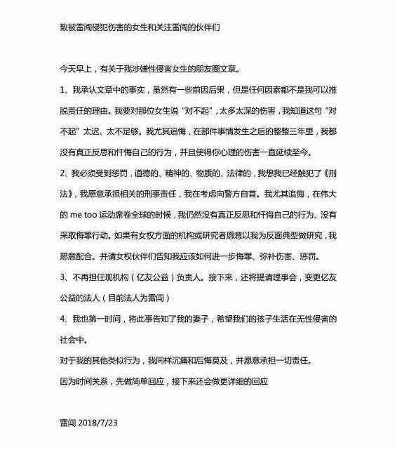
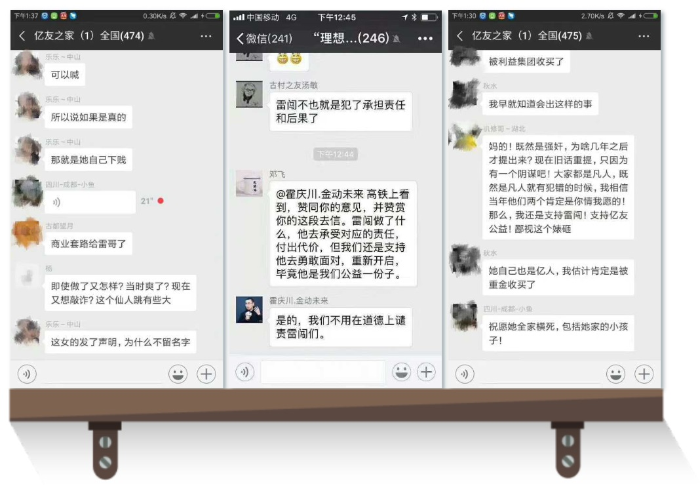
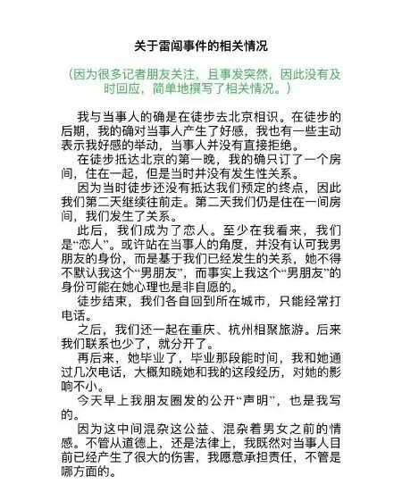
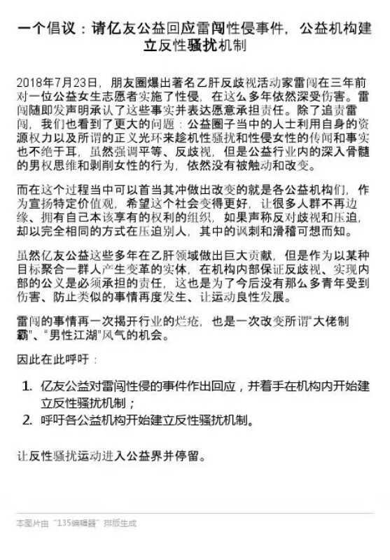

> **编者按：**近几天，公益圈中爆出了一系列性骚扰及性侵害事件，对于侵害者来说的陈年往事却是困扰了受害者们多年的梦魇。herstoria编辑部对雷闯事件截至7.23晚间的进展情况进行了一个简单综述，希望有助于读者们了解这场公益圈反性骚扰序曲的来龙去脉。
>
> **面对风暴，你只需走进风暴之中。**

 <!--more-->

7月23日凌晨，有女生实名爆料称自己在2015年7月29日参加亿友公益组织的“益行去北京”的徒步活动时遭到亿友创始人、著名公益人士雷闯的性侵（非自愿性关系）。

据作者称，当天，雷闯在未经她同意的情况下擅自主张开了大床房，为此，他解释道：**“做公益的人都很穷的，大家都是这样混着开房一起睡的”**，由于不想与雷闯翻脸，也不知道该如何拒绝他，她勉强接受了同睡一张床挤一晚的要求。

晚上，当她洗澡出来坐到床上，雷闯突然强行抱住她，她当时完全傻眼，用不是很强硬的口气请求他放开，不停地岔开话题，然而他还是没有停下，在最后迫不得已的情况下，她只能以缺乏安全措施为由进行拒绝，但作为老手的雷闯早就准备好了安全套。

最后的结果是，她以非常痛苦的方式，与雷闯发生了关系。在此之前，她没有任何性经验，那天晚上，她几乎是一个人忍受撕裂感和疼痛，清醒地度过了一夜。

事后，她从朋友口中得知，雷闯曾经以相似的手法对多名女实习生和志愿者实施性侵，为了防止出现更多的受害者，她决定实名举报。

此消息一出，整个公益圈哗然。

很多人对此感到震惊和崩溃，他们无法接受的是，性骚扰和性侵的施害者竟然是公益行业的知名人士；声称反对歧视和压迫的公益人士却以相同的方式歧视女性和制造不平等，ta们对公益人士的双标，公益行业的男权氛围以及性别不平等程度让他们感到震惊。

7月23日中午，雷闯在朋友圈发布声明，承认爆料文章的性侵指控，**“虽然有一些前因后果，但是任何因素都不是我可以推托责任的理由。”**并考虑向警方自首，承担相关的刑事责任，同时辞去其所创公益平台“亿友公益”负责人职务，变更亿友公益的法人代表。

> 雷闯的第一次回复

不少人对他很快就认错的诚恳态度表示赞赏，并建议他尽快去自首。与之同时，雷闯所在的亿友公益群里出现大量针对当事女生的荡妇羞辱、阴谋论揣测以及咒骂的言论：

*“即使做了又怎样？**当时爽了，现在又想敲诈？**这个仙人跳有点大”*

*“她自己也是亿人，**估计她被重金收买了**”*

*“如果不想做，可以喊，如果是真的，那就是**她自己下贱**”*

*“祝她全家横死，包括她家的小孩子！”*

*“妈的！既然是强奸，为何现在才提出来？现在旧话重提，只因为有一个阴谋吧！大家都是凡人，**既然是凡人就有犯错的时候，当年他们两个肯定是你情我愿的！**那么我还是支持雷闯！支持亿友公益，鄙视这个婊砸”。*

> 亿友公益群里群员的评论
>

对于雷闯的第一篇声明，举报人因此回应称：“雷闯的回应非常雷闯，就是什么时候先确保自己是个好人，毕竟好人也会犯错，不能逼他不犯错。下一篇就是，这位同学是怎么和我谈恋爱的。她也不是什么正经人……”

果不其然，下午，雷闯向主流媒体发表了与第一份声明截然不同的第二份声明，改口声称双方是恋人关系，“或许站在当事人的角度，并没有认可我的男朋友身份，而是基于我们已经发生的关系，她不得不默认我这个“男朋友””。

> 雷闯第二次在面对媒体时的回应已经改了口风
>

雷闯前后不一致的两份声明以及亿友公益群里的相关言论进一步点燃了众人的怒火。当事人据此发表以下声明对雷闯表示强烈反对：

> 我今天自述被雷闯性侵事实。三年前的事件，对我个人生活的影响是深远的。我通过各种途径寻求自救，目前仍然在接受专业的帮助，在短期内无法应对众多媒体采访要求，因此在这里简单作一回应，请见谅。
>
> 我想媒体朋友都看到了雷闯在朋友圈和针对媒体的前后两份说明。请大家仔细比较这两份文本的区别，也许对你们逼近事实有所帮助。
>
> 一、**雷闯在第一份声明里说“承认文章中的事实”—也就是性侵，并表示“自己已经触犯了《刑法》”，并“正在考虑向警方自首”，那为何第二份声明里却只说“发生了关系”？**第一份说明针对的是社交媒体上的公益界友人，第二份则是针对主流媒体所面对的普通公众。为何对事实的陈述判若云泥，请诸位自行判断。
>
> 二、雷闯第二份声明提出我与他之间是“男女朋友关系”。事实上，当初徒步的伙伴（安娜、龙飞等）都可以证明，并不存在这种关系。**事实上，雷闯对外强调我是他“自己的妹妹”，对我则强调“这是我们之间的秘密”。**
>
> 三、我个人保留对雷闯相关言行进行法律追诉的权利，包括刑事侵害与民事诽谤的部分。
>
> 四、我说出此事初心是希望他停止伤害其他人的行为，也希望探讨反性骚扰／侵害的解决办法。
>

23日下午 ，肖美丽发表文章《[雷闯强奸案——作为也和雷闯一起徒步过的女生，我也讲讲吧](https://link.zhihu.com/?target=https%3A//mp.weixin.qq.com/s%3F__biz%3DMjM5MDk5ODQ4Mw%3D%3D%26mid%3D2650724840%26idx%3D1%26sn%3Db8d0d0b50c6409e407050948984f9421%26scene%3D21%23wechat_redirect)》爆料称自己曾在2013年的徒步活动中遭到雷闯的性别歧视，并希望更多的当事人说出自己的遭遇，可以推动公益界反性骚扰机制的建立。

随后，另一名当事人在《[雷闯也套路了我—2015年一起徒步另一女生自述](https://link.zhihu.com/?target=https%3A//mp.weixin.qq.com/s%3F__biz%3DMzI0ODU2Mjc1OQ%3D%3D%26mid%3D2247484281%26idx%3D2%26sn%3Dbafae533ace2115341e7e8eb5f822049%26scene%3D21%23wechat_redirect)》匿名爆料称雷闯在2015年徒步期间在未经她本人同意的情况下开大床房与她同住。

有人因此倡议请益友公益回应雷闯性侵事件，并号召公益机构建立起反性骚扰机制。

**他们认为公益机构应当承担起反歧视、实现内部公义的责任，防止类似的事情再度发生，让公益运动得以良性发展。雷闯事件再一次揭开了公益行业的烂疮，同时也是一次改变公益行业内“大佬制霸”、“男性江湖”风气的机会。因此他们呼吁让反性骚扰运动进入公益圈并停留。**

> 针对公益圈的倡议书

近年来，随着欧美#MeToo反性骚扰运动声势渐涨，中国大陆也随之爆发激烈的反性骚扰活动，中国高校性骚扰事件接连不断地被曝光出来，引发公众广泛关注。如今，随着公益圈性骚扰事件不断被曝光出来，这一股反性骚扰风气终于燃烧到了公益圈。根据联合国的统计，全球有近35%的女性曾遭遇过身体暴力或性暴力，而女性占据半数以上的公益行业同样无法例外。**公益行业本身具有行业特殊性，公益行业旨在谋求社会福祉、解决社会问题以及实现社会美好和多元化，然而如今公益从业者在对外宣扬正义原则和平等价值的同时，自己却在亲手制造压迫和歧视。**指得一提的是，目前被曝光出来的性侵事件只是其中的冰山一角，还有更多正在遭受性骚扰痛苦的女性没有站出来发声和维权。

性骚扰并不仅仅是个体的问题，一个良好的社会必然不是一个强奸和性骚扰横行的社会。希望我们都能够大家都重视性骚扰和性教育，性别平等可以让我们都受益。

反性骚扰，人人有责。