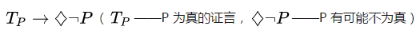
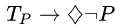

自7月23日女生桦桦发公开信举报“亿友公益”负责人雷闯三年前在反歧视徒步活动中对其实施性侵以来，米兔的燎原之火已经烧到了公知圈、媒体圈、佛教圈甚至有向商界发展的趋势，借由米兔浪潮，越来越多性骚扰事件不断被揭露出来，人们逐渐意识到性骚扰问题的普遍性和严重性，引发人们对当下性骚扰问题和社会环境进行思考。

<!--more-->

与此同时，针对米兔的质疑声音也随之而起，7月28日，清华大学政治学系副教授刘瑜评论米兔的文章《关于Metoo》在微信朋友圈广为流传。该文质疑“米兔”运动在中国发展过度，认为“诉诸网络大鸣大放”不如“诉诸法律”，并提出米兔这种网络申诉的途径有可能造成冤假错案。一时之间，驳斥和支持刘瑜的声音充斥于网络。

根据「郭力尼安」(2018)的文章的归纳［1］，迄今针对「**米兔有可能误伤无辜**」的反驳有以下三种：（1）**误伤绝少发生**；（2）**为了鼓励女性发声，应该相信她们**；（3）男性本身处于优势地位，也有话语权。即便真的误伤，当事人也可以通过自己发声获得澄清，**误伤的代价很小**。

但我认为，上述反驳都远不够充分。

在面对「证言有可能是诬告，不应该理所当然地相信」的反驳时**，将关注点放在是『诬告的可能性有多大』或者『应该如何权衡利弊』上时，其实就已经受到误导了。**

事实上，面对性侵害的证言时，首先怀疑『此证言是不是诬告』本身就已是对从属群体证言信誉的蔑视，是**与宰制群体的过分共情，是父权****（Patriarchy）的傲慢**，其中蕴含着明显的倾向性，相比于弱势的受害群体，怀疑性侵害证言者更倾向于强势的施害群体。

####  **缺省状态就是相信证言**

首先，我们先来做两个思想实验：

（1）假如我迷路了，我问路人地铁站怎么走，路人告诉我在前面路口左转，那么我就有理由相信地铁站在前面路口的左边，除非我知道地铁站真的不在前面路口的左边，或者我知道路人自己也不认识路。

（2）假如小果知道自己今天早上吃了油条，且她把这件事告诉了小莫，那么小莫就有理由小果今天早上吃了油条，除非小莫知道小果今天早上真的没吃油条，或者小莫知道小果有什么特殊的理由不说实话。

易言之，**证言一般都能为我们相信某事为事实提供证成**。

 纽约市立大学研究生院已故的 Jonathan Adler 教授 (2017) 称此为「**证言的缺省规则**」(Default Rule for Testimony)：

如果说话人 S 向听话人 H 声明 P，那么在一般情况下，H 接受（相信）S 的声明是正确的，除非 H 有特殊的理由反对。

同理，如果一个人 S 作出了其受到了性侵害的证言，另一个人 H 就应该相信 S 受到了性侵害，除非 M 有特殊的理由认为 S 没有受到性侵害。

值得一提的是，**证言的缺省规指的是“相信是正确的”，这是一种规范性表达，也就是在知识论意义上应该被相信**。

但是质疑米兔一方的意思是，这其实是值得怀疑的。他们认为，S 有可能说的不是实话，这样 H 就不能相信「S 受到了性侵害」。

也就是说从「S 受到了性侵害的证言」可以推出「S 有可能没有受到性侵害」。形式化如下：

对此，林垚老师 (2018) 的反驳是 S 不说实话的可能性非常小——「**至少到现在为止，me too运动的“命中率”高得惊人，“误伤率”却几近于零。**」

钱居华老师 (2018) 则引用文献指出，「绝大多数性侵指控都是完全真实的。九成以上的指控者确实亲身遭遇了性侵，而**不实的性侵指控大约占所有指控的4%-6%。**」

可是上述反驳不足以回应反对方的质疑：既然真的存在这种可能性（即使微小），就可能对某群体造成伤害的潜在风险，那么**米兔相较于更加「客观、公正、中立」的司法审判自然是欠佳的**。刘瑜老师 (2018) 写道：

"*可能有人会说，反正他 10 个罪名都成立了，管它第 11 个罪名对不对呢？不，法治原则要求我们严肃对待每一个罪名。越是千夫所指者，越需要程序正义，而大鸣大放大字报的斗争模式，不可能保障这种程序正义。*”

支持米兔一方的回应则是，**接受这种风险是一种政治取舍**。北大飞老师 (2018) 指出，很多人其实并不那么在乎微小的风险，「如果你担心metoo冤假错案，那你支持死刑吗？如果不能斩钉截铁的反对死刑，那就没必要讨论下去。」

孙金昱老师 (2018) 便认可「这些回应是充分的」，而且认为是否接受诬告的风险「**在于平衡我们想要的不同价值**」。

那么我们完全可以想象质疑米兔一方的回击：**为什么要这样取舍？是不是最终变成了屁股决定脑袋？**例如，郭力尼安老师 (2018) 就抨击道，「一个男人声誉受损，[一个女人] 不用付出任何代价，她当然愿意『付出』了。」（**根据性别来站队**）

#### **证言不正义与 Himpathy**

迄今为止，支持米兔一方的思路都是**否认/减小 [S没有受到性侵害的可能性]及其后果的严重性**。

我认为这是死胡同，我想要做的是直接指出 

（从「**S 受到了性侵害的证言**」可以推出「**S 有可能没有受到性侵害**」）这一推论本身就是**偏见性**的。

荒堂老师 (2018) 引述米兰达·弗里克的工作，为米兔讨论引进了「**认识论不正义**」(Epistemic Injustice) 的概念。

本文所关注的是其中的「**证言不正义**」(Testimonial Injustice)——当别人出于诸如你在某**群体中的成员身份**等理由而怀疑你的证言是否属实时，你便遭遇了证言不正义。例如，一位女性的证言就可能仅仅因为是**女性作出的证言**而遭到更强烈怀疑。

**证言为我们提供了相信一件事的证成，是我们获得知识的重要途径**。即使我不知道地铁站是不是在前面路口的左边，路人的证言使我能够正当地相信地铁站就是在前面路口的左边；即使我不知道恋人明天是不是要和朋友聚会，恋人的证言使我能够正当地相信恋人明天是要和朋友聚会；即使我没有亲眼见过地球是不是围着太阳转的，科学家的证言使我能正当地相信地球真是围着太阳转的。

**面对证言，我们的缺省规则便是相信它。**质疑米兔证人的「指控都应该被理所当然地相信吗」则是对缺省规则的偏离。潜台词是，**米兔适用的是特殊规则**。因为米兔的证人是要指控性侵害，所以其证言就是值得怀疑的——即使举不出什么具体实锤的理由证明某证人 S 的证言「S 被 M 性侵了」为假，此证言依然是值得怀疑。

在『是否相信米兔参与者证言』的问题上提出

实质上就是**对米兔证人信誉的贬损**。当**一个人向你声明自己受到了性侵害，你先担心的却是这个人是不是在诬告**，这已经是极为荒堂的事情了。

想一想吧：你向别人问路，别人告诉了你怎么走以后，你倒担心起别人是不是在骗你来；恋人告诉你明天要和朋友聚会，你却先担心是不是被戴了绿帽子；科学家告诉你地球是围着太阳转的，你反而怀疑科学家是不是别有所图。

在我看来，宋石男老师 (2018) 富有洞见地意识到了，「**担心网络诬告成风，是基于对女性的恐惧与偏见，认为女性多有以性作为讹诈资本的倾向**」。

这种担心是本身便是**性别化**的和**非中立**的。用康奈尔大学哲学系的 Kate Manne 教授造的词来说便是 **himpathy**，即**与男性的过分共情**，over-empathetic for him。

Manne 使用 himpathy 来解释为什么米兔是从哈维·温斯坦事件而不是更早的丑闻开始爆发的：

*我们所谈论的很多这些男性都是和我们有情感联系的男性——通过阅读他们，通过在电视上看他们……但是哈维·温斯坦的事情里，站出来的女性同样也是和我们有 [情感] 联系的女性。而所有通常都会上演的**责备受害者的机制**——像是，「呃，也许她只是恼火事业不顺」或者「她在博关注」——都不适用了。格温妮丝·帕特洛不需要关注。安吉丽娜·朱莉的生活在她发声之前都很好。(The Guardian 2018)*

引入

  

却恰恰为「通常都会上演的责备受害者的机制」卷土重来制造了温床。如果接受它，那么任何一位米兔证人站出来为自己受到性侵作证时，其证言都会遭到怀疑，而我们已经说过这种怀疑是要**贬低证言的可信度**——「她只是想上位」或「她可能是为了报复」。

而 himpathy 还向我们揭示，**贬低证言的可信度是出于明确的原因（对宰制群体的过分共情），且承担着明确的作用（袒护宰制群体的成员）**。首先向汉语世界引介 himpathy 概念的刘满新老师 (2018) 写道：

*厌女者做出伤害女性的行为后，舆论上很快就会出现对伤害者大量的同情：他一时心理障碍，爱得太深，这位教授只是想现实地帮助女学生……舆论上的“himpathy”常常比对受害者的同情还要强。*

类似地，我们也看到「他好可怜，明明她当时也没说什么，现在却被倒打一耙」等等与宰制群体成员的过分共情。例如，鄢烈山老师 (2018) 便这样评论蒋方舟老师：

*蒋方舟可不是小女生，她的名气比章文大得多。访日归来的散伙饭局自然都是熟人。她当时只要认真拒绝，章文怎么可能不断摸她大腿，并后续纠缠她？章文绝不是韦小宝，这个“公知”人前尤其是那么多熟人前，他是要顾点脸面的。蒋方舟当时不拒绝不制止，现在在网络上毁人清誉，这个女人真的很邪恶！你们却认同她，以为她很勇敢甚至纯洁！*

这种与宰制群体成员的过分共情是极为不恰当的。对于此，我大概无法比林垚老师 (2018) 说得更好了：

**仅仅强调『误伤』对被指控性侵者的打击，而拒绝同样严肃地看待『纵容作恶』对实际性侵受害者的打击**，等于是将被指控者的权益天然地摆在指控者的权益前面；这本身恐怕就反映了**男权社会的某种偏见**。

既然没有

是缺省状态，而引入它是对米兔证人信誉的贬损和对被控告者利益的袒护，那么反米兔一方在引入它的时候就已经一屁股坐到相当偏见性的立场上了——**相较于声援从属群体的成员，更在乎的是宰制群体中可能有成员被误伤。**

这真的是正义社会所应当接受的立场吗？

----

#### 相关引用

Adler, Jonathan. 2017. "Epistemological Problems of Testimony." The Stanford Encyclopedia of Philosophy (Winter 2017 Edition). https://plato.stanford.edu/archives/win2017/entries/testimony-episprob/

北大飞，2018，《metoo: 我们真的那么担心“冤假错案”？》。https://matters.news/forum/?post=5399bdbe-f684-4a81-a660-79a57b1bfe16

The Guardian. 2018. "From 'Himpathy' to Power Bottoms: Six Things We Learned at Sydney Writers' Festival." The Guardian, May 5, 2018. https://www.theguardian.com/books/2018/may/08/from-himpathy-to-power-bottoms-six-things-we-learned-at-sydney-writers-festival

郭力尼安，2018，《刘瑜的声音很宝贵，请不要轻易「打倒」她》。https://mp.weixin.qq.com/s/KuwTdpXFGzaHWnx5TD2C-Q

荒堂，2018，《米兔认识论》。https://www.douban.com/note/684706419/

林垚，2018，《me too运动会制造冤假错案吗？》。https://matters.news/forum/?post=787abbb0-12f9-48f6-b63e-1e2bc4665707

刘满新，2018，《作为反制机制的厌女：Kate Manne论厌女的逻辑》。https://mp.weixin.qq.com/s/VfwFamt9hDPW0h9WJwYA8w

刘瑜，2018，《关于 metoo》。https://matters.news/forum/?post=16439143-1a75-497a-bad2-875d2fcd5d28

钱居华，2018，《#MeToo运动会误伤无辜吗？——再论性侵指控中的“舆论审判”问题》。https://matters.news/forum/?post=d36b2555-2b82-48ed-83a1-d624bf7f907d

孙金昱，2018，《米兔中的集体行动正当性、个体责任与诬告 》。https://weibo.com/1527379661/Gs0k83mH5

鄢烈山，2018，微博。http://news.ifeng.com/a/20180726/59427781_0.shtml