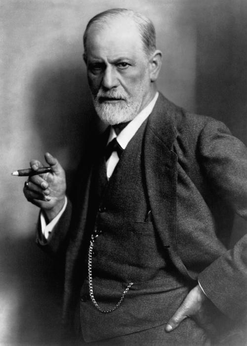

最近，国产慰安妇题材电影《大寒》重新上映。影片独特而深刻的女权主义视角使得它超越了同类型影片的民族主义窠臼，获得了历史反思的新高度，同时影片的票房不甚乐观，所以，笔者决定写下这篇评论，分享自己关于影片的的三个不太成熟的想法，一方面是鼓励大家去电影院购票支持，另一方面是看了电影后确实有诸多感想，渴望与大家分享和讨论。

<!--more-->

## （1）作为心理创伤的菲勒斯崇拜

作为一部**女权主义**电影，影片具有明显的反父权元素，这体现在它对父权制的核心——**菲勒斯崇拜**的揭露和批判之上。下面笔者将为大家简单介绍菲勒斯崇拜和相关的心理学知识。

所谓的菲勒斯（phallus），就是**阴茎**，它在父权制中是被崇拜的，被认为是男性的优越性、特权以及生殖力量的象征。**父权制的菲勒斯崇拜其实是对父权对女性生育能力的歇斯底里的嫉妒的一种掩盖***，*它实际上是一种心理创伤后的形成的防御机制，无法面对现实从而不得不编织出一套自我崇拜的文化来实现减轻焦虑的效果，而其结果就是父权制（Patriarchy）。

> 西格蒙德·弗洛伊德（Sigmund Freud，1856年5月6日—1939年9月23日），奥地利精神病医师、心理学家、精神分析学派创始人。

关于菲勒斯的研究，十九世纪的心理学家西格蒙德·弗洛伊德(Sigmund Freud)就是此道的集大成者，他化用俄狄浦斯的故事编织出一个男童在父亲的菲勒斯的规训之下由压抑的**被动**接受到**主动**遵从父权规范的成长道路，并把女性视为“缺少了菲勒斯的人”，“道德思维水平低下”（只有“妇人之仁”，不能理解真正的道德法则、不能进行理性的自我立法），诉诸菲勒斯的缺失，因而缺少了阉割恐惧因而是欠缺规训的（因而被认为不懂得规范性地思考），并且把当时常见的女性的“神经症”归因为**对菲勒斯的妒忌**（因为她们自己没有菲勒斯）。

但事实上，没有任何理由把所谓把女性的那种**重视关怀的伦理学**视为次等（编者注：吉利根的关怀伦理学理论就是探讨这个方面的），在一种真正的神经症之上建构一套“疗法”而未曾反思那个本来就在生产着神经症的社会结构本身也不失为一种虚妄。

影片并未在理论上探讨菲勒斯崇拜，而是**通过日军军官健二和他的手下的凶恶、疯狂和脆弱来表现菲勒斯崇拜的作为一种创伤的本质**。作为占领桃源村的部队领导人的健二表面上是极有权力的，因此他轻易就能搜罗和占有全村的年轻女性，但是他却难以在寻获性资源和单纯的强奸中获得真正的满足，于是他不得不借助外求的快感，比如在张宝生（崔大妮的丈夫）濒死的情况下在起面前让部下对之实施强奸；又比如，在收到投降诏书那日，仍未失去权力的他，竟然能轻易地被仍是他的俘虏的崔大妮侮辱，之后竟然需要借助集体强奸她来泄愤以及维持自己仍然走在大东亚共荣圈的伟大道路上的一丝幻想。

这个疯狂而脆弱得令人怜悯的形象很难让人不相信，**菲勒斯崇拜带来的狂傲其实根本就是一种创伤后的防御机制，一种神经症，而它的治疗如同大多数治疗一样，需要我们勇敢地面对现实，反思在当前社会结构之下女性受压迫的境况，了解自己的焦虑与苦难的根源，在疗愈与成长的方向上迈出重要一步。**

## （2）张双兵的人道主义

作为电影旁白和最主要的男性角色张双兵被处理为一个近乎**义人**的存在，他不是出于名利或任何与父权制有关的原因，比如民族情怀、家国情怀，才去帮助那些曾经被侵华日军性侵的老人。他那份十几年如一日的坚持是出于人道主义的追求。

这种人道主义绝不是作为西方国家的政治正确/普世价值的那种伦理，那是一种（自命）**受害者的伦理**，也就是保守主义的、拒绝革命的，跟动物保护法规相似（这并不意味着它的原则不值得遵守）。如果按照西方国家那种人道主义来理解，那么张双兵坚持十多年的事业完全是错误的，因为他不断地揭开老人们的心里的那块「冰疙瘩」，为了获取用于诉讼的事实细节，客观上对她带来一些“不必要”的痛苦。

> 张双兵

但事实上，在征得老人同意的基础上，他帮助老人们真正面对心中被埋藏了许多年的创伤，那个「冰疙瘩」，通过诉讼来讨回公道，以合乎正义的方式来实现对不义的复仇——**真正的疗愈，绝不是余生安置在安稳的环境了尽力忘记过去、深埋创伤，死心塌地，不反抗地承认自己的受害者（猎物）的身份，夹着尾巴苟活下去，而是痛快而凶狠地报复当初那个凶徒，向世界宣告自己是作为自立自主的人而存活于世上，自己本来就具有无可置疑的主体性**，而不管那个时候自己已经是九十多岁，这就是不愿意把自己当做「必死的存在」，仍然要追求「活好」而非「死好」的生活方式，仍然要追求善，而不是非恶。

影片中的张双兵就是这么一个革命的人道主义主义者，同时也是一位真正的男性女权主义者，而非女权导师。

在大约一小时三十八分时的旁白中，我们明确地看到，他对老人绝非是居高临下的，绝非是固执地带着既定的“先进观念”来领导一场自以为是的“解放”，而是深切地进入到老人的精神世界中，深入到她简单而又卑微的乡土情怀中去——**她只是希望延续自己一直以来的也已经深入到精神的最深处的「道」来继续生活，继续守护自己的生活信念。**

这种选择也许客观上不利于整体的女性解放，但对个人选择的尊重、对生存境况的深刻体察和共情却是无比珍贵的，更何况老人的这种生活态度有着它生机勃勃而充满力量的一面，女性的爱与力量并未因久置于父权制的囚笼而消失，反之，它充溢到传统乡土制度的每个缝隙里，把它重新塑造为一种特殊的女性生活方式，就某些方面而言并不比自由主义所设想的生活要糟糕。

而作为对比的，笔者发现影片中也有另一位潜在的女权主义者，就是那位日军士兵**浅野**。他向崔大妮展示与姐姐的合影，这说明他跟姐姐有着及其深厚的亲情，想必在那背后是长久的共同生活经验的积淀，这种积淀让他有着**对女性处境更深层次的理解**，而本性善良的他在目睹自己的战友跟上司的暴行后更加对外貌与自己的姐姐相像的崔大妮感到亲切和同情，于是便时常安慰她，为她画像。

但这个可怜人的结局是悲剧的，他未能摆脱父权制的强制力，最后在上司（健二）的命令下对崔大妮实施了强奸，尽管在此过程中他特意用一块布盖住了她的脸。而在影片结尾，已经须发皆白的他带上了装裱好的当年那副画像静默地跪倒在崔大妮老人家的门外，总算是完成了一个被**军国主义**裹挟的小人物的自我救赎。

## （3）家国情怀

家国情怀几乎是所有反映抗日战争时期的影片所共有的主题之一，本片也不例外。而影片之所以是女权主义的，其中一个原因也在于它对家国情怀的特殊理解。伴随着韩宝生的退场，父权制"格式"的家国情怀，即民族主义已经隐去，等到韩宝生遗骨的再次出现的时候，这种情怀已经悄然而又顺理成章地褪去了父权制的痕迹。

正如笔者在本文第二节所分析的那样，崔大妮的家国情怀不是**国族**的，而是**乡土**的、“桃源村”的；不是父权制的，是**女性主义**的，不是「非我族类，其心必异」的种族仇恨，是**为了唤回公义和善的人道主义的复仇**。

> 大妮

实际上，我说这种转变是顺理成章的还在于父权制已经在遗骨出现之前的情节里被全面批判。通过村民对受害女性的歧视以及对各种残忍的堕胎技术的展示，导演明确地对家国情怀中常见的父权制成分进行了彻底的**扬弃**。（「扬弃」的基本含义就是革命性的改造）

这种扬弃的核心是（借崔大妮来进行的）对英烈韩宝生的重新理解。我们知道，韩宝生英勇反抗的重要动机是父权制的，既是要维护自己作为丈夫的地位，也是为了韩家血脉的存续。但是到了影片最后，我们发现，村民们以乡族荣誉（即父权象征的再生产工具）来理解韩宝生。

而与之形成对比的是崔大妮对他的理解，在她眼中，他不是父权制的维护者，而是**家园**（而非家族，也不止于家庭）的守护者，是她过去的生活里的亲爱的伴侣。在某种意义上来说，这几乎可以认为某种**母系社会**的精神的复现。

## （4）最后多说几句

笔者极力推荐大家亲自去观看这部电影，有条件的话尽量前往电影院购票观看。第一个理由是鼓励我国的电影人更多地拍摄具有反思性和批判性的作品，这种反思历史的电影在这个**娱乐至上**的时代毫无疑问地遭到了冷遇，实际上影片今年二月就已经上映过一次，只收获**一百多万票房**，惨淡至极。第二个理由是，笔者相信这部电影不应该只得上述两点解读，期望各位读者可以找到属于自己的看法，笔者很欢迎大家留言分享。