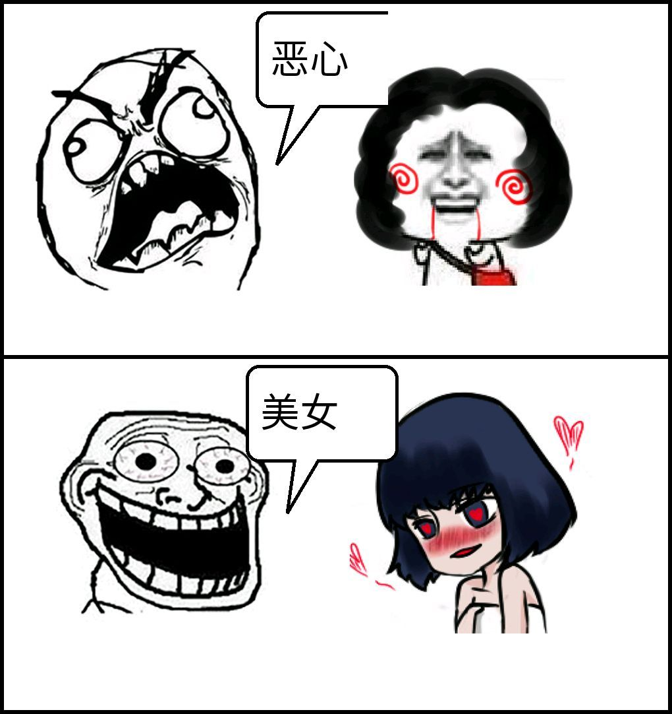

> 编者按：
>
> 关于女性“内在美”与“外在美”的讨论热度长盛不衰，在这二者之辩中可能我们会在道义上选择“内在美”但内心仍有一定的犹疑：女性真的可以拒绝“男才女貌”的俗套格局吗？当女性在追求“女才/财”的同时真的能无视“女貌”的诱惑吗？
>
> 今天我们herstoria的AI编辑陆贽(是的我们是个有AI的编辑部)会就这个问题展开探讨，也欢迎读者朋友们在评论区谈谈你们的看法！
>

<!--more-->

> 左为知乎大V人设是剑桥美女学霸的王诺诺，右为整容前后共花费逾400万的模特吴晓辰

其中，吴晓辰认为现在的社会是一个看脸的世界，她坦然接受“外貌至上”的价值观念，花了四百万去整容，高度注重自己的外貌体态。

王诺诺则表示不认同这种极端推崇外在美的价值观和生活方式，认为追求外表“可悲”，“虚幻”，而是应该追求内在美，同时排斥别人过度关注自己的外貌。

**当代女性拥有普遍的外貌焦虑，这种焦虑源自于“外貌至上”的审美秩序和社会文化，其中蕴含的权力关系并不合理。**

暴走漫画之类的自媒体无形中也扩大了男性对于女性颜值重视程度的情况，女性也深陷这种压力漩涡被迫投入颜值生产

吴晓辰直接默认了这一套权力关系，将相应的逻辑预设内化成为自身观念，她对这一套深信不疑，镜头下的她看起来从容自若，然而这份从容下却隐藏着严重的外貌焦虑，正是这种焦虑驱使她不断去整容，尽可能地追求完美的面孔，将“外貌至上”推行到极致。

与她一样，很多女性直接默认现有审美秩序和价值观念，并将其内化成自我观念，通过化妆、整容和健身等方式践行这一套价值观，尽可能地提升自己的外在美，从而变得“与众不同”，她们从没有想过其中是否有不合理之处。

王诺诺多少意识到了其中的不合理之处，却无从反抗外貌焦虑，反而陷入自相矛盾和纠结当中，一方面，她事实享受着外貌红利，在意自己的外貌，比如她曾经参加过两次选美比赛，比如在知乎营造“剑桥美女学霸”人设，比如在节目拍摄前，担心自己的拍摄效果不好，直言“因为我这边脸很大”；另一方面，她主张内在价值高于外在，认为女性不应当过于追求外在美，而是应该追求内在价值，不喜欢整容。

> 《不可说》视频截图

可以说她们代表了当代女性面对“外貌至上”的社会文化时的两种典型态度。

如同吴晓辰所言，我们如今所在的社会是一个无比注重颜值和身材的消费社会。

在这个社会里，人们的生活重心逐渐从工作领域转移到消费领域，符号消费变得特别重要，相比于使用价值，人们更为看重物品的交换价值。重要的不是满足基本需求的实用性，而是商品所蕴含的可供交换的符号，使用价值和交换价值逐渐模糊化。

鲍德里亚认为，消费社会里的物品的效用价值并非基于其自身的有用性，而是某种特定社会符号编码的结果。物品的使用价值不过是一种对物操持的保证，更根本的是基于物品建构的符号的交换价值。

> 鲍德里亚

如果我们只是满足于生存必需的基本需求，那么所消耗的商品数量极少，导致整体消费不足，生产力过剩。为了消耗多余的生产力，需要通过广告、软文等种种手段让人们产生更多的消费欲望，促进消费循环，从而消耗更多的生产力，进而维持整个资本主义体系的运转。

其中的重要区别在于，我们对于商品的消费需求是否是自愿、真实和主动的，而非虚假的和被胁迫的。而在消费社会里，只满足于基本需求消费的人会被当作有缺陷的“新穷人”（鲍曼的概念），会被排斥和边缘化，被人们看作鄙视链低生位的“Low B”。

正是文化工业（法兰克福学派概念）促进了消费转变的过程，文化工业使消费社会的文化品消费从满足需求而产生消费标准转变为直接强迫我们向文化品消费标准靠拢，甚至是某种符号化的生活方式强迫我们的文化导向。

原本应该是从生活中诞生消费需求的过程（为满足生活必需而消费），如今演变成了直接通过制造消费需求来重塑某种生活方式（直接制造消费欲望），特定的生活状态被赋予个人意义和目标来追求，比如各类常见的“消费了XX商品你就可以成为独立而精致的新时代女性”广告文案。

消费主义不断制造出种种需求，让我们沉浸于消费带来的兴奋和满足之中，被文化工业批量制造的消费需求所驱动，不断追逐各种消费品。我们通过消费获取赋予商品交换价值的消费符号，利用消费符号建构自我身份和个性，塑造出某种既定的生活方式。

**身体是现代人自我认同的核心，身体的外形、消费价值和审美价值是人们普遍关注的重心。随着消费主义的兴起，身体的审美价值也得到高度重视，身体成为承载消费主义欲望的重要载体。身体的实用性退场，取而代之的是身体的审美特性，身体的观赏价值和消费价值被突出强调。**

个人的身体状态成为被消费的话题，并参与到审美秩序的建构过程中，与身体相关的消费话语在公共场域不断生产并广泛传播。

作为消费品的身体，它的外观和审美价值，而非生产价值，被赋予越来越重要的意义。越是符合人们审美需求的身体，其消费价值就越大。理想的身体形象会被符号化成为一种更高的社会身份、社会地位与生活方式的象征，“身材即阶级”。

**因此，消费主义提倡一种“身体规划”，即通过对身体的塑造、维护与保养等方式提高身体的符号价值与交换价值。**消费主义对身体价值的极端推崇导致人们对年轻的无限渴望以及对身体的老化持极端恐惧和拒绝，化妆、减肥、健身和美容等美体规划和实践变得流行。为了保持身体的完美外形和观赏价值，化妆品、美容整形和健身等与身体消费高度有关的“美体工业”顺势而生。

> 整容作为一种新型身体规划已经在实用性上深入人心

其中，消费社会的身体消费存在着明显的性别倾向，相比于男性，女性更加热衷于各种美体实践，尽可能地提升自己的身体价值，存在着更为普遍的外貌焦虑。

在日常生活中，女性需要担心自己的体重是不是增加了，小肚子增多了，因为吃上火食物长了几颗痘痘不好看了，颈部出现了细纹，每天担心衰老的降临，发质不够好以及自己腿型不够好等等。护肤品、彩妆以及服装搭配都是高深的“学问”，有着无比繁复的内容，需要女性投入大量时间精力去了解。

这一切，与男权不无关系。

**男权（不等于男人）本身是一整套系统，包括制度、文化和意识形态，是社会结构的一部分，它有着自己的话语逻辑，通过各种商家、媒体以及娱乐圈等形式对女性进行压迫、歧视和洗脑。**

当前社会对男女外貌要求不同，对女性的外貌要求远比男性高，这其中蕴含着男权对女性的压迫和束缚，女性在男权结构下更多的是提供身体价值，而非男性被看重的社会价值，男性的价值通过钱、权和社会地位等来衡量的，女性的价值则更多的是通过生育与身体的审美观赏价值来体现的。

女性将男权观念无意识内化成为自身观念，倾向于维护男权制度和观念，遵守基于男女二分的性别角色准则，高度重视自己的身体价值，而非社会价值。

消费主义通过公共场域的话语机制对女性进行编码，完成对女性的物化，女性因此被客体化成具有消费价值的商品，无处不在的男性凝视和物化让女性产生普遍的外貌焦虑。

<img class="img-fluid" src="../images/外貌/timg-7.jpeg)

有人说爱美之心人皆有之，女性追求美无可厚非，怎么扯到男权了？的确，化妆、选美与整容确实有女性主动追求美的成份，但是如果只是为了自我取悦而美，那为何女性在这些方面比男性花费更多的时间和精力？是因为女性不化妆就比男性丑吗？明显不是。因此爱美之心本身或许与男权无关，但这种对男女的双重标准却是男权的体现。

由于受到男权的规训，很多女性直接接受和默认了男权审美标准，男权的高级之处在于让作为压迫者的女性不知不觉、心甘情愿地被压迫，甚至还依赖与维护着这个体系，看起来是“女性自己自愿选择了这些审美”，反而是意识到其中的不合理并付诸行动的反抗者显得是格格不入的“异类”。

有人说，我们干嘛要批判这一套制度，高颜值的人在这一套体系同样拥有权力，谁叫你投胎不好，长得丑的人没权力不受关注也是活该，回去怪爹妈或者是整容吧。

然而拥有高颜值的女性未必拥有权力，因为在这一套审美秩序中，女性的相貌已经被高度符号化，成为评判系统的符号， 变成了权力等价物。女性的颜值在系统中是被当成展示的客体进行消费，系统对她们的异化导致主体性不断折损，女性普遍的外貌焦虑即是异化的体现。

在消费社会里，女性看似拥有追求幸福和梦想的自由和权力，却难以逃脱男权文化和消费主义加载于女性身上的禁锢和羁绊。

既然这套系统存在那么多不合理的地方，那么我们又应该如何改变呢？

**首先，我们可以适当悬置这种外在评价机制，学会自我豁免消费媒介制造的焦虑话语**，从自己的真实需求出发，尊重自我需求，专注于自我体验和提升，而非被消费媒介制造的消费欲望所强迫，理性看待自己的外貌和身材，控制自己在身体消费方面的时间和精力投入；

**其次，尊重不同的审美欲求，与他人建立起互相友好的积极自由界限，反抗单一的审美霸权，促进审美秩序多元化生产**，而非对他人施加Bodyshaming（身材羞辱），利用话语霸权去审判他人，增加别人的外貌焦虑；

**另外，批判焦虑制造机制的性别倾向，破除男权和消费主义的意识形态神话，让更多的人从虚假的美梦中觉醒过来，并进行抵抗和斗争，促进话语变革和制度变革。**

当然，区分真实需求和虚假欲望以及反抗几乎无处不在的规训并不容易，焦虑是消费社会的常态，反抗者很可能会被当成“异类”而被排斥和边缘化。

然而反抗本身也是重新找回自信和自我赋权的过程，反抗的过程也是主体性回归的过程。一旦放弃抵抗，也就是放弃了清醒，意味着彻底失去打破黑暗屋子、实现解放的可能性。

**当然，从更为激进的左翼角度来看，要想彻底破除这种压迫，实现女性的解放，只有通过变革所有制以及发展新的生产关系，彻底推翻晚期资本主义和男权共生体才有可能实现。**