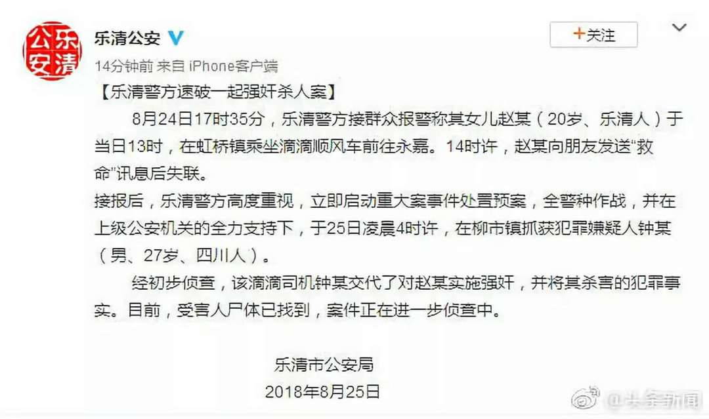

**作者**：[陆贽](https://www.zhihu.com/people/ru-shi-shuo-59)

**编辑**：[陆贽](https://www.zhihu.com/people/ru-shi-shuo-59)

<!--more-->

她忐忑地穿新买耐克鞋，赴自己的闺蜜的生日会，这本是个友情情深的美好故事。然而，最后这却成了一个恐怖故事。

继三个月前郑州顺风车司机杀害空姐事件之后，8月24日发生在乐清女孩身上的悲剧，让滴滴再次由于出现女性乘车安全问题站到了舆论的风口浪尖上。

事实上，类似事件去年就发生过。2017年5月14日，重庆永川顺风车司机周航利用风筝线和红布将30岁的甘女士勒死，案发后，周航被判处死缓，然而该案几乎没有任何相关报道。直到今年5月郑州顺风车司机杀人事件曝光后，女性乘车安全才引发全社会的广泛关注。

在过去四年中，经由媒体报道及有关部门处理过的滴滴司机性侵和性骚扰事件多达50起，所有受害者均为女性。其中有2起故意杀人案，有19起强奸案、9起强制猥亵案、5起行政处罚案件以及15起未立案的性骚扰事件。

值得一提的是，每次一出现女性受害事件曝光后，舆论焦点总是聚集在**女性如何自保**上（有人甚至因此谴责受害者不会自保）。然而，那些受害者真的不会自保吗？

在郑州案中，空姐李某防范意识很强，她把行程告诉家人、和好朋友假装打电话，但仍未逃过魔爪；在乐清案中，受害者是在光天化日之下乘车，并将行程告诉亲友，在察觉不对劲后迅速求救，依然难逃一劫。在有记录的50个案例中， 21起就发生在晚上，然而也有20起发生在早上六点到晚上六点，**白天未必就是安全的**。

女性自保固然重要，但一味强调自保可能会忽略很多问题。个体自我防护无法保证绝对安全，而且是以**让渡女性权利**为前提，极易导致谴责受害者的逻辑滑坡。在盛行荡妇羞辱的男权结构下，谴责女性的声音从来不曾缺场，谴责女性受害者本身就是女性受到男权压迫的体现。

更为重要的是，过多强调自保问题，不过是试图**将社会结构性问题转化为个体问题**，让人忽略平台的管理责任和公共部门监管问题，等于变相为滴滴平台和监管部门洗地。

在上次郑州空姐被害后，滴滴顺风车下线整改。自5月19日起，滴滴出行推出“史上力度最大的整改”——下线乘客的“所有个性化标签和评论功能”；“暂停接受22点-6点期间出发的订单”；在原有的“三证验证”基础上，“快车、专车、豪华车每天出车前司机必须进行人脸识别验证”，并设奖鼓励举报，且“顺风车每次接单前必须进行人脸识别”。

然而**人脸识别**等措施“只能防君子，不能防小人”，图谋不轨者依然可以绕过层层监管。即使在经过五月份的大幅整顿后，司机还是可以通过提前预约再换人的方式躲过审查。

增加人脸识别等审核措施之后，固然可以使犯罪成本提高，降低受害风险，使顺风车的安全性部分提升，但**这些措施注定无法杜绝安全风险，这是网约车行业本身特性决定的。**

相比于有牌照等准入门槛的出租车，**网约车本身准入门槛偏低**。专车、快车和顺风车，定价、服务水平、审核门槛和安全性的不同，不过也是滴滴公司为了占领市场的策略。说得刻薄点，不过是利用互联网高大上的外衣，将**黑车**重新包装成网约车服务而推向市场，**原有的安全风险并未因为其互联网化而有所降低。**

“硅谷传奇”已经离我们远去。很多人曾经寄希望于技术进步可以推动社会进步迭代，技术进步的确可以推动生产力的提升，并引发生产资料的迭代，但是它们并没有否定资本本身的逻辑，并不会带来太多社会结构的变革。

互联网技术只是成就少数资本家的财富神话，**资本增殖的过程往往是充满血腥和暴力。资本家的光鲜亮丽背后堆积着无数人的累累白骨**，互联网行业快速扩张的代价却是由整个社会来承担：隐私泄露、虚假信息与社会分裂，儿童上瘾，安全问题增加，环境污染加重……

近几年，通过收购和兼并同行公司，滴滴疯狂扩张，已经处于近乎垄断的地位。然而相应的监管责任并未及时跟上。

不少人在案发后建议滴滴**提高顺风车准入门槛，设立相应的准入制度，建立相应的行业培训机制**。滴滴公司事后多少也是以此为方向进行整改。

然而如此整改必然会使审核门槛提高，挡住众多最初被平台方便的审核而吸引的大量司机，推动他们去寻求替代平台，使顺风车平台的司机总数下降；同时还会导致运营成本提升，最终成本很有可能会反映在价格上，导致顺风车价格提升，让“顺风车”变成“快车”。

价格提高之后，原本就**价格敏感**的顺风车消费者（如果价格不敏感，这些消费者必然会使用服务水平更高和安全性更好的快车）很有可能会选择其它替代平台的服务，让滴滴顺风车失去原有的市场份额。

对于利益驱动的企业来说，这种情况是不被允许的。

可以说，**顺风车的市场份额和乘客安全之间存在着一定的冲突**。而对于盈利驱动的企业而言，前者是必须选择的，至于后者，尽可能保证不出事即可。资本首先关心的是自我增殖，而非做公益。如果因为公共安全事故接连不断地发生，滴滴公司是懒得花费大量资源去构建复杂和全面的监管体系来保障顾客乘车安全的。

据了解，滴滴目前已经把所有的客服岗位，包括审核车主信息真实性的审核员以及负责接听电话和打字咨询的客服，全部外包给和君纵达公司，**和君纵达**在招聘市场上用3000元的月薪雇了1500个中专生来负责上述工作，给滴滴节约了上亿的人工成本，资本的趋利性由此可见一斑。也就是说，**你我的生死，取决于月薪3000的滴滴外包客服**。

即使发生了多起人员死伤，只要还能获利，这些生命的代价对于资本来说不过是几个零碎的影响上市的不利好信息而已，这些女孩子灿烂的生命不是生命，只是通衢大道上不起眼的绊脚石。在这样令人狂热的经济环境的催逼下，人的价值被符号代替，**三倍赔偿在这个庞大市值的大型资本聚合体面前连个小小的零头都算不上。**

从数十年前开始，中国已经逐渐进入了资本的时代，有的问题不是单纯的管理体制的问题，背后聚集了层垒的矛盾。逐利固然赋予了**新自由主义**下人们对于自我解放的幻想，那么当背后的残酷浮上水面时，我们也不必故作惊讶，**这些都是为“礼物”标好的“价格”。**

除此之外，暴露在公众面前的是一个事实：**公共安全这种社会性问题，单靠私营公司滴滴无法彻底解决**。滴滴能做的只是**在安全和效率之间寻求最优解**，在保证不由于提高成本而失去市场的前提下尽量降低安全风险，接受公众和政府的监督，不断完善产品服务。从这个角度来看，顺风车的安全风险注定无法彻底消除，只能依靠公众、平台与公共部门的多方参与和监管去尽可能地降低风险。

可以预见的是，未来还可能有类似的事件被曝光出来，将滴滴再次送到聚光灯之下。作为一家网约车大公司，滴滴必须吸取相应的教训，亡羊补牢，不断完善自己的监管机制，承担起相应的社会责任。**仅仅依靠道歉和赔偿解决不了公共安全问题**，在乘车安全保障上，滴滴平台还有很长的路要走。