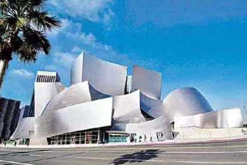
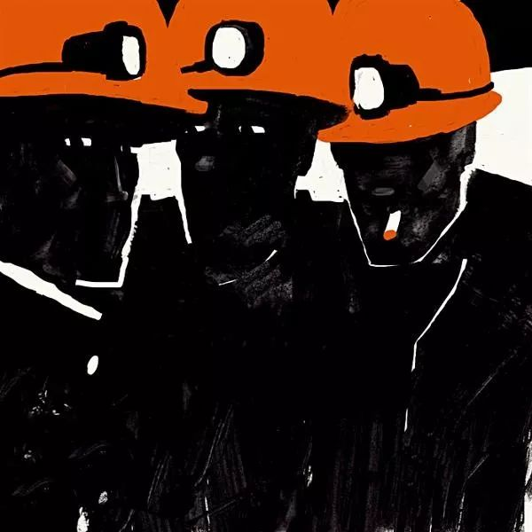
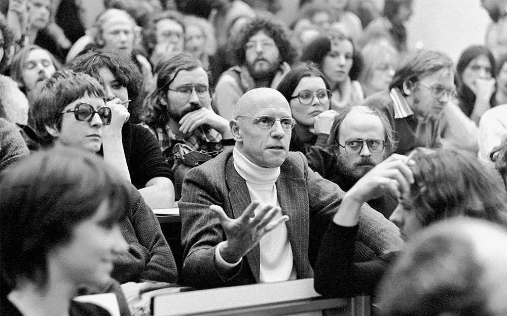
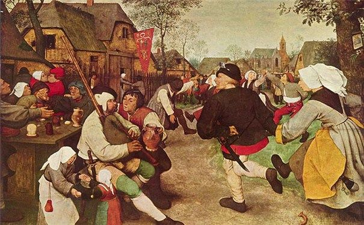
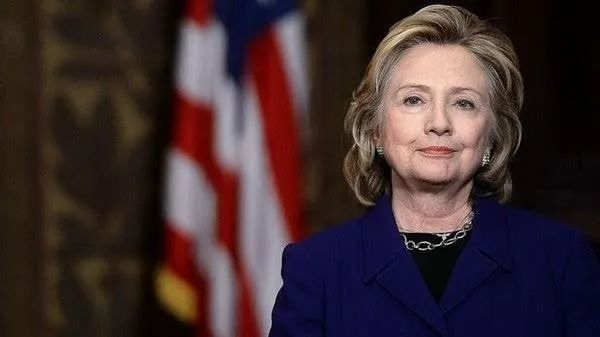

后现代哲学（比如拉康）对女权是如何影响的？

<!--more-->

单纯讨论“拉康”的影响意义其实不大，（更何况拉康对女权态度很奇怪，至少对他弟子Irigaray很奇怪，当然作为纯粹哲学对后人影响是有的），因为女性主义是**具体哲学**，不是纯粹哲学，其思想溯源往往是系统地受“某一个学派”的影响，而不是单纯的“一个人”，故而这里探讨以拉康（Jacques Lacan），福柯（Michel Foucault）为首的**后结构主义**学派的影响，更为妥帖一点。

后结构主义的建立，正好导致了女权运动的“**第三波浪潮**”（关于第三波女权，可适当参考 [“我是女权主义者，但……”：第三波女权主义](https://mp.weixin.qq.com/s?__biz=MzI4MjQ4NTkwOQ==&mid=2247484135&idx=1&sn=aeccd1808ce80d6df0d0c055aad839ba&scene=21#wechat_redirect)）。而第三波浪潮的主要事件在于三个：

1，**新女权主义的返潮**。
2，**80年代激进女权主义的没落。**
3，**后现代女权的建立**。

而拉康为代表的后结构主义，对于第三点的影响最为直接，其他女权派别也有影响。

而后结构主义折射到具体哲学上的诉求主要在于：

批判西方现代主义主体概念，开创了后现代理论流派。其中哈贝马斯派的批判理性还是以“理性”为基本原则，而大部分人干脆抛弃了启蒙时代的“理性主义”原则。批判理论以“知识的产生”这个知识论命题。

而这个命题在纯粹哲学的讨论折射到具体哲学里面就成了：**将后现代理论导向对男权制文化和生殖器中心话语的女性主义的批判。**

这一思潮从1968年开始的激进女权之中，在本命题下**激进女权**倡导：**现代社会人格**的认定尤其是性别的认定（性别角色批判），和社会本格本身是建立在父权制的引导下，这种父权制是“生育需求”指导的社会构建，是后天性的观念。

比如“异性恋”所占据社会性观念符号主流本身是不合理的，同性恋所需要寻求的并非是“与异性恋平权”，而是要消灭“异性恋”作为性观念主流的符号本位。而异性婚姻本质是后天“生育需求”所引导的婚姻制度，实质上体现的是对于“性权”的压迫，所以“异性恋作为性观念主流”完全不合理”，现代婚姻制度本身是剥削。而在此基础上寻求“观念平权”属于缘木求鱼，本质上应该打破。

这种后天的观念所带来的双向压迫，其本质体现为一种“父权文化符号”，而社会人格的平等，首先就要引导这种社会人格叙事上的“无性化”，也就是现有的社会“性别符号”体系，即“人本无性，而后人赋之”。

**当然，从激进女权派生出来的“性别隔离女权”就发展了这种观点。**

比如：她们认为，女性的天性性观念只可能是同性认同，异性恋本身就是“生育需求”指导造成生理反应和“男性符号集合”对于女性社会人格扮演的压制。也就是说，天然的性观念只可能是无性或者认同同性，一个女人天然喜欢男性是根本不可能的，现代社会中大部分女性“喜欢男人”根本就不正常，而且“女性喜欢男人”这种性观念本身就是生育要求和男权社会强加和洗脑的东西。以天性论来说，女性天性应该首先认同同性，否则就不合理。。现代观念的“异性恋”范式，完全就不正常。

**这种观点的科学，哲学依据来自于“行为学还原主义”对于性观念，性伦理本源和基本范式的探讨。**

而**生态女权**倡导：（生态女权的观点变迁过几次，这里写的是最终版本）反对“男性观点”所造成的社会符号集合占据的主流，而现代社会的建构也是在这种不合理的基础之上，不符合自然法则，本质体现为对“生态”的剥削。而在早期生态女权的解决方案是“**女性观念至上**”或“**女性本位**”，后来提倡“观念并行与共荣”反对“任何观念符号的主流化”。

**但是这些不是后现代女权的诉求，而后现代女权在本命题的论断在于以下几点**：

1，反对建构社会的宏大社会观念，虽然都标榜其**普遍性**和**性别中**立的性质，包括那些强调两性差异的理论也自称是性别中立的。这些宏大理论本身就是“父权符号集合”基础上建立的观念，本身是“父权本位”，在此基础上将观念回归到“中性”实际上是做不到的。

比如说，在后现代女权的论断下，自由主义女权所提倡的“在尊重男女生理差异，追求最大性别自由，在社会人格上平权”本身仍然是被父权社会洗脑了，是在父权强加的“性别观念”基础上谈论的“观念自由”，还是在父权符号本位的社会模型中打转转，这本身就是个笑话。

2，反对“**本质主义**”（Freudian essentialism）在伦理学上形成的本位观，反对用自然或人性可以解释一切，反对自然和人性的不变性，尤其是反对人本位观念的基点在“狩猎-采集”时代形成，并统觉不变这种论断。

3，反对**普世价值**，“普世基本权假设”或“自然权假设”作为固有的“基点视角”来讨论问题。这种“基点观念”在本格上是不合理的。以及反对“权利基点”上基于社会构建法的统领观念。

**下面具体说说：**

一：**福柯**几乎是每一位后现代女性主义者都把他放在最重要的位置上，福柯是一位怀疑主义哲学大师，是怀疑主义哲学传统在20世纪的重要继承人。

在知识论上，**他主张检验知识变化的实践，而不是用标准的认识论方法去证明独一无二的理性。**

**那么这套知识论，**推导可知：**现存一切秩序体制的确定性和稳固性都是基于建构，其合理性是值得商榷的。**

他指出：“我所分析的一切就是为了否定关于人类存在方式的普遍适用的必然性的观念。我的分析旨在揭示出现存制度的人为性质，揭示出我们还拥有多少自由的空间，还能对现存的一切做哪些改变。”

**拉康**和**德里达**也受到后现代女性主义的高度重视和大量引证。

**后现代女性主义致力于批判所有那些博大宏伟和涵盖一切的现代理论，试图建立社区理论，即，将道德和政治观念建立在小范围的特殊社区的经验之上，否定因果关系与宏观社会概念。后现代理论超越意识，关注无意识和下意识的自我。**

则后现代女性主义的哲学基本假设是：**所谓“知识的普适性”是错误的。知识的生产都是局部的，某一观念预设下，才具有相对的社会本格价值。**

从启蒙思想开始，所有的宏大理论都标榜其**普遍性**和**性别中立**的性质；那些强调两性差异的理论也自称是性别中立的。可在后现代女性主义看来，这些理论都是以“父权符号”其标准的。也就是说现代社会规则的宏大理论本身就是“父权符号集合”基础上建立的观念，本身是“父权本位”，在此基础上将观念回归到“中性”实际上是做不到的。

二，**后现代女性主义反对“社会人格基于观念的分类”，因为其过于概括了。就连“女性”、“男权制”这类概念也都带有大成问题的本质主义色彩。**

拉康批判了弗洛伊德式的本质主义 (Freudian essentialism)，主张应以话语为中心而不应以生理学因素为中心来建构性别差异的意义。他特别提出严重质疑的包括俄底浦斯情结和阉割焦虑等理论。他的思想引起后现代女性主义的共鸣。维特根斯坦的反本质主义的思想。

那么，要寻求解决。

**伊丽加莱**（Irigaray），质疑自觉的理性主体，认为理性是男性的西方的单性文化。她还认为，女性的差异在男权制符号秩序中没有体现出来，女性的利益也没有得到法律和语言的服务。当然这一套是建立在对拉康的批判上。

**伦理学上的“本质主义”强调的是人的本质的生理和遗传决定论，以为用自然或人性可以解释一切，而且认为自然和人性是不会改变的。**

反对本质主义的后现代女性主义不赞成**力比多** (性动力) 理论，也不赞成所有人最初都是**双性恋**(bisexual) 的理论（应该说，所有基于本位观念的观念都反对）。

而这些理论都是假定**性**是生活的中心，而且假定性的动力是超越时间和空间的普遍存在。

这里解说一下：这里和“物化”无关，而且父性不等于男性。是现有“象征秩序”建立在父权规则下，而这种秩序的基础是“父性符号集合”，而现有的所有本质主义概念的还原实际上同样在这象征秩序之外，非女性视角。而西方的“单性文化”，表面看去是客观的、性别中立的科学和哲学话语，其实是男性主体的话语。

比如，**社会人格的性别**是父系社会后来加的，你是个“女人”的原因不是你生理是“女人”，而是社会给了你一个“女人”的身份认定，而在这种“父性象征秩序上”的角色逼迫你在社会上扮演一个“女人”，而无论你追求什么或者秉承什么观念，你依然实在这种“性别符号内”打转，这不是天性。

诸如，希拉里自称自己是“进步女性”，“裤装运动精神继承人”，“玻璃天花板打破者”，以伊大妈的观点来说，她只是在“父系社会”的符号下，表现得像个“进步女人”，而“女人”的“角色扮演”是父性符号强加的，“进步”的定义更是她根据父性规则逆推的（比如，传统男性观念期望女性扮演路边灶台的角色，而进步女性据此的观念和男性一样加入社会劳动，这不是寻求女性自由，是因为你在父系话语权下，逆推了一个“进步女性”的角色，而这个角色还是建立在父性规则上的，仍然不是女性天性），所以伊大妈是主张温和的“性别隔离”的。

**克里斯蒂瓦**，提出“形成过程中的主体”观念。她批判拉康，反对将主体性视为固定的、人文的本质。

拉康认为，**语言先于主体存在，制造主体，所以人在了解性别之前就进入性别语境了。**

克里斯蒂瓦则认为，**主体植根于无意识的过程中，在符号秩序中形成，服从法律和秩序。语言（包括男性与女性尺度）成为革命变革的潜在基础。“女性必须发现第三种方式，它使她们能够接近符号秩序，而不必接受关于女性的男性模式。”**

也就是说“话语权变迁，取代，平衡”的英美系社会学做法实际上还是“父权符号秩序”的框架内，无论男女性话语权如何变动，其范式根本没变，所以，解决方案是追求改变符号秩序。

**威蒂格 (**Monique Wittig) 发展了这一观点，她认为，就连女人的身体也是社会造成的。女人并没有任何“天生”的成分，女人并非生来即是女人。

她反对某些激进女性主义者对所谓**女性气质**的讴歌，主张真正的女性解放不仅要超越自由主义的**男女机会均等**的境界，而且要超越激进女性主义的**女性优越论**。

（*客观来说，Wittig这里在典型树靶子了，激进女权主张的是反对“社会符号集合的本位化”，而“女性至上”或“女性优越论”是70年代出现的广泛“社会基要主义”思潮，跟人家激进女权没半毛钱关系，某些人把自己的不喜欢的都归到“激进”头上*）

三，**认为不存在普适性的人权，所有的人权都有文化和历史的意义特殊性和特殊的视角和立场，反对人们总是强调女性的生育能力及其对女性特质形成的影响。**

**后**现代女性主义者认为，福柯关于自我体验的思想可以转化为近代女性主义关于女性和**母性**的伦理。旧式的女性主义理论一向把人的特质划分为**男性气质**和**女性气质**两大类，而后现代女性主义理论则向这一划分提出了挑战，提醒人们注意到男女两种性别内部各自所拥有的差别。

后结构主义质疑**启蒙理性**，要求重新评价通过理性获得进步与解放的概念，所谓“通过理性获得解放的神话”深受质疑。“理性的自律的权力”是不存在的。

也就是说，如果说社会和物质世界是由唯一的、仁慈的和决不相互矛盾的一套法律来支配与掌管的，那么离开了使所有人受益的、普遍的、中立的保护性基础，权力就失去了它的清白

在此基础上，**后现代女性主义反对性别概念本身，反对那种以为性别是天生的、不可改变的思想，也就是反对社会人格的“固有化”。不要把这些词语当作跨越时空和文化的、不可改变的、唯一的、本质上的类别。**

因此，后现代女性主义认为，没有任何证据表明，呼吁理智、知识和真理在寻求变化的策略中是唯一有效的或应占据特权地位。故而反对权利基点的普适性。

