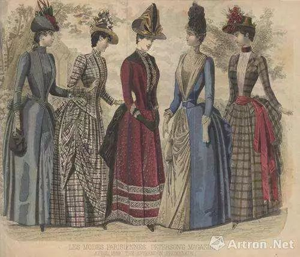

这篇文章可以总结为一句话：**抛弃对温情的幻想，投入战斗。**

<!--more-->

## 一

近日，豆瓣上有位豆友声称：[作为男性，真正好的态度应该是：不反对女权。](https://mp.weixin.qq.com/s?__biz=MzI0MTczODg1Mw==&mid=2247486005&idx=1&sn=b2571998e8150fd2a9af2c1c735b8aca&chksm=e907bf3fde7036297353dd9ffef7e936225dfa959727784294353e564e3143dc9e6871575e0a&mpshare=1&scene=21&srcid=&sharer_sharetime=1577459444050&sharer_shareid=d54b8d2704185e97ba3e8e09acbf2ceb&key=a7f0d0945338b532b239e134d0b65255cc5025c0ec61b40e763adfa15c0aebcc06358bd7a3189d16f4773119eb635e8fdcadf7ac074f9a9fd5778199c3f751d90548c5d39f2698ca27a70c9691af865f&ascene=1&uin=MjY1NTUzMzcwMQ==&devicetype=Windows 8&version=62070158&lang=zh_CN&exportkey=AVMTWzt87Erf8MpqWSuGrb8=&pass_ticket=DPQRkkVwqKfP1gQZDNWpI5BqcVxaEdsK A96p1HGZ39K2QKLbTmvK8Ib9mcRUdUW#wechat_redirect)

这一言论在获得不少支持的同时，也激起了一些质疑。有评论指出，这一“不反对”的态度实质上是**屈尊俯就**（所谓“爹味太浓”）或**对于男性放弃理解女权主义的美化**。值得注意的是，这一言论并不是某位男性基于自身经验与知识对女权主义作出的一种表态：“我”不反对女权主义；而是**将“不反对女权主义”同时作为男性能够持有的最高程度的立场与男性能够作出的最低限度的承诺**：

所谓“最高程度立场”，即**男性只能做到“不反对女权”而很难真正做到“支持女权”**。作者给出了两个论证：(1) 以吸烟为例，支持女权可能引发自相矛盾，因此诉诸“不反对”可以搁置矛盾；（2）“性别差异造成我们很难体会女性真正面临的境遇”。

所谓“最低限度承诺”，即**男性应当做到“不反对女权”**。正如作者指出的，“我不反对女权，我有妈妈，奶奶，外婆，表姐，堂妹，很多争议的讨论，我只要把当事人换成自己家人，就能松懈性别差异树立起的围墙”。换言之，**男性不反对女权是出于对女性亲属的共情。**

笔者在此声明，这篇文章无意于攻击这一言论的作者及其支持者，而是将这一言论作为男性对于女权主义态度的典型，以供公共讨论。这篇文章将探讨三个问题：

第一，支持女性的自我赋权是否必然引发“**自由**”与“**善**”的矛盾以及“**不反对”的中立态度能否成为这一矛盾的解决方案；**

第二，**女权主义对女性的自主性的肯定是否必然导出“男性只能做到不反对女权”；**

第三，**男性通过女性亲属与女权主义者达成共情的局限性。**

## 二

作者首先以男性与女性在吸烟或婚外情上面临的不同社会压力指出了“支持女权”所带来的困境：男性吸烟视为正常而女性吸烟则是咄咄怪事，男性出轨是风流而女性出轨是“破鞋”，如果支持女权则理应对吸烟或婚外恋本身去污名化。

然而，就吸烟问题，作者声称“明明我是支持女权的啊，但心底又真的不愿意支持女性抽烟”。无论作者“不愿支持女性吸烟”是出于对健康风险的考虑还是单纯视女性吸烟为“不雅”，这里确实提出了一个问题：**支持女权主义是否意味着必须包容或正当化某些在道德或风俗上至少是争议性的行为**？由于婚外恋涉及婚姻制度在根本上是否与女权主义兼容这个更为复杂的问题，本文的讨论将集中在作者所举的第一个例子：支持女权主义能否必然导出“不反对”女性吸烟这一立场。

Sara C. Hitchmana与Geoffrey T. Fong的经验性研究指出，**在性别关系越平等的国家，男女吸烟比越接近1:1，这一关系不受国家经济发展水平与收入差距的影响**(Hitchmana& Fong, 2011 ）。然而**相关性并不意味着因果性**。这一研究不意味女性吸烟人口增长是女权运动的必然结果。从历史的角度看，吸烟与女性气质有着复杂的、动态的关系：在20世纪初，吸烟的女性往往被视为娼妓；但随着女性吸烟人数的上升，吸烟也从标志着男性气质或女同性恋转化为女性解放、优雅与性感的象征；但在近50年来，随着禁烟运动的展开，吸烟再次被视为“非女性化的”（Greaves，2015）。

Tinkler通过对1920-1970年英国香烟广告的研究指出了烟草商对女性吸烟文化的形塑。在三十年代，当吸烟在女性群体中仍然是一种极为小众的现象的时候，女士吸烟的广告在面向中产阶级的年轻女性的杂志中大为流行；而到了吸烟已被女性接受的六十年代，针对女性的烟草广告减少了，更多的广告倾向于采取**性别中立**的策略（Tinkler，2001）。

Triandafilidis等研究者对于女性烟民的访谈也指出，女性吸烟的动因包括控制体重、增强性吸引力等多个与女权主义无关的因素 （Triandafilidis et al, 2017）。虽然我们可以声称女权运动推动了女性平均收入的上升，从而使女性拥有了对烟草的更强的购买力。然而女权运动与女性吸烟人数上升无法建立直接唯一的因果联系。从这个角度看，“支持女性主义就应该支持女性吸烟”是伪命题。

正如女权主义并不必然地推动女性吸烟比例的提高，所谓“吸烟自由”也不是女性权利的必要组成部分。如果假定女权主义确实提高了女性吸烟人群的比例，那么文中指出的矛盾实质上是“自由”与“善”的冲突。

“自由”与“善”的主张间确实存在张力。然而如果将二者视为不可调和的矛盾，则陷入了**极端的自由至上主义**。在这一前提下，任何对自由的干涉都必然地损害了个体能动性的完整，因而由此可导出“人拥有自我伤害而不受到外力限制的权利”。然而哪怕在古典自由主义中，洛克已明确指出了**人没有将自己卖为奴隶的自由。**

换言之，这里的矛盾并不存在于“自由”与“善”之间，而是**“无限制的自由”本身所蕴含的悖论**。以个人的福祉、幸福、需要、利益为由对个人的行动或选择的自由加以干涉，在一定情形下是可证成的。“自由主义家长制”（libertarian paternalism）的拥护者，例如德沃金与桑斯坦，指出：**个体的自由选择在许多情况下会受到信息不足或意志缺乏的影响，如果对自由的干涉能够保全并促进一个人通过理性思考作出决定的能力，那么我们可以赞成某种对个人选择与行动的介入**。自由与个人福祉的关系不能教条处理：试图最大化“善”是危险的，然而试图最大化自由同样值得警惕（Dworkin，1972；Sunstein& Thaler，2003）。

这一言论真正的问题在于，作者单纯地认为女权主义意味着“女性试图获取和男性一样的自由”，并将吸烟视为被男性所垄断的自由的之一。然而，**女权主义的目的并不是将男性与女性同质化，而是通过作为“第二性”的女性反思目前的性别关系**。如果无视女权主义在争取女性生命权、健康权、受教育权、获得平等收入的权利等诸多方面的努力，将女权避重就轻地理解为支持“吸烟的自由”或“寻找婚外恋（而不被侧目）的自由”，哪怕这种支持能够在一定程度上破除刻板印象，恐怕也是对女权主义极大的误解与矮化。

总言之，**我们无法证明女权主义必然地导致某一恶果，其次，女权不意味着无限制的自由**。作者所指出的矛盾更多建立在对“权利”理解的偏差上，而这一偏差可能是由于将男性目前在私生活中享有的自由视为女性奋斗的目标所导致的。如果迄今为止我们的论证是成立的，那么以“不反对”为名试图搁置争议将是一种极为可疑的立场。

然而，**“不反对”的可疑之处不仅仅在于其对女性吸烟这一语境的不适用，更在于这个立场中蕴含着将女权主义去政治化的危险信号**。基于对现实政治中无可避免的价值多元性的承认，罗尔斯提出了“重叠共识”这一构想，从而构建“政治”（the political）这一特殊领域。（Rawls, 1987；1989）如果由支持女权主义所带来的与其他价值的不融贯可以通过“不反对”这一立场悬置，那么在罗尔斯的框架下，这意味着女权将在政治自由主义中被移至社会共识之外。换言之，**支持女权主义与持有某一特定宗教信仰别无二致**。信仰某种宗教不是“坏”的，也绝非不“重要”的，然而正如宗教信仰无法也不应该介入一个世俗化社会的政治活动，女权主义将被削减为圈地自娱。既然“不反对”既是底线也是男性能持有的最佳立场，那么是否可以认为：该表态隐含着“男性既不会反对也不会支持女权”这一命题呢？换言之，男性天然地有理由对女权主义无动于衷（indifference）。

“不反对”，换言之，“don’t judge”。然而**女权主义者无法类比于需要主流社会摒弃成见、衷心接纳的性少数群体、有色人种或残障人士**。如果这个地球上约一半人口是女性，那么女权主义者就不应该自居为少数派，也不应该仅仅满足主流社会的“包容”。

## 三

“不反对”女权主义作为最高程度立场的理由之二导出了两个结论：（a）**真正地支持女权主义需要男性出让父权制下的既得利益**，故而声称支持女权主义的男性大多是表面功夫（“嘴遁”）。（b）男性与女性具有天然的生理差异，因此男性无权置喙 “女权“。这里不想讨论（a）是否蕴含着**对“男性不愿/无法出让利益 “的合理化**，而旨在讨论（b）所延伸的问题：**男性与女权主义的关系是”不可能“的吗**？承认女性在女权运动中无可争议的主体性，承认女性主义不需要男性权威的认可，承认激进女权义不需要男性的“理性“中和，并不意味着男性只能打出”不反对“的口号。

这一论证的关键在于：**它假定了“女性”是“女权主义者”的充分必要条件**。男性无法支持女权主义仅仅在于他们不是女性。如果我们承认女性并非生来就是女权主义者，或者说承认女权主义是一项政治社会实践，那么我们就无法声称男性注定囿于生理性别而只能选择”不反对“女性主义。文中的说法首先会过度简化男性与女权主义的冲突；

其次，**它将会巩固了对女性的刻板印象：女性是无法渗透的，难以理解的，隶属于潜意识与激情的，换言之，女性是一个谜**。这一宣言看似是对女性自主权的承认，实质上是以男性的声音/身份强化某种“女性特质“。如果激进地理解，那么”男性与女性具有天然的、不可通约的生理差异“不是一个事实，而是一种阐释。（历史学可以告诉我们，这个观念是维多利亚时代的产物。）那么强调”男性“这个身份具有基于生理差异的稳定性实则是试图维护male sexuality免于女性主义的挑战。我们甚至可以认为，”男性“在此扮演了一个隐匿的、仁慈的主人，通过他的宣告，女性的自决性才得以显现。

然而讨论“男性“与”女权主义“的关系得承认一个困境：**男性无法代替女性发声，但这种”无能“并非根植于性别本质主义**。“男性”与“女权主义者”的悖谬并非来自男性在更大程度上作为”受益者“以至于不得不面临女权主义的审查这一事实，而是**男性对女权主义的参与或挪用极有可能构成对女权主义的殖民**。

Showalter在批判伊格尔顿对女权主义、唯物主义、后结构主义的整合时指出，”在男性理论家借用女权主义批判的语言而缺乏探索他们自己的阅读系统中的男权偏见的意愿的时候，我们得到了一种**阳具女权主义**式的批判。这种批判将父权主义枷锁强加在女性身上，而不是打破它们。“ Heath进一步阐明了Showalter的批判：“**对男性而言，难以想象的不是与女性平等，而是难以意识到他们自己所处的位置的不平等**：前者是抽象的，并不要求我走出我现在的位置（女性自然应该与男性平等）；后者才是切实的——它指出了一个事实：我的平等掩盖了对她们的压迫（女性与我不平等，而她们的奋斗也不是为了那种平等）。“ (Showalter，2003；Heath, 2003)

然而Showalter也指出，**男性的女权主义阅读是可能的，尽管”这并非毫无问题“。这种阅读允许男性作出女权主义批判而不用代入女性**。男性无法”像女性一样“阅读，他只能作为一个男性和一个女权主义者。男性之于女权主义，不应当自居骑士、忏悔者或盟友，或试图给予女性”与男性一样“的自由。

**男性女权主义者应当承认他的书写具有双重性质，既是对压迫的再生产也是对乌托邦的希冀**。男性女权主义者能够做什么？这里或许可以借用Jardine的话：“女权主义者想要什么？恕我直言，我们并不想让你模仿我们，变得和我们一样；我们不需要你的激情或你的罪孽；我们甚至不需要你的钦佩（哪怕拥有它一阵子也挺棒的）。我们想要的，我甚至可以说我们需要的，是你的工作。我们需要你去从事严肃的工作。而像所有严肃的工作一样，它包含了挣扎与痛苦。“ （Jardine, 2003）

## 四

作者提出了一个极为温情的说法：将所有女性想象成自己的母亲、女儿或姐妹。假如一个男性爱自己的亲人，那么他应当对所有女性抱有善意。而这种善意是化解两性之间的藩篱的不二法门。笔者的目的并非否认共情的价值（作为宣传策略，这种诉诸亲情式的共情的确很有效），而是试图指出将女权主义的希望寄托于男性的温柔与善意是不合理的。

这一本质上是“老吾老以及他人之老”的共情框架具有极大的局限性。

**首先，它排除了就目前来说难以被纳入家庭结构的女性，比如女同性恋者和跨性别女性。其次，它剥夺了女性的公共身份。**

如果男性与女性产生联系的唯一领域是**家庭**，那么**女性只能作为“家中天使”来领受男性的善意**。我们完全可以想象一位男性出于善意、真诚地劝导女性回归家庭，正如他不希望自己的母亲、姐妹、女儿经受职场打拼的压力。然而**这份温柔对于打破女性所面临的天花板有害无益。将个体的善良作为性别问题的终极解决方式，很容易掩盖女性所面临的结构性困境**。**所谓“个人的即政治的”，试图诉诸“非政治的”家庭领域以消弭不平等，本身就是权力的操演。女权主义不是对男性温情的祈求，而是一个战斗口号。**

**如果女性的身份是通过与男性的关系定义的，我们完全有理由认为这个框架是斐勒斯中心主义的**。**在女性成为女儿、妻子、母亲之前，她首先是一个人**。

然而，这是否意味着男性应该把女性想象成“和他一样”的个体？阿甘本对于亚里士多德的“朋友是另一个自我（alter ego）”给出了一个有趣的阐释：希腊语中对于**异质性**（alterity）有两个词，allos （lat. alius）是广义的异质性，而heteros （lat. alter）是作为两元对立中的一极的异质性。**朋友不是另一个“我”，而是内在于自我的他性**（otherness immanent to selfness）。（Agamben, 2009）**“女性”对于男性来说，不是“我”也不是“我的…”，而是与“自我”充满张力的“另一个我”。**

## References

Agamben G. The Friend[M]//What is an Apparatus? And Other Essays. Stanford, 2009: 25-38.

Dworkin G. Paternalism[J]. the Monist, 1972: 64-84.

Greaves L. The meanings of smoking to women and their implications for cessation[J]. International journal of environmental research and public health, 2015, 12(2): 1449-1465.

Heath S. Male feminism[M]//Men in Feminism. Routledge, 2003: 11-42.

Hitchman S C, Fong G T. Gender empowerment and female-to-male smoking prevalence ratios[J]. Bulletin of the World Health Organization, 2011, 89: 195-202.

Jardine A. Men in Feminism: Odor di Uomo Or Compagnons de Route? [M]//Men in Feminism. Routledge, 2003: 54-61.

Rawls J. The idea of an overlapping consensus[J]. Oxford journal of legal studies, 1987, 7(1): 1-25.

——, The domain of the political and overlapping consensus[J]. NYUL Rev., 1989, 64: 233.

Showalter E. Critical cross-dressing: Male feminists and the woman of the year[M]//Men in Feminism. Routledge, 2003: 126-142.

Sunstein C R, Thaler R H. Libertarian paternalism is not an oxymoron[J]. The University of Chicago Law Review, 2003: 1159-1202.

Tinkler P. ‘red tips for hot lips’: advertising cigarettes for young women in Britain, 1920-70[J]. Women's history review, 2001, 10(2): 249-272.

Triandafilidis Z, Ussher J M, Perz J, et al. Doing and undoing femininities: An intersectional analysis of young women’s smoking[J]. Feminism & Psychology, 201765-488.