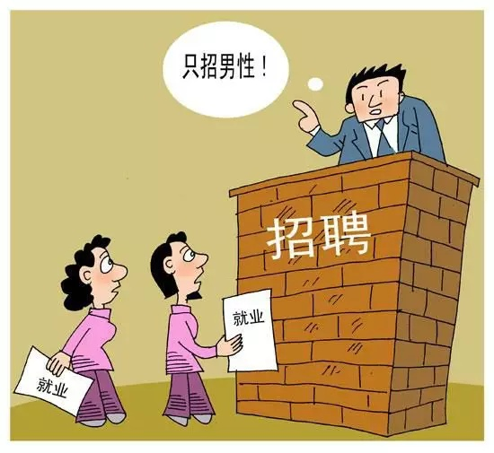
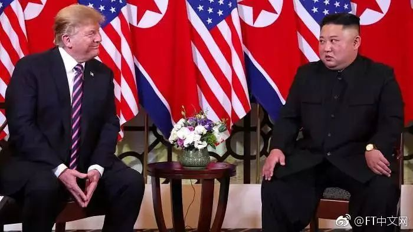

3月18日，一位自称是北邮19级毕业生焦越在微博上爆料，声称自己**报考清华研究生的过程由于遭遇性别歧视而被刷**，引发网友广泛关注，成为一时热点。

有人认为该女生不是因为性别歧视低被刷，而是因为没有介绍自己的本科学术经历以及未来的研究方向，反而谈了一堆本科经济学双学位，在外面开店之类与考研无关内容、英语写作水平不够好、自身过于极端自信以及心理有问题等原因而被刷。

有人说这是“田园女权”乱用政治正确博人眼球，是“**田园女权的一贯套路**”，趁机嘲讽女权；

还有人认为，这位女生是在滥用“反性别歧视”，**损耗反对性别歧视的正当性和道义资源**，可能会导致“反对性别歧视”和“女权”的进一步污名化。

<!--more-->

焦越微博爆料

那么，到底怎样才算是性别歧视(sex discrimination)？

## 何为歧视

歧视的定义是很广泛的，而且**个体**和**群体**不太一样，歧视可以大致分为**观念歧视**和**结构性歧视**。

很多人所理解的歧视是一种**价值判断**，即**在观念世界中某一群体对另一群体的标签化认知，所造成的无知判断，并且导致弱势的低生位者**（比如黑人或同性恋）**利益受损**。

在日常生活中，**很多人在评价“歧视”时，实际上并不能列出歧视的准确标准**。他们的判断逻辑是——某些行为在一定程度上是否违背了“**被尊重**”的情感或情绪，而**“什么是被尊重”只是一种大致承诺，它同样没有标准**。我们只在是模糊地使用“歧视”这个概念而已，**歧视的标准不清也是歧视存在如此多的争议性的原因之一**。

歧视(**discrimination**)原本是中性词，即“**区别对待**”。目前人们常用的“歧视”是指基于性别主义**(sexism)**偏见等不合理或不正当的理由的区别对待，比如因为一个是同性恋或者黑人身份，而对ta们进行区别对待。

如果我们在**刻板印象**（stereotype，*指按照性别、种族、年龄或职业等进行社会分类而形成的固定印象，如“河南人偷井盖”*）与**偏见**（prejudice，*脱离客观事实而建立起来的对人事物的消极认知与态度*）的影响下，甚至是带着恐惧和敌意等情感，对具有不同身份的群体进行区别对待，那么这就是歧视。

**如果我们把偏见和刻板印象表现出来，就构成了歧视。**

## 统计歧视

不过我们需要额外谈及一种特殊的歧视：**统计歧视**(statistical discrimination)。比如有人认为，的确不是所有的女人的科研能力（或开车技术）比男性差，但是**平均来看，女性群体中出现这种人的概率比男性高**，因此在没有其他可参考信息的前提下，如果我们需要在一个女人和一个男人当中进行选择，肯定是选男性更靠谱。因此这种对女性的歧视行为似乎纯属理性使然而具备合理性了。

然而合理的统计歧视需要满足两个前提：（1）**已知信息的准确性**；（2）**未知信息的无法获取性**。

对于个体而言，**统计歧视只能是在对已知信息具有绝对把握而且缺乏任何渠道获取更多信息的前提下的权宜之计**，而不是在所有状态下的默认策略：

首先，我们必须**保证对某个群体的已知信息是准确的**，这不是靠个体观察或者是媒体个案式的报道能得出的，而是需要**代表性大样本**或者是查阅**相关权威数据**才能得出结论。

否则我们**一方面利用“纯理性”来合理正当化自己对统计歧视的使用，一方面又随意根据某些个体而得出对某些群体的结论，那是不合理的**。如果我们对某个群体的已知信息是不准确的，那么我们就失去了统计歧视的正当性。

其次，我们必须**保证自己在做出决策之前已经穷尽已知信息，无法获取其它信息了**。比如如果我们只看到“女性”这一身份标签而无视“职业”等其他更相关的信息就作出判断，很可能会做出错误的判断。

如果我们不是通过复杂而准确的模型而只依靠**单一的身份标签**来做出选择判断，那将是非常低效的，其结果往往会事与愿违。

而且统计歧视还会导致某些非常严重的后果。

统计歧视的理性是从**歧视者**的角度出发，然而对于处于**被歧视群体**中的完全理性的个体而言，以被普遍歧视的女性为例，**如果无论她怎么努力，社会也只是根据其女性身份来做出判断，用女性群体的平均水平来代替其真实水准，那么对于她而言，不做出额外的努力才是最合理的，因为她越是努力就越吃亏**；相应的，低于群体平均水准的女性个体也可以通过**搭便车**的方式上升到女性群体的平均水平而失去努力的动力。

经过长期博弈之后，无论是高于群体平均水平，还是低于群体平均水准的女性个体都可能失去进步的动力，整个女性群体就因此陷入了**恶性循环**的困境，女性群体的平均水平也会变得越来越低。

而且**针对女性的刻板印象和社会偏见会参与到女性的社会建构过程当中，这种统计歧视的受害者不仅仅是被歧视的群体，其他人也会受到影响**。这种宏观影响是长期而潜移默化的，以至于一般我们很难准确认识到它的危害性。

因此滥用统计歧视是有代价的，如果我们对已知信息的过度自信，或者是过度纠结于某些标签而忽略其它更具备相关性的信息，很有可能会做出错误而低效的选择；社会宏观层面上，**统计歧视的滥用会导致社会总效率下降，社会不平等加剧，人才与资源无法得到有效流动与利用，最终所有人都要承担相应的代价。**

当然，在现实生活中，**某些统计歧视是会被社会默认的，**比如学历水平高的人更容易在招聘过程中被录用。但是这些统计歧视本身需要大量的统计工作来保证结果的可靠性，而且需要尽可能地穷尽所有的可知信息。某个统计歧视是否能被社会普遍接受的标准本身是复杂而动态的，会随不同的时间和社会空间而产生变化。

## **歧视与平权**

虽然以上我试图对澄清歧视概念做了一些尝试，但是我知道，这不过是杯水车薪而已，关于歧视的争论还会将会在公共场域上演无数次。

因为**歧视的存在本身有着现实结构基础，即不同群体的高低生位差异**，比如黑人的弱势和白人的强势。除了观念歧视之外，还有结构性歧视。要改变对黑人的种族歧视，除了明文禁止“黑鬼”等带有歧视意味的称呼之外，还是得从这种歧视的社会基础入手。

**歧视往往体现在观念世界，我们很容易忽视歧视的实体依托，以至于认为我们只需要在观念世界获得澄清，就能够保证“不歧视”**——当我们有一个被i净化过的语言空间，有足够多的人在这个主流话语下认同平权，抛弃私人性的**价值判断**，拥抱中质化的观念，就能够解决歧视问题。

然而，即使我们通过这种类似于美国60年代以来的“语言净化”运动，把“歧视性”语言从公共话语空间剔除掉，形成某种“**政治正确**”的公共准则，也只能去除观念性歧视。就像经过长期的民权运动和平权运动洗礼之后，今天的美国黑人已经很难遭遇有“种族歧视行为”的人一样，但是他们依然可能会遇到**结构性歧视问题**。我们只有从根源上改变导致歧视产生的社会结构问题，才有可能真正解决（种族）歧视问题。

美国现有的种族歧视问题是阶级差异的族裔化，除了观念歧视方面之外，更本质上是**社会结构的阶级问题捆绑上了种族标签**。种族歧视本质是伴随着阶级歧视而来，并导致主流话语的结构性压迫，产生对黑人群体的”标签化“歧视。

**单独通过某种净化方式改变主流话语，无助于真正解决问题**。如同左派批评白左的“政治正确”治标不治本，不过是忽略社会、政治和经济基础的改良运动，我们需要解决基于社会关系基础的高低生位群体差异的问题，而不只是通过净化“观念世界的价值判断”，然后以此去减弱其依托的社会关系基础的方式去消除“歧视”。

否则，我们辛辛苦苦通过建构白左式的“政治正确”共识，光顾着净化观念歧视，而对结构性问题置之不理，一旦遇到一个口无遮拦，对“政治正确”根本不在乎的右翼民粹领袖，裹挟大量根本不承认歧视问题是问题的保守右翼反攻倒算，瞬间就傻了。

川普在16年美国大选的意外崛起以及全球极右的泛滥殷鉴不远。