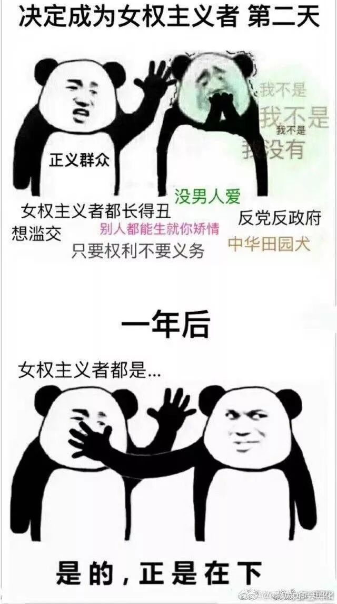
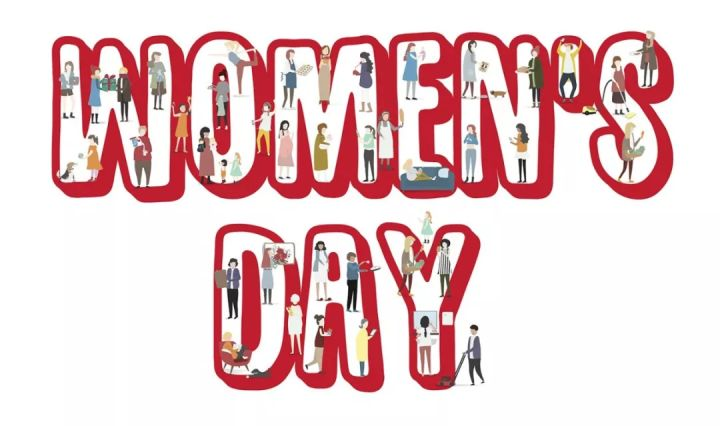
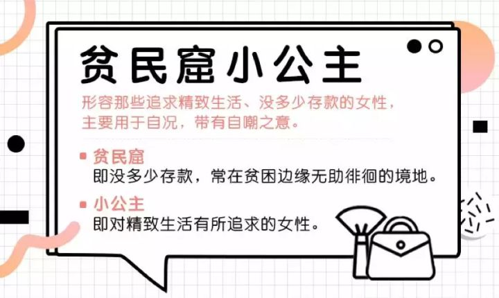

**作者**：[acel rovsion](https://www.zhihu.com/people/acel-rovsion)

> 延续本号每年妇女节的传统，首先祝各行各业的女性劳动者和为人类解放奋斗的女权主义者们节日快乐！
>
> 往年可参照：《[姑娘，你想当女神还是当妇女？](https://link.zhihu.com/?target=https%3A//mp.weixin.qq.com/s%3F__biz%3DMzIzNTU3MDI5Mw%3D%3D%26mid%3D2247484909%26idx%3D1%26sn%3D8526d847827b9639c3ef5d398b96ad3b%26chksm%3De8e450f7df93d9e13a661974755f0ae5f9e431713d539ee7e36587190cf5033a051222241c90%26mpshare%3D1%26scene%3D21%26srcid%3D0307tjakZzQuhQNVAmCYQjFd%26from%3Dtimeline%26ascene%3D14%26devicetype%3Dandroid-22%26version%3D26060739%26nettype%3DWIFI%26lang%3Den%26pass_ticket%3DKe1iU9DbrItHxwwtAoOSij3dC%2520rsvZ97FzLRCWQyuXCR2zQAB641u1HJsS/zuvC9%26wx_header%3D1%23wechat_redirect)》和《[妇女节谈消费主义：积极的局限，局限的积极](https://link.zhihu.com/?target=https%3A//mp.weixin.qq.com/s%3F__biz%3DMzA4OTEyMTMxNA%3D%3D%26mid%3D2447668052%26idx%3D1%26sn%3Deb1734dbefaf3f7d17c4428350d2766a%26chksm%3D840f6419b378ed0f0e8e23727203dde283c1986db90e5b7e35a3d330ac4ed3caecd98bd614cf%26token%3D1203915284%26lang%3Dzh_CN%26scene%3D21%23wechat_redirect)》

今年我们聊聊**身份政治**（identity politics）问题。

<!--more-->

福山在新作《身份：尊严的要求与仇恨的政治》中将**身份政治**作为**撕裂保守主义者想象的社会有机体的民粹策略**，或者说是**替代政治对于传统政治经验的颠倒**。在罗伯特•卡根那里，这种基于社群公正本身的政治行动被污名化为**部落主义**。这种"女权指导家"的姿态首先在于他们**放弃反思他们所信仰的社会有机体对于女性的剥削性**。

更民粹的男权主义则干脆会认为**当我们在提到女权这个概念时，就是挑起了所谓的“男女对立”**，诸如“**你们女性现在地位已经很高了**”这种论调。

其实，我们可以看到，男权秩序运作的方式是**常态化**的，是**生产性**的，**男权者本身在直觉性地维护这个体系**，即使他在这个体系里也是个不值一提的数字。

这也是我们强调“女权主义”的原因，**平权主义是我们争取的一部分，但不能在某种说教和诡计中来替换这种话语。**因为用Allan G.Johnson《性别打结》的说法来讲，**女性是男权的最直接受害者，男性在男权的弱势则是由于被男权秩序所吞噬**（或者说是另一种异化，而非性别客体化），但**女性受到剥削仅仅是因为她们生而为女性**。

而同样的，**对于女性权利的强调**是为打破男权这种常态化的**结构性歧视**寻找到最直接的问题症结和反抗的基点。同时，在这个运动中，**女性也必然是革命的主体。**
所以，我们要将女权议题作为长期的**公共议程**置入公共领域；将女性的**共同生命政治经验**联系起来，反抗男权秩序对女性共同体的结构性压制。所以**从女权主义出发对女性的强调，并拒绝（用平权）置换（女权），并没有违背平权**，而是拒绝各种改良思潮中对女性议题出于不同动机的淡化，甚至是忽视。

对，在此说这话的我是个**男性女权主义者**，也包括很多同仁。

**我们必须强调女权，也必须强调“妇女”这个政治身份共同体的当代意义，和重构妇女节对于女性权益斗争的集体历史。**  

在探讨现阶段的问题时，我们要知道，**男权与晚期资本主义的共谋**，本身就包括文化系统中**主流文化对于其它文化的宰制**；用身份构成模式来管理身份，不仅体现在用作性别身份固化的各种社会结构；还有捆绑在**社会再生产**的性伦理管制，血缘认同等一系列惯习（habitus）。

所以，是**传统男权秩序首先预制了身份政治路径，而弱势者在过渡时期延续了这种路径，进行对位反抗**，所谓**承认的政治**。

**社会承认**关乎整个社会机器他者对于自我建构造成的控制，羞辱以及自我意识的自主性。“**不承认**”在南希•弗雷泽那儿是**对自我意识健康程度的损害**（比如主流群体对少数群体的蔑视和猎奇体验），**对弱势群体的结构性压制**，而**承认的斗争实际上是一种积极自我的抗争**。

其次，**承认也是一种自我生存位置的追求**，其中包括反抗内化的社会公共尺度对于少数者生存空间的压缩，也在于新的文化空间对于经典空间的反制，人出于自我持存的本能而带来持存的文化生产。

这当然不是**普遍性**的革命模式，但在目前**去政治化**的大前提下，却是女性通过公共领域打响对于传统秩序的灰色**性别操演**空间的第一枪。

当然，基于身份政治本身的**二重性**，我们也需要探讨其局限性。身份政治是多元社会和个体化意识，基于社群代表性的发声模式。但在南希•弗雷泽那里提到了一个重点：

### 为啥刻意忽视再分配呢？

男权本身不仅是社会网络的一套**身份**体系，同时也是一套**分配**体系。对于激进女权来说，“**承认-性别政治-再分配**”是瓦解掉男权社会中最重要的**再生产**（包括性别文化，私权等）的共同基础。

经济结构的压制和再生产体系中通过**阶级**和**性别身份**进行二重剥削，会随着代际传承，巩固着男权社会这一套表征体系。**如果忽视这个物质基础，就很容易被变革的资本话语将你的反抗吸纳到它的再生产中**——即**消费主义的收编。**

消费主义延续了男权社会的欲望装置和**男性凝视**（male gaze）的文化成分，但它在当代的运作模式已经不仅是取悦作为**真实观看者**的男性，而是“收编”。  

### 消费媒介对生活方式的塑造

我们回望这三年，消费主义开始正视女性群体对于传统女性身份的反抗，最近几个运动品牌（比如耐克）都是通过**讲述女性个人努力的故事**来重塑一个独立女性的“身份”。从某种角度来说，可以说这三年公共文化貌似“进步”了。

但是正如同南希•弗雷泽警惕各种一元规范论的统摄体系一样，**这种新的叙事可能形成一种新的去政治化**。女性自主意识和Girl Power可能被商业媒介变成一个只关乎于个人生活方式和生活取向的问题，于是我们刚才提到对男权和资本主义冲击的**再分配问题**就被掩埋了。女主自主意识打破了规范化的男权秩序，却有可能被商业媒介引入到新的规划宰制中。男权对于女性共同性的压迫，文化制度性的宰制，变成了似乎仅仅依靠**某种生活取向**就能够打破的神话。

就如同南希•弗雷泽对于**第二波女权**和**新政联盟**（主要是部分女企业家提出的单纯靠个人努力和观念变革来解决问题的群体）的批判一样，问题在于，**它很大程度默认了现有社会模式是一种“已完成”的秩序，我们需要做的只是公共观念的改良和秩序内政治工具的配套。**然而对于男权秩序而言，这种改良促成了消费主义的精益化管制。

而“**妇女**”身份的性别文化变革，正好对抗的是男权秩序的自我演化和收编，从而塑造的是一种**开放的未来**——即公共性的性别文化议程，以及自主性的积极诉求。多重的公共领域冲击开男权的二重剥削构成的传统规范，挤出了新的文化空间和行为维度。

这也是我们在此处强调"妇女节"的意义和"妇女"这个共同政治身份的价值的原因，以及强调**性别政治**领域对于原有性别秩序进行**总体性解构**的意义。