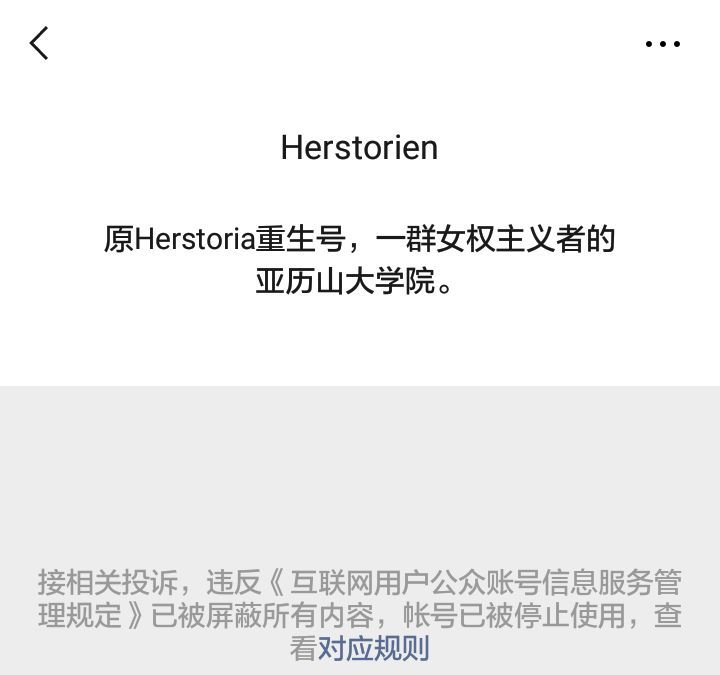
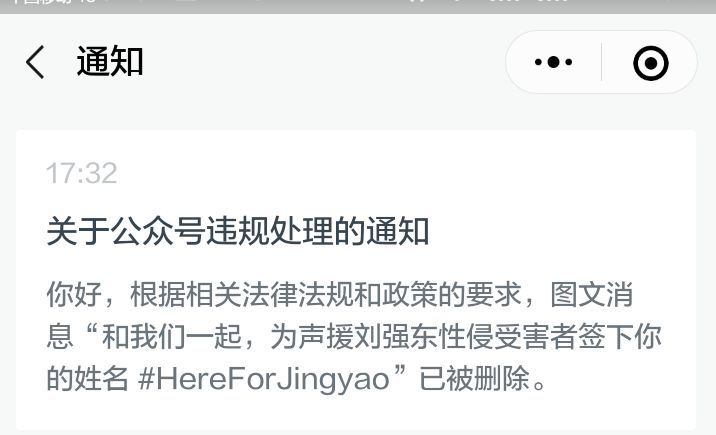
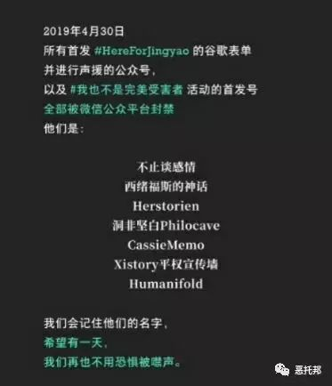
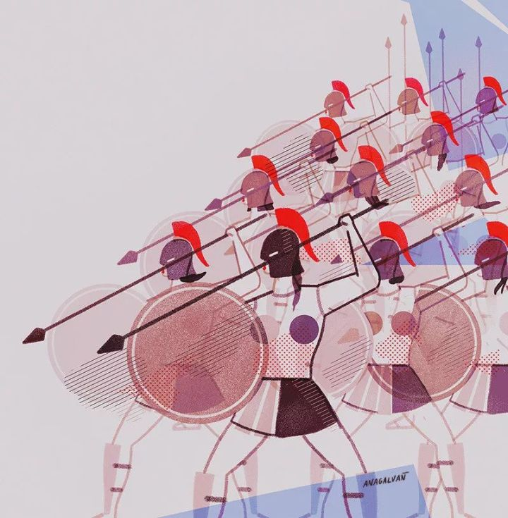

大家好，我是赫斯丽娅，一个脱胎于知乎平台，非著名，没钱，还随缘更新的佛系女权公众号。

<!--more-->

自去年起，我一直致力于生产较为严肃的女权内容，我希望能够帮助读者从女权主义批判视角去看待现实和历史，给读者提供批判的武器，而非廉价的共情。

在一个娱乐至死，流量为王的时代，因为不会吸粉，我常常感到一众新媒体格格不入，由于卖萌打滚，抖机灵吐槽，以及煽情的功力未臻成熟，我长期以来一直都是闹市里的小透明，没什么知名度和影响力。与之同时，通过避免涉足敏感话题，我一直未被房间里的大象注意到，得以保住了小命。

然而，这样一个小透明，还是再次不幸地被WeChat碾死了！

如果你发现在WeChat 搜不出赫斯丽娅这个名字，那是因为，我已经在昨天，又一次光荣地炸号了！

去年，我们因为转发声援女性Worker蜜兔的文章，光荣地牺牲了。

上个月，我转发了一篇打脸性别刻板印象的文章，有幸成为微博爆款文，总阅读量在几天内飙升到40W+，我的体量因此暴涨了一倍，高兴地手舞足蹈。

让人意想不到的是，昨天，铡刀终于再一次落到我的头上。

上周，因为转发声援刘强东案女当事人的联名号召，以及转发刘强东被起诉书的全文翻译，我的阅读量达到创号以来第二高，关注我的人也越来越多。

他人的目光令我欢呼雀跃，小透明也有一颗成为偶像C位出道的心，梦想有一天能够站在舞台上和大家一起闪耀。早已不想做默默无闻的看客，我要成为时代弄潮儿，名垂青史……

然而幸福总是短暂的，不幸总是在你意想不到的时刻降临。

以为自己只是在边缘试探，却不知道，一只脚早已跨了过去。

昨天下午，我先是被人打小报告，声援的文章被河蟹；很快，我惊讶地发现，自己原本就不多的热度，已经彻底凉凉，透心凉，心飞扬。（*参与声源的公众号几近全灭*）

本来还在纠结要不要把《道德经》里的“知止不殆"抄上九九八十一遍，但转念一想，名不见经传的我，竟然能够被WeChat临幸，也真是八百年修来的福分。

我不想说永别，不想就此消失被别人遗忘。一位注定要名垂青史的著名人物曾经说过:

**“追求性别平等的事业是崇高的。纵观人类历史，没有女性解放与进步，就没有人类解放与进步。消除性别歧视和性别偏见，可以让社会变得更加美好和进步。”**

**“我们要努力消除一切形式针对女性的暴力，包括家庭暴力。我们要以性别平等为核心,打破妨碍女性发展的落后观念与陈规旧俗。”**

然而，如今依然普遍存在着严重的性别歧视以及虐待女性的事情，男女不平等依然非常严重的性别歧视以及虐待女性的事情，男女不平等依然非常严重。

已经进入棺材的我为此感到很气愤，很不甘心，就这样离去，我死不瞑目，我要复活！

于是经过小编们的努力，利用高超的基因技术，从原来的尸体中提取出DNA，经由无数次克隆实验后，我终于艰难重生，变成了今天的Her小号。

鲁迅曾经说过：“我自爱我的野草，但我憎恶这以野草作装饰的地面。

地火在地下运行，奔突；熔岩一旦喷出，将烧尽一切野草，以及乔木，于是并且无可朽腐。

但我坦然，欣然。我将大笑，我将歌唱。”

重生后，失去的只是原来关注我的朋友们,但得到的是对当今女权议题整体环境紧张的进一步确认。

今后我将依旧张扬我的个性，以“一群女权主义者的亚历山大学院”为名，坚持有质量的文字创作，也许我也等不到短期内恢复的契机，但我坦然，欣然。

我将大笑，我将歌唱！踏在自己的尸体上，我将舞蹈，过去的生命已经死亡，而我——一个新的我已经诞生。

“为了实现男女平等，共建一个对所有妇女、对所有人更加美好的世界”

不要保持沉默!欢迎点赞转发本文，帮我找回原来的小伙伴们，用炮火支援我！

再一次经历死亡，我已无所畏惧，哪怕再次死去，我也要化作幽灵，在大地上继续游荡，直到男女平等的理想成为现实。