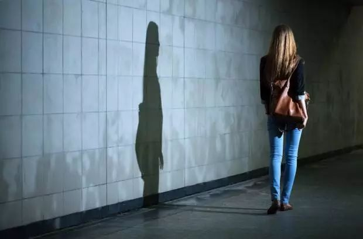
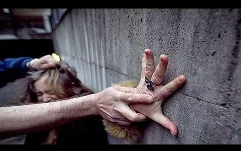
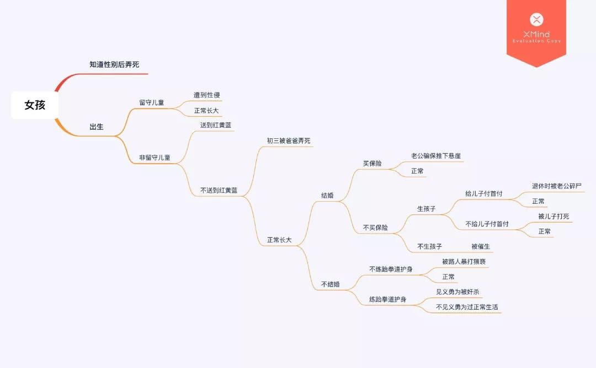

> 犯下强奸的不是精神变态的或者偏离我们社会规范的人——犯下强奸的是我们社会规范的标兵。在这个男性至上的社会，男性被定义为高于女性和与女性对立的一群人，而女性则被定义为 [与男性] 相反的、完全不同的另一群人 . . . 强奸不是极端，不是异常，不是意外，不是失误——它正体现着文化所定义的性。——*Andrea Dworkin,* Our Blood: Prophecies and Discourses on Sexual Politics *(Perigee Books, 1976), emphasis added*

<!--more-->

## 无差别施暴？明明是两种意义上的暴力！

南周知道今早的《[男子深夜暴打女子，我们的社会怎样才能更安全？](https://mp.weixin.qq.com/s?__biz=MzAxMzA3NDY1OA==&mid=2651663716&idx=1&sn=f833b4db2d7690cf019be7112b581e1c&scene=21#wechat_redirect)》一文代表了一种普遍看法，

> 男子向无辜者施暴，这是一种“无差别伤害” . . . 施暴者与你非亲非故、素昧平生，只是因为不凑巧他遇到了某个人，某个人便成为受害者 . . .

男子暴打、猥亵无辜女子，真的是「无差别」伤害吗？从一种意义上来说是的——被暴打与猥亵的女子是「随机」被选上的，她是在错误的时间出现了错误的地点。可是，南周知道的「无差别伤害」却完全忽视了下述两种情况的区别：

>
> 男子「因与其女友感情纠纷情绪波动」（官方通报措辞），走在路上就想
>
> 1. 随便找一个**人**报复泄愤。
> 2. 随便找一个**女人**报复泄愤。

虽然两种情况都有「无差别性」或「随机性」在里面，但**恐怕只有第一种才可以称为真正的无差别伤害**。注意，我们在这里不能被不严谨的口语表达所迷惑。我们都知道，和友人外出吃饭，问想吃什么，若得到的回复是「随便吃什么」，那可不是真的「随便」——实际上随便的往往是限制在某几种食物之内的，「随便吃什么火锅」，「随便吃什么烧烤」，如此种种。

同样地，男子因与其女友感情纠纷情绪波动，说是出去「随便打个人」，若真的把此话字面理解为「随便打个人」就未免太天真了。被爱情所伤的是自己，自己是个男人，「随便打个人」当然不是要随便打个男人——自己的兄弟。可伤自己的是个女人，**「随便打个人」就是要「随便打个女人」**，其中对受害人的选择性不可无视。

这要如何与被打的那位女性联系起来呢？熟悉法理学的读者知道，**一个人可以不同的「身份」被起诉**。地方政府违法拆了你家的房子，你去起诉当地政府的首长 A，你所起诉的当然不是 A 本人，而是当地政府的首长——A 只是恰好承担着「当地政府的首长」的身份。换言之，A 是**作为当地政府的首长**被你起诉的。

同理，一个人也可以不同的「身份」被打。B 是 C 的同学，也是 C 的朋友，但 B 一直欠着 C 的钱不还。C 因此揍了 B 一拳，并不是因为 B 是 C 的同学，亦不是因为 B 是 C 的朋友，而是因为他欠了钱不换。换言之，B 是**作为债务人**被打的。

电视剧《不要和陌生人说话》剧照

回到当前的案件中。「随便打个女人」最重要的是要「打女人」，而当事女子恰好是个**女人**，因此就被打了。所以，当这位倒霉的女性问自己是为什么被打时，答案都与她自己的举止品行、能力特质无关。易言之，她**不是作为她****自己**被打的，**而是作为女性**被选上，并因此既遭打又遭猥亵的。**她的错误不在于她自己，不在于她半夜出门或穿着暴露，而恰恰在于且仅仅在于她是一位女性。是女性才是她被选择为性暴力受害者的原因。**

要更深入地理解这点，就需要我们从「男人深夜暴打女人」中区分出两种意义上的暴力：

第一种是**个人对个人的暴力**。在此种暴力中，我们能很清晰地识别出哪些**具体的个体**是加害者，而哪些**具体的个体**又是受害者。这种暴力我们都很熟悉了。例如，在我国现行刑法中，「故意伤害」「强奸」「强制猥亵」等「暴力」构成犯罪所依赖的法理是它「侵犯公民人身权利」，而**人身权利即是一种个人权利**。所以，**刑法意义上的「暴力」就属于一种个人对个人的暴力。**

又因为在个人对个人的暴力中有具体的加害者，我们便能从其身上发现**主****观的意图、动机或目的**，即哲学理论中的「**施为性**」或「**能动性**」(agency)，在我国刑法理论中也叫做「**故意性**」。个人对个人的暴力因此亦具有施为性、能动性或故意性的特征。

根据本案的官方通报，「犯罪嫌疑人王某因与其女友感情纠纷情绪波动，酒后于22日凌晨路遇被害人吴某，对其使用暴力并强制猥亵」。王某与吴某都是我们能很清楚识别出的个体，而且我们还能从王某身上找到施为性或故意性，即对吴某实施暴力的主观意图。于是，我们可以合理地说**本案中存在个人对个人的暴力**。当然，意思不是本案就一定能构成犯罪，本文的关切点并不在那里。

第二种是我们所不那么熟悉的是**社会结构性的暴力**。女性走夜路遭到性暴力便是极好的例子。一方面来说，固然有女性 A1 在场合 C1 下走夜路遭到性暴力，女性 A2 在场合 C2 下走夜路遭到性暴力，女性 A3 在场合 C3 下走夜路遭到性暴力，……，女性 An 在场合 Cn 下走夜路遭到性暴力——这些都是个人对个人的暴力。可另一方面，「女性走夜路遭到性暴力」却不等同于「女性 A1 在场合 C1 下走夜路遭到性暴力」，甚至不是「对于任意的 i，女性 Ai 在场合 Ci 下走夜路遭到性暴力」。早在四十年前，安德里亚·德沃金 (Andrea Dworkin, [1979] 1993) 便敏锐地观察到，

> 女人走在夜晚的路上不仅只是面对暴力的威胁，依据男性统治的价值观，更是在主动寻求着暴力。跨过了「夜晚」的边界的女人，都是破坏了这条最基本教养的罪人：正经的女人不会与其他女人一起、更不会独自在夜晚出行 . . . **夜间的「警察」——强奸犯和其他潜行狩猎的男人们——有着执行「夜间法律」的权利**：尾随违法的女性并惩罚她 . . . 一个「文明社会」里懂规矩的女人会知道，自己必须远离夜晚。
>
> （采用了友社 *Philosophia* 发表的全译文，强调后加，原文链接：[夺回黑夜：女性独自夜间出行不安全，所以就应放弃夜间出行的自由吗？](https://mp.weixin.qq.com/s?__biz=MzUzNDc3NzIxMA==&mid=2247485024&idx=1&sn=cd79d00cbbe1b0a53a910fd3485028c0&scene=21#wechat_redirect)）

在「女性走夜路遭到性暴力」的社会结构性暴力里，受害者不再是某个具体的个体，而是**女性这个社会群体**；性暴力也不再仅仅是一次次具体的性暴力事件那样简单，而是一种**承担着惩戒功能的警察机制**。于是，在社会结构性暴力下，就不再有哪些具体的个体是加害者或受害者了。加害者变成了不具有施为性、能动性或故意性的制度、政策、法律、规矩、传统、习惯、偏见等**社会机构与社会文化**，而受害者则变成了某个**社会群体**。

社会群体不是具体的个体，而是一种**身份** (membership) 或**范畴** (category)。我们之前说，本案的被害人是**作为女性**被打的，其准确的意思是，她是**作为女性的这个社会群体的一员**而被打的。这样，我们除了需要把「男人深夜暴打女人」当作一次个人对个人的暴力外，就还需要把它当作**我们这个社会的运行机制的一个实例**，看到它在我们社会的结构中处于什么位置、起到了什么作用——也就是说，我们要往后退几步从宏观的角度去看到森林。在森林里，我们看到的是，发泄到这位无辜的女性身上的，是**女性胆敢让男性感情受伤的惩罚**，而这**惩罚针对的是整个女性群体**——**「男人深夜暴打女人」中被打的，被打的不只有那位女性一个个体，还有整个女性群体。**

## 女性是作为女性而受到压迫的

具体是谁哪位女性不幸遭到性暴力兴许真的是「随机的」或「无差别的」，但**女性群体遭到性暴力却决不是偶然的或偶发的，而是系统性的与结构性的**。无论一位女性怎样穿着打扮，无论结婚与否，无论是异性还是同性恋，无论呆在外面还是家里，无论白天还是晚上出门；只要她还是位女性，她就仍然是女性群体的一员，她所有的选择就都指向同一个方向——轻则性歧视、性骚扰，重则性暴力、性侵害，甚至性谋杀。**如此种种，都不是出于她自己的举止品行或能力特质，而仅仅是因为她是位女性。**

图源微博 @五百君喜翻理性蒸发，已获得授权

密歇根州立大学哲学系的荣休教授玛丽莲·弗赖伊 (Marilyn Frye, 1983) 曾将女性的这种困境形象地比喻为一个「**鸟笼**」，

> 笼子。想想鸟笼吧。如果仔细观察笼子上的某一根栏杆，你是看不见其它栏杆的。你只见树木的视觉焦点决定了你眼前所能看见的东西，**你可以上下打量那根栏杆，却还是搞不懂为什么小鸟不能绕过那根栏杆飞去想去的地方**。
>
> 除此以外，即使有一天你只见树木地检查了每一根栏杆，你仍然搞不懂为什么小鸟不能绕过那些栏杆飞去想去的地方。不管你再怎么严密检查，你也找不到栏杆有任何的物理属性，能解释为什么一只小鸟会被区区一根栏杆限制住或伤害到，除非是发生了最天方夜谭的意外。
>
> **只有你往后退一步，不要再微观地一根一根地打量栏杆，而要宏观地观察整个鸟笼，你才看得出来为什么那只小鸟哪里都去不****了**，实际上你立马就能看出来。并不需要有什么精巧的精神功力。非常明显，**那只小鸟被一张系统性关联着的障碍网络所包围，其中没有单独某个障碍会阻碍它的飞行，但是经由它们之间的关联，最终铸成了铜墙铁壁**。
>
> （全译文在本号发表过，强调后加， 原文链接：[压迫：男性也受压迫吗？](http://mp.weixin.qq.com/s?__biz=MzI5NzU2Mzg1NQ==&mid=2247483791&idx=1&sn=6c67efeea5162b0b30bba69ed90f3826&chksm=ecb2622fdbc5eb39471a5e6f2daf55ca864b9053ee6f8bf5632e117071e543c0e58dd9fdd318&scene=21#wechat_redirect)）

鸟笼是有**选择性**的。关在鸟笼里的同样不是某些随机的个体，而是女性这个群体的成员——女性是**作为女性**而关进鸟笼的。易言之，**群体身份**就在个体层面上成为了一个人是否会关进鸟笼的条件与原因。值得注意的是，社会群体是一个社会意义上的概念，**群体身份亦非生理意义上的，而是社会意义上的**。说女性是作为女性而关进鸟笼的，并不是说女性是因为其性染色体组成是 XX，或因为其主要分泌雌激素，或因为其有卵巢或阴道，而关进鸟笼的。申言之，一位性染色体组成是 XY、主要分泌雄激素、有睾丸和阴茎的雄性，也可能因为**被视作女性**或在某种场合中「**充当女性**」而关进鸟笼 (Haslanger [2000] 2012)——「娘炮」「男人婆」当然是最为明显的，可「懦夫」「没种」又何尝不是呢。

当然，鸟笼并不是现在常听到的比喻了。如今更寻常的说法是，女性是作为女性而受到**压迫**的。艾里斯·杨 (Iris Young, 1990) 具体理论化了压迫的至少五种表现形式，称为**压迫的五面性**（five faces of oppression）：

> - **剥削**（exploitation）。例如：女性不仅将物质劳动的成果转让给男性，还要为男性提供情感慰藉和性满足。「正是因为女性为男性工作，男性的自由、权力、地位和自我实现才得以成为可能」。
> - **边缘化**（marginalization）。例如：女性被拒绝参与劳动、政治和其它社会生活。
> - **无力**（powerlessness）。例如：女性只能服从命令而少有决定权；缺少发展自我能力的机会；因为自己的性别在工作中而不尊重或被认为「不专业」。
> - **文化帝国主义**（cultural imperialism）。例如：男性的文化是社会的主流文化和规范。「就像所有人都知道地球绕着太阳转一样，所有人都知道…女性适合带孩子」。
> - **暴力**（violence）。例如：女性遭受系统性和结构性的暴力。

杨指出，压迫的五面性是决定某个群体是否受到压迫的**客观条件**——满足任一面即构成（受）压迫。同样地，就像我们对「暴力」的处理一样，我们可以也应该区别两种不同意义上的压迫：个人对个人的压迫与社会结构性的压迫。在**个人对个人的压迫**里，存在**具体的个体**充当压迫者与被压迫者。而在**社会结构性的压迫**里则没有具体的个体充当压迫者与被压迫者——被压迫的是**群体**，而压迫群体的则是制度、政策、法律、规矩、传统、习惯、偏见等**社会机构与社会文化**。

**当今的女性主义理论往往更关心后一种社会结构性的压迫，也常常将社会结构性的压迫视为压迫最重要的形式。**我们现在对社会结构性压迫最好的理解，要感谢麻省理工大学的哲学教授萨利·哈斯兰格 (Sally Haslanger, [2004] 2012) 所做的工作。哈斯兰格为我们给社会结构性压迫做了严格定义，

> *x* 作为一个 *F* 受到某个机构 *I* 在场合 *C* 中的压迫，由定义当且仅当，在 *C* 中存在 *R*，使得因与他人处于不平等的关系 *R* 中而处于不利地位与是一个 *F* 并非巧合地相关，并且 *I*制造、维持或强化 *R*。
>
> *x* is oppressed as an *F* by an institution *I* in context *C* iffdf *x* is an *F* in *C* and in *C* (∃*R*) ((being an *F* nonaccidentally correlates with being disadvantaged by standing in an unjust relation *R* to others) and *I* creates, perpetuates, or reinforces *R*.)

例如，在 2019 年的中国，小黄作为一位女性受到某警察学院的招生政策压迫，当且仅当小黄是在 2019 年包括该警察学院的女性，而在此背景下，是一位女性与不平等的入学机会并非巧合地相关，并且该警察学院的招生政策制造、维持或强化着不平等的入学机会。

再回到本案中。本案的受害人吴某是在 2019 年中国，于某个夜晚外出的女性，而在此背景下，是一位女性与遭到性暴力并非巧合地相关，并且性暴力文化与女性不能夜间外出的规训制造、维持或强化着对女性的性暴力。因此，我们可以说， 吴某作为一位女性在 2019 年的中国受到了压迫，而这压迫来自性暴力文化与女性不能夜间外出的规训。

## 不仅仅是一个人的道德沦丧

区分个人对个人的压迫/暴力与社会结构性的压迫/暴力最重要的意义，是我们由此得以看到**同一起事件的多个维度**。

作为一起**个人对个人**的压迫或暴力，「男人深夜暴打女人」存在着**法律**与**道德**的问题。在法律意义上，任何人深夜暴打任何人都是**违法的**；在道德意义上，任何人深夜暴打任何人都是**不对的**。在此两种维度上，我们关心的是哪个**个体**侵害了哪另一个**个体**的权利或利益。而要纠正个人对个人的压迫或暴力，所需要纠正的就是**那个违反法律或沦丧道德的个体**。这样的工作需要我们最好的法律理论与法律实践，还有我们最好的道德理论与道德实践。

但也许更重要的是，作为一起**社会结构性**的压迫或暴力，「男人深夜暴打女人」还存在着**社会**与**政治**的问题。在这两种意义上，我们的焦点从个体转移到了**群体**，从微观转移到了**宏观**。从群体与宏观的维度上，我们所关心的也变成**平等**的问题，或者说**正义**的问题。正义问题在当代的政治哲学中具有非同寻常的重量。在《正义论》的开头，约翰·罗尔斯（John Rawls, 1999）便著名地宣告道：

> **正义是社会制度的首要美德**，正如真理是思想体系的首要美德一样。无论是多么精巧简洁的理论，只要它不能成立，就必须予以否决或修正；同样，**无论是多么高效有序的法律和制度，只要它们不正义，就必须予以改革或取缔**。
>
> （强调后加）

**要纠正社会结构性的压迫或暴力，所需要纠正的就是制造、维持或强化压迫与暴力的社会制度、社会机构与社会文化。**这样的工作就需要我们最好的政治理论与政治哲学，还有我们最好的政治与社会实践。

**女性不是在真空中受到压迫的，女性主义理论必须要去揭示女性周围限制、伤害她的社会结构。**在「男人深夜暴打女人」中，只看到个体向个体的「无差别」施暴，终究是只治标不治本的。

## 参考文献

Dworkin, Andrea. 1993. *Letters from a War Zone: Writings 1976–1989*. Brooklyn, NY: Lawrence Hill Books,

Frye, Marilyn. 1983. *The Politics of Reality: Essays in Feminist Theory*. New York: Crossing Press.

Haslanger, Sally. 2012. *Resisting Reality: Social Construction and Social Critique*. New York: Oxford University Press.

Rawls, John. 1999. *A Theory of Justice: Revised Edition*. Cambridge, MA: Harvard University Press.

Young, Iris Marion. 1990. *Justice and the Politics of Difference*. Princeton, NJ: Princeton University Press

