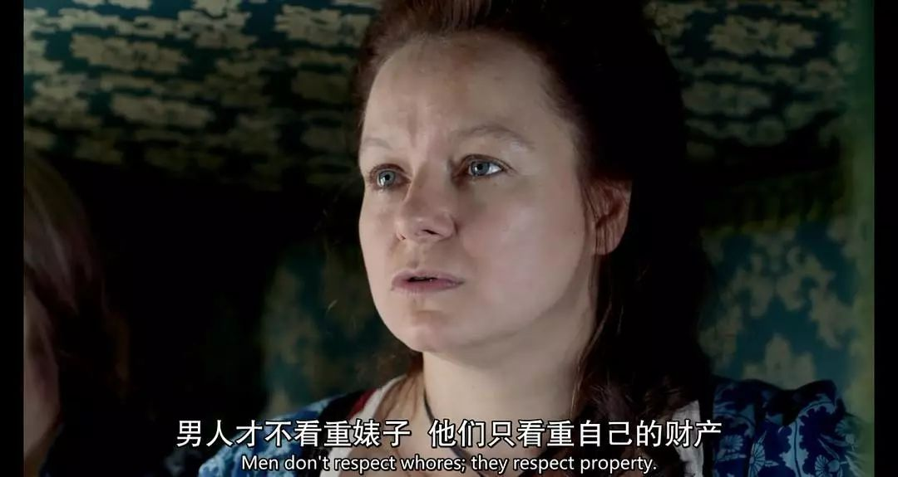

在分析性交易合法化的问题上，我将从个体性行为的普遍特征出发来考察这项规则是否合理，按照递进关系依次论述以下三个问题：

1. 性交易作为一种普遍的（超越地域和历史的）社会规则是否具有合理性？
2. 反对性交易合法化到底是在反对什么？
3. 性交易在现阶段应不应该合法？

<!--more-->

## 1. 性交易作为一种普遍的（超越地域和历史的）社会规则是否具有合理性？

先抛出我的结论：**否**。

论述如下：

人类的性行为是与个体的特殊偏好密不可分的（不管这种偏好是先天的还是后天环境的因素所造成）。通俗点说就是：**你不可能对所有人以及在所有的状态下都产生性欲**。而性交易活动由于性工作者无法选择客户，只能因为经济利益放弃自己基于自身特殊的性偏好而（应该）具有的性自主权，从而造成了对性自由的损害。

反对者认为，那在其他的普通工作中人们一样无法选择自己的客户啊，（比如律师不能因为当事人道德低劣而放弃对他的辩护，律师的职责只是在于利用法律知识为当事人争取最大权益）。

这样的论点是混淆了其他普通工作在工作性质上和性工作的本质区分。

诚然，其他普通工作与性工作一样花费了身体精力、时间，但是其他工作的 **工—作—内—容** 在一般情况下并不通过损害个体的特殊性来达到。

比如律师、作家、餐厅服务员、工厂工人等等这些工作，是个体利用自身而去获得一项个人（只要条件允许并通过一定训练就可以获得）的公共性技能，从而对于个体来说**此项工作内容给其带来的是一种特殊性的增添而不是损害**。除非是（被强迫的）超过一定强度和时间的工作才会损害到个体的特殊性，比如常见的血汗工厂、资本主义早期工厂工人的普遍处境。

而反观性工作，由于性行为的特殊性和无法选择客户这一环境，那就势必要求性工作者放弃自己的性偏好及其自主权来反向获得一种伪公共性的产品。也就是说性工作的工作内容并不能给个体增添任何的特殊性而相反恰恰是通过减损自身的特殊性来达到的。

这里就不存在普通工作向血汗工厂，那样的因为工作强度和时间的加强和延长而产生的转变。**性工作一开始就是基本可以和血汗工厂等同的通过减损个体的必要的特殊性或者说必要的自由空间来达到的。**只不过性工作损害的是性自由，而血汗工厂损害的可能是身体健康或者继续生活的基本物质条件。

类似的还有**商业代孕**、**人体器官买卖**、**人口贩卖**。代孕因为子宫不具有可通过训练而获得的公共性，那么代孕则必然是对个体身体部分控制权和健康的损害来获得的一种公共产品；人体器官买卖则必然造成对个体身体完整权的损害来获得一种公共产品；人口贩卖就直接必然造成对个体全部自由的损害来获得一种公共产品。

这类交易对人的自由空间的损害大致可以进行如下排列：普通工作＜性交易≤血汗工厂≤代孕＜人体器官买卖＜人口贩卖。除过普通工作以外，其后几种原则上都应该予以反对。

再回到性工作的问题，有人提出，如果性工作者可以基于自身的性偏好来选择客户，那岂不是就不存在对性工作者性自由的损害了。我要指出的是，这种设想在现今的资本主义市场下几乎是不可能的。

如果我们假定性工作者可以基于自己的性偏好选择它的客户，那么就意味着性工作者可以满足自己的性偏好又可以拿钱，这相当于食物活了过来对要吃它的人说不的情况。这就很有意思了。**也就是说金钱在这里已经丧失了其一般等价物的地位了**，而是附带和买方本人的其他特征混合在一起而成为一种交换物。

所以情况就变成了，买方需求性工作者的性特征，**而性工作者除了需求买方的性特征以外还需求着买方的钱**。这个跟劳动者自愿进入公司且快乐的工作并不与公司付出劳动报酬相悖的那种情况不一样，因为劳动者付出的劳动已经由公司支付的报酬而得以补偿，而拥有自由选择权的性工作者的性行为已经得到了买方性特征的回馈而抵消，因而付钱只能被理解为额外的善意或者基于一个自由契约的行为。

但既然是合法化了，那么就像法国那样，性工作者有黄色执照，依据这个执照，任何买方在知悉性工作者身份后与其发生性交易的，一个必须付钱的强制附加契约就产生了。从而性工作者真真正正地变成比买方需求更多的群体了。

那么对于买方来说，其在性交易市场即便是有钱也不一定能够缔结一桩性交易了，买方看上的某个性工作者可能性工作者不愿意，性工作者看上的某个买方可能买方不愿意。这就变得滑稽起来了，**一个自由性交易市场竟然在很多时候无法交易了**，那么这个市场还会有多么活跃？    

当然这一切的前提都是性工作者确实基于自己的性偏好选择客户了。然而这是非常不现实的。理由就是:买方们发现，这个性交易市场竟然和外面的环境没有区别，那么买方们会想那我在外面的世界约炮又和性交易市场有什么区别呢而且还不用付钱。

性交易市场中性工作者的优势就大打折扣，从而性工作者以自己有偏好和选择权的性行为获取金钱利益的目的也会大打折扣，结果就是自己的性工作带来的效益很可能并不足以满足其他的需求。

然而由于性工作者是否根据自己的性偏好选择性对象依然是一个自由的选择，所以在其他需求的压力下性工作者还是会选择放弃自己的性偏好投向资本的怀抱，从而又回到了初始的现状——**资本依旧压迫和强制扭曲着性工作者的性偏好**。

**因此性交易在商业化市场中不可能做到不损害性工作者的性自主权。**这里还存在一个和商业化的性交易非常相似的情况，那就是色情影视产业。不过这两者依然存在一些区别。

色情影视产业的从业者由于其买方不是某个个体而是任何可能去够买观看的一般人且处于公开透明的环境下，这就要求拍摄公司必须符合一些规则并创造一些条件让影片更具有观赏性。那么正规的公司就经常选一些俊男靓女在一些环境十分优美的地方进行拍摄，被拍摄者还要提前接触消除“陌生感”，好让被拍摄者处于一种自然放松的状态，如我们经常看到的欧美的绝大多数AV就是这样。

所以色情影视产业在很多情况下并不损害到从业者的性自由权，此类工作对从业者的要求并不在于其作为性客体的身体本身，而是将身体作为一个因素成为表演的一部分。并且只要是公开拍摄并公开发行，那么我们就有了可以鉴定其是否违背了从业者意愿的极大空间。

## 2. 反对性交易合法化到底是在反对什么？

一种意见认为，既然性交易从根本上说是对性自由的损害，那么我们就应该反对一切性交易。这是极其可笑的。

首先，当我们说反对性**交易合法化时我们说的是**利用公权力对此类活动进行禁止，这就涉及到一个性交易是属于公域还是私域的问题。公权力只能处理公域的问题，而不能僭越到私人领域。

就性交易来说，并非所有的性交易活动都属于公域，只有商业化的性交易才是，而且反对商业化性交易的理由也不仅仅是在商业化，更根本的理由是**商业化在一个资源分配不均的阶级社会会造成更大范围的阶级压迫和歧视**。这一点我稍后会论述，现在我们先来看完全不属于公域的那种性交易活动。

性交易从广义上说是指放弃自己的性偏好而获得某种经济利益的行为，而以长期营利为目的的性交易只是其中一种，在商业化的性交易类型之外，还存在有大量的其他类型的个体偶然的性交易，比如社会上常见的“包二奶”、“sugar daddy”等现象。

还有一种是虽然收取一定报酬但是由于报酬非常低廉可以视为是免费服务的性交易，比如10元专门为民工提供性服务的叶海燕。还有完全免费的专门为残疾人提供性服务的加拿大硕士毕业生Rachel Wotton。

以上几类都不属于商业化的性交易而是属于个体偶然的性交易，公权力能禁止这类活动吗？显然不可以。

首先最基本的一个原则，人有对自己身体的使用和处置权。举一个最彻底的例子就是：人有没有自杀的权利？当然有。**那么人连自己的生命都可以放弃，那么放弃依托于生命的性自由又为何不被允许而要被公权力干预呢？**

同理，偶然的代孕和赠予器官等行为也不是公权力所能干预的领域，前者诸如姐姐给不能生育的妹妹代孕的情况，后者诸如母亲给儿子捐献自己的器官，虽然对于此类情况的报道让人觉得很不舒服。比如母亲给儿子捐献器官的案例（肾好像是，因为能找到的和儿子相匹配的器官只有母亲一人），一开始母亲并不愿意，说自己可以用一生去照顾儿子，而如果把自己的器官给了儿子那自己也可能行动不便，所以她更想要前者。由于此，儿子还对母亲故意冷落甚至横加指责，最终母亲同意了将自己的器官给儿子。

说实话，这个儿子令我恶心，不管你的生命相比于你母亲多么地年轻和有前途，都不应该出于所谓的“亲情”、“母亲的职责”来绑架你的母亲。但这种情况依然是属于个人的选择问题，不管其过程有多么地令人不齿，公权力都没有权力对这种事情横加干预。且不说这个母亲最终捐献了自己的器官给儿子，如果碰到是一位非常乐意将自己的器官给自己的孩子的父亲/母亲，如果公权力禁止，那他们还因此不能执行对自己身体进行处置的意愿了吗？那就太荒谬了。

同理，**如果公权力禁止了一切性交易活动，那就是说人连放弃自己的一种快乐的权利都没了**？这就好比说公权力要强迫每个人都吃山珍海味而不能吃粗茶淡饭。且不说这种设想在学理上有多么荒谬，就是在执行问题上也是根本不可能的。怎么，你要对入住酒店的每一位人都要问你们是否是要进行性交易？是的话不能入住？警察可以随时撞开我的房门质问正在性交的我们是否是在进行性交易？这种设想的荒谬性我已经不想再多说什么了。

（广义上的）性交易行为作为个体众多选择中的一种选择，依然是属于个体的自由空间。唯一值得探讨的是，当一种交易活动会造成某种群体参与交易成为一种**“无可选择的选择”**时，才需要被纳入到社会公利的范围内进行探讨，这种情况就是商业化性交易、商业代孕、买卖人体器官等等。

在进行到反对性交易商业化的这一阶段之前，我想先插入澄清回应一个问题。有人说用人有权利自杀的例子来说明人有诸如性交易、代孕、捐赠器官等处置自己身体的权利是不恰当的，理由有二：1、自杀行为不可以使他人获利，因此不可能被纳入商业化的活动。2、自杀以后自杀者就无法感知了，而性交易、代孕等会持续伤害身体带来痛苦。

对于第一点，我只能说你太没有想象力了，我们搞一个自杀综艺怎么样？让自杀者自杀前讲述自己的故事和缘由，然后选择一种方式自杀，现场直播，最能引起观众兴趣的自杀者给予最高的分，分数越高奖金越多，奖金按照自杀者的遗嘱进行分配。这不就商业化了？

对于第二点，则更是搞不清楚逻辑，死亡对于个人来说乃是一个边界，这个边界之内即是我们所经验到的所有生的体验，最接近死亡的状态那也只是作为“濒死者”、“垂死者”的状态，而不是死亡的状态。**在生的边界死亡之外则是一片对个体而言绝对无知的领域。**因此说死后永恒、消散、轮回等都是对的也都是错的，因为不可证。但不管如何，我们可以确定的是死亡是对生的一种否定，是一种无限判断，即死亡不是生的经验所能延伸的一个经验领域。那么死亡对于生来说就是一种纯粹的不可触及的“无”，而所有对身体的伤害都是不同程度的“有”。既然一个人拥有选择去“无”化的权利，为何没有选择另一种“有”的权利？

好，再回到反对商业化性交易、商业代孕、买卖人体器官等的问题上。为何要反对此类活动的商业化？我们“自愿”与一商业机构签订劳动契约或者买卖契约获取一定报酬为什么不可以而要被法律所禁止？

首要的理由我在一开始已经论证过了，即此类工作内容在性质上必然造成对性自由、身体自主权的损害。其次，虽然原则上人有选择放弃自己身体的部分自由来换取经济利益，但是在一个分配不均的阶级社会，**对于处在社会底层的人来说从事此类活动往往是一种“无可选择的选择”，而不是“众多选择中的一种选择”**。

以性交易为例，设想如果性交易所获得的利润跟现在一般的底层工作没有区别（比如环卫工或者餐厅服务员），或者说现在的底层工作者的工资上升到跟从事性交易的人所获得的利润无二的水平，那还有多少人愿意去从事性交易呢？那恐怕就剩下那些以此为乐或者觉得性的专属关系对自己来说不很重要或者为了某种高尚目的的人去从事了。在这种情况下，性交易就只是作为“众多选择中的一种选择”而已。

同理代孕、买卖器官等活动如果在一个人人都拥有众多选择且各选择之间无太大差别的社会，又会有多少人去从事？

我们可以说，性交易、代孕、买卖器官等此类活动有商业化倾向的原因正是由于阶级社会的存在，正是因为存在巨大的利润空间，资本才得以大量地涌入。从而使得那些处于社会底层或者难以靠自己维持自身的人，去从事为了得到相较于其他自己可以胜任的工作而言，可以获得更多收益的此类会极大损害到自身自由空间的工作。**而且在性交易和代孕的问题上，由于从业者大多数是女性和只能是女性的情况，就连带着也带来了更多的性别压迫和歧视。**

以中国为例，据统计，女性性工作者中农民和无业人员占79.8%，文盲、小学和初中比例占80.5%，这说明**低收入妇女为谋取经济利益而从事性交易依然是其主导动机。**而那些固执地只讨论“自愿选择”的人则正是忽视或者故意忽视此结构性的社会问题，甚至有某些自由意志论者认为就算是一定程度的资本强迫又怎么样？从业者依然可以通过自己的劳动获得报酬啊？持这种论调的人，不是愚蠢就是既得利益者，养尊处优的上层阶级坐在宽敞明亮的办公室喝着咖啡，自己不想去卖淫/代孕/买卖器官，他们还能通过国家立法禁止别人去了？他们当然不会禁止，有机会他们还能利用自己的资本去大量投资来进行更多的财富积累呢。

因此，当我们反对性交易商业化、代孕商业化、买卖器官商业化，我们反对的是商业化，更**根本的是反对商业化后所造成的更大的结构性压迫，而不是反对个体从事此类活动的自由。**

有人会问，如果阶级被消灭，我们进入一种人人都拥有众多选择且选择之间无甚差别的社会，比如共产主义社会，那还需要反对此类活动的商业化吗？其实要反问的是，如果处在这种社会，那这类活动的商业化还会产生吗？所以理论上可能连反对的对象也不存在了。其次，**我们不能把希望寄托于一种乌托邦的未来。**就我个人而言，我对人类社会是持相当悲观的看法，我不认为那种所谓“共产主义”社会能够真正在现实中实现出来，而只是作为一种对照现实的遥远的乌托邦而存在。

**我们需要的是揭示出现实的矛盾，并考虑何种政治举措能够最大程度地缓解此种矛盾，达到最大多数人的最大幸福。**

此外，在这里需要提出另一种反对性交易的意见。即认为进行性交易是一种道德上的堕落，而且往往是那些好吃懒做之人才去从事，所以应该禁止。提出此类观点的人往往是男权主义者，其所指的对象往往也是女性性工作者。这种观点本不足挂齿，但考虑到现今社会大部分人还是持有此类保守观点，因此我觉得还是需要说一下。

首先，认为性工作者是道德上的堕落，并经常对女性性工作者进行荡妇羞辱，以一种居高临下捍卫父权制等级道德观念的人，是被父权制驯化、调教的温顺的宠物，但面对压迫者时又是狗仗人势的恶犬。那种常常羞辱女性性工作者的人，**往往是出于一种将女性性资源化而将男性作为性资源的占有和使用者的观念**，从而抹杀的是女性的性主体性，从而根本上抹杀的是人的主体性。

性工作作为一种被迫放弃自身性自由的活动，这本身和自愿超时加班（放弃自己部分应得的自由活动权）是一个性质的，结果后者往往被视为是奋进的、勤恳的，而前者被认为是“不洁的”？？这里不光存在有父权制社会下对女性的性资源化，更根本的还是存在对性的污名化，**认为性只能被纳入到一定社会关系中才是合理的**，从而造成的是对性工作者的更大的污名化。这种文明的遗毒我们早该祛除了。

## 3. 性交易在现阶段应不应该合法？

上文提到，当我们反对性交易合法化时，我们的理由是性交易的工作方式本身是对性自由的一种损害（相当于不间断超时加班损害应得的自由活动时间），而在一个资源分配不均的阶级社会里则会产生更多的阶级压迫与歧视，**即是相当于让一部分“无可选择”的人去选择做这种势必损害（应得的）自由的工作。**

理论上说法律上禁止性交易的目的是不让人去从事此类活动，但现实却并非如此。一方面由于性工作的机动性和隐蔽性都很强，另一方面正是由于性交易非合法化的灰色状态，使得此行业拥有了巨大的利润空间，导致依然有大量的人转入地下进行灰色交易。

以中国为例，据我国公安部门统计，自80年代初到1997年底，中国累计查获的从事性交易的人数大约是210万，而且这个统计数字并不是来自这一活动的发生率，而是来自于查获率。如果我们算上未被公安机关处理的那些性工作者，在这个期间从事性工作的人数可能会达到1000万之多，而且上世纪末的从事性交易的人数相比80年代初的增幅大约是30倍，直至现在这一势头依然有增无减。

这充分说明了要想在一个资源分配不均的阶级社会杜绝此类现象几乎是不可能的，而且取得适得其反的效果也是非常可笑。更重要的是，这些性工作者一方面承受着放弃自己性自由的代价。另一方面其劳动所获得的收入也不能得到保障，他们要面对随时被司法机关查处的危险。再来，有时候连自己的人身安全都不能保障，很多的性交易者面临着拒不付账甚至被杀害的危险。这就导致性交易活动往往寄生于黑帮势力之下以求基本的保护，像美国六七十年代，妓女往往和皮条客合作来保障自己的收入，虽然性工作者要上交非常大的一部分给皮条客受其剥削。就连像法国瑞典这种性交易合法化的国家，由于罚嫖不罚娼的政策，导致客源减少，性工作者的生活状况明显恶化。为了吸引和保护买方则越来越隐秘转移地下，从而造成安全和卫生状况下降。**所以我们可以看到的是，在阶级社会要想从法律上禁止性交易活动无疑是拔苗助长。**

正如上文提到的，如果性交易所获得的利润跟现在一般的底层工作没有区别（比如环卫工或者餐厅服务员），或者说现在的底层工作者的工资上升到跟从事性交易的人所获得的利润无二的水平，那还有多少人愿意去从事性交易呢？目前看来，要通过后者的手段（实现整体的分配均衡）来减少性交易活动似乎是一个极其漫长的过程，甚至我认为是一个永远也达不到的目标。

那么我们只能就现实优先考虑前者，基本的设想是这样的，我们将性交易合法化，首要的一方面，我们可以通过公权力为性工作者的安全和获得报酬的权益做出保障，另一方面合法化使得从事性交易所需的成本减少，并且使原先藏在暗处的性工作者都成为此公开行业的一部分，从而致使整个行业的利润降低，最终使得原先想靠此活动赚钱的部分公民放弃此种选择。

对这方面我们可以考察下已经将性交易合法化的国家的情况，比较有意思。以法国为例，据The local称，目前法国的性工作者预计有三万名，其中超过80%来自国外。德国和瑞典也是，大量的性工作从业者都来自国外地区，通常是较为落后的第三世界，比如中国，而且很多都是被诱骗甚至绑架而去的。

这揭示的一个问题是，**对于性交易活动，如果一个地区合法而另一个地区不合法，那么就会产生巨大的套利空间，**使得那些经营者想方设法地从其他不合法的地区去捕猎可能的从业者以降低成本来反向获得高利润。这就导致了，如果以国际主义的立场来看待性交易问题，性交易的合法化就必须成为一种全球普遍现象才能达到我们所预期的效果。但如果我们不秉持这一国际主义立场，**而退回到保守主义“本国利益优先”的立场，性交易合法化至少可以保障本国已经从事以及有意愿从事性交易公民的权益。**

虽然我本人一贯地对于保守主义的立场抱有极其轻视的态度，但回到现实政治问题上，我们总要做些什么。我们或许保证不了全人类的最大多数人的最大幸福，但我们至少可以并应该做到一国之内成员的最大幸福。

最后，回到现阶段在中国，性交易是否应该合法化的问题。我觉得虽然从根本的原则上我认为性交易是对人性自由的损害，而且在一个阶级社会则会造成更多的阶级压迫和性别压迫，但因为性交易本身的特点使得我们无法在现在的状况之下对其加以根除，而且往往造成了适得其反的效果，并且使得性工作者的权益无法得到保障。**因此我们应该将其合法化以保障性工作者的权益，这是我们在一个阶级社会可以为性工作者所做的最低限度，**另外我们的社会也需要转变对性工作者的看法。

性工作本身是一种负担强于其他普通工作的一种，本应给予更多的保护，而像手天使那样专门为特殊人群工作的人则更是高尚甚至伟大的群体。但往往我们出于陈腐的性道德观念将其斥为“不洁的”、“堕落的”，在一个男权社会则更多的是对女性性工作者的污名和排斥，这是极其不公平的做法。

另一方面，虽然我们看到，由于性交易没有在全球范围内合法化，所以导致的是合法化的发达国家对不合法化相对落后国家公民的剥削，因此这就使得性交易合法化成为了一全球性的问题。但回到本国公民的利益上，回到中国公民的利益上，我觉得性交易合法化至少对本国公民是有利的，而且性交易合法化之所以难以在全球范围内执行，不正是因为国家的存在吗？如果我们像马克思所给我们指出的，去消灭国家并最终消灭阶级，那么性交易全球合法化也不是一个问题了。

**但乌托邦终究是乌托邦，我们需要面对的是当下的现实政治，在公共领域能做多少是多少。即便此“公共领域”只是狭隘的“本国利益”。**

*图片均来自《名姝》豆瓣页面*