自去年8月刘强东因涉嫌“性犯罪行为”被美国警方拘留起，刘强东涉嫌“性侵”一案已经历时差不多一年，由于更多的细节被披露出来，此案再度引爆舆论场。

<!--more-->

北美时间2019年7月24日，明州警方发布长达149页的调查报告。

整个报告总共包括**女方**Liu Jingyao对警察的陈述、男性**报案人**报案时的电话录音文字档、**刘强东**接受警方问话的录音、刘强东的**助手**和**律师**以及**案发司机**对案件的描述、女方和朋友的**微信记录**（翻译版）、案发当日餐馆与公寓的高清版**监控录像**等几个部分，整个调查报告通过多人叙述，从不同角度阐述了案发当晚发生的事情。

## （一）调查报告的部分关键内容

根据女方对警察的陈述，刘强东在酒局上邀请她成为自己在京东的助理，女方表示对此不感兴趣，并希望以后继续攻读PhD。

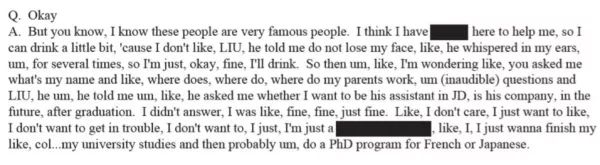

女方喝醉后，刘强东向女方表达爱意，并表示希望她搭乘自己的私人飞机去纽约。

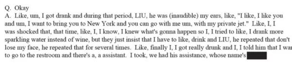

对于离开餐馆后的车上部分，女方表示：

> “晚饭后，刘强东拉着我和女助理上了豪华轿车，并让我跟他坐在一排。当时他拉掉我的衣服，并亲吻我。
>
> 我看向女助理，并向她求助。但是女助理什么都没有做，司机反而打开了音乐。
>
> 整个过程中我都在反抗，而刘强东说“别打扰我。”

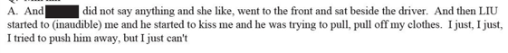

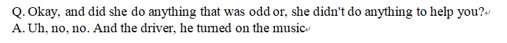

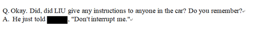

对此，当时坐在司机旁边的刘强东的**助理**则表示：

> “当时开车了，我回头看到了他们在亲吻。
>
> 我没有看到女方有任何不满，她也没有向我求助，他们非常亲密。然后我把头扭过来了，因为这是他们的隐私。
>
> 我没听到有什么音乐。”

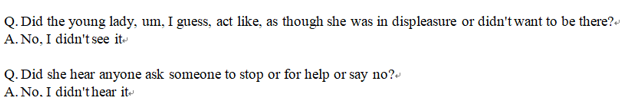

案发**司机**表示：当时两人有亲密行为，但不确定是否是双方自愿，没听到求救。

> “当我开车时，我看到刘强东对liujingyao进行亲热，刘强东的助理看到我在看他们在后座亲热后，动手抬起了后视镜。
>
> 我听到了亲吻和呻吟，但整个过程中我没听到有关“停止”“回家后再进行”的言论，也没有听到求救。
>
> 但是，我也无法肯定双方是否自愿。”

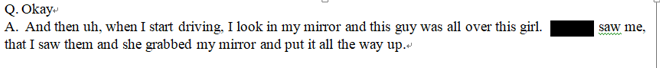

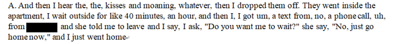

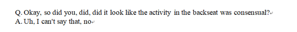

女方在接受警方的询问时，表示刘强东将自己压在身下、举起了自己的双腿，进行了性器官插入，在此过程中，刘强东还询问女方是否处于安全期。

> “我坐在床沿上，他把我丢在床上，压着我，我想把他推开。但是，他在我上面，我动不了。他先脱我内衣，再压住我，再把我的腿拉起来，压向我自己。
>
> 然后插入，我没办法逃脱。然后他问我是否在安全期，我说：不是，我不想怀孕。然后他拔出来了。”

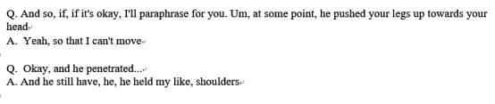

**整个性行为一共持续了大约两分钟。**

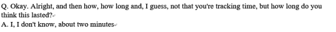

> “他拔出来后射在我体外，床单上，还有我的肚子上。然后我把它翻起来，让这些留在我的床单上，我想留着当做证据。”

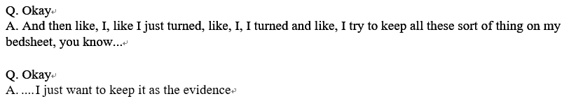

## （二）双方对调查报告的不同回应

针对警方发布的调查报告，刘强东的律师发表声明称：

> “警方发布的证据再次证明我们自始至终坚信刘（强东）先生是清白的。警方报告再加上监控录像完全消除错误信息，以及一些广为流传但未经证实的指控，无可反驳地支持了亨内平郡检方决定不起诉我们的当事人。刘先生依然对执法部门致力于解决此事的辛勤工作表示感谢。”

而女方Liu Jingyao在接受《财经》记者采访时则强调**警方调查报告的某些表述存在“疑点”，她希望关注此案的人能够“完整分析各方证词”，而不是断章取义。她对国内某些报道中所提及的“洗鸳鸯浴”、“激吻”、“裸睡”等表述极为气愤。**采访相关的更多细节可参考[警方披露明州案细节：男方称证实无辜，女生表示还有疑点](https://mp.weixin.qq.com/s?__biz=MjM5NDU5NTM4MQ==&mid=2653346077&idx=1&sn=882dc4fa67f342f8f2fde34920137961&scene=21#wechat_redirect)。

## （三）北美留学生日报等媒体的偏向性

北美留学生日报等（自）媒体在报道此案时，并没有采纳警方调查报告中的**多方观点**进行**平衡报道**，基本不涉及女方的说法，而是**单方采用刘强东一方的自述，并配上极具偏向性的“震惊体”标题**『重磅！刘强东案149页警方档案公布：激吻、裸睡、鸳鸯浴、发生关系…』，并在文章中如此描述：

> “记录显示是女方主动邀请刘强东去她新搬的公寓，并且两人曾在车内激吻，同时，在回到公寓后还同洗鸳鸯浴，性交后熟睡数小时……”

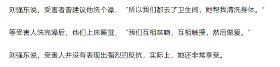

这篇具有明显偏向性的煽动文章（目前已经被公众号运营方删除）发布之后，阅读量很快过10万+，并被新浪科技等知名媒体大规模转发，相关评论区里则是几乎一边倒地指责女方“**仙人跳**”，甚至对其进行“荡妇羞辱”。

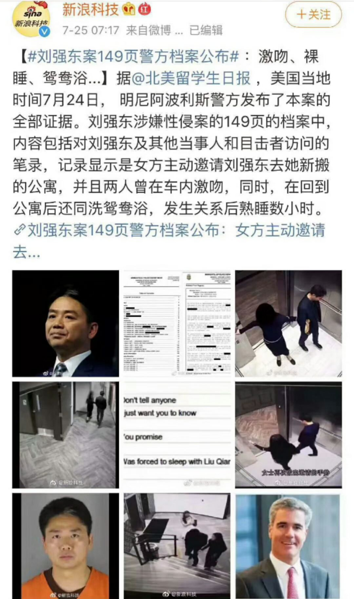

然而，在警方发布的长达 149 页的报告中，根本没有目前网上热传、北美留学生日报首倡的「鸳鸯浴、激吻」之类的描述，女方liujingyao在接受《财经》媒体采访时也对媒体的偏颇报道表示反对。

北美留学生日报作为一个关注量达百万级别的自媒体帐号，为了流量10万+，不惜抛弃媒体的专业操守，放弃了对出产内容进行质量控制，出产极具偏向性的低劣内容。可以说，北美留学生日报已经堕落成为了无节操的媒体帐号，成为煽动舆论对受害者进行攻击的源头之一。

很多人也许不了解，北美留学生日报之前还不像现在这么low，他们在报道刘强东案时还能保持着较高的媒体操守和专业素养，对出产的内容进行质量控制，其相关报道对舆论起到了一定的正面引导作用，最终引来刘强东一方的公关团队对其进行公关，被迫删文了事。

> 当时在解释为何删除报导刘强东案一稿时，北美留学生日报编辑团队说道，『一面是市值几百亿的美股上市公司，一面是几十人的小创业团队……我们不得不做出妥协』，『但我们能保证的是，我们报导的，是根据可信赖的一手信源报导的。并非捏造』

俨然一副正义的“屠龙勇士”模样。

谁曾想到，不到一年的时间，北美留学生日报就堕落到如此lowB境地？

## （四）媒体环境的恶化

自媒体时代，从“勇士”堕落成“恶龙”的自媒体远不止北美留学生日报一家。除了北美留学生日报之外，还有新浪科技、观察者网以及看天下等媒体发表了极具偏向性的报道。

仅以刘强东案为例，在之前的2018年12月21日，明州检方由于证据不足决定不对刘强东提起刑事诉讼后，大量媒体在报道时直接打出“刘强东无罪”的大标题，全然不顾由于证据不足而不起诉与“无罪”的区别，更不顾在刑事诉讼之后，还有女方提起的民事诉讼。相关内容可参考《[性侵有罪，出轨无罪？性别视角下刘强东案的报道分析](https://mp.weixin.qq.com/s?__biz=MzAwNjE1MDg3Mg==&mid=2650111980&idx=1&sn=458255bf5e4137dfe0c944527ad78237&scene=21#wechat_redirect)》。

> “根据美国检方公布的调查结果，由于没有办法达到举证的责任，检方无法对刘强东提起刑事诉讼（no charges）；而国内媒体对刘强东不被起诉事件进行报道时，多以“无罪（innocent/not guilty）”对刘强东事件进行定性。从美国法律程序上来说，有罪/无罪是陪审团决定的，而是否起诉是检察院决定的，程序上有所不同，二者是不同的法律概念。
>
> 刘强东和女方发生性关系是既定的事实，而性侵的认定则取决于女方是否自愿。就该案来说，由于检方认为没有足够的证据表明女方是否自愿，因此无法对刘强东提起刑事诉讼，但女方可以自行对刘强东提起民事诉讼。
>
> 而媒体在进行报道的过程中，过于强调“未性侵”、“无罪”等内容，却对不提起诉讼的关键原因语焉不详，造成刘强东似乎被女方算计、诬陷的媒介传达，引发舆论对女方当事人的恶意猜测。”

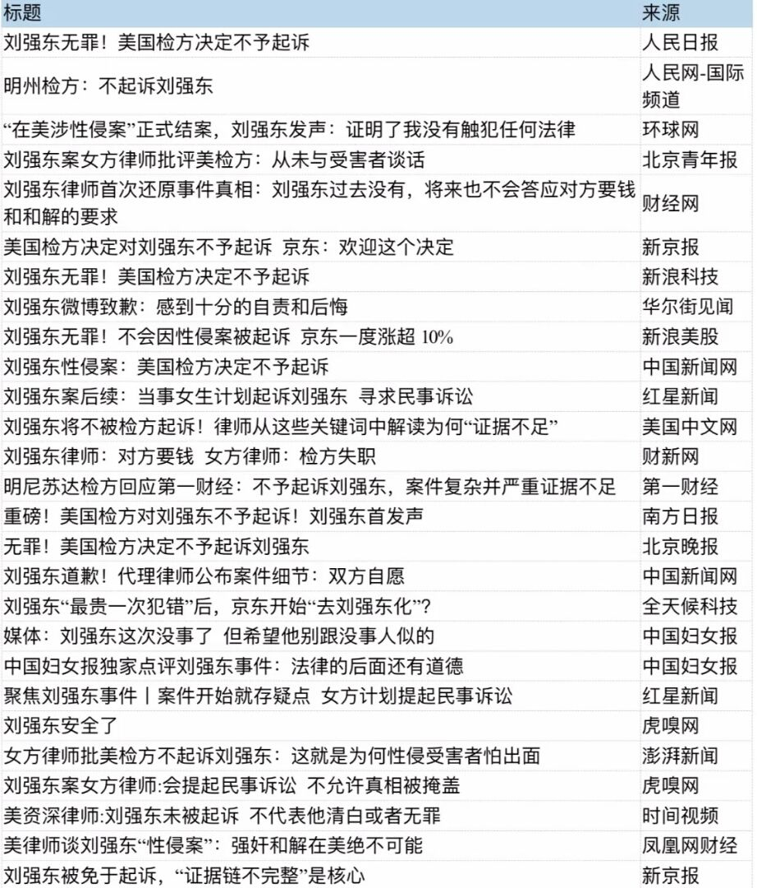

2019年4月16日，Liu Jingyao正式向明尼苏达地方法院提起民事诉讼，在起诉书中，Liu Jingyao详细表述了案发全过程，并以刘强东对其构成民事胁迫、人身侵犯、基于性的侵犯与侵害等为由，对刘强东及京东集团提起诉讼，要求刘强东和京东集团赔偿她超过5万美元的损失并承担诉讼费。

4月22日，之前未曾发过微博的微博号@**明州事记**放出两则被剪辑过的视频，并配上文字“刘强东明州案晚宴视频曝光，女方未醉酒主动跟随”和“仙人跳实锤？明州案公寓视频曝光，女方举止亲密主动邀请刘强东进入”，而**本应坚守新闻伦理的专业机构媒体却全然不检查信息的真实性和完整性，直接转发相关视频，并配上模糊的标题，直接沦落为刘强东一方的传声筒和舆论打手。**

直接叫嚣女方“仙人跳”的自媒体更是数不胜数。很多自媒体为了骗取点击量，不惜大量煽情，甚至是歪曲事实，根本不顾所谓媒体规则，**在流量10万+面前，机构媒体曾经所推崇的****新闻专业主义**（professionalism，核心理念是强调新闻的客观性，以及新闻媒介和新闻工作者的独立地位和独特作用）**根本不值一提。**

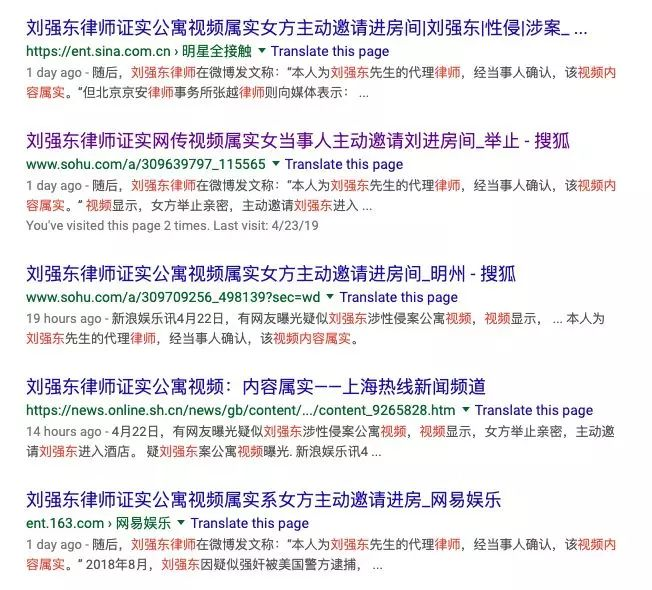

由于自媒体的崛起以及利维坦的打压，如今整个新闻媒体环境正在急剧恶化，有良知的媒体被打压和警告，调查记者急剧减少，大量记者纷纷转行，依然留守新闻行业的很多从业者也早已不再以新闻专业主义的高标准要求自己，而是紧跟自媒体潮流，以追逐流量为己任，不断突破专业底线。

如今，**要写出一篇10万+的自媒体文，根本不需要像以前的记者一样花费大量时间和精力去一线采访，不需要拿到一手信息，不需要对信息进行核实，不需要规范引用，不需要尊重事实和尊重人物，不需要坚持新闻伦理**……

你只需要对记者们花费大量资源写出的优秀的独家报道进行洗稿和抄袭，比如呦呦鹿鸣洗稿财新多篇报道的爆款文《甘柴烈火》；

你只需要用搜索引擎搜索几页非一手信息，参考别人的细节描写和文字评述，用无法确认归属或匿名的信息来源，就可以写出引爆舆论的爆文，比如导致咪蒙封号的《一个出身寒门的状元之死》；

你甚至还可以直接跳过事实性内容而凭空造谣，比如2017年发端于知乎用户@伊利丹·怒风（目前已被封号）、然后被酷玩实验室等无良自媒体广为传播的“**女权卖淫产业链**”谣言文……

在如今媒体行业，不扮演幕后力量（*比如拥有强大公关团队的京东*）的传声筒，不以煽动情绪吸流量，而是能独立验证信息的真实和完整、给出背景信息和专业解读的媒体已经越来越少，他们不是已经死亡，就是在通往死亡的路上挣扎。

当专业的新闻机构纷纷消失、整个新闻行业趋于崩塌时，我们还能靠什么来了解事实和真相？依靠北美留学生日报这样的lowb媒体？或者是指望人人都成为能够辨别新闻真实性的新闻记者？这明显不可能实现。

或许，在娱乐至死的时代，人们根本不需要真相，不需要新闻真实。

（PS 获取警方完整报告的具体方法：前往明州警察局的网站链接阅读指示：<http://www.minneapolismn.gov/police/records/frequent>。

发邮件给policePIO@minneapolismn.gov，说明要求获得编号为 18-293415 和 18-294338 案件的记录，将会获得一个包含文字和视频资料的链接）

